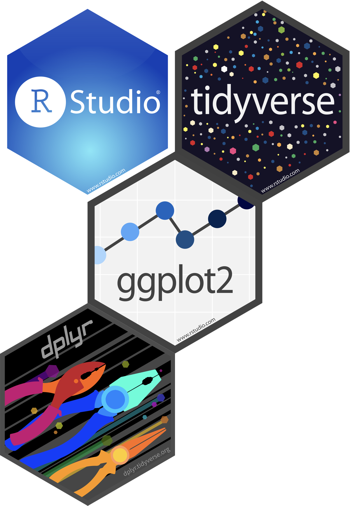
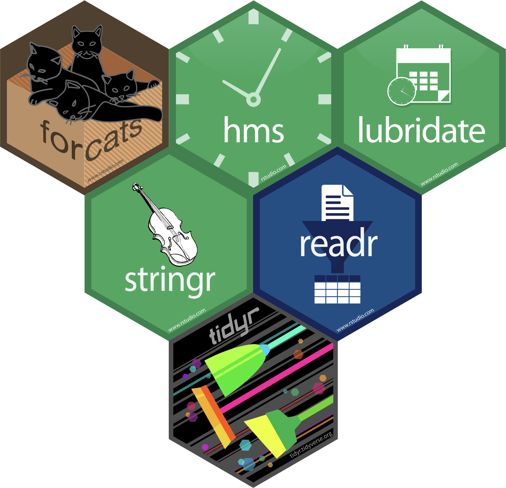
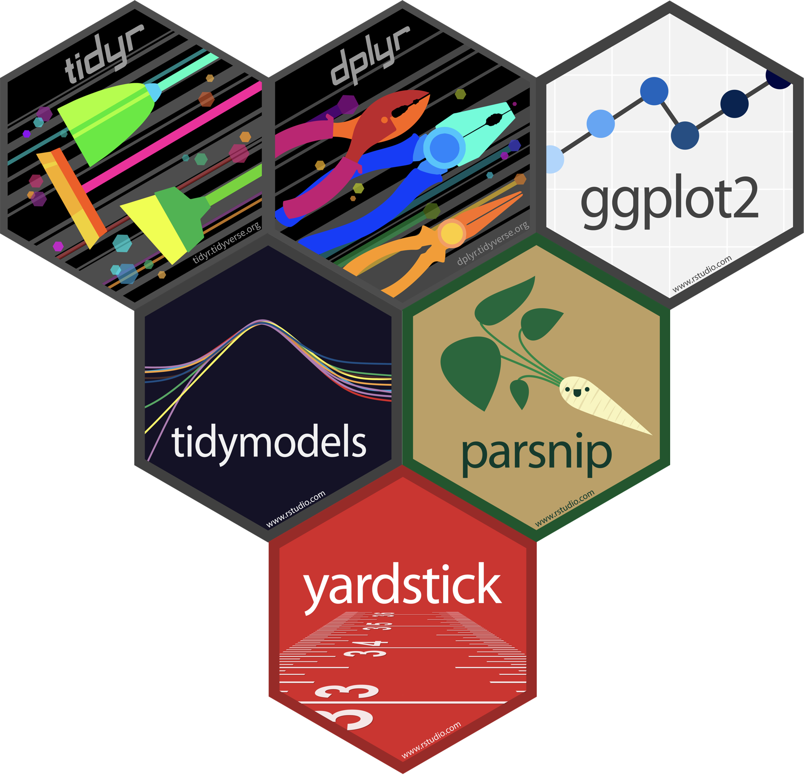
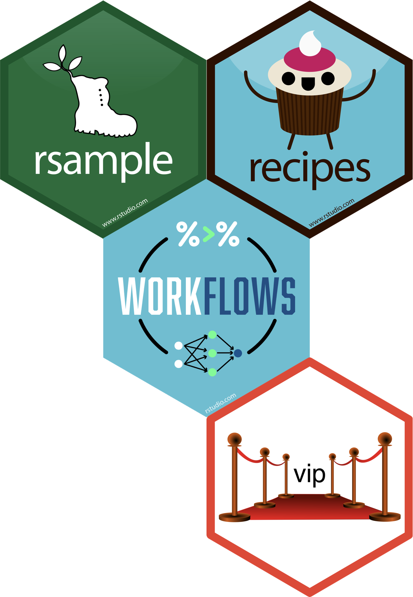
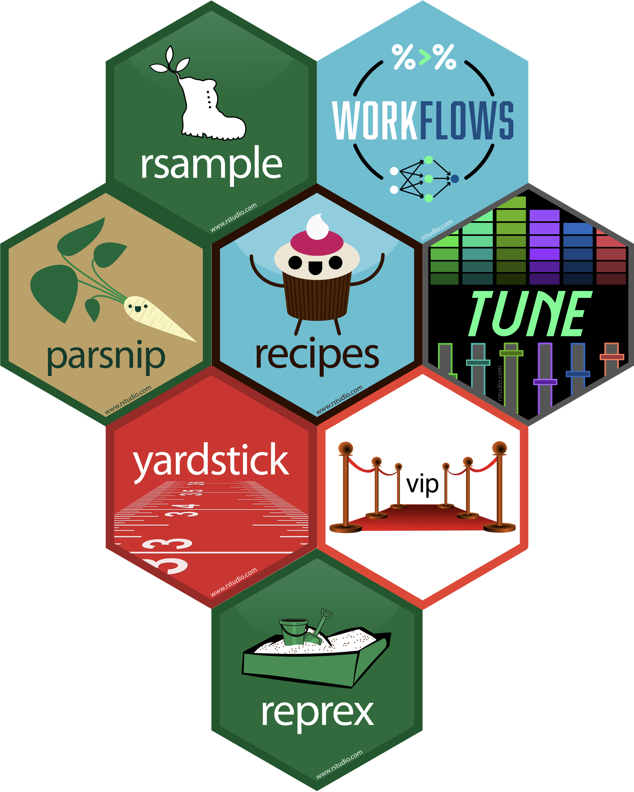

```{r setup, include=FALSE}
options(htmltools.dir.version = FALSE)
knitr::opts_chunk$set(collapse = TRUE,
                      fig.retina = 3)

xaringanExtra::use_share_again()

yt_counter <- 0
library(countdown)
library(tidyverse)
library(gt)
library(glue)
```

class: title-slide, center

<span class="fa-stack fa-4x">
  <i class="fa fa-circle fa-stack-2x" style="color: #ffffff;"></i>
  <strong class="fa-stack-1x" style="color:#009FB7;">`r rmarkdown::metadata$session`</strong>
</span> 

# `r rmarkdown::metadata$title`

## `r rmarkdown::metadata$subtitle`

### `r rmarkdown::metadata$author`

#### [`r params$class_link`](`r params$class_link`) &#183; [`r params$site_link`](`r params$site_link`)

.footer-license[*Tidy Data Science with the Tidyverse and Tidymodels* is licensed under a [Creative Commons Attribution 4.0 International License](https://creativecommons.org/licenses/by/4.0/).]

---
background-image: url(images/background/hello-banner2.png)
background-position: top center
background-size: 100%
class: bottom, center

## W. Jake Thompson


.blue[<i class="fab fa-github"></i>] [@wjakethompson](https://github.com/wjakethompson)  
.blue[<i class="fab fa-twitter"></i>] [@wjakethompson](https://twitter.com/wjakethompson)

---
background-image: url(images/background/hello-banner2.png)
background-position: top center
background-size: 100%
class: bottom, center

Workshop content is based on the prior work of:

.columns[

.column-5[


[Hadley Wickham](https://twitter.com/hadleywickham)

]

.column-5[


[Amelia McNamara](https://twitter.com/AmeliaMN)

]

.column-5[


[Charlotte Wickham](https://twitter.com/CVWickham)

]

.column-5[


[Garrett Grolemund](https://twitter.com/StatGarrett)

]

.column-5[


[Alison Hill](https://twitter.com/apreshill)

]

]

---
class: middle, center

.pull-left[

# First Half:

### How to work with data in R
]

--

.pull-right[

# Second Half:

### How to learn from data in R

]

---
class: middle, center

.pull-left[

# First Half:

### How to work with data in R

Visualize

Transform

Tidy
]

--

.pull-right[

# Second Half:

### How to learn from data in R

Predicting

Classifying

Sampling and Resampling

Ensembling
]

---
class: middle, center

.pull-left[

# First Half:

### How to work with data in R

```{r out.width = "50%", echo = FALSE}
knitr::include_graphics("images/hex/tidyverse.png")
```
]

--

.pull-right[

# Second Half:

### How to learn from data in R

```{r out.width = "50%", echo = FALSE}
knitr::include_graphics("images/hex/tidymodels.png")
```
]

---
class: center

.columns[

.left-col[

### R for Data<br>Science

```{r out.width = "70%", echo = FALSE}
knitr::include_graphics("images/books/r4ds.png")
```
]

.middle-col[

### Tidy Modeling<br>with R

```{r out.width = "70%", echo = FALSE, eval = FALSE}
knitr::include_graphics("images/books/r4ds.png")
```
]

.right-col[

### R Markdown: The Definitive Guide

```{r out.width = "70%", echo = FALSE}
knitr::include_graphics("images/books/rmdg.png")
```
]
]

---
class: middle, center

# Day 1

.pull-left[
```{r day-1, echo = FALSE}


tribble(
  ~When, ~What,
  "09:00-09:30", "Preliminaries",
  "09:30-10:15", "Introduction to R and RStudio",
  "10:15-10:30", glue("<em>Break</em> {emo::ji('coffee')}"),
  "10:30-12:00", "Data Visualization with <a href='https://ggplot2.tidyverse.org'>ggplot2</a>",
  "12:00-01:30", glue("<em>Lunch</em> {emo::ji('bento')}"),
  "01:30-02:30", "Data Manipulation with <a href='https://dplyr.tidyverse.org'>dplyr</a>",
  "02:30-02:45", glue("<em>Break</em> {emo::ji('tea')}"),
  "02:45-03:30", "Data Manipulation with <a href='https://dplyr.tidyverse.org'>dplyr</a>",
  "03:30-04:30", "<em>Office Hours</em> (sign-up required)"
) %>%
  mutate(What = map(What, html)) %>%
  gt() %>%
  cols_align(align = "center", columns = vars(When)) %>%
  cols_align(align = "left", columns = vars(What)) %>%
  cols_width(vars(When) ~ px(150),
             vars(What) ~ px(300)) %>%
  wjake::gt_theme_wjake() %>%
  tab_style(style = list(cell_text(font = "Source Code Pro")),
            locations = cells_body(columns = vars(When)))
```
]

.pull-right[
```{r day-1-hex, echo = FALSE, out.width = "60%"}

```
]

---
class: middle, center

# Day 2

.pull-left[
```{r day-2, echo = FALSE}
tribble(
  ~When, ~What,
  "09:00-10:15", "Data Types",
  "10:15-10:30", glue("<em>Break</em> {emo::ji('coffee')}"),
  "10:30-12:00", "Import Data with <a href='https://readr.tidyverse.org'>readr</a>",
  "12:00-01:30", glue("<em>Lunch</em> {emo::ji('pizza')}"),
  "01:30-02:30", "Tidy Data with <a href='https://tidyr.tidyverse.org'>tidyr</a>",
  "02:30-02:45", glue("<em>Break</em> {emo::ji('tea')}"),
  "02:45-03:30", "Tidy Data with <a href='https://tidyr.tidyverse.org'>tidyr</a>",
  "03:30-04:30", "<em>Office Hours</em> (sign-up required)"
) %>%
  mutate(What = map(What, html)) %>%
  gt() %>%
  cols_align(align = "center", columns = vars(When)) %>%
  cols_align(align = "left", columns = vars(What)) %>%
  cols_width(vars(When) ~ px(150),
             vars(What) ~ px(300)) %>%
  wjake::gt_theme_wjake() %>%
  tab_style(style = list(cell_text(font = "Source Code Pro")),
            locations = cells_body(columns = vars(When)))
```
]

.pull-right[
```{r day-2-hex, echo = FALSE, out.width = "90%"}

```
]

---
class: middle, center

# Day 3

.pull-left[
```{r day-3-hex, echo = FALSE, out.width = "60%"}

```
]

.pull-right[
```{r day-3, echo = FALSE}
tribble(
  ~When, ~What,
  "09:00-10:00", "Case Study",
  "10:00-10:15", glue("<em>Break</em> {emo::ji('coffee')}"),
  "10:15-12:00", "Prediction with <a href='https://parsnip.tidymodels.org'>parsnip</a>",
  "12:00-01:30", glue("<em>Lunch</em> {emo::ji('burrito')}"),
  "01:30-02:30", "Classification with <a href='https://parsnip.tidymodels.org'>parsnip</a>",
  "02:30-02:45", glue("<em>Break</em> {emo::ji('tea')}"),
  "02:45-03:30", "Classification with <a href='https://parsnip.tidymodels.org'>parsnip</a>",
  "03:30-04:30", "<em>Office Hours</em> (sign-up required)"
) %>%
  mutate(What = map(What, html)) %>%
  gt() %>%
  cols_align(align = "center", columns = vars(When)) %>%
  cols_align(align = "left", columns = vars(What)) %>%
  cols_width(vars(When) ~ px(150),
             vars(What) ~ px(300)) %>%
  wjake::gt_theme_wjake() %>%
  tab_style(style = list(cell_text(font = "Source Code Pro")),
            locations = cells_body(columns = vars(When)))
```
]


---
class: middle, center

# Day 4

.pull-left[
```{r day-4-hex, echo = FALSE, out.width = "60%"}

```
]

.pull-right[
```{r day-4, echo = FALSE}
tribble(
  ~When, ~What,
  "09:00-10:00", "Resampling with <a href='https://rsample.tidymodels.org'>rsample</a>",
  "10:00-10:15", glue("<em>Break</em> {emo::ji('coffee')}"),
  "10:15-12:00", "Ensembling with <a href='https://parsnip.tidymodels.org'>parsnip</a>",
  "12:00-01:30", glue("<em>Lunch</em> {emo::ji('salad')}"),
  "01:30-02:30", "Modeling Pipelines with <a href='https://recipes.tidymodels.org'>recipes</a>",
  "02:30-02:45", glue("<em>Break</em> {emo::ji('tea')}"),
  "02:45-03:30", "Modeling Pipelines with <a href='https://workflows.tidymodels.org'>workflows</a>",
  "03:30-04:30", "<em>Office Hours</em> (sign-up required)"
) %>%
  mutate(What = map(What, html)) %>%
  gt() %>%
  cols_align(align = "center", columns = vars(When)) %>%
  cols_align(align = "left", columns = vars(What)) %>%
  cols_width(vars(When) ~ px(150),
             vars(What) ~ px(300)) %>%
  wjake::gt_theme_wjake() %>%
  tab_style(style = list(cell_text(font = "Source Code Pro")),
            locations = cells_body(columns = vars(When)))
```
]

---
class: middle, center

# Day 5

.pull-left[
```{r day-5, echo = FALSE}
tribble(
  ~When, ~What,
  "09:00-10:00", "Reproducible Writing with <a href='https://rmarkdown.rstudio.com'>rmarkdown</a>",
  "10:00-10:15", glue("<em>Break</em> {emo::ji('coffee')}"),
  "10:15-12:00", "Reproducible Writing with <a href='https://rmarkdown.rstudio.com'>rmarkdown</a>",
  "12:00-01:30", glue("<em>Lunch</em> {emo::ji('burger')}"),
  "01:30-02:30", "Case Study",
  "02:30-02:45", glue("<em>Break</em> {emo::ji('tea')}"),
  "02:45-03:30", "Getting Help with <a href='https://reprex.tidyverse.org'>reprex</a>",
  "03:30-04:30", "<em>Office Hours</em> (sign-up required)"
) %>%
  mutate(What = map(What, html)) %>%
  gt() %>%
  cols_align(align = "center", columns = vars(When)) %>%
  cols_align(align = "left", columns = vars(What)) %>%
  cols_width(vars(When) ~ px(150),
             vars(What) ~ px(300)) %>%
  wjake::gt_theme_wjake() %>%
  tab_style(style = list(cell_text(font = "Source Code Pro")),
            locations = cells_body(columns = vars(When)))
```
]

.pull-right[
```{r day-5-hex, echo = FALSE, out.width = "60%"}

```
]
