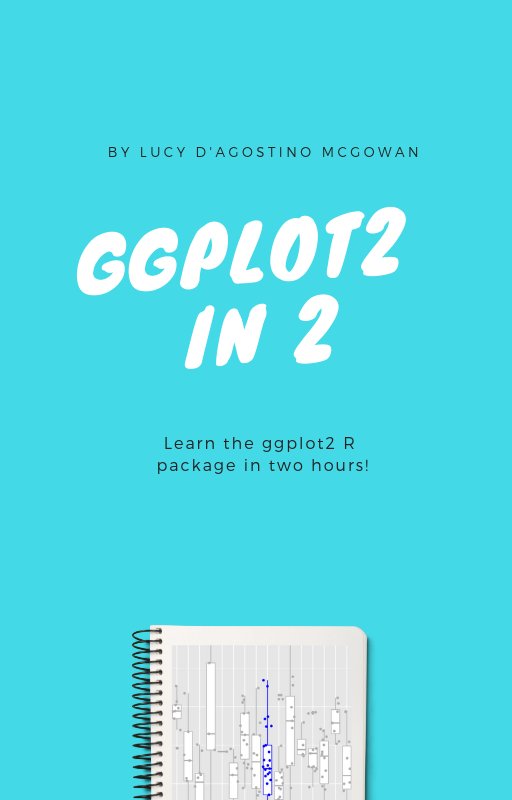
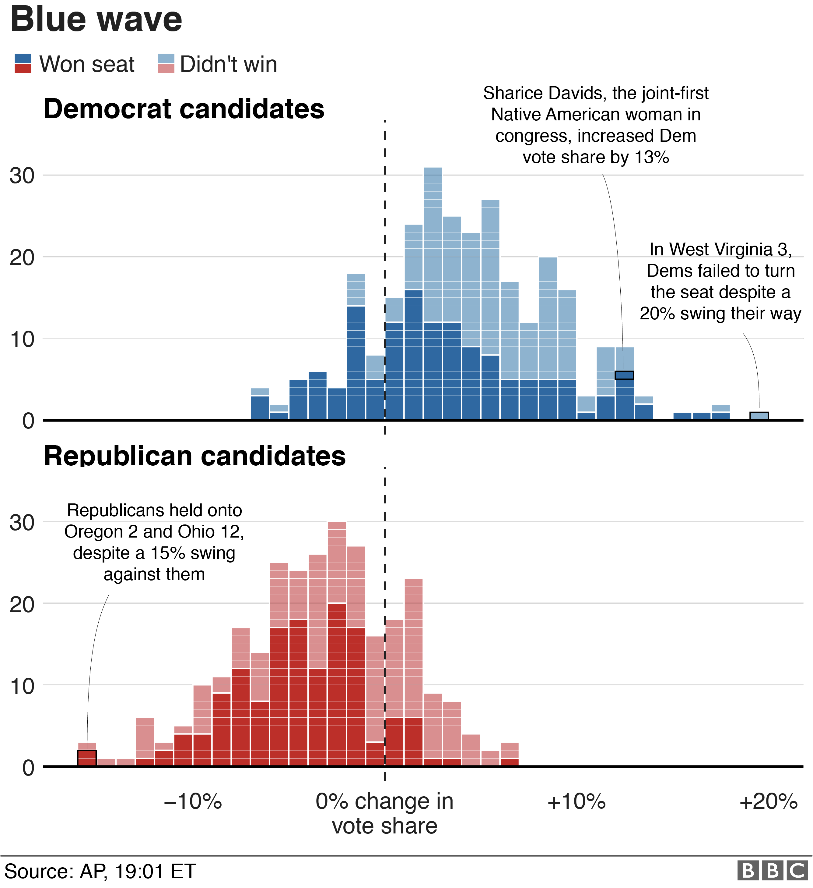
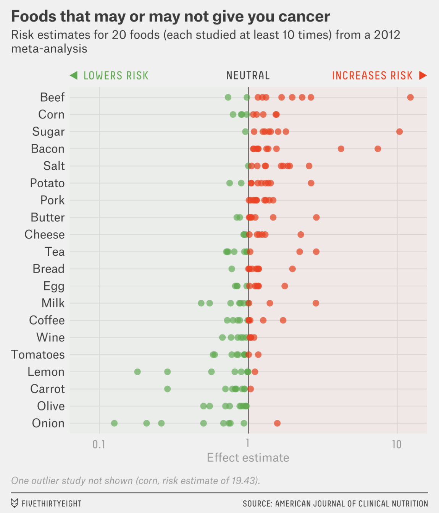
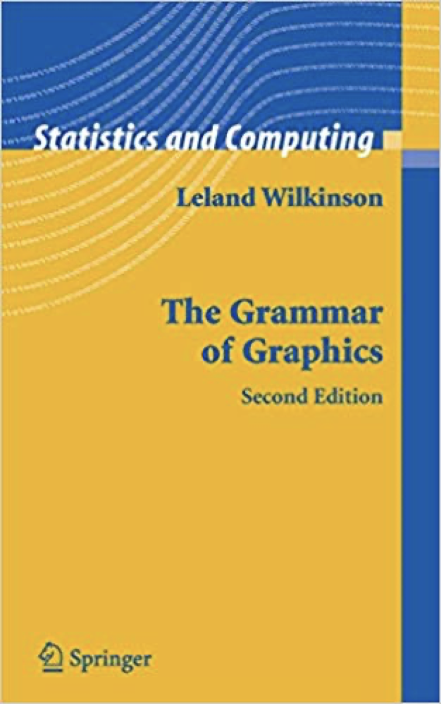
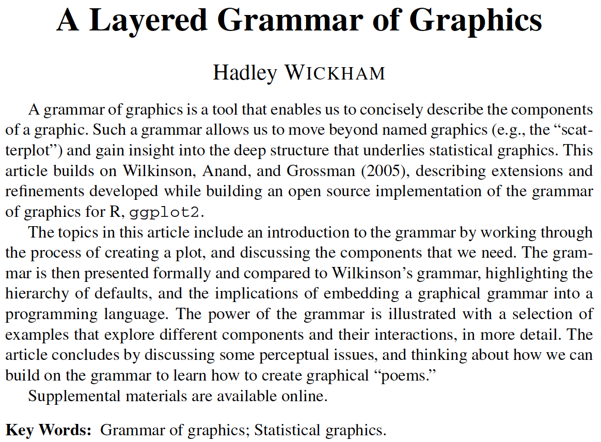
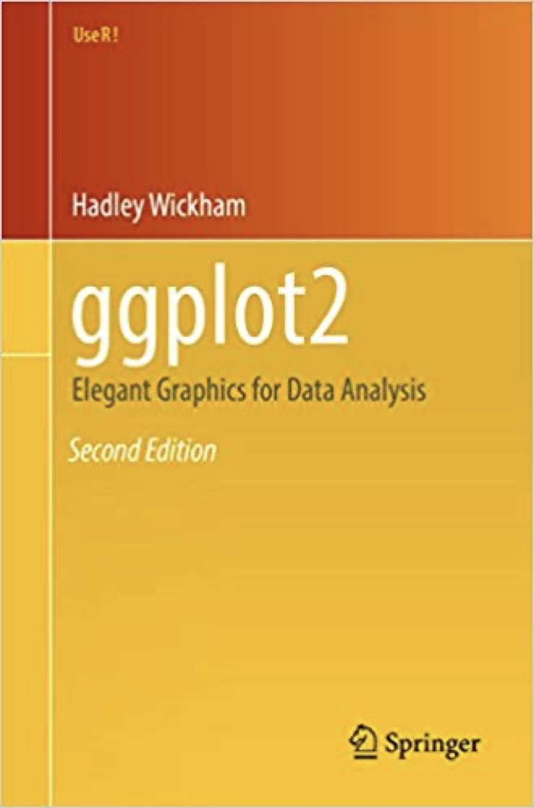
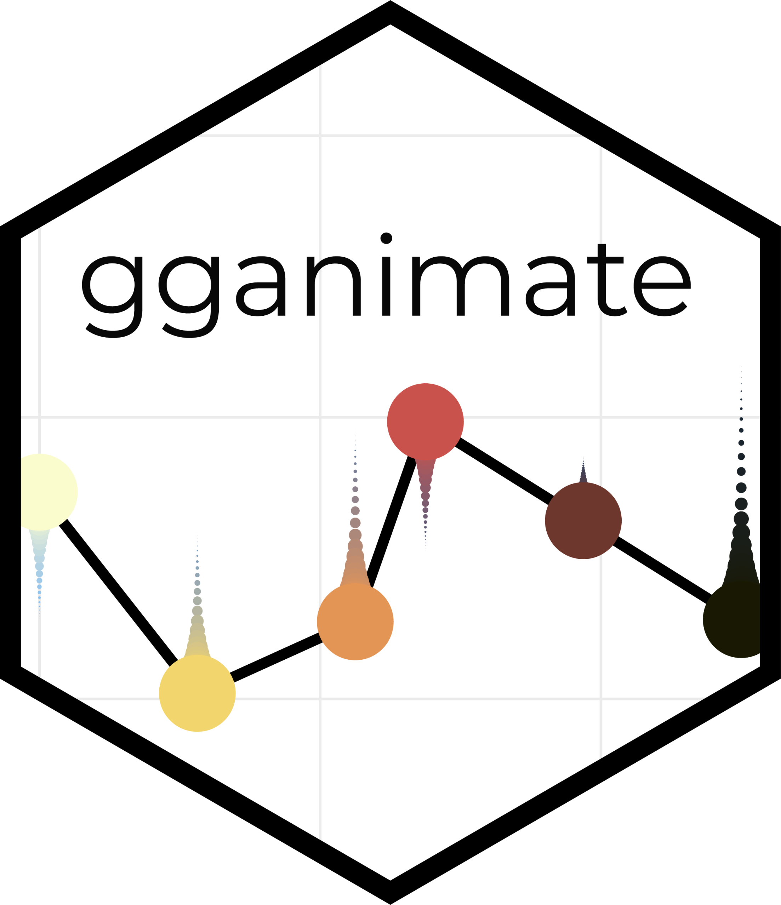

```{r setup, include=FALSE}
options(htmltools.dir.version = FALSE)
knitr::opts_chunk$set(collapse = TRUE,
                      fig.retina = 3,
                      fig.path = "images/visualize/plots/",
                      fig.align = "center",
                      fig.asp = 0.618)

xaringanExtra::use_share_again()
xaringanExtra::use_panelset()
xaringanExtra::use_extra_styles(hover_code_line = TRUE,
                                mute_unhighlighted_code = TRUE)
xaringanExtra::use_scribble(pen_color = "#009FB7")

yt_counter <- 0
library(countdown)
library(tidyverse)
library(flair)
library(here)
library(knitr)

library(xaringancolor)
yellow <- "#FED766"
blue <- "#009FB7"
```

class: title-slide, center

<span class="fa-stack fa-4x">
  <i class="fa fa-circle fa-stack-2x" style="color: #ffffff;"></i>
  <strong class="fa-stack-1x" style="color:#009FB7;">`r rmarkdown::metadata$session`</strong>
</span> 

# `r rmarkdown::metadata$title`

## `r rmarkdown::metadata$subtitle`

### `r rmarkdown::metadata$author`

#### [`r params$class_link`](`r params$class_link`) &#183; [`r params$site_link`](`r params$site_link`)

.footer-license[*Tidy Data Science with the Tidyverse and Tidymodels* is licensed under a [Creative Commons Attribution 4.0 International License](https://creativecommons.org/licenses/by/4.0/).]

<div style = "position:fixed; visibility: hidden">
$$\require{color}\definecolor{yellow}{rgb}{0.996078431372549, 0.843137254901961, 0.4}$$
$$\require{color}\definecolor{blue}{rgb}{0, 0.623529411764706, 0.717647058823529}$$
</div>

<script type="text/x-mathjax-config">
MathJax.Hub.Config({
  TeX: {
    Macros: {
      yellow: ["{\\color{yellow}{#1}}", 1],
      blue: ["{\\color{blue}{#1}}", 1]
    },
    loader: {load: ['[tex]/color']},
    tex: {packages: {'[+]': ['color']}}
  }
});
</script>

<style>
.yellow {color: #FED766;}
.blue {color: #009FB7;}
</style>

---
class: center middle

.pull-left[


[Lucy D'Agostino McGowan](https://www.lucymcgowan.com/)  
Assistant Professor in Statistics  
Wake Forest University  
<i class="fab fa-twitter"></i> [@LucyStats](https://twitter.com/LucyStats)  
<i class="fab fa-github"></i> [@LucyMcGowan](https://github.com/LucyMcGowan)

]

.pull-right[
<a href="https://leanpub.com/ggplot2in2">
  
</a>
]

---
<div class="hex-book">
  <a href="https://ggplot2.tidyverse.org">
    
  </a>
  <a href="https://r4ds.had.co.nz/data-visualisation.html">
    
  </a>
</div>

---
background-image: url(images/visualize/applied-ds-viz.png)
background-position: center 60%
background-size: 85%

# .nobold[(Applied)] Data Science

---
class: center

.pull-left[


[BBC News](https://www.bbc.com/news/world-us-canada-46076389)
]

.pull-right[


[FiveThirtyEight](https://fivethirtyeight.com/features/you-cant-trust-what-you-read-about-nutrition/)
]

---
class: center

.pull-left[


[Kieran Healy](https://kieranhealy.org/blog/archives/2013/06/18/a-co-citation-network-for-philosophy/)
]

.pull-right[


[John MacKintosh](https://www.r-graph-gallery.com/283-the-hourly-heatmap)
]

---
# Grammar of Graphics

.pull-left.center[

]

.pull-right.center[


https://doi.org/10.1198/jcgs.2009.07098
]

---
# ggplot2

.center[


[3rd Edition WIP](https://ggplot2-book.org/)
]


---
class: center middle


.big[**data** maps to]  

--
.big[**aes**thetics in]  

--
.big[layers]  

```{r ggbuild-images, include = FALSE}
library(ratlas)
library(here)

set.seed(1234)
dat <- tibble(x = sample(seq(1, 8, length.out = 10), size = 50, replace = TRUE),
              y = 3 + (0.4 * x) + rnorm(50, mean = 0, sd = 0.7),
              rand = runif(50),
              jitter_x = x + runif(50, min = -0.1, max = 0.1),
              g = case_when(between(x, 2.5, 6.5) & rand < 0.5 ~ "Group 1",
                            TRUE ~ "Group 2"))

# build 1
ggplot(dat, aes(x = x, y = y)) +
  # geom_point(color = blue) +
  # geom_smooth(color = yellow, method = "lm", formula = y ~ x) +
  expand_limits(x = c(1, 8), y = c(2, 10)) +
  scale_x_continuous(breaks = seq(0, 12, 2)) +
  scale_y_continuous(breaks = seq(0, 12, 2)) +
  labs(x = NULL, y = NULL) +
  theme(axis.text = element_blank(),
        axis.ticks = element_blank()) -> b1

# build 2
ggplot(dat, aes(x = x, y = y)) +
  geom_point(color = blue) +
  # geom_smooth(color = yellow, method = "lm", formula = y ~ x) +
  expand_limits(x = c(1, 8), y = c(2, 10)) +
  scale_x_continuous(breaks = seq(0, 12, 2)) +
  scale_y_continuous(breaks = seq(0, 12, 2)) +
  labs(x = NULL, y = NULL) +
  theme(axis.text = element_blank(),
        axis.ticks = element_blank()) -> b2

# build 3
ggplot(dat, aes(x = x, y = y)) +
  geom_point(color = blue) +
  geom_smooth(color = yellow, method = "lm", formula = y ~ x) +
  expand_limits(x = c(1, 8), y = c(2, 10)) +
  scale_x_continuous(breaks = seq(0, 12, 2)) +
  scale_y_continuous(breaks = seq(0, 12, 2)) +
  labs(x = NULL, y = NULL) +
  theme(axis.text = element_blank(),
        axis.ticks = element_blank()) -> b3

# build 4
ggplot(dat, aes(x = jitter_x, y = y)) +
  geom_point(color = blue) +
  geom_smooth(color = yellow, method = "lm", formula = y ~ x) +
  expand_limits(x = c(1, 8), y = c(2, 10)) +
  scale_x_continuous(breaks = seq(0, 12, 2)) +
  scale_y_continuous(breaks = seq(0, 12, 2)) +
  labs(x = NULL, y = NULL) +
  theme(axis.text = element_blank(),
        axis.ticks = element_blank())  -> b4

# build 5
ggplot(dat, aes(x = jitter_x, y = y)) +
  geom_point(aes(color = g)) +
  expand_limits(x = c(1, 8), y = c(2, 10)) +
  scale_x_continuous(breaks = seq(0, 12, 2)) +
  scale_y_continuous(breaks = seq(0, 12, 2)) +
  scale_color_manual(values = c(yellow, blue)) +
  labs(x = NULL, y = NULL, color = "Groups") +
  theme(axis.text = element_blank(),
        axis.ticks = element_blank()) -> b5

# build 6
ggplot(dat, aes(x = jitter_x, y = y)) +
  facet_grid(rows = vars(g)) +
  geom_point(color = blue) +
  expand_limits(x = c(1, 8), y = c(2, 10)) +
  scale_x_continuous(breaks = seq(0, 12, 2)) +
  scale_y_continuous(breaks = seq(0, 12, 2)) +
  labs(x = NULL, y = NULL, color = "Groups") +
  theme(axis.text = element_blank(),
        axis.ticks = element_blank()) -> b6

# build 7
ggplot(dat, aes(x = jitter_x, y = y)) +
  facet_grid(rows = vars(g)) +
  geom_point(color = blue) +
  expand_limits(x = c(1, 8), y = c(2, 10)) +
  scale_x_continuous(breaks = seq(0, 12, 2)) +
  scale_y_continuous(breaks = seq(0, 12, 2)) +
  labs(x = NULL, y = NULL, color = "Groups") +
  theme_bw() +
  theme(axis.text = element_blank(),
        axis.ticks = element_blank()) -> b7

# ggsave2(b1, "build1.png", type = "cairo", width = 4, height = 3.66,
#         path = here("site/static/slides/images/visualize/build-comp"))
# ggsave2(b2, "build2.png", type = "cairo", width = 4, height = 3.66,
#         path = here("site/static/slides/images/visualize/build-comp"))
# ggsave2(b3, "build3.png", type = "cairo", width = 4, height = 3.66,
#         path = here("site/static/slides/images/visualize/build-comp"))
# ggsave2(b4, "build4.png", type = "cairo", width = 4, height = 3.66,
#         path = here("site/static/slides/images/visualize/build-comp"))
# ggsave2(b5, "build5.png", type = "cairo", width = 4, height = 3.66,
#         path = here("site/static/slides/images/visualize/build-comp"))
# ggsave2(b6, "build6.png", type = "cairo", width = 4, height = 3.66,
#         path = here("site/static/slides/images/visualize/build-comp"))
# ggsave2(b7, "build7.png", type = "cairo", width = 4, height = 3.66,
#         path = here("site/static/slides/images/visualize/build-comp"))
```


---
class: center middle
background-image: url(images/visualize/ggbuild-1.png)
background-position: center
background-size: 85%

---
class: center middle
background-image: url(images/visualize/ggbuild-2.png)
background-position: center
background-size: 85%

---
class: center middle
background-image: url(images/visualize/ggbuild-3.png)
background-position: center
background-size: 85%

---
class: center middle
background-image: url(images/visualize/ggbuild-4.png)
background-position: center
background-size: 85%

---
class: center middle
background-image: url(images/visualize/build-comp/build5.png)
background-position: center
background-size: 40%

---
class: center middle
background-image: url(images/visualize/build-comp/build6.png)
background-position: center
background-size: 40%

---
class: center middle
background-image: url(images/visualize/build-comp/build7.png)
background-position: center
background-size: 40%

---
# Example: Bechdel Test

.big[
1. At least 2 names women in the movie,
2. Women have at least one conversation with each other, and
3. That conversation isn't about a man
] 

---
# Bechdel Test Outcomes

* Binary outcome (Pass/Fail)
    * Does the movie meet all 3 criteria
<br>
<br>
* 5 outcomes based on severity
    * <span style="color:#EA594E">**nowomen**</span> - Fails first criteria
    * <span style="color:#EA594E">**notalk**</span> - Fails second criteria
    * <span style="color:#EA594E">**men**</span> - Fails third criteria
    * <span style="color:#589ACF">**dubious**</span> - Experts divided on whether third criteria is met
    * <span style="color:#589ACF">**ok**</span> - Meets all criteria

---
# bechdel

.smallish[
```{r bechdel-intro, message = FALSE}
library(fivethirtyeight)
bechdel
```
]

???

Variables for us:

* clean_test
* budget
* domgross
* decade_code (1990s = 3, 2000s = 2, 2010s = 1)

---
class: your-turn

# Your turn `r (yt_counter <- yt_counter + 1)`

.big[
* Open the R Notebook **materials/exercises/02-visualize.Rmd**
* Let's look at the `bechdel` data set
* Run this code to make a graph
]

```{r bechdel-prompt, eval = FALSE}
ggplot(data = bechdel) +
  geom_point(mapping = aes(x = budget, y = domgross))
```

```{r bechdel-prompt-cd, echo = FALSE}
countdown(minutes = 2, seconds = 0,
          font_size = "2em",
          color_border = yellow,
          color_background = blue,
          color_text = yellow,
          color_running_background = "#F0F0F0",
          color_running_text = blue,
          color_finished_background = yellow,
          color_finished_text = blue)
```

---
class: your-turn

.panelset[
```{r bechdel-sol, panelset = c(source = "Code", output = "Plot"), warning=FALSE, out.width="80%"}
ggplot(data = bechdel) +
  geom_point(mapping = aes(x = budget, y = domgross))
```
]

---
class: middle

```{r ggplot-template1, eval = FALSE, include = FALSE}
ggplot(data = bechdel) +
  geom_point(mapping = aes(x = budget, y = domgross))
```

```{r ggplot-template1-flair, echo = FALSE}
decorate("ggplot-template1", eval = FALSE)
```

---
class: middle

```{r template-flair-data, echo = FALSE}
decorate("ggplot-template1", eval = FALSE) %>%
  flair("bechdel", background = yellow, color = blue)
```

???

Define the data

---
class: middle

```{r template-flair-plus, echo = FALSE}
decorate("ggplot-template1", eval = FALSE) %>%
  flair("+", background = yellow, color = blue)
```

???

+ before new line; *add* layers together

---
class: middle

```{r template-flair-geom, echo = FALSE}
decorate("ggplot-template1", eval = FALSE) %>%
  flair("geom_point", background = yellow, color = blue)
```

???

the type of layer

---
class: middle

```{r template-flair-aes, echo = FALSE}
decorate("ggplot-template1", eval = FALSE) %>%
  flair("aes", background = yellow, color = blue)
```

???

define aesthetics for how data *maps* to layer

---
class: middle

```{r template-flair-x, echo = FALSE}
decorate("ggplot-template1", eval = FALSE) %>%
  flair("x = budget", background = yellow, color = blue)
```

???

x variable

---
class: middle

```{r template-flair-y, echo = FALSE}
decorate("ggplot-template1", eval = FALSE) %>%
  flair("y = domgross", background = yellow, color = blue)
```

???

y variable

---
name: aes
class: center middle

# .blue[**aes**.nobold[thetics]]

---
class: center middle

```{r aes-example, echo = FALSE, fig.asp = 0.265, out.width = "95%"}
tibble(x = rep(1, 4),
       y = rep(1, 4),
       f = 1:4,
       c = as.character(c(1, 1, 1, 2)),
       s = as.character(c(1, 1, 2, 1)),
       z = as.character(c(1, 2, 1, 1))) %>%
  ggplot(aes(x = x, y = y)) +
  facet_wrap(~f, nrow = 1) +
  geom_point(aes(shape = s, color = c, size = z),
             show.legend = FALSE) +
  scale_color_manual(values = c(blue, yellow)) +
  scale_size_manual(values = c(30, 15)) +
  expand_limits(x = c(-100, 100), y = c(-100, 100)) +
  labs(x = NULL, y = NULL) +
  coord_equal() +
  theme(strip.background = element_blank(),
        strip.text = element_blank(),
        axis.text = element_blank(),
        axis.ticks = element_blank())
```


---
class: center

```{r bechdel-aes, echo = FALSE, message = FALSE, out.width="70%", fig.asp = 0.4}
dat <- tibble(x = c(rep(1, 6), rep(1.2, 6)),
              y = rep(1:6, 2),
              label = c("ok", "dubious", "men", "notalk", "nowoman", "clean_test",
                        "colorblock", "colorblock", "colorblock", "colorblock",
                        "colorblock", "color"))

ggplot() +
  geom_text(data = filter(dat, x == 1, y < 6),
            aes(x = x, y = y, label = label),
            hjust = 1, color = "#696773", size = 6,
            family = "Source Sans Pro") +
  geom_label(data = filter(dat, x == 1.2, y < 6),
            aes(x = x, y = y, label = label, color = y, fill = y),
            hjust = 0, show.legend = FALSE, size = 6,
            family = "Source Sans Pro") +
  geom_text(data = filter(dat, x == 1, y == 6),
            aes(x = x, y = y, label = label),
            hjust = 1, color = "black", fontface = "bold", size = 6,
            family = "Source Sans Pro") +
  geom_text(data = filter(dat, x == 1.2, y == 6),
            aes(x = x, y = y, label = label),
            hjust = 0, color = "black", fontface = "bold", size = 6,
            family = "Source Sans Pro") +
  geom_segment(aes(x = 1.01, xend = 1.19, y = 1:5, yend = 1:5),
               lineend = "round", linejoin = "bevel",
               arrow = arrow(length = unit(0.1, "inches"), ends = "both")) +
  expand_limits(x = c(0.5, 1.8)) +
  scale_color_viridis_c(begin = 1, end = 0, option = "viridis") +
  scale_fill_viridis_c(begin = 1, end = 0, option = "viridis") +
  theme_void() +
  theme(plot.background = element_rect(fill = "#F0F0F0", color = NA),
        panel.background = element_rect(fill = "#F0F0F0", color = NA))
```
<br>
<br>
.left[
```{r bechdel-color-example, eval = FALSE, include = FALSE}
ggplot(data = bechdel) +
  geom_point(mapping = aes(x = budget, y = domgross, color = clean_test))
```

```{r bechdel-color-example-flair, echo = FALSE}
decorate("bechdel-color-example", eval = FALSE) %>%
  flair("color = clean_test", background = yellow, color = blue)
```
]

---
.panelset[
```{r bechdel-color-plot, panelset = c(source = "Code", output = "Plot"), warning=FALSE, out.width="80%"}
ggplot(data = bechdel) +
  geom_point(mapping = aes(x = budget, y = domgross, color = clean_test))
```
]

???
Legend is added automatically

---
class: your-turn

# Your turn `r (yt_counter <- yt_counter + 1)`

.big[
* Experiment with adding color, size, alpha, and shape aesthetics to your graph
* How do aesthetics behave differently with mapped to discrete and continuous variables?
* What happens when you use more than one aesthetic?
]

```{r aes-try-cd, echo = FALSE}
countdown(minutes = 5)
```

---

```{r aes-overview, echo = FALSE, message = FALSE, fig.width = 15, fig.asp = .618, out.width = "90%"}
library(patchwork)

disc <- tibble(x = c("a", "b", "c"), y = 1)

cont <- tibble(x = 1:5, y = 1)

disc_c <- ggplot(disc, aes(x = x, y = y)) +
  geom_point(aes(color = x), show.legend = FALSE, size = 30) +
  labs(x = NULL, y = "Color", title = "Discrete") +
  theme(plot.title = element_text(size = 50, family = "Source Sans Pro",
                                  hjust = 0.5),
        axis.title.y = element_text(angle = 360, vjust = 0.5, size = 50,
                                    family = "Source Sans Pro"),
        axis.text = element_blank(),
        axis.ticks = element_blank(),
        plot.background = element_rect(fill = "#F0F0F0", color = NA),
        panel.border = element_rect(color = "#272727", fill = NA))

disc_z <- ggplot(disc, aes(x = x, y = y)) +
  geom_point(aes(size = x), show.legend = FALSE) +
  scale_size_manual(values = c(5, 15, 30)) +
  labs(x = NULL, y = "Size") +
  theme(axis.title.y = element_text(angle = 360, vjust = 0.5, size = 50,
                                    family = "Source Sans Pro"),
        axis.text = element_blank(),
        axis.ticks = element_blank(),
        plot.background = element_rect(fill = "#F0F0F0", color = NA),
        panel.border = element_rect(color = "#272727", fill = NA))

disc_s <- ggplot(disc, aes(x = x, y = y)) +
  geom_point(aes(shape = x), show.legend = FALSE, size = 30) +
  labs(x = NULL, y = "Shape") +
  theme(axis.title.y = element_text(angle = 360, vjust = 0.5, size = 50,
                                    family = "Source Sans Pro"),
        axis.text = element_blank(),
        axis.ticks = element_blank(),
        plot.background = element_rect(fill = "#F0F0F0", color = NA),
        panel.border = element_rect(color = "#272727", fill = NA))

cont_c <- ggplot(cont, aes(x = x, y = y)) +
  geom_point(aes(color = x), show.legend = FALSE, size = 30) +
  labs(x = NULL, y = NULL, title = "Continuous") +
  expand_limits(x = c(0.8, 5.2)) +
  theme(plot.title = element_text(size = 50, family = "Source Sans Pro",
                                  hjust = 0.5),
        axis.title.y = element_text(angle = 360, vjust = 0.5, size = 50,
                                    family = "Source Sans Pro"),
        axis.text = element_blank(),
        axis.ticks = element_blank(),
        plot.background = element_rect(fill = "#F0F0F0", color = NA),
        panel.border = element_rect(color = "#272727", fill = NA))

cont_z <- ggplot(cont, aes(x = x, y = y)) +
  geom_point(aes(size = x), show.legend = FALSE) +
  scale_size_area(max_size = 30) +
  labs(x = NULL, y = NULL) +
  expand_limits(x = c(0.8, 5.2)) +
  theme(axis.title.y = element_text(angle = 360, vjust = 0.5, size = 50,
                                    family = "Source Sans Pro"),
        axis.text = element_blank(),
        axis.ticks = element_blank(),
        plot.background = element_rect(fill = "#F0F0F0", color = NA),
        panel.border = element_rect(color = "#272727", fill = NA))

cont_s <- ggplot(cont, aes(x = x, y = y)) +
  geom_point(aes(size = x), show.legend = FALSE, alpha = 0) +
  scale_size_continuous(range = c(5, 30)) +
  labs(x = NULL, y = NULL) +
  expand_limits(x = c(0.8, 5.2)) +
  theme(axis.title.y = element_text(angle = 360, vjust = 0.5, size = 50,
                                    family = "Source Sans Pro"),
        axis.text = element_blank(),
        axis.ticks = element_blank(),
        plot.background = element_rect(fill = "#F0F0F0", color = NA),
        panel.border = element_rect(color = "#272727", fill = NA))

(disc_c | cont_c) /
(disc_z | cont_z) /
(disc_s | cont_s) &
  plot_annotation(theme = theme(plot.background = element_rect(fill = "#F0F0F0",
                                                               color = NA)))
```

---
# Set vs. map

```{r set-map, echo = FALSE, fig.align = "center", out.width = "75%", warning = FALSE}
ggplot(data = bechdel) +
  geom_point(mapping = aes(x = budget, y = domgross), color = "blue")
```

???

How would you do this?

---
.pull-left[
`)
]

.pull-right.center[
**Inside of aes()**: Maps an aesthetic to a variable
]

```{r inside-aes, eval = FALSE, include = FALSE}
ggplot(data = bechdel) +
  geom_point(mapping = aes(x = budget, y = domgross, color = clean_test))
```

```{r outside-aes, eval = FALSE, include = FALSE}
ggplot(data = bechdel) +
  geom_point(mapping = aes(x = budget, y = domgross), color = "blue")
```

```{r inside-aes-flair, echo = FALSE}
decorate("inside-aes", eval = FALSE) %>%
  flair("color = clean_test", background = yellow, color = blue)
```

---
.pull-left[
`)
]

.pull-right.center[
**Outside of aes()**: Sets an aesthetic to a value
]


```{r inside-aes-flair-2, echo = FALSE}
decorate("inside-aes", eval = FALSE) %>%
  flair("color = clean_test", background = yellow, color = blue)
```

```{r outside-aes-flair, echo = FALSE}
decorate("outside-aes", eval = FALSE) %>%
  flair_rx("aes\\(.*\\)(?!$)", background = yellow, color = blue)
```

---
.pull-left[
`)
]

.pull-right.center[
`)
]


```{r inside-aes-flair-3, echo = FALSE}
decorate("inside-aes", eval = FALSE) %>%
  flair("color = clean_test", background = yellow, color = blue)
```

```{r outside-aes-flair-2, echo = FALSE}
decorate("outside-aes", eval = FALSE) %>%
  flair_rx("aes\\(.*\\)(?!$)", background = yellow, color = blue)
```

---
class: pop-quiz

# Pop quiz!

What will this code do?

```{r quiz-code, eval = FALSE}
ggplot(data = bechdel) +
  geom_point(mapping = aes(x = budget, y = domgross, color = "blue"))
```

---
class: pop-quiz

.panelset[
```{r pop-quiz-solution, panelset = c(source = "Code", output = "Plot"), warning=FALSE, out.width="80%"}
ggplot(data = bechdel) +
  geom_point(mapping = aes(x = budget, y = domgross, color = "blue"))
```
]

---
name: geom
class: center middle

# .blue[**geom**.nobold[etries]]

---
class: center middle

.pull-left[
```{r point-geom, echo = FALSE, warning = FALSE}
ggplot(bechdel, aes(x = budget, y = domgross)) +
  geom_point()
```
]

.pull-right[
```{r smooth-geom, echo = FALSE, warning = FALSE, message = FALSE}
ggplot(bechdel, aes(x = budget, y = domgross)) +
  geom_smooth()
```
]

???
How are these plots similar?
* x var, y var, data

How different?
* Geometric object (i.e., visual object used to represent the data)

---
class: middle

```{r ggplot-template, eval = FALSE, include = FALSE}
ggplot(data = {DATA}) +
  {GEOM_FUNCTION}(mapping = aes({MAPPINGS}))
```

```{r ggplot-template-flair, echo = FALSE}
decorate("ggplot-template", eval = FALSE) %>%
  flair("{DATA}", color = blue, background = yellow) %>%
  flair("{GEOM_FUNCTION}", color = blue, background = yellow) %>%
  flair("{MAPPINGS}", color = blue, background = yellow)
```

---
background-image: url(images/visualize/cheatsheet-geom.png)
background-position: center middle
background-size: 85%

---
class: your-turn

# Your turn `r (yt_counter <- yt_counter + 1)`

.big[
* Replace this scatter plot with one that draws a box plot
]

```{r yt-scatter, out.width = "40%"}
ggplot(data = bechdel) +
  geom_point(mapping = aes(x = clean_test, y = budget))
```

```{r yt-scatter-cd, echo = FALSE}
countdown(minutes = 5)
```

---
class: your-turn

.panelset[
```{r yt-box, panelset = c(source = "Code", output = "Plot"), out.width = "80%", warning = FALSE}
ggplot(data = bechdel) +
  geom_boxplot(mapping = aes(x = clean_test, y = budget))
```
]

---
class: your-turn

# Your turn `r (yt_counter <- yt_counter + 1)`

.big[
* Make the histogram of **budget** shown below
]

```{r yt-hist, echo = FALSE, out.width = "60%", warning = FALSE, message = FALSE}
ggplot(data = bechdel) +
  geom_histogram(mapping = aes(x = budget))
```

```{r yt-hist-cd, echo = FALSE}
countdown(minutes = 5)
```

---
class: your-turn

.panelset[
```{r yt-hist-sol, panelset = c(source = "Code", output = "Plot"), out.width = "80%", warning = FALSE, message = FALSE}
ggplot(data = bechdel) +
  geom_histogram(mapping = aes(x = budget))
```
]

---
class: your-turn

# Your turn `r (yt_counter <- yt_counter + 1)`

.big[
* Make the density plot of **budget** colored by **clean_test** shown below
]

```{r yt-col-den, echo = FALSE, out.width = "60%", warning = FALSE, message = FALSE}
ggplot(data = bechdel) +
  geom_density(mapping = aes(x = budget, color = clean_test))
```

```{r yt-col-den-cd, echo = FALSE}
countdown(minutes = 5)
```

---
class: your-turn

.panelset[
.panel[.panel-name[Density Code]
```{r dcode-sol, fig.show='hide'}
ggplot(data = bechdel) +
  geom_density(mapping = aes(x = budget))
```
]
.panel[.panel-name[Density Plot]
```{r dcode-sol-fig, echo = FALSE, out.width = "80%"}
include_graphics(fig_chunk("dcode-sol", ".png"))
```
]

.panel[.panel-name[Coloring Code]
```{r col-den-sol, fig.show='hide'}
ggplot(data = bechdel) +
  geom_density(mapping = aes(x = budget, color = clean_test))
```
]

.panel[.panel-name[Final Plot]
```{r col-den-sol-fig, echo = FALSE, out.width = "80%"}
include_graphics(fig_chunk("col-den-sol", ".png"))
```
]
]

---
class: your-turn

# Your turn `r (yt_counter <- yt_counter + 1)`

.big[
* Make the bar chart of **clean_test** colored by **clean_test** shown below
]

```{r yt-col-bar, echo = FALSE, out.width = "60%", warning = FALSE, message = FALSE}
ggplot(data = bechdel) +
  geom_bar(mapping = aes(x = clean_test, fill = clean_test))
```

```{r yt-col-bar-cd, echo = FALSE}
countdown(minutes = 5)
```

---
class: your-turn

.panelset[
.panel[.panel-name[Color Code]
```{r col-bar-sol, fig.show='hide'}
ggplot(data = bechdel) +
  geom_bar(mapping = aes(x = clean_test, color = clean_test))
```
]
.panel[.panel-name[Color Plot]
```{r col-bar-sol-fig, echo = FALSE, out.width = "80%"}
include_graphics(fig_chunk("col-bar-sol", ".png"))
```
]

.panel[.panel-name[Fill Code]
```{r fill-bar-sol, include = FALSE, echo = FALSE}
ggplot(data = bechdel) +
  geom_bar(mapping = aes(x = clean_test, fill = clean_test))
```

```{r fill-bar-sol-flair, echo = FALSE}
decorate("fill-bar-sol", eval = FALSE) %>%
  flair("fill", background = yellow, color = blue)
```
]

.panel[.panel-name[Final Plot]
```{r fill-bar-sol-fig, echo = FALSE, out.width = "80%"}
include_graphics(fig_chunk("fill-bar-sol", ".png"))
```
]
]

---
class: your-turn

# Your turn `r (yt_counter <- yt_counter + 1)`

.big[
* Predict what this code will do.
* Then run it.
]

```{r yt-mult-layer, eval = FALSE, warning = FALSE, message = FALSE}
ggplot(data = bechdel) +
  geom_point(mapping = aes(x = budget, y = domgross)) +
  geom_smooth(mapping = aes(x = budget, y = domgross))
```

```{r yt-mult-layer-cd, echo = FALSE}
countdown(minutes = 5)
```

---
class: your-turn

.panelset[
```{r yt-mult-layer-sol, panelset = c(source = "Code", output = "Plot"), out.width = "80%", warning = FALSE, message = FALSE}
ggplot(data = bechdel) +
  geom_point(mapping = aes(x = budget, y = domgross)) +
  geom_smooth(mapping = aes(x = budget, y = domgross))
```
]

???
Each new geom just adds a new layer.

---
name: global
class: center middle

# .blue[global vs. local]

---

```{r yt-mult-layer-flair, echo = FALSE}
decorate("yt-mult-layer", eval = FALSE) %>%
  flair("mapping = aes(x = budget, y = domgross)",
        background = yellow, color = blue)
```

```{r yt-mult-layer-sol-fig, echo = FALSE, out.width = "70%"}
include_graphics(fig_chunk("yt-mult-layer-sol", ".png"))
```

???
This is really repetitive. What if you want to change one of the variables? Then you have to change every layer. Gross.

---
```{r global-opts, include = FALSE}
ggplot(data = bechdel, mapping = aes(x = budget, y = domgross)) +
  geom_point() +
  geom_smooth()
```

```{r global-opts-flair, echo = FALSE}
decorate("global-opts", eval = FALSE) %>%
  flair("mapping = aes(x = budget, y = domgross)",
        background = yellow, color = blue)
```

```{r global-opts-fig, echo = FALSE, out.width = "70%"}
include_graphics(fig_chunk("global-opts", ".png"))
```

???
Mappings and data that are defined in `ggplot()` will be applied globally, to every layer.

---
```{r local-opts, include = FALSE}
ggplot(data = bechdel, mapping = aes(x = budget, y = domgross)) +
  geom_point(mapping = aes(color = clean_test)) +
  geom_smooth()
```

```{r local-opts-flair, echo = FALSE}
decorate("local-opts", eval = FALSE) %>%
  flair("mapping = aes(color = clean_test)",
        background = yellow, color = blue)
```

```{r local-opts-fig, echo = FALSE, out.width = "70%"}
include_graphics(fig_chunk("local-opts", ".png"))
```

???
Mappings (and data) that appear in a geom_*() function will add to or override the global mappings for that layer only

---
```{r local-data, include = FALSE}
ggplot(data = bechdel, mapping = aes(x = budget, y = domgross)) +
  geom_point(mapping = aes(color = clean_test)) +
  geom_smooth(data = filter(bechdel, clean_test == "ok"))
```

```{r local-data-flair, echo = FALSE}
decorate("local-data", eval = FALSE) %>%
  flair("data = filter(bechdel, clean_test == \"ok\")",
        background = yellow, color = blue)
```

```{r local-data-fig, echo = FALSE, out.width = "70%"}
include_graphics(fig_chunk("local-data", ".png"))
```

???
Data can also be set globally and/or locally

---
name: stats
class: center middle

# .blue[stats]

---
class: pop-quiz

# Pop quiz!

Where do the values for creating the box and whiskers come from?

```{r yt-box-fig, echo = FALSE, out.width = "60%"}
include_graphics(fig_chunk("yt-box", ".png"))
```

---
class: pop-quiz

What does `method = "gam"` mean?

```{r show-gam-msg, warning = FALSE, out.width = "60%"}
ggplot(data = bechdel, mapping = aes(x = budget, y = domgross)) +
  geom_point() +
  geom_smooth()
```

---
# Defining Stats

.panelset[
```{r stat-summary, panelset = c(source = "`stat_summary`", output = "Plot"), out.width = "60%"}
ggplot(data = bechdel, mapping = aes(x = clean_test, y = budget)) +
  geom_boxplot() +
  stat_summary(geom = "point", fun = "mean", color = "blue", size = 3)
```

```{r geom-func, panelset = c(source = "`stat = \"summary\"`", output = "Plot"), out.width = "60%"}
ggplot(data = bechdel, mapping = aes(x = clean_test, y = budget)) +
  geom_boxplot() +
  geom_point(stat = "summary", fun = "mean", color = "blue", size = 3)
```
]

---
# Stats as Layers

```{r stat-sum-flair, echo = FALSE}
decorate('
ggplot(data = bechdel, mapping = aes(x = clean_test, y = budget)) +
  geom_boxplot() +
  stat_summary(geom = "point", fun = "mean", color = "blue", size = 3)
', eval = FALSE) %>%
  flair("stat_summary", background = yellow, color = blue) %>%
  flair("geom = \"point\"", background = yellow, color = blue)
```

```{r stat-sum-geom-flair, echo = FALSE}
decorate('
ggplot(data = bechdel, mapping = aes(x = clean_test, y = budget)) +
  geom_boxplot() +
  geom_point(stat = "summary", fun = "mean", color = "blue", size = 3)      
', eval = FALSE) %>%
  flair("geom_point", background = yellow, color = blue) %>%
  flair("stat = \"summary\"", background = yellow, color = blue)
```

---
# Distributions

```{r dist-example, out.width = "55%"}
ggplot() + xlim(c(-5, 5)) +
  geom_function(aes(color = "normal"), fun = dnorm) +
  geom_function(aes(color = "t, df = 1"), fun = dt, args = list(df = 1))
```

---
name: positions
class: center middle

# .blue[positions]

---
.panelset[
.panel[.panel-name[Bad]
```{r bad-pos, warning = FALSE, include = FALSE}
ggplot(data = bechdel, mapping = aes(x = clean_test, y = budget)) +
  geom_point()
```

```{r bad-pos-flair, echo = FALSE}
decorate("bad-pos", eval = FALSE)
```

```{r bad-pos-fig, echo = FALSE, out.width = "60%"}
include_graphics(fig_chunk("bad-pos", ".png"))
```
]

.panel[.panel-name[Better]
```{r better-pos, warning = FALSE, include = FALSE}
ggplot(data = bechdel, mapping = aes(x = clean_test, y = budget)) +
  geom_point(position = "jitter")
```

```{r better-pos-flair, echo = FALSE}
decorate("better-pos", eval = FALSE) %>%
  flair("position = \"jitter\"", background = yellow, color = blue)
```

```{r better-pos-fig, echo = FALSE, out.width = "60%"}
include_graphics(fig_chunk("better-pos", ".png"))
```
]

.panel[.panel-name[Best]
```{r best-pos, warning = FALSE, include = FALSE}
ggplot(data = bechdel, mapping = aes(x = clean_test, y = budget)) +
  geom_point(position = position_jitter(width = 0.2, height = 0))
```

```{r best-pos-flair, echo = FALSE}
decorate("best-pos", eval = FALSE) %>%
  flair("position_jitter(width = 0.2, height = 0)",
        background = yellow, color = blue)
```

```{r best-pos-fig, echo = FALSE, out.width = "60%"}
include_graphics(fig_chunk("best-pos", ".png"))
```
]
]

---
class: center middle

`position_identity()`

--

`position_jitter()`

--

`position_dodge()`

--

`position_fill()`

--

more...

---

```{r need-pos, echo = FALSE, warning = FALSE, include = FALSE}
ggplot(bechdel, mapping = aes(x = decade_code)) +
  geom_bar(mapping = aes(fill = clean_test))
```

```{r need-pos-fig, echo = FALSE, out.width = "90%"}
include_graphics(fig_chunk("need-pos", ".png"))
```

---
class: your-turn

# Your turn `r (yt_counter <- yt_counter + 1)`

.big[
* Add a position adjustment to this plot to compare the frequency of test results across decades.
]

```{r yt-need-pos-flair, echo = FALSE}
decorate("need-pos", eval = FALSE)
```

```{r yt-need-pos-fig, echo = FALSE, out.width = "40%"}
include_graphics(fig_chunk("need-pos", ".png"))
```

```{r yt-need-pos-cd, echo = FALSE}
countdown(minutes = 5)
```

---
class: your-turn

.panelset[
```{r bar-pos-dodge, panelset = c(source = "Dodge", output = "Dodge Plot"), out.width = "80%", warning = FALSE}
ggplot(bechdel, mapping = aes(x = decade_code)) +
  geom_bar(mapping = aes(fill = clean_test), position = "dodge")
```

```{r bar-pos-fill, panelset = c(source = "Fill", output = "Fill Plot"), out.width = "80%", warning = FALSE}
ggplot(bechdel, mapping = aes(x = decade_code)) +
  geom_bar(mapping = aes(fill = clean_test), position = "fill")
```
]

---
name: scales
class: center middle

# .blue[scales]

---

```{r scale-brewer, echo = FALSE, out.width = "90%"}
ggplot(data = bechdel) +
  geom_bar(mapping = aes(x = clean_test, fill = clean_test)) +
  scale_fill_brewer(type = "qual")
```

---

.panelset[
.panel[.panel-name[Brewer]
```{r scale-brewer-def, include = FALSE}
ggplot(data = bechdel) +
  geom_bar(mapping = aes(x = clean_test, fill = clean_test)) +
  scale_fill_brewer()
```

```{r scale-brewer-def-flair, echo = FALSE}
decorate("scale-brewer-def", eval = FALSE) %>%
  flair("scale_fill_brewer()")
```

```{r scale-brewer-def-fig, echo = FALSE, out.width = "60%"}
include_graphics(fig_chunk("scale-brewer-def", ".png"))
```
]

.panel[.panel-name[Qualitative]
```{r scale-brewer-qual, include = FALSE}
ggplot(data = bechdel) +
  geom_bar(mapping = aes(x = clean_test, fill = clean_test)) +
  scale_fill_brewer(type = "qual")
```

```{r scale-brewer-qual-flair, echo = FALSE}
decorate("scale-brewer-qual", eval = FALSE) %>%
  flair("type = \"qual\"")
```

```{r scale-brewer-qual-fig, echo = FALSE, out.width = "60%"}
include_graphics(fig_chunk("scale-brewer-qual", ".png"))
```
]

.panel[.panel-name[Palettes]
```{r scale-brewer-pal, include = FALSE}
ggplot(data = bechdel) +
  geom_bar(mapping = aes(x = clean_test, fill = clean_test)) +
  scale_fill_brewer(type = "qual", palette = "Set1")
```

```{r scale-brewer-pal-flair, echo = FALSE}
decorate("scale-brewer-pal", eval = FALSE) %>%
  flair("palette = \"Set1\"")
```

.left-column.center[
View available palettes at:  
[colorbrewer2.org](https://colorbrewer2.org)
]

.right-column[
```{r scale-brewer-pal-fig, echo = FALSE, out.width = "80%"}
include_graphics(fig_chunk("scale-brewer-pal", ".png"))
```
]
]

.panel[.panel-name[Ordinal]
```{r scale-ordinal, include = FALSE}
ggplot(data = bechdel) +
  geom_bar(mapping = aes(x = clean_test, fill = clean_test)) +
  scale_fill_ordinal()
```

```{r scale-ordinal-flair, echo = FALSE}
decorate("scale-ordinal", eval = FALSE) %>%
  flair("scale_fill_ordinal()")
```

```{r scale-ordinal-fig, echo = FALSE, out.width = "60%"}
include_graphics(fig_chunk("scale-ordinal", ".png"))
```
]
]

---
class: center middle

`scale_{aesthetic}_continuous()`

--

`scale_{aesthetic}_discrete()`

--

`scale_{aesthetic}_ordinal()`

--

`scale_{aesthetic}_manual()`

--

`scale_{color/fill}_brewer()`

--

`scale_{color/fill}_distill()`

--

`scale_{color/fill}_gradient()`

---

```{r coord-def, out.width = "70%"}
ggplot(bechdel, aes(x = clean_test, y = budget)) +
  geom_point(position = position_jitter(width = 0.2, height = 0))
```

???

Also coordinate scales.

---

```{r coord-x, out.width = "70%"}
ggplot(bechdel, aes(x = clean_test, y = budget)) +
  geom_point(position = position_jitter(width = 0.2, height = 0)) +
  scale_x_discrete(limits = c("dubious", "ok", "men", "notalk", "nowomen"))
```

---

```{r cont-def, out.width = "70%", warning = FALSE}
ggplot(bechdel, mapping = aes(x = budget, y = domgross)) +
  geom_point()
```

---

```{r cont-x, out.width = "70%", warning = FALSE}
ggplot(bechdel, mapping = aes(x = budget, y = domgross)) +
  geom_point() +
  scale_x_continuous(limits = c(0, 5e+08), breaks = seq(0, 5e+08, 5e+07),
                     labels = scales::scientific)
```

---
name: facets
class: center middle

# .blue[facets]

---

```{r need-facet, echo = FALSE, out.width = "80%", warning = FALSE}
ggplot(data = bechdel, mapping = aes(x = budget, y = domgross)) +
  geom_point(mapping = aes(color = clean_test))
```

---

```{r facet-wrap, include = FALSE}
ggplot(data = bechdel, mapping = aes(x = budget, y = domgross)) +
  geom_point(mapping = aes(color = clean_test)) +
  facet_wrap(vars(clean_test))
```

```{r facet-wrap-flair, echo = FALSE}
decorate("facet-wrap", eval = FALSE) %>%
  flair("facet_wrap(vars(clean_test))")
```

```{r facet-wrap-fig, echo = FALSE, out.width = "70%"}
include_graphics(fig_chunk("facet-wrap", ".png"))
```

---

```{r facet-grid, include = FALSE}
ggplot(data = bechdel, mapping = aes(x = budget, y = domgross)) +
  geom_point(mapping = aes(color = clean_test)) +
  facet_grid(rows = vars(decade_code), cols = vars(clean_test))
```

```{r facet-grid-flair, echo = FALSE}
decorate("facet-grid", eval = FALSE) %>%
  flair("facet_grid")
```

```{r facet-grid-fig, echo = FALSE, out.width = "70%"}
include_graphics(fig_chunk("facet-grid", ".png"))
```


???

Facet with multiple variables using `facet_grid()`

---
name: themes
class: center middle

# .blue[themes]

---
.panelset[
.panel[.panel-name[Default]
```{r theme-grey, out.width = "60%", warning = FALSE}
ggplot(data = bechdel, mapping = aes(x = budget, y = domgross)) +
  geom_point(mapping = aes(color = clean_test))
```
]

.panel[.panel-name[Black & White]
```{r theme-bw, out.width = "60%", warning = FALSE}
ggplot(data = bechdel, mapping = aes(x = budget, y = domgross)) +
  geom_point(mapping = aes(color = clean_test)) +
  theme_bw()
```
]

.panel[.panel-name[Minimal]
```{r theme-min, out.width = "60%", warning = FALSE}
ggplot(data = bechdel, mapping = aes(x = budget, y = domgross)) +
  geom_point(mapping = aes(color = clean_test)) +
  theme_minimal()
```
]

.panel[.panel-name[Void]
```{r theme-void, out.width = "60%", warning = FALSE}
ggplot(data = bechdel, mapping = aes(x = budget, y = domgross)) +
  geom_point(mapping = aes(color = clean_test)) +
  theme_void()
```
]

.panel[.panel-name[More...]
```{r theme-custom, out.width = "60%", warning = FALSE}
ggplot(data = bechdel, mapping = aes(x = budget, y = domgross)) +
  geom_point(mapping = aes(color = clean_test)) +
  theme(legend.position = "bottom")
```
]
]

---
.panelset[
.panel[.panel-name[Stata Theme]
```{r ggthemes}
library(ggthemes)
```

```{r stata-thm, include = FALSE}
ggplot(data = bechdel, mapping = aes(x = budget, y = domgross)) +
  geom_point(mapping = aes(color = clean_test)) +
  scale_color_stata() +
  theme_stata()
```

```{r stata-thm-flair, echo = FALSE}
decorate("stata-thm", eval = FALSE) %>%
  flair("scale_color_stata") %>%
  flair("theme_stata")
```
]

.panel[.panel-name[Plot]
```{r stata-thm-fig, echo = FALSE, out.width = "80%"}
include_graphics(fig_chunk("stata-thm", ".png"))
```
]
]

---
name: extend
class: center middle

# .blue[extensions]

---
# ggforce

.pull-left.center[
Additional:

geoms  
stats  
facets  

.big[
[ggforce.data-imaginist.com](https://ggforce.data-imaginist.com/)
]
]

.pull-right.center[
```{r ggforce-hex, echo = FALSE, out.width = "70%"}

```
]

---
# ggrepel

.pull-left.center[
Add non-overlapping labels to plots

.big[
[ggrepel.slowkow.com](https://ggrepel.slowkow.com/)
]
]

.pull-right.center[
```{r ggrepel-hex, echo = FALSE, out.width = "70%"}

```
]

---
# ggdist

.pull-left.center[
Plot distributional summaries from, e.g., MCMC chains

.big[
[mjskay.github.io/ggdist](https://mjskay.github.io/ggdist/)
]
]

.pull-right.center[
```{r ggdist-hex, echo = FALSE, out.width = "70%"}
include_graphics("images/hex/ggdist.png")
```
]

---
# gganimate

.pull-left.center[
Add motion and animation to ggplot2

.big[
[gganimate.com](https://gganimate.com/)
]
]

.pull-right.center[
```{r gganimate-hex, echo = FALSE, out.width = "70%"}

```
]

---
# ggraph

.pull-left.center[
Plot relational data structures:

networks  
graphs  
trees  

.big[
[ggraph.data-imaginist.com](https://ggraph.data-imaginist.com/)
]
]

.pull-right.center[
```{r ggraph-hex, echo = FALSE, out.width = "70%"}
include_graphics("images/hex/ggraph.png")
```
]

---
class: center middle

# .blue[finishing touches]

---
# Saving plots

.panelset[
.panel[.panel-name[Save last]
```{r save-def, eval = FALSE}
ggplot(data = bechdel, mapping = aes(x = budget, y = domgross)) +
  geom_point(mapping = aes(color = clean_test))

ggsave("my-plot.png", width = 8, height = 6, units = "in")
```

* Saves last generated plot
* To current working directory
]

.panel[.panel-name[Save specific]
```{r save-opts, eval = FALSE, include = FALSE}
ggplot(data = bechdel, mapping = aes(x = budget, y = domgross)) +
  geom_point(mapping = aes(color = clean_test)) -> scatter_plot

ggplot(data = bechdel, mapping = aes(x = decade_code)) +
  geom_bar(mapping = aes(fill = clean_test), position = "fill") -> bar_plot

ggsave("my-plot.png", plot = scatter_plot, path = "~/Desktop/",
       width = 8, height = 6, units = "in")
```

```{r save-opts-flair, echo = FALSE}
decorate("save-opts", eval = FALSE) %>%
  flair("-> scatter_plot") %>%
  flair("plot = scatter_plot") %>%
  flair("path = \"~/Desktop/\"")
```
]
]

---
class: middle

```{r final-template, eval = FALSE, include = FALSE}
ggplot(data = {DATA}, mapping = aes({GLOBAL MAPPINGS})) +
  {GEOM_FUNCTION}(mapping = aes({LOCAL MAPPINGS}),
                  stat = {STAT}, position = {POSITION}) +
  {FACET_FUNCTION} +
  {SCALE_FUNCTION} +
  {THEME_FUNCTION}

ggsave(...)
```

```{r final-template-flair, echo = FALSE}
decorate("final-template", eval = FALSE) %>%
  flair("{DATA}", background = yellow, color = blue) %>%
  flair("{GLOBAL MAPPINGS}", background = yellow, color = blue) %>%
  flair("{GEOM_FUNCTION}", background = yellow, color = blue) %>%
  flair("{LOCAL MAPPINGS}", background = yellow, color = blue) %>%
  flair("{STAT}", background = blue, color = yellow) %>%
  flair("{POSITION}", background = blue, color = yellow) %>%
  flair("{FACET_FUNCTION}", background = blue, color = yellow) %>%
  flair("{SCALE_FUNCTION}", background = blue, color = yellow) %>%
  flair("{THEME_FUNCTION}", background = blue, color = yellow)
```

---
class: title-slide, center

# `r rmarkdown::metadata$title`

```{r closing-hex, echo = FALSE, out.width = "20%"}
include_graphics("images/hex/ggplot2.png")
```

## `r rmarkdown::metadata$subtitle`

### `r rmarkdown::metadata$author`

#### [`r params$class_link`](`r params$class_link`) &#183; [`r params$site_link`](`r params$site_link`)

.footer-license[*Tidy Data Science with the Tidyverse and Tidymodels* is licensed under a [Creative Commons Attribution 4.0 International License](https://creativecommons.org/licenses/by/4.0/).]
