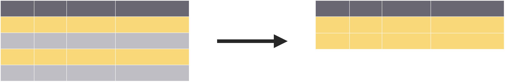
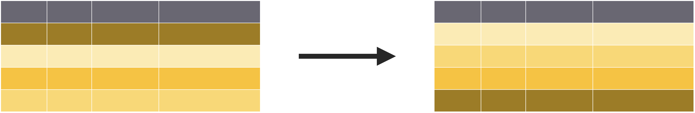

```{r setup, include=FALSE}
options(htmltools.dir.version = FALSE)
knitr::opts_chunk$set(collapse = TRUE,
                      fig.retina = 3,
                      fig.path = "images/transform/plots/",
                      fig.align = "center",
                      fig.asp = 0.618,
                      comment = "#>")

xaringanExtra::use_share_again()
xaringanExtra::use_panelset()

yt_counter <- 0
library(countdown)
library(tidyverse)
library(flair)
library(here)
library(knitr)

library(xaringancolor)
yellow <- "#FED766"
blue <- "#009FB7"
```

class: title-slide, center

<span class="fa-stack fa-4x">
  <i class="fa fa-circle fa-stack-2x" style="color: #ffffff;"></i>
  <strong class="fa-stack-1x" style="color:#009FB7;">`r rmarkdown::metadata$session`</strong>
</span> 

# `r rmarkdown::metadata$title`

## `r rmarkdown::metadata$subtitle`

### `r rmarkdown::metadata$author`

#### [`r params$class_link`](`r params$class_link`) &#183; [`r params$site_link`](`r params$site_link`)

.footer-license[*Tidy Data Science with the Tidyverse and Tidymodels* is licensed under a [Creative Commons Attribution 4.0 International License](https://creativecommons.org/licenses/by/4.0/).]

<div style = "position:fixed; visibility: hidden">
$$\require{color}\definecolor{yellow}{rgb}{0.996078431372549, 0.843137254901961, 0.4}$$
$$\require{color}\definecolor{blue}{rgb}{0, 0.623529411764706, 0.717647058823529}$$
</div>

<script type="text/x-mathjax-config">
MathJax.Hub.Config({
  TeX: {
    Macros: {
      yellow: ["{\\color{yellow}{#1}}", 1],
      blue: ["{\\color{blue}{#1}}", 1]
    },
    loader: {load: ['[tex]/color']},
    tex: {packages: {'[+]': ['color']}}
  }
});
</script>

<style>
.yellow {color: #FED766;}
.blue {color: #009FB7;}
</style>

---
<div class="hex-book">
  <a href="https://dplyr.tidyverse.org">
    
  </a>
  <a href="https://r4ds.had.co.nz/transform.html">
    
  </a>
</div>

---
background-image: url(images/transform/applied-ds-trans.png)
background-position: center 60%
background-size: 85%

# .nobold[(Applied)] Data Science

---

# Example Data: `babynames`

```{r preview-babynames}
library(babynames)
babynames
```

???

Year, Sex assigned at birth, Name, Number, and Proportion (n / sum(n |year,gender))

---
class: middle

.left-column[
<a href="https://docs.ropensci.org/skimr/">
  
</a>
]

.right-column[
# skimr

```r
library(skimr)
```

* Skims your data
* Summarizes variable types, distributions, etc.

```r
skim(babynames)
```
]

---
class: your-turn

# Your turn `r (yt_counter <- yt_counter + 1)`

.big[
* Open the R Notebook **materials/exercises/03-transform.Rmd**
* Let's look at the `babynames` data set
* Run this code to view a summary of the data
]

```{r yt-skim, eval = FALSE}
skim(babynames)
```

```{r yt-skim-cd, echo = FALSE}
countdown(minutes = 2, seconds = 0,
          font_size = "2em",
          color_border = yellow,
          color_background = blue,
          color_text = yellow,
          color_running_background = "#F0F0F0",
          color_running_text = blue,
          color_finished_background = yellow,
          color_finished_text = blue)
```

---
class: your-turn wide

.panelset[
.panel[.panel-name[Code]
```{r yt-skim-sol-code, eval = FALSE}
skim(babynames)
```
]

.panel[.panel-name[Output]
.smaller[
```{r set-width, include = FALSE}
w_opt <- options(width = 200)
```

```{r yt-skim-sol-output, echo = FALSE, render = knitr::normal_print}
library(skimr)
skim(babynames)
```

```{r restore-width, include = FALSE}
options(w_opt)
```
]
]
]

---
# Isolating Data

.pull-left[

]

.pull-right[
.big[Extract variables with **`select()`**]
]

---
# Isolating Data

.pull-left[

</br>
</br>
</br>

]

.pull-right[
.big[Extract variables with **`select()`**]
</br>
</br>
</br>
</br>
.big[Extract cases with **`filter()`**]
]

---
# Isolating Data

.pull-left[

</br>
</br>
</br>

</br>
</br>
</br>

]

.pull-right[
.big[Extract variables with **`select()`**]
</br>
</br>
</br>
</br>
.big[Extract cases with **`filter()`**]
</br>
</br>
</br>
.big[Arrange cases with **`arrange()`**]
]

---
class: center middle

# `select()`

---
class: middle

```{r select, include = FALSE, eval = FALSE}
select(.data, ...)
```

```{r select-flair, echo = FALSE}
decorate("select", eval = FALSE)
```

---
class: middle

```{r select-flair-data, echo = FALSE}
decorate("select", eval = FALSE) %>%
  flair(".data", background = yellow, color = blue)
```

???

Data to transform

---
class: middle

```{r select-flair-columns, echo = FALSE}
decorate("select", eval = FALSE) %>%
  flair("...", background = yellow, color = blue)
```

???

Name of column(s) to select, or select helper function

---

```{r select-exm, eval = FALSE}
select(babynames, name, prop)
```

.pull-left[
```{r full-select, echo = FALSE, warning = FALSE}
library(gt)

babynames %>%
  head(n = 10) %>%
  gt() %>%
  fmt_number(columns = vars(prop),
             decimals = 3) %>%
  wjake::gt_theme_wjake() %>%
  tab_style(style = cell_fill(color = blue),
            locations = list(cells_column_labels(vars(name, prop)))) %>%
  tab_style(style = cell_fill(color = "#0ADEFF"),
            locations = list(cells_body(columns = vars(name, prop))))
```
]

--

.pull-right[
```{r exec-select, echo = FALSE}
babynames %>%
  select(name, prop) %>%
  head(n = 10) %>%
  gt() %>%
  fmt_number(columns = vars(prop),
             decimals = 3) %>%
  wjake::gt_theme_wjake() %>%
  tab_style(style = cell_fill(color = blue),
            locations = list(cells_column_labels(vars(name, prop)))) %>%
  tab_style(style = cell_fill(color = "#0ADEFF"),
            locations = list(cells_body(columns = vars(name, prop))))
```
]

---
class: your-turn

# Your turn `r (yt_counter <- yt_counter + 1)`

.big[
* Alter the code to select just the **`n`** column
]

```{r yt-select, eval = FALSE}
select(babynames, name, prop)
```

```{r yt-select-cd, echo = FALSE}
countdown(minutes = 2)
```

---
class: your-turn

.panelset[
```{r yt-select-sol, panelset = c(source = "Code", output = "Result"), comment = NA}
select(babynames, n)
```
]

---
# Example Data: `storms`

```{r storms-intro}
storms
```

???
Hurricane data; year, month, day, hour of report; position (lat/long); classification; category; wind speed; air pressure; diameter of the area with tropical storm winds; diameter of area with hurricane winds

---
# `select()` helpers

**`:`** selects a range of columns
```{r help-1, eval = FALSE}
select(storms, name:pressure)
```

**`-`** selects every column but
```{r help-2, eval = FALSE}
select(storms, -c(name, pressure))
```

**`starts_with()`**/**`ends_with()`** selects based on start/end
```{r help-3, eval = FALSE}
select(storms, starts_with("w"))
select(storms, ends_with("e"))
```


---
# `select()` helpers

**`contains()`** selects based on anywhere
```{r help-4, eval = FALSE}
select(storms, contains("d"))
```

**`matches()`** selects based on expressions
```{r help-5, eval = FALSE}
select(storms, matches("^.{4}$"))
```

**`any_of()`**/**`all_of()`** selects a set
```{r help-6, eval = FALSE}
select(storms, any_of(c("name", "names", "Name")))
```

???
regex: name starts, has any character 4 times, then ends

---
background-image: url(images/transform/cheatsheet-select.png)
background-position: center middle
background-size: 85%

---
class: pop-quiz

# Consider

Which of these is NOT a way to select the **`name`** and **`n`** columns together?

```r
select(babynames, -c(year, sex, prop))
```

```r
select(babynames, name:n)
```

```r
select(babynames, starts_with("n"))
```

```r
select(babynames, ends_with("n"))
```

```{r select-quiz-cd, echo=FALSE}
countdown(minutes = 1)
```

---
class: pop-quiz

.panelset[
.panel[.panel-name[Option 1]
```{r quiz-opt-1}
select(babynames, -c(year, sex, prop))
```
]

.panel[.panel-name[Option 2]
```{r quiz-opt-2}
select(babynames, name:n)
```
]

.panel[.panel-name[Option 3]
```{r quiz-opt-3}
select(babynames, starts_with("n"))
```
]

.panel[.panel-name[Option 4]
```{r quiz-opt-4}
select(babynames, ends_with("n"))
```
]
]

---
class: center middle

# `filter()`

---
class: middle

```{r filter, include = FALSE, eval = FALSE}
filter(.data, ...)
```

```{r filter-flair, echo = FALSE}
decorate("filter", eval = FALSE)
```

---
class: middle

```{r filter-flair-data, echo = FALSE}
decorate("filter", eval = FALSE) %>%
  flair(".data", background = yellow, color = blue)
```

???

Data to transform

---
class: middle

```{r filter-flair-columns, echo = FALSE}
decorate("filter", eval = FALSE) %>%
  flair("...", background = yellow, color = blue)
```

???

One or more logical tests. Filter returns each row where the test is TRUE

---

```{r filter-exm, eval = FALSE}
filter(babynames, name == "Ida")
```

.pull-left[
```{r full-filter, echo = FALSE, warning = FALSE}
babynames %>%
  head(n = 10) %>%
  gt() %>%
  fmt_number(columns = vars(prop),
             decimals = 3) %>%
  wjake::gt_theme_wjake() %>%
  tab_style(style = cell_fill(color = yellow),
            locations = list(cells_body(rows = 7)))
```
]

--

.pull-right[
```{r exec-filter, echo = FALSE}
babynames %>%
  filter(name == "Ida") %>%
  head(n = 10) %>%
  gt() %>%
  fmt_number(columns = vars(prop),
             decimals = 3) %>%
  wjake::gt_theme_wjake() %>%
  tab_style(style = cell_fill(color = yellow),
            locations = cells_body())
```
]

---
class: middle

```{r filter-exm-flair, echo = FALSE}
decorate("filter-exm", eval = FALSE) %>%
  flair("==", background = yellow, color = blue)
```

---
# Logical Tests

.center[
`?Comparison`

<table>
  <colgroup>
    <col span="1" style="width: 175px;">
    <col span="1" style="width: 225px;">
  </colgroup>
  
  <tbody>
    <tr>
      <td style="text-align: center">
        <code class="r,css,yaml remark-inline-code code-fade">x </code>
        <code class="r,css,yaml remark-inline-code"><strong> < </strong></code>
        <code class="r,css,yaml remark-inline-code code-fade">y</code>
      </td>
      <td style="text-align: left"> Less than </td>
    </tr>
    <tr>
      <td style="text-align: center">
        <code class="r,css,yaml remark-inline-code code-fade">x </code>
        <code class="r,css,yaml remark-inline-code"><strong> > </strong></code>
        <code class="r,css,yaml remark-inline-code code-fade">y</code>
      </td>
      <td style="text-align: left"> Greater than </td>
    </tr>
    <tr>
      <td style="text-align: center">
        <code class="r,css,yaml remark-inline-code code-fade">x </code>
        <code class="r,css,yaml remark-inline-code"><strong> == </strong></code>
        <code class="r,css,yaml remark-inline-code code-fade">y</code>
      </td>
      <td style="text-align: left"> Equal to </td>
    </tr>
    <tr>
      <td style="text-align: center">
        <code class="r,css,yaml remark-inline-code code-fade">x </code>
        <code class="r,css,yaml remark-inline-code"><strong> <= </strong></code>
        <code class="r,css,yaml remark-inline-code code-fade">y</code>
      </td>
      <td style="text-align: left"> Less than or equal to </td>
    </tr>
    <tr>
      <td style="text-align: center">
        <code class="r,css,yaml remark-inline-code code-fade">x </code>
        <code class="r,css,yaml remark-inline-code"><strong> >= </strong></code>
        <code class="r,css,yaml remark-inline-code code-fade">y</code>
      </td>
      <td style="text-align: left"> Greater than or equal to</td>
    </tr>
    <tr>
      <td style="text-align: center">
        <code class="r,css,yaml remark-inline-code code-fade">x </code>
        <code class="r,css,yaml remark-inline-code"><strong> != </strong></code>
        <code class="r,css,yaml remark-inline-code code-fade">y</code>
      </td>
      <td style="text-align: left"> Not equal to</td>
    </tr>
    <tr>
      <td style="text-align: center">
        <code class="r,css,yaml remark-inline-code code-fade">x </code>
        <code class="r,css,yaml remark-inline-code"><strong> %in% </strong></code>
        <code class="r,css,yaml remark-inline-code code-fade">y</code>
      </td>
      <td style="text-align: left"> Group membership</td>
    </tr>
    <tr>
      <td style="text-align: center">
        <code class="r,css,yaml remark-inline-code"><strong>is.na(</strong></code>
        <code class="r,css,yaml remark-inline-code code-fade">x</code>
        <code class="r,css,yaml remark-inline-code"><strong>)</strong></code>
      </td>
      <td style="text-align: left"> Is missing (<code class="r,css,yaml remark-inline-code code-dark">NA</code>)</td>
    </tr>
    <tr>
      <td style="text-align: center">
        <code class="r,css,yaml remark-inline-code"><strong>!is.na(</strong></code>
        <code class="r,css,yaml remark-inline-code code-fade">x</code>
        <code class="r,css,yaml remark-inline-code"><strong>)</strong></code>
      </td>
      <td style="text-align: left"> Is not missing (not <code class="r,css,yaml remark-inline-code code-dark">NA</code>)</td>
    </tr>
  </tbody>
</table>
]

---
class: your-turn

# Your turn `r (yt_counter <- yt_counter + 1)`

.big[
Use the logical operators to manipulate the `babynames` data to show:

1. All of the names where **`prop`** is greater than .08
2. All of the children named "Daenerys"
3. All of the names that have a missing value for **`n`**

.tiny[(Hint: this should return an empty dataset)]
]

```{r yt-filter-cd, echo = FALSE}
countdown(minutes = 5)
```

---
class: your-turn

.panelset[
.panel[.panel-name[`prop` > .08]
```{r yt-filter-prop}
filter(babynames, prop > .08)
```
]

.panel[.panel-name[Daenerys]
```{r yt-filter-name}
filter(babynames, name == "Daenerys")
```
]

.panel[.panel-name[Missing]
```{r yt-filter-missing}
filter(babynames, is.na(n))
```
]
]

---

```{r filter-mult-exm, eval = FALSE}
filter(babynames, name == "Ida", year == 1880)
```

.pull-left[
```{r full-filter-mult, echo = FALSE, warning = FALSE}
babynames %>%
  head(n = 10) %>%
  gt() %>%
  fmt_number(columns = vars(prop),
             decimals = 3) %>%
  wjake::gt_theme_wjake() %>%
  tab_style(style = cell_fill(color = yellow),
            locations = list(cells_body(rows = 7)))
```
]

--

.pull-right[
```{r exec-filter-mult, echo = FALSE}
babynames %>%
  filter(name == "Ida", year == 1880) %>%
  head(n = 10) %>%
  gt() %>%
  fmt_number(columns = vars(prop),
             decimals = 3) %>%
  wjake::gt_theme_wjake() %>%
  tab_style(style = cell_fill(color = yellow),
            locations = cells_body())
```
]

???
Specify multiple logical conditions that must be met. Listing comma separated values is equivalent to "AND"/&

---
# Boolean operators

.center[
`?base::Logic`

<table>
  <colgroup>
    <col span="1" style="width: 225px;">
    <col span="1" style="width: 175px;">
  </colgroup>
  
  <tbody>
    <tr>
      <td style="text-align: center">
        <code class="r,css,yaml remark-inline-code code-fade">a </code>
        <code class="r,css,yaml remark-inline-code"><strong> & </strong></code>
        <code class="r,css,yaml remark-inline-code code-fade">b</code>
      </td>
      <td style="text-align: left"> and</td>
    </tr>
    <tr>
      <td style="text-align: center">
        <code class="r,css,yaml remark-inline-code code-fade">a </code>
        <code class="r,css,yaml remark-inline-code"><strong> | </strong></code>
        <code class="r,css,yaml remark-inline-code code-fade">b</code>
      </td>
      <td style="text-align: left"> or</td>
    </tr>
    <tr>
      <td style="text-align: center">
        <code class="r,css,yaml remark-inline-code"><strong>xor(</strong></code>
        <code class="r,css,yaml remark-inline-code code-fade">a, b</code>
        <code class="r,css,yaml remark-inline-code"><strong>)</strong></code>
      </td>
      <td style="text-align: left"> Exactly or</td>
    </tr>
    <tr>
      <td style="text-align: center">
        <code class="r,css,yaml remark-inline-code"><strong>!</strong></code>
        <code class="r,css,yaml remark-inline-code code-fade">a</code>
      </td>
      <td style="text-align: left"> not</td>
    </tr>
    <tr>
      <td style="text-align: center">
        <code class="r,css,yaml remark-inline-code code-fade">a </code>
        <code class="r,css,yaml remark-inline-code"><strong> %in% </strong></code>
        <code class="r,css,yaml remark-inline-code code-fade">c(a, b)</code>
      </td>
      <td style="text-align: left"> One of (in)</td>
    </tr>
  </tbody>
</table>
]

???
xor -> one is true and one is false

---
class: your-turn

# Your turn `r (yt_counter <- yt_counter + 1)`

.big[
Use the Boolean operators to manipulate the `babynames` data to show:

1. Girls named Sea
2. Names that were used by exactly 5 or 6 children in 1880
3. Names that are one of Acura, Lexus, or Yugo
]

```{r yt-boolean-cd, echo = FALSE}
countdown(minutes = 5)
```

---
class: your-turn

.panelset[
.panel[.panel-name[Sea]
```{r yt-boolean-sea}
filter(babynames, name == "Sea", sex == "F")
```
]

.panel[.panel-name[Sea Alternate]
```{r yt-boolean-sea-alt}
filter(babynames, name == "Sea" & sex == "F")
```
]

.panel[.panel-name[1880]
```{r yt-boolean-1880}
filter(babynames, n %in% c(5, 6), year == 1880)
```
]

.panel[.panel-name[1880 Alternate]
```{r yt-boolean-1880-alt}
filter(babynames, (n == 5 | n == 6) & year == 1880)
```
]

.panel[.panel-name[Cars]
```{r yt-filter-cars}
filter(babynames, name %in% c("Acura", "Lexus", "Yugo"))
```
]

.panel[.panel-name[Cars Alternate]
```{r yt-filter-cars-alt}
filter(babynames, name == "Acura" | name == "Lexus" | name == "Yugo")
```
]
]

???
Common mistakes:
* collapsing multiple tests into one (i.e., `10 < n < 20` instead of  `10 < n, n < 20`)
* Stringing together many tests when you could use %in%

---
class: center middle

# `arrange()`
