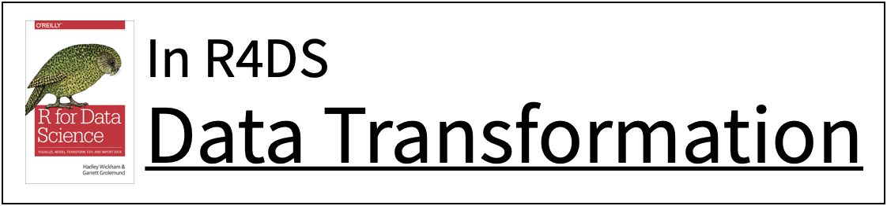

```{r setup, include=FALSE}
options(htmltools.dir.version = FALSE)
knitr::opts_chunk$set(collapse = TRUE,
                      fig.retina = 3,
                      fig.path = "images/transform/plots/",
                      fig.align = "center",
                      fig.asp = 0.618)

xaringanExtra::use_share_again()
xaringanExtra::use_panelset()

yt_counter <- 0
library(countdown)
library(tidyverse)
library(flair)
library(here)
library(knitr)

library(xaringancolor)
yellow <- "#FED766"
blue <- "#009FB7"
```

class: title-slide, center

<span class="fa-stack fa-4x">
  <i class="fa fa-circle fa-stack-2x" style="color: #ffffff;"></i>
  <strong class="fa-stack-1x" style="color:#009FB7;">`r rmarkdown::metadata$session`</strong>
</span> 

# `r rmarkdown::metadata$title`

## `r rmarkdown::metadata$subtitle`

### `r rmarkdown::metadata$author`

#### [`r params$class_link`](`r params$class_link`) &#183; [`r params$site_link`](`r params$site_link`)

.footer-license[*Tidy Data Science with the Tidyverse and Tidymodels* is licensed under a [Creative Commons Attribution 4.0 International License](https://creativecommons.org/licenses/by/4.0/).]

<div style = "position:fixed; visibility: hidden">
$$\require{color}\definecolor{yellow}{rgb}{0.996078431372549, 0.843137254901961, 0.4}$$
$$\require{color}\definecolor{blue}{rgb}{0, 0.623529411764706, 0.717647058823529}$$
</div>

<script type="text/x-mathjax-config">
MathJax.Hub.Config({
  TeX: {
    Macros: {
      yellow: ["{\\color{yellow}{#1}}", 1],
      blue: ["{\\color{blue}{#1}}", 1]
    },
    loader: {load: ['[tex]/color']},
    tex: {packages: {'[+]': ['color']}}
  }
});
</script>

<style>
.yellow {color: #FED766;}
.blue {color: #009FB7;}
</style>

---
<div class="hex-book">
  <a href="https://dplyr.tidyverse.org">
    
  </a>
  <a href="https://r4ds.had.co.nz/transform.html">
    
  </a>
</div>
