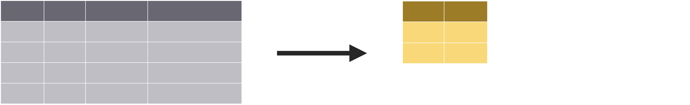
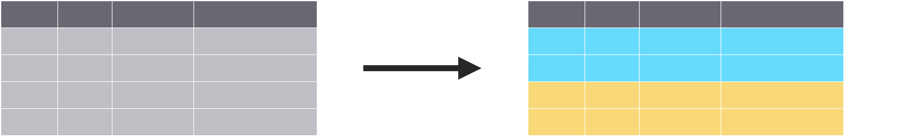
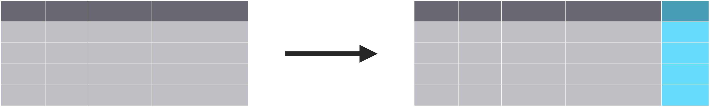
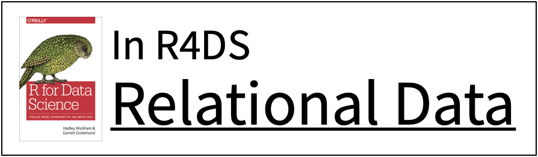

```{r setup, include=FALSE}
options(htmltools.dir.version = FALSE)
knitr::opts_chunk$set(collapse = TRUE,
                      fig.retina = 3,
                      fig.path = "images/transform/plots/",
                      fig.align = "center",
                      fig.asp = 0.618,
                      comment = "#>")

xaringanExtra::use_share_again()
xaringanExtra::use_panelset()
xaringanExtra::use_extra_styles(hover_code_line = TRUE,
                                mute_unhighlighted_code = TRUE)
xaringanExtra::use_scribble(pen_color = "#009FB7")

yt_counter <- 0
library(countdown)
library(tidyverse)
library(flair)
library(here)
library(knitr)

library(xaringancolor)
yellow <- "#FED766"
blue <- "#009FB7"
```

class: title-slide, center

<span class="fa-stack fa-4x">
  <i class="fa fa-circle fa-stack-2x" style="color: #ffffff;"></i>
  <strong class="fa-stack-1x" style="color:#009FB7;">`r rmarkdown::metadata$session`</strong>
</span> 

# `r rmarkdown::metadata$title`

## `r rmarkdown::metadata$subtitle`

### `r rmarkdown::metadata$author`

#### [`r params$class_link`](`r params$class_link`) &#183; [`r params$site_link`](`r params$site_link`)

.footer-license[*Tidy Data Science with the Tidyverse and Tidymodels* is licensed under a [Creative Commons Attribution 4.0 International License](https://creativecommons.org/licenses/by/4.0/).]

<div style = "position:fixed; visibility: hidden">
$$\require{color}\definecolor{yellow}{rgb}{0.996078431372549, 0.843137254901961, 0.4}$$
$$\require{color}\definecolor{blue}{rgb}{0, 0.623529411764706, 0.717647058823529}$$
</div>

<script type="text/x-mathjax-config">
MathJax.Hub.Config({
  TeX: {
    Macros: {
      yellow: ["{\\color{yellow}{#1}}", 1],
      blue: ["{\\color{blue}{#1}}", 1]
    },
    loader: {load: ['[tex]/color']},
    tex: {packages: {'[+]': ['color']}}
  }
});
</script>

<style>
.yellow {color: #FED766;}
.blue {color: #009FB7;}
</style>

---
<div class="hex-book">
  <a href="https://dplyr.tidyverse.org">
    
  </a>
  <a href="https://r4ds.had.co.nz/transform.html">
    
  </a>
</div>

---
background-image: url(images/transform/applied-ds-trans.png)
background-position: center 60%
background-size: 85%

# .nobold[(Applied)] Data Science

---

# Example Data: `babynames`

```{r preview-babynames}
library(babynames)
babynames
```

???

Year, Sex assigned at birth, Name, Number, and Proportion (n / sum(n |year,gender))

---
class: middle

.left-column[
<a href="https://docs.ropensci.org/skimr/">
  
</a>
]

.right-column[
# skimr

```r
library(skimr)
```

* Skims your data
* Summarizes variable types, distributions, etc.

```r
skim(babynames)
```
]

---
class: your-turn

# Your turn `r (yt_counter <- yt_counter + 1)`

.big[
* Open the R Notebook **materials/exercises/03-transform.Rmd**
* Let's look at the `babynames` data set
* Run this code to view a summary of the data
]

```{r yt-skim, eval = FALSE}
skim(babynames)
```

```{r yt-skim-cd, echo = FALSE}
countdown(minutes = 2, seconds = 0,
          font_size = "2em",
          color_border = yellow,
          color_background = blue,
          color_text = yellow,
          color_running_background = "#F0F0F0",
          color_running_text = blue,
          color_finished_background = yellow,
          color_finished_text = blue)
```

---
class: your-turn wide

.panelset[
.panel[.panel-name[Code]
```{r yt-skim-sol-code, eval = FALSE}
skim(babynames)
```
]

.panel[.panel-name[Output]
.smaller[
```{r set-width, include = FALSE}
w_opt <- options(width = 200)
```

```{r yt-skim-sol-output, echo = FALSE, render = knitr::normal_print}
library(skimr)
skim(babynames)
```

```{r restore-width, include = FALSE}
options(w_opt)
```
]
]
]

---
# Isolating Data

.pull-left[

]

.pull-right[
.big[Extract variables with **`select()`**]
]

---
# Isolating Data

.pull-left[

</br>
</br>
</br>

]

.pull-right[
.big[Extract variables with **`select()`**]
</br>
</br>
</br>
</br>
.big[Extract cases with **`filter()`**]
]

---
# Isolating Data

.pull-left[

</br>
</br>
</br>

</br>
</br>
</br>

]

.pull-right[
.big[Extract variables with **`select()`**]
</br>
</br>
</br>
</br>
.big[Extract cases with **`filter()`**]
</br>
</br>
</br>
.big[Arrange cases with **`arrange()`**]
]

---
name: select
class: center middle

# `select()`

---
class: middle

```{r select, include = FALSE, eval = FALSE}
select(.data, ...)
```

```{r select-flair, echo = FALSE}
decorate("select", eval = FALSE)
```

---
class: middle

```{r select-flair-data, echo = FALSE}
decorate("select", eval = FALSE) %>%
  flair(".data", background = yellow, color = blue)
```

???

Data to transform

---
class: middle

```{r select-flair-columns, echo = FALSE}
decorate("select", eval = FALSE) %>%
  flair("...", background = yellow, color = blue)
```

???

Name of column(s) to select, or select helper function

---

```{r select-exm, eval = FALSE}
select(babynames, name, prop)
```

.pull-left[
```{r full-select, echo = FALSE, warning = FALSE}
library(gt)

babynames %>%
  head(n = 10) %>%
  gt() %>%
  fmt_number(columns = vars(prop),
             decimals = 3) %>%
  wjake::gt_theme_wjake() %>%
  tab_style(style = cell_fill(color = blue),
            locations = list(cells_column_labels(vars(name, prop)))) %>%
  tab_style(style = cell_fill(color = "#0ADEFF"),
            locations = list(cells_body(columns = vars(name, prop))))
```
]

--

.pull-right[
```{r exec-select, echo = FALSE}
babynames %>%
  select(name, prop) %>%
  head(n = 10) %>%
  gt() %>%
  fmt_number(columns = vars(prop),
             decimals = 3) %>%
  wjake::gt_theme_wjake() %>%
  tab_style(style = cell_fill(color = blue),
            locations = list(cells_column_labels(vars(name, prop)))) %>%
  tab_style(style = cell_fill(color = "#0ADEFF"),
            locations = list(cells_body(columns = vars(name, prop))))
```
]

---
class: your-turn

# Your turn `r (yt_counter <- yt_counter + 1)`

.big[
* Alter the code to select just the **`n`** column
]

```{r yt-select, eval = FALSE}
select(babynames, name, prop)
```

```{r yt-select-cd, echo = FALSE}
countdown(minutes = 2)
```

---
class: your-turn

.panelset[
```{r yt-select-sol, panelset = c(source = "Code", output = "Result"), comment = NA}
select(babynames, n)
```
]

---
# Example Data: `storms`

```{r storms-intro}
storms
```

???
Hurricane data; year, month, day, hour of report; position (lat/long); classification; category; wind speed; air pressure; diameter of the area with tropical storm winds; diameter of area with hurricane winds

---
# `select()` helpers

**`:`** selects a range of columns
```{r help-1, eval = FALSE}
select(storms, name:pressure)
```

**`-`** selects every column but
```{r help-2, eval = FALSE}
select(storms, -c(name, pressure))
```

**`starts_with()`**/**`ends_with()`** selects based on start/end
```{r help-3, eval = FALSE}
select(storms, starts_with("w"))
select(storms, ends_with("e"))
```


---
# `select()` helpers

**`contains()`** selects based on anywhere
```{r help-4, eval = FALSE}
select(storms, contains("d"))
```

**`matches()`** selects based on expressions
```{r help-5, eval = FALSE}
select(storms, matches("^.{4}$"))
```

**`any_of()`**/**`all_of()`** selects a set
```{r help-6, eval = FALSE}
select(storms, any_of(c("name", "names", "Name")))
```

???
regex: name starts, has any character 4 times, then ends

---
background-image: url(images/transform/cheatsheet-select.png)
background-position: center middle
background-size: 85%

---
class: pop-quiz

# Consider

Which of these is NOT a way to select the **`name`** and **`n`** columns together?

```r
select(babynames, -c(year, sex, prop))
```

```r
select(babynames, name:n)
```

```r
select(babynames, starts_with("n"))
```

```r
select(babynames, ends_with("n"))
```

```{r select-quiz-cd, echo=FALSE}
countdown(minutes = 1)
```

---
class: pop-quiz

.panelset[
.panel[.panel-name[Option 1]
```{r quiz-opt-1}
select(babynames, -c(year, sex, prop))
```
]

.panel[.panel-name[Option 2]
```{r quiz-opt-2}
select(babynames, name:n)
```
]

.panel[.panel-name[Option 3]
```{r quiz-opt-3}
select(babynames, starts_with("n"))
```
]

.panel[.panel-name[Option 4]
```{r quiz-opt-4}
select(babynames, ends_with("n"))
```
]
]

---
name: filter
class: center middle

# `filter()`

---
class: middle

```{r filter, include = FALSE, eval = FALSE}
filter(.data, ...)
```

```{r filter-flair, echo = FALSE}
decorate("filter", eval = FALSE)
```

---
class: middle

```{r filter-flair-data, echo = FALSE}
decorate("filter", eval = FALSE) %>%
  flair(".data", background = yellow, color = blue)
```

???

Data to transform

---
class: middle

```{r filter-flair-columns, echo = FALSE}
decorate("filter", eval = FALSE) %>%
  flair("...", background = yellow, color = blue)
```

???

One or more logical tests. Filter returns each row where the test is TRUE

---

```{r filter-exm, eval = FALSE}
filter(babynames, name == "Ida")
```

.pull-left[
```{r full-filter, echo = FALSE, warning = FALSE}
babynames %>%
  head(n = 10) %>%
  gt() %>%
  fmt_number(columns = vars(prop),
             decimals = 3) %>%
  wjake::gt_theme_wjake() %>%
  tab_style(style = cell_fill(color = yellow),
            locations = list(cells_body(rows = 7)))
```
]

--

.pull-right[
```{r exec-filter, echo = FALSE}
babynames %>%
  filter(name == "Ida") %>%
  head(n = 10) %>%
  gt() %>%
  fmt_number(columns = vars(prop),
             decimals = 3) %>%
  wjake::gt_theme_wjake() %>%
  tab_style(style = cell_fill(color = yellow),
            locations = cells_body())
```
]

---
class: middle

```{r filter-exm-flair, echo = FALSE}
decorate("filter-exm", eval = FALSE) %>%
  flair("==", background = yellow, color = blue)
```

---
# Logical Tests

.center[
`?Comparison`

<table>
  <colgroup>
    <col span="1" style="width: 175px;">
    <col span="1" style="width: 225px;">
  </colgroup>
  
  <tbody>
    <tr>
      <td style="text-align: center">
        <code class="r,css,yaml remark-inline-code code-fade">x </code>
        <code class="r,css,yaml remark-inline-code"><strong> < </strong></code>
        <code class="r,css,yaml remark-inline-code code-fade">y</code>
      </td>
      <td style="text-align: left"> Less than </td>
    </tr>
    <tr>
      <td style="text-align: center">
        <code class="r,css,yaml remark-inline-code code-fade">x </code>
        <code class="r,css,yaml remark-inline-code"><strong> > </strong></code>
        <code class="r,css,yaml remark-inline-code code-fade">y</code>
      </td>
      <td style="text-align: left"> Greater than </td>
    </tr>
    <tr>
      <td style="text-align: center">
        <code class="r,css,yaml remark-inline-code code-fade">x </code>
        <code class="r,css,yaml remark-inline-code"><strong> == </strong></code>
        <code class="r,css,yaml remark-inline-code code-fade">y</code>
      </td>
      <td style="text-align: left"> Equal to </td>
    </tr>
    <tr>
      <td style="text-align: center">
        <code class="r,css,yaml remark-inline-code code-fade">x </code>
        <code class="r,css,yaml remark-inline-code"><strong> <= </strong></code>
        <code class="r,css,yaml remark-inline-code code-fade">y</code>
      </td>
      <td style="text-align: left"> Less than or equal to </td>
    </tr>
    <tr>
      <td style="text-align: center">
        <code class="r,css,yaml remark-inline-code code-fade">x </code>
        <code class="r,css,yaml remark-inline-code"><strong> >= </strong></code>
        <code class="r,css,yaml remark-inline-code code-fade">y</code>
      </td>
      <td style="text-align: left"> Greater than or equal to</td>
    </tr>
    <tr>
      <td style="text-align: center">
        <code class="r,css,yaml remark-inline-code code-fade">x </code>
        <code class="r,css,yaml remark-inline-code"><strong> != </strong></code>
        <code class="r,css,yaml remark-inline-code code-fade">y</code>
      </td>
      <td style="text-align: left"> Not equal to</td>
    </tr>
    <tr>
      <td style="text-align: center">
        <code class="r,css,yaml remark-inline-code code-fade">x </code>
        <code class="r,css,yaml remark-inline-code"><strong> %in% </strong></code>
        <code class="r,css,yaml remark-inline-code code-fade">y</code>
      </td>
      <td style="text-align: left"> Group membership</td>
    </tr>
    <tr>
      <td style="text-align: center">
        <code class="r,css,yaml remark-inline-code"><strong>is.na(</strong></code>
        <code class="r,css,yaml remark-inline-code code-fade">x</code>
        <code class="r,css,yaml remark-inline-code"><strong>)</strong></code>
      </td>
      <td style="text-align: left"> Is missing (<code class="r,css,yaml remark-inline-code code-dark">NA</code>)</td>
    </tr>
    <tr>
      <td style="text-align: center">
        <code class="r,css,yaml remark-inline-code"><strong>!is.na(</strong></code>
        <code class="r,css,yaml remark-inline-code code-fade">x</code>
        <code class="r,css,yaml remark-inline-code"><strong>)</strong></code>
      </td>
      <td style="text-align: left"> Is not missing (not <code class="r,css,yaml remark-inline-code code-dark">NA</code>)</td>
    </tr>
  </tbody>
</table>
]

---
class: your-turn

# Your turn `r (yt_counter <- yt_counter + 1)`

.big[
Use the logical operators to manipulate the `babynames` data to show:

1. All of the names where **`prop`** is greater than .08
2. All of the children named "Daenerys"
3. All of the names that have a missing value for **`n`**

.tiny[(Hint: this should return an empty data set)]
]

```{r yt-filter-cd, echo = FALSE}
countdown(minutes = 5)
```

---
class: your-turn

.panelset[
.panel[.panel-name[`prop` > .08]
```{r yt-filter-prop}
filter(babynames, prop > .08)
```
]

.panel[.panel-name[Daenerys]
```{r yt-filter-name}
filter(babynames, name == "Daenerys")
```
]

.panel[.panel-name[Missing]
```{r yt-filter-missing}
filter(babynames, is.na(n))
```
]
]

---

```{r filter-mult-exm, eval = FALSE}
filter(babynames, name == "Ida", year == 1880)
```

.pull-left[
```{r full-filter-mult, echo = FALSE, warning = FALSE}
babynames %>%
  head(n = 10) %>%
  gt() %>%
  fmt_number(columns = vars(prop),
             decimals = 3) %>%
  wjake::gt_theme_wjake() %>%
  tab_style(style = cell_fill(color = yellow),
            locations = list(cells_body(rows = 7)))
```
]

--

.pull-right[
```{r exec-filter-mult, echo = FALSE}
babynames %>%
  filter(name == "Ida", year == 1880) %>%
  head(n = 10) %>%
  gt() %>%
  fmt_number(columns = vars(prop),
             decimals = 3) %>%
  wjake::gt_theme_wjake() %>%
  tab_style(style = cell_fill(color = yellow),
            locations = cells_body())
```
]

???
Specify multiple logical conditions that must be met. Listing comma separated values is equivalent to "AND"/&

---
# Boolean operators

.center[
`?base::Logic`

<table>
  <colgroup>
    <col span="1" style="width: 225px;">
    <col span="1" style="width: 175px;">
  </colgroup>
  
  <tbody>
    <tr>
      <td style="text-align: center">
        <code class="r,css,yaml remark-inline-code code-fade">a </code>
        <code class="r,css,yaml remark-inline-code"><strong> & </strong></code>
        <code class="r,css,yaml remark-inline-code code-fade">b</code>
      </td>
      <td style="text-align: left"> and</td>
    </tr>
    <tr>
      <td style="text-align: center">
        <code class="r,css,yaml remark-inline-code code-fade">a </code>
        <code class="r,css,yaml remark-inline-code"><strong> | </strong></code>
        <code class="r,css,yaml remark-inline-code code-fade">b</code>
      </td>
      <td style="text-align: left"> or</td>
    </tr>
    <tr>
      <td style="text-align: center">
        <code class="r,css,yaml remark-inline-code"><strong>xor(</strong></code>
        <code class="r,css,yaml remark-inline-code code-fade">a, b</code>
        <code class="r,css,yaml remark-inline-code"><strong>)</strong></code>
      </td>
      <td style="text-align: left"> Exactly or</td>
    </tr>
    <tr>
      <td style="text-align: center">
        <code class="r,css,yaml remark-inline-code"><strong>!</strong></code>
        <code class="r,css,yaml remark-inline-code code-fade">a</code>
      </td>
      <td style="text-align: left"> not</td>
    </tr>
    <tr>
      <td style="text-align: center">
        <code class="r,css,yaml remark-inline-code code-fade">a </code>
        <code class="r,css,yaml remark-inline-code"><strong> %in% </strong></code>
        <code class="r,css,yaml remark-inline-code code-fade">c(a, b)</code>
      </td>
      <td style="text-align: left"> One of (in)</td>
    </tr>
  </tbody>
</table>
]

???
xor -> one is true and one is false

---
class: your-turn

# Your turn `r (yt_counter <- yt_counter + 1)`

.big[
Use the Boolean operators to manipulate the `babynames` data to show:

1. Girls named Sea
2. Names that were used by exactly 5 or 6 children in 1880
3. Names that are one of Acura, Lexus, or Yugo
]

```{r yt-boolean-cd, echo = FALSE}
countdown(minutes = 5)
```

---
class: your-turn

.panelset[
.panel[.panel-name[Sea]
```{r yt-boolean-sea}
filter(babynames, name == "Sea", sex == "F")
```
]

.panel[.panel-name[Sea Alternate]
```{r yt-boolean-sea-alt}
filter(babynames, name == "Sea" & sex == "F")
```
]

.panel[.panel-name[1880]
```{r yt-boolean-1880}
filter(babynames, n %in% c(5, 6), year == 1880)
```
]

.panel[.panel-name[1880 Alternate]
```{r yt-boolean-1880-alt}
filter(babynames, (n == 5 | n == 6) & year == 1880)
```
]

.panel[.panel-name[Cars]
```{r yt-filter-cars}
filter(babynames, name %in% c("Acura", "Lexus", "Yugo"))
```
]

.panel[.panel-name[Cars Alternate]
```{r yt-filter-cars-alt}
filter(babynames, name == "Acura" | name == "Lexus" | name == "Yugo")
```
]
]

???
Common mistakes:
* collapsing multiple tests into one (i.e., `10 < n < 20` instead of  `10 < n, n < 20`)
* Stringing together many tests when you could use %in%

---
name: arrange
class: center middle

# `arrange()`

---
class: middle

```{r arrange, include = FALSE, eval = FALSE}
arrange(.data, ...)
```

```{r arrange-flair, echo = FALSE}
decorate("arrange", eval = FALSE)
```

---
class: middle

```{r arrange-flair-data, echo = FALSE}
decorate("arrange", eval = FALSE) %>%
  flair(".data", background = yellow, color = blue)
```

???

Data to transform

---
class: middle

```{r arrange-flair-columns, echo = FALSE}
decorate("arrange", eval = FALSE) %>%
  flair("...", background = yellow, color = blue)
```

???

One or more columns to order by. Additional columns are used to break ties.

---

```{r arrange-exm, eval = FALSE}
arrange(babynames, n)
```

.pull-left[
```{r full-arrange, echo = FALSE, warning = FALSE}
set.seed(123)

messy_baby <- babynames %>%
  group_by(n) %>%
  slice_sample(n = 1) %>%
  ungroup() %>%
  slice_sample(n = 10)

yel_cols <- wjake::ramp_yellow(seq(0.1, 1, length.out = nrow(messy_baby)))
rank_order <- rank(messy_baby$n)

base_gt <- messy_baby %>%
  gt() %>%
  fmt_number(columns = vars(prop),
             decimals = 3) %>%
  fmt_number(columns = vars(n),
             use_seps = TRUE, decimals = 0) %>%
  wjake::gt_theme_wjake()

for (i in seq_len(nrow(messy_baby))) {
  base_gt <- base_gt %>%
    tab_style(style = cell_fill(color = yel_cols[rank_order[i]]),
              locations = cells_body(columns = everything(),
                                     rows = i))
}

base_gt
```
]

--

.pull-right[
```{r exec-arrange, echo = FALSE}
base_gt <- messy_baby %>%
  arrange(n) %>%
  gt() %>%
  fmt_number(columns = vars(prop),
             decimals = 3) %>%
  fmt_number(columns = vars(n),
             use_seps = TRUE, decimals = 0) %>%
  wjake::gt_theme_wjake()

for (i in seq_len(nrow(messy_baby))) {
  base_gt <- base_gt %>%
    tab_style(style = cell_fill(color = yel_cols[i]),
              locations = cells_body(columns = everything(),
                                     rows = i))
}

base_gt
```
]

---
class: your-turn

# Your turn `r (yt_counter <- yt_counter + 1)`

.big[
* Arrange `babynames` by **`n`**. Add **`prop`** as a second (tiebreaking) variable to arrange by.
* What is the smallest value of **`n`**?
]

```{r yt-arrange-cd, echo = FALSE}
countdown(minutes = 2)
```

---
class: your-turn

.panelset[
```{r yt-arrange-sol, panelset = c(source = "Code", output = "Result"), comment = NA}
arrange(babynames, n, prop)
```
]

---
# Descending Order

```{r desc-arrange, include = FALSE}
arrange(babynames, desc(n))
```

```{r desc-arrange-flair, echo = FALSE}
decorate("desc-arrange", eval = FALSE) %>%
  flair("desc(", background = yellow, color = blue) %>%
  flair_rx("\\)(?!$)", background = yellow, color = blue)
```

.pull-left[
```{r full-desc, echo = FALSE, warning = FALSE}
yel_cols <- wjake::ramp_yellow(seq(0.1, 1, length.out = nrow(messy_baby)))
rank_order <- rank(messy_baby$n)

base_gt <- messy_baby %>%
  gt() %>%
  fmt_number(columns = vars(prop),
             decimals = 3) %>%
  fmt_number(columns = vars(n),
             use_seps = TRUE, decimals = 0) %>%
  wjake::gt_theme_wjake()

for (i in seq_len(nrow(messy_baby))) {
  base_gt <- base_gt %>%
    tab_style(style = cell_fill(color = yel_cols[rank_order[i]]),
              locations = cells_body(columns = everything(),
                                     rows = i))
}

base_gt
```
]

--

.pull-right[
```{r exec-desc, echo = FALSE}
base_gt <- messy_baby %>%
  arrange(desc(n)) %>%
  gt() %>%
  fmt_number(columns = vars(prop),
             decimals = 3) %>%
  fmt_number(columns = vars(n),
             use_seps = TRUE, decimals = 0) %>%
  wjake::gt_theme_wjake()

for (i in seq_len(nrow(messy_baby))) {
  base_gt <- base_gt %>%
    tab_style(style = cell_fill(color = rev(yel_cols)[i]),
              locations = cells_body(columns = everything(),
                                     rows = i))
}

base_gt
```
]

---
class: your-turn

# Your turn `r (yt_counter <- yt_counter + 1)`

.big[
* Use **`desc()`** to find the names with the highest **`prop`**.
* Which names have the largest values of **`n`**?
]

```{r yt-desc-cd, echo = FALSE}
countdown(minutes = 2)
```

---
class: your-turn

.panelset[
.panel[.panel-name[prop]
```{r yt-desc-sol-1, comment = NA}
arrange(babynames, desc(prop))
```
]

.panel[.panel-name[n]
```{r yt-desc-sol-2, comment = NA}
arrange(babynames, desc(n))
```
]
]

---
name: pipe
class: center middle

# `%>%`

---
class: pop-quiz

# Consider

.pull-left[
How would you do the following to the `babynames` data:

1. Filter to only the names Sansa and Arya;
2. Arrange by **`name`** and then **`year`**; and
3. Remove the **`prop`** variable
]

.pull-right[
```{r pq-pipe-exm, echo = FALSE, comment = NA}
babynames %>%
  filter(name %in% c("Sansa", "Arya")) %>%
  arrange(name, year) %>%
  select(-prop)
```
]

```{r pq-pipe-cd, echo = FALSE}
countdown(minutes = 2)
```

---
class: pop-quiz wide

# Nesting

```{r nest-filter-0, eval = FALSE, include = FALSE}
babynames
```

```{r nest-filter-0-flair, echo = FALSE}
decorate("nest-filter-0", eval = FALSE)
```

--

```{r nest-filter-1, eval = FALSE, include = FALSE}
filter(babynames, name %in% c("Sansa", "Arya"))
```

```{r nest-filter-1-flair, echo = FALSE}
decorate("nest-filter-1", eval = FALSE) %>%
  flair("babynames", background = yellow, color = blue)
```

--

```{r nest-filter-2, eval = FALSE, include = FALSE}
arrange(filter(babynames, name %in% c("Sansa", "Arya")), name, year)
```

```{r nest-filter-2-flair, echo = FALSE}
decorate("nest-filter-2", eval = FALSE) %>%
  flair("filter(babynames, name %in% c(\"Sansa\", \"Arya\"))", background = yellow, color = blue)
```

--

```{r nest-filter-3, eval = FALSE, include = FALSE}
select(arrange(filter(babynames, name %in% c("Sansa", "Arya")), name, year), -prop)
```

```{r nest-filter-3-flair, echo = FALSE}
decorate("nest-filter-3", eval = FALSE) %>%
  flair("arrange(filter(babynames, name %in% c(\"Sansa\", \"Arya\")), name, year)", background = yellow, color = blue)
```

--

```{r nest-filter-final-flair, echo = FALSE}
decorate("nest-filter-3", eval = FALSE)
```

???
Start with babynames  
Then filter to Sansa and Arya  
Then arrange by name and year  
Finally remove prop  

---
class: pop-quiz wide

# Intermediate objects

```{r io-filter-0, eval = FALSE, include = FALSE}
bn1 <- babynames
```

```{r io-filter-0-flair, echo = FALSE}
decorate("io-filter-0", eval = FALSE)
```

--

```{r io-filter-1, eval = FALSE, include = FALSE}
bn2 <- filter(bn1, name %in% c("Sansa", "Arya"))
```

```{r io-filter-1-flair, echo = FALSE}
decorate("io-filter-1", eval = FALSE) %>%
  flair("bn1", background = yellow, color = blue)
```

--

```{r io-filter-2, eval = FALSE, include = FALSE}
bn3 <- arrange(bn2, name, year)
```

```{r io-filter-2-flair, echo = FALSE}
decorate("io-filter-2", eval = FALSE) %>%
  flair("bn2", background = yellow, color = blue)
```

--

```{r io-filter-3, eval = FALSE, include = FALSE}
bn4 <- select(bn3, -prop)
```

```{r io-filter-3-flair, echo = FALSE}
decorate("io-filter-3", eval = FALSE) %>%
  flair("bn3", background = yellow, color = blue)
```

--

.big[What are all these objects in my environment window??]

---
class: center middle

.big[Your code should tell the story of what you are doing to the data]

---
class: center middle

<iframe width="889" height="500" src="https://www.youtube.com/embed/UbxUSsFXYo4" frameborder="0" allow="accelerometer; autoplay; clipboard-write; encrypted-media; gyroscope; picture-in-picture" allowfullscreen></iframe>

---
# Let's tell a story

I: 

1. **Tumble** out of bed

--

2. **Stumble** to the kitchen

--

3. **Pour** myself a cup of ambition

--

4. **Yawn**

--

5. **Stretch**

--

6. **Try** to come to live

---
# What story does this tell?

```r
try(come_to_live(
    stretch(yawn(pour(stumble(tumble(I, out_of = "bed"), to = "the kitchen"),
                 who = "myself", unit = "cup", what = "ambition")))
))
```

---
# Turn the story into code

```r
I
```

---
# Turn the story into code

```r
tumble(I, out_of = "bed")
```

---
# Turn the story into code

```r
stumble(tumble(I, out_of = "bed"), to = "the kitchen")
```

---
# Turn the story into code

```r
pour(stumble(tumble(I, out_of = "bed"), to = "the kitchen"),
     who = "myself", unit = "cup", what = "ambition")
```

---
# Turn the story into code

```r
yawn(pour(stumble(tumble(I, out_of = "bed"), to = "the kitchen"),
          who = "myself", unit = "cup", what = "ambition"))
```

---
# Turn the story into code

```r
stretch(yawn(pour(stumble(tumble(I, out_of = "bed"), to = "the kitchen"),
                  who = "myself", unit = "cup", what = "ambition")))
```

---
# Turn the story into code

```r
try(come_to_live(
    stretch(yawn(pour(stumble(tumble(I, out_of = "bed"), to = "the kitchen"),
                 who = "myself", unit = "cup", what = "ambition")))
))
```

???

We understand because we wrote it, but can others? Remember before we built this up.

---
class: center middle

.huge[**`%>%`**]

--

Pass the output of one function to the first argument of the next

---
class: middle

```{r no-pipe, eval = FALSE, include = FALSE}
me1 <- "I"
me2 <- tumble(me1, out_of = "bed")
me3 <- stumble(me2, to = "the kitchen")
```

```{r no-pipe-flair, echo = FALSE}
decorate("no-pipe", eval = FALSE) %>%
  flair("me1", background = yellow, color = blue)
```

--

```{r no-pipe-flair-2, echo = FALSE}
decorate("no-pipe", eval = FALSE) %>%
  flair("me2", background = yellow, color = blue)
```

--

```{r pipe, eval = FALSE, include = FALSE}
I %>%
  tumble(out_of = "bed") %>%
  stumble(to = "the kitchen")
```

```{r pipe-flair, echo = FALSE}
decorate("pipe", eval = FALSE) %>%
  flair("%>%", background = yellow, color = blue)
```

---
# Tell a story

```r
I %>%
  tumble(out_of = "bed") %>%
  stumble(to = "the kitchen") %>%
  pour(who = "myself", unit = "cup", what = "ambition") %>%
  yawn() %>%
  stretch() %>%
  try(come_to_live())
```

---
# Piping in the tidyverse

Functions take a data frame as their first argument, and return a data frame.

```{r tidy-select, echo = FALSE}
decorate("select", eval = FALSE) %>%
  flair(".data", background = yellow, color = blue)
```

```{r tidy-filter, echo = FALSE}
decorate("filter", eval = FALSE) %>%
  flair(".data", background = yellow, color = blue)
```

```{r tidy-arrange, echo = FALSE}
decorate("arrange", eval = FALSE) %>%
  flair(".data", background = yellow, color = blue)
```

---
class: pop-quiz

# Reconsider

.pull-left[
How would you do the following to the `babynames` data:

1. Filter to only the names Sansa and Arya;
2. Arrange by **`name`** and then **`year`**; and
3. Remove the **`prop`** variable
]

.pull-right[
```{r pq-pipe-exm-2, echo = FALSE, comment = NA}
babynames %>%
  filter(name %in% c("Sansa", "Arya")) %>%
  arrange(name, year) %>%
  select(-prop)
```
]

---
class: pop-quiz

```{r pq-pipe-sol}
babynames %>%
  filter(name %in% c("Sansa", "Arya")) %>%
  arrange(name, year) %>%
  select(-prop)
```

---
class: your-turn

# Your turn `r (yt_counter <- yt_counter + 1)`

.big[
Use **`%>%`** to write a sequence of functions that:

1. Filter `babynames` to just the femalte that were born in 2015.
2. Select the **`name`** and **`n`** columns.
3. Arrange the results so that the most popular names are at the top.
]


---
class: your-turn

.panelset[
```{r yt-pipe-sol, panelset = c(source = "Code", output = "Results"), comment = NA}
babynames %>%
  filter(sex == "F", year == 2015) %>%
  select(name, n) %>%
  arrange(desc(n))
```
]

---
class: your-turn

# Your turn `r (yt_counter <- yt_counter + 1)`

.big[
Combine your new data skills to make a plot showing the popularity of your name over time.

1. Trim `babynames` to just the rows that contain your **`name`**.
2. Trim the result to just the columns that are needed for your plot.
3. Plot the results as a line graph with **`year`** on the x-axis and **`prop`** on the y-axis, colored **`sex`**.
]

---
class: your-turn

.panelset[
```{r yt-name-plot-sol, panelset = c(source = "Code", output = "Plot"), out.width = "80%"}
babynames %>%
  filter(name == "Jake") %>%
  select(year, prop, sex) %>%
  ggplot(mapping = aes(x = year, y = prop)) +
  geom_line(mapping = aes(color = sex))
```
]

---
class: center middle

# What names are the most popular?

---
# What is popularity?

We can assess popularity through:

--

1. **Sums** - a large number of children have the name when we sum across years.

--

2. **Ranks** - the name consistently ranks among the top names from year to year.

---
class: pop-quiz

# Consider

.big[
Do we have enough information to:

1. Calculate the total number of children with each name?
2. Rank the names within each year?
]

---
# Deriving information

.pull-left[

]

.pull-right[
.big[Compile data with **`summarize()`**]
]

---
# Deriving information

.pull-left[

</br>
</br>
</br>

]

.pull-right[
.big[Compile data with **`summarize()`**]
</br>
</br>
</br>
</br>
.big[Analyze groups with **`group_by()`**]
]

---
# Deriving information

.pull-left[

</br>
</br>
</br>

</br>
</br>
</br>

]

.pull-right[
.big[Compile data with **`summarize()`**]
</br>
</br>
</br>
</br>
.big[Analyze groups with **`group_by()`**]
</br>
</br>
</br>
.big[Make new variables with **`mutate()`**]
]


---
name: summarize
class: center middle

# `summarize()`

---
class: middle

```{r summarize, include = FALSE, eval = FALSE}
summarize(.data, ...)
```

```{r summarize-flair, echo = FALSE}
decorate("summarize", eval = FALSE)
```

---
class: middle

```{r summarize-flair-data, echo = FALSE}
decorate("summarize", eval = FALSE) %>%
  flair(".data", background = yellow, color = blue)
```

???

Data to summarize

---
class: middle

```{r summarize-flair-columns, echo = FALSE}
decorate("summarize", eval = FALSE) %>%
  flair("...", background = yellow, color = blue)
```

???

Summaries to calculate

---

```{r summarize-exm, eval = FALSE}
summarize(babynames, total = sum(n), max = max(n))
```

.pull-left[
```{r full-summarize, echo = FALSE, warning = FALSE}
babynames %>%
  head(n = 10) %>%
  gt() %>%
  fmt_number(columns = vars(prop),
             decimals = 3) %>%
  wjake::gt_theme_wjake()
```
]

--

.pull-right[
```{r exec-summarize, echo = FALSE}
babynames %>%
  summarize(total = sum(n), max = max(n)) %>%
  gt() %>%
  wjake::gt_theme_wjake() %>%
  tab_style(style = cell_fill(color = blue),
            locations = list(cells_column_labels(vars(total, max)))) %>%
  tab_style(style = cell_fill(color = "#0ADEFF"),
            locations = list(cells_body(columns = vars(total, max))))
```
]

---
background-image: url(images/transform/cheatsheet-summary.png)
background-position: center middle
background-size: 85%

---
class: your-turn

# Your turn `r (yt_counter <- yt_counter + 1)`

.big[
Use **`summarize()`** to compute three statistics *about the data*:

1. The first (minimum) year in the data set
2. The last (maximum) year in the data set
3. The total number of unique names in the data.
]

Hint: Use the functions `min()`, `max()`, and `n_distinct()`.

```{r yt-summarize-cd, echo = FALSE}
countdown(minutes = 3)
```

---
class: your-turn

.panelset[
```{r yt-summarize-sol, panelset = c(source = "Code", output = "Result"), comment = NA}
babynames %>%
  summarize(first_year = min(year),
            last_year = max(year),
            num_names = n_distinct(name))
```
]

---
class: your-turn

# Your turn `r (yt_counter <- yt_counter + 1)`

.big[
Extract the rows for children named **Khaleesi**.

1. How many children have been named Khaleesi?
2. What was the first year Khaleesi appeared in the data?
]

```{r yt-summarize-2-cd, echo = FALSE}
countdown(minutes = 4)
```

---
class: your-turn

.panelset[
```{r yt-summarize-2-sol, panelset = c(source = "Code", output = "Result"), comment = NA}
babynames %>%
  filter(name == "Khaleesi") %>%
  summarize(total_kids = sum(n),
            first_year = min(year))
```
]

---
name: group
class: center middle

# `group_by()`

---
class: middle

```{r group-by, include = FALSE, eval = FALSE}
group_by(.data, ...)
```

```{r group-by-flair, echo = FALSE}
decorate("group-by", eval = FALSE)
```

---
class: middle

```{r group-by-flair-data, echo = FALSE}
decorate("group-by", eval = FALSE) %>%
  flair(".data", background = yellow, color = blue)
```

???

Data to group

---
class: middle

```{r group-by-flair-columns, echo = FALSE}
decorate("group-by", eval = FALSE) %>%
  flair("...", background = yellow, color = blue)
```

???

Variables to group by

---

```{r group-by-exm}
group_by(babynames, sex)
```

???

What has changed? Additional meta data being printed.

---
# Grouped summaries

```{r group-summaries}
babynames %>%
  group_by(sex) %>%
  summarize(num_names = n_distinct(name))
```

---
class: your-turn

# Your turn `r (yt_counter <- yt_counter + 1)`

.big[
Calculate popularity by determining the total number of children given each name.

1. Use **`group_by()`** and **`summarize()`** to calculate the total number of children that have been given each name, by sex.
2. Arrange the results to show the most popular names first.

 Bonus:

3. Create a bar plot of the 10 most popular names, with **`name`** on the x-axis and total children on the y-axis.
]

```{r yt-group-by-cd, echo = FALSE}
countdown(minutes = 5)
```

---
class: your-turn

.panelset[
```{r yt-group-by-sol, panelset = c(source = "Code", output = "Result"), comment = NA}
babynames %>%
  group_by(name, sex) %>%
  summarize(total = sum(n)) %>%
  arrange(desc(total))
```
]

---
class: your-turn

```{r yt-group-by-plot-sol, fig.show = "hide"}
babynames %>%
  group_by(name, sex) %>%
  summarize(total = sum(n), .groups = "drop") %>%
  arrange(desc(total)) %>%
  slice_max(total, n = 10) %>% #<<
  ggplot(mapping = aes(x = fct_reorder(name, desc(total)), y = total)) + #<<
  geom_col(mapping = aes(fill = sex)) + #<<
  scale_fill_brewer() + #<<
  labs(x = "Name", y = "Total Children") + #<<
  theme_bw() #<<
```

---
class: your-turn

```{r yt-group-by-plot-show, echo = FALSE, out.width = "90%"}
include_graphics(fig_chunk("yt-group-by-plot-sol", ".png"))
```

---
class: your-turn

# Your turn `r (yt_counter <- yt_counter + 1)`

.big[
Use grouping to calculate the **number of children born each year**.

Plot the results as a line graph.
]

```{r yt-total-kids-cd, echo = FALSE}
countdown(minutes = 5)
```

---
class: your-turn

.panelset[
```{r yt-total-kids-sol, panelset = c(source = "Code", output = "Plot"), out.width = "80%"}
babynames %>%
  group_by(year) %>%
  summarize(n_children = sum(n)) %>%
  ggplot(mapping = aes(x = year, y = n_children)) +
  geom_line()
```
]

???

What does this affect our measure of popularity?

---
name: mutate
class: center middle

# `mutate()`

---
class: middle

```{r mutate, include = FALSE, eval = FALSE}
mutate(.data, ...)
```

```{r mutate-flair, echo = FALSE}
decorate("mutate", eval = FALSE)
```

---
class: middle

```{r mutate-flair-data, echo = FALSE}
decorate("mutate", eval = FALSE) %>%
  flair(".data", background = yellow, color = blue)
```

???

Data to mutate

---
class: middle

```{r mutate-flair-columns, echo = FALSE}
decorate("mutate", eval = FALSE) %>%
  flair("...", background = yellow, color = blue)
```

???

Additional variables to calculate

---

```{r mutate-exm, eval = FALSE}
mutate(babynames, percent = round(prop * 100, digits = 2))
```

.pull-left[
```{r full-mutate, echo = FALSE, warning = FALSE}
babynames %>%
  head(n = 10) %>%
  gt() %>%
  fmt_number(columns = vars(prop),
             decimals = 3) %>%
  wjake::gt_theme_wjake()
```
]

--

.pull-right[
```{r exec-mutate, echo = FALSE}
babynames %>%
  head(n = 10) %>%
  mutate(percent = round(prop * 100, digits = 2)) %>%
  gt() %>%
  fmt_number(columns = vars(prop),
             decimals = 3) %>%
  wjake::gt_theme_wjake() %>%
  tab_style(style = cell_fill(color = blue),
            locations = list(cells_column_labels(vars(percent)))) %>%
  tab_style(style = cell_fill(color = "#0ADEFF"),
            locations = list(cells_body(columns = vars(percent))))
```
]

---
background-image: url(images/transform/cheatsheet-mutate.png)
background-position: center middle
background-size: 70%

---
# `min_rank()`

Lowest value get the lowest rank, i.e., `1`.

```{r min-rank-1}
min_rank(c(50, 40, 60, 75, 50))
```

--

To give highest values the rank of `1`, use `desc()`

```{r}
min_rank(desc(c(50, 40, 60, 75, 50)))
```

---
class: your-turn

# Your turn `r (yt_counter <- yt_counter + 1)`

.big[
Use **`mutate()`** and **`min_rank()`** to rank each row in `babynames` from largest **`prop`** to lowest **`prop`**.

The highest **`prop`** should have a rank of `1`.
]

```{r yt-rank-cd, echo = FALSE}
countdown(minutes = 3)
```

---
class: your-turn

.panelset[
```{r yt-rank-sol, panelset = c(source = "Code", output = "Result"), comment = NA}
babynames %>%
  mutate(rank = min_rank(desc(prop)))
```
]

---
class: your-turn

# Your turn `r (yt_counter <- yt_counter + 1)`

.big[
**What is each name's median rank?**

1. Compute each **`name`**'s rank with each **`year`** and **`sex`**.
2. Compute the median rank across years for each **`name`**, within each **`sex`**.
3. Sort the results from highest median rank to lowest.
]

```{r yt-full-rank-cd, echo = FALSE}
countdown(minutes = 5)
```

---
class: your-turn

.panelset[
```{r yt-full-rank-sol, panelset = c(source = "Code", output = "Result"), comment = NA}
babynames %>%
  group_by(year, sex) %>%
  mutate(rank = min_rank(desc(prop))) %>%
  group_by(name, sex) %>%
  summarize(score = median(rank)) %>%
  arrange(score)
```
]

---
# Recap: Single table verbs

.pull-left[

</br>
</br>

</br>
</br>

</br>
</br>

</br>
</br>

]

.pull-right.wide-line[
Extract variables with **`select()`**

Extract cases with **`filter()`**

Arrange cases with **`arrange()`**

Compile data with **`summarize()`**

Make new variables with **`mutate()`**
]

---
name: joins
class: center middle

# Joining Data Sets

<a href="https://r4ds.had.co.nz/relational-data.html">
  
</a>

---
# Example Data: `nycflights13`

```{r preview-nycflights}
library(nycflights13)
flights
```

---
background-image: url(images/transform/nycflights.png)
background-position: center middle
background-size: 65%


---
background-image: url(images/transform/nycflights-highlight.png)
background-position: center middle
background-size: 65%

.big[Which airlines had the longest delays?]

---
.pull-left[
```{r unique-carriers}
distinct(flights, carrier)
```
]

.pull-right[
```{r preview-airlines}
airlines
```
]

---
class: center middle

**Mutating joins** use information from one data set to **add variables to another data set** (like `mutate()`)

--

**Filtering joins** use information from one data set to **extract cases** from another data set (like `filter()`)

---
background-image: url(images/transform/join-data.png)
background-position: center middle
background-size: 85%

# Toy data for practice

---
background-image: url(images/transform/left-join.png)
background-position: center middle
background-size: 90%

# `left_join()`

```{r left-join, eval = FALSE}
left_join(heros, homes, by = "hero")
```

---
background-image: url(images/transform/right-join.png)
background-position: center middle
background-size: 90%

# `right_join()`

```{r right-join, eval = FALSE}
right_join(heros, homes, by = "hero")
```

---
background-image: url(images/transform/full-join.png)
background-position: center middle
background-size: 90%

# `full_join()`

```{r full-join, eval = FALSE}
full_join(heros, homes, by = "hero")
```

---
background-image: url(images/transform/inner-join.png)
background-position: center middle
background-size: 90%

# `inner_join()`

```{r inner-join, eval = FALSE}
inner_join(heros, homes, by = "hero")
```


---
class: your-turn

# Your turn `r (yt_counter <- yt_counter + 1)`

.big[
Which airlines had the largest arrival delays (**`arr_delay`**)? Complete the code below.
]

```{r yt-delay, include = FALSE}
flights %>%
  drop_na(arr_delay) %>%
  left_join(airlines, by = "carrier") %>% # 1. Join airlines to flights
  group_by(name) %>%
  summarize(delay = mean(arr_delay)) %>%  # 2. Compute the average arrival delay
  arrange(desc(delay))
```

```{r yt-delay-mask, echo = FALSE}
decorate("yt-delay", eval = FALSE) %>%
  mask('left_join(airlines, by = "carrier")', background = yellow) %>%
  mask('name', background = yellow) %>%
  mask('summarize(delay = mean(arr_delay))', background = yellow) %>%
  mask_rx('(?<=\\()delay', color = yellow, background = yellow)
```

```{r yt-delay-cd, echo = FALSE}
countdown(minutes = 6)
```

---
class: your-turn

.panelset[
```{r yt-delay-solution, panelset = c(source = "Code", output = "Result")}
flights %>%
  drop_na(arr_delay) %>%
  left_join(airlines, by = "carrier") %>%
  group_by(name) %>%
  summarize(delay = mean(arr_delay)) %>%
  arrange(desc(delay))
```
]

---
background-image: url(images/transform/named-join.png)
background-position: center 65%
background-size: 90%

# Non-matching names

Use a named vector to match on variables with different names.

```{r named-join, eval = FALSE}
heroes %>%
  left_join(enemies, by = c("hero" = "avenger"))
```

---
class: center middle

**Mutating joins** use information from one data set to **add variables to another data set** (like `mutate()`)

**Filtering joins** use information from one data set to **extract cases** from another data set (like `filter()`)

---
background-image: url(images/transform/semi-join.png)
background-position: center middle
background-size: 90%

# `semi_join()`

```{r semi-join, eval = FALSE}
semi_join(heros, homes, by = "hero")
```

---
background-image: url(images/transform/anti-join.png)
background-position: center middle
background-size: 90%

# `anti_join()`

```{r anti-join, eval = FALSE}
anti_join(heros, homes, by = "hero")
```

---
class: your-turn

# Your turn `r (yt_counter <- yt_counter + 1)`

.big[
How many airports in the **`airports`** data were serviced by flights originating in New York?

Notice that the column to join on is named **`faa`** in the **`airports`** data set and **`dest`** in the **`flights`** data set.
]

```{r yt-airports-cd, echo = FALSE}
countdown(minutes = 5)
```

---
class: your-turn

.panelset[
```{r yt-airports-solution, panelset = c(source = "Code", output = "Result")}
airports %>%
  semi_join(flights, by = c("faa" = "dest")) %>%
  distinct()
```
]

---
background-image: url(images/transform/cheatsheet-join.png)
background-position: center middle
background-size: 85%

---
class: title-slide, center

# `r rmarkdown::metadata$title`

```{r closing-hex, echo = FALSE, out.width = "20%"}
include_graphics("images/hex/dplyr.png")
```

## `r rmarkdown::metadata$subtitle`

### `r rmarkdown::metadata$author`

#### [`r params$class_link`](`r params$class_link`) &#183; [`r params$site_link`](`r params$site_link`)

.footer-license[*Tidy Data Science with the Tidyverse and Tidymodels* is licensed under a [Creative Commons Attribution 4.0 International License](https://creativecommons.org/licenses/by/4.0/).]
