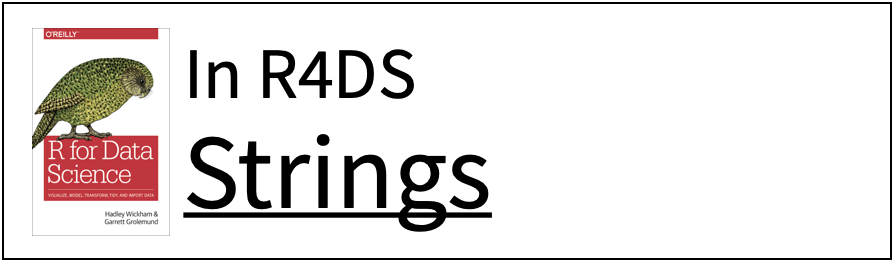
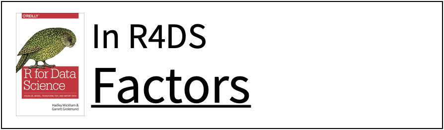
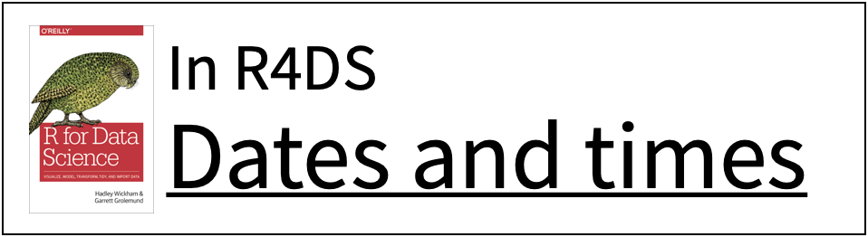
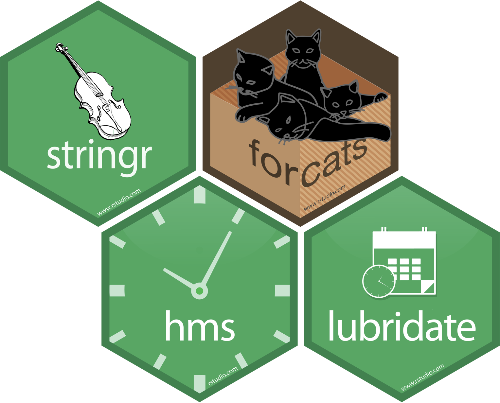

```{r setup, include=FALSE}
options(htmltools.dir.version = FALSE)
knitr::opts_chunk$set(collapse = TRUE,
                      fig.retina = 3,
                      fig.path = "images/data-types/plots/",
                      fig.align = "center",
                      fig.asp = 0.618,
                      comment = "#>")

xaringanExtra::use_share_again()
xaringanExtra::use_panelset()
xaringanExtra::use_extra_styles(hover_code_line = TRUE,
                                mute_unhighlighted_code = TRUE)
xaringanExtra::use_scribble(pen_color = "#009FB7")

yt_counter <- 0
library(countdown)
library(tidyverse)
library(flair)
library(here)
library(knitr)

library(xaringancolor)
yellow <- "#FED766"
blue <- "#009FB7"
```

class: title-slide, center

<span class="fa-stack fa-4x">
  <i class="fa fa-circle fa-stack-2x" style="color: #ffffff;"></i>
  <strong class="fa-stack-1x" style="color:#009FB7;">`r rmarkdown::metadata$session`</strong>
</span> 

# `r rmarkdown::metadata$title`

## `r rmarkdown::metadata$subtitle`

### `r rmarkdown::metadata$author`

#### [`r params$class_link`](`r params$class_link`) &#183; [`r params$site_link`](`r params$site_link`)

.footer-license[*Tidy Data Science with the Tidyverse and Tidymodels* is licensed under a [Creative Commons Attribution 4.0 International License](https://creativecommons.org/licenses/by/4.0/).]

<div style = "position:fixed; visibility: hidden">
$$\require{color}\definecolor{yellow}{rgb}{0.996078431372549, 0.843137254901961, 0.4}$$
$$\require{color}\definecolor{blue}{rgb}{0, 0.623529411764706, 0.717647058823529}$$
</div>

<script type="text/x-mathjax-config">
MathJax.Hub.Config({
  TeX: {
    Macros: {
      yellow: ["{\\color{yellow}{#1}}", 1],
      blue: ["{\\color{blue}{#1}}", 1]
    },
    loader: {load: ['[tex]/color']},
    tex: {packages: {'[+]': ['color']}}
  }
});
</script>

<style>
.yellow {color: #FED766;}
.blue {color: #009FB7;}
</style>

---
class: pop-quiz

# Pop quiz!

What types of data are in this data set?

```{r flights-types, echo = FALSE, message = FALSE, comment = NA}
library(nycflights13)
library(lubridate)

flights %>%
  left_join(airlines, by = "carrier") %>%
  mutate(delayed = arr_delay > 0,
         date = ymd(paste(year, month, day, sep = "-")),
         day = wday(date, label = TRUE, abbr = FALSE),
         air_time = dminutes(air_time)) %>%
  select(time_hour, name, air_time, distance, day, delayed)
```

---
background-image: url(images/data-types/applied-ds-prog.png)
background-position: center 60%
background-size: 85%

# .nobold[(Applied)] Data Science

---
background-image: url(images/data-types/applied-ds-trans-prog.png)
background-position: center 60%
background-size: 85%

# .nobold[(Applied)] Data Science

---
name: logicals
class: center middle

# logicals

---
# Logicals

R's data type for Boolean values (i.e., `TRUE` and `FALSE`)

```{r typeof-logical}
typeof(TRUE)

typeof(FALSE)

typeof(c(TRUE, TRUE, FALSE))
```

---

```{r}
flights %>%
  mutate(delayed = arr_delay > 0) %>%
  select(arr_delay, delayed)
```

--

Can we compute the proportion of flights that arrived late?

---
# Most useful skills

* Math with logicals
  * When you do math with logicals, `TRUE` becomes **1** and `FALSE` becomes **0**

--

* The **sum** of a logical vector is the **count of `TRUE`s**
```{r sum-logical}
sum(c(TRUE, FALSE, TRUE, TRUE))
```

--

* The **mean** of a logical vector is the **proportion of `TRUE`s**
```{r mean-logical}
mean(c(1, 2, 3, 4) < 4)
```

---
class: your-turn

# Your turn `r (yt_counter <- yt_counter + 1)`

.big[
Use the `flights` data set to create a new variable, **`delayed`** that indicates if the flight was delayed (**`arr_delay > 0`**).

Then, remove all rows that contain an `NA` in the **`delayed`** variable.

Finally, create a summary table that shows:

1. How many flight were delayed?
2. What proportion of flights were delayed?
]

```{r logical-cd, echo = FALSE}
countdown(minutes = 4, seconds = 0,
          font_size = "2em",
          color_border = yellow,
          color_background = blue,
          color_text = yellow,
          color_running_background = "#F0F0F0",
          color_running_text = blue,
          color_finished_background = yellow,
          color_finished_text = blue)
```

---
class: your-turn

```{r logical-yt-sol}
flights %>%
  mutate(delayed = arr_delay > 0) %>%
  drop_na(delayed) %>%
  summarize(total = sum(delayed), prop = mean(delayed))
```

---
name: strings
class: center middle

# strings

---
# .nobold[(character)] strings

Anything surrounded by quotes (`"`) or single quotes (`'`)

```r
> "one"
> "1"
> "one's"
> '"Hello World"'
> "foo
+
+
+ oops. I'm stuck in a string."
```

---
class: pop-quiz

# Consider

Discuss in the chat: Are boys or girls names more likely to end in a vowel?

```{r name-vowel-cd, echo = FALSE}
library(babynames)
countdown(minutes = 1)
```

---
class: pop-quiz

How can we calculate the proportion of boys and girls names that end in a vowel?

```{r babynames-overview}
babynames
```

---
# Most useful skills

1\. How to extract or replace substrings.

.fade[
2\. How to find matches for patterns.

3\. Regular expressions.
]

---
<div class="hex-book">
  <a href="https://stringr.tidyverse.org">
    
  </a>
  <a href="https://r4ds.had.co.nz/strings.html">
    
  </a>
</div>

---
# `str_sub()`

Extract or replace portions of a string with **`str_sub()`**

```{r str-sub, eval = FALSE, include = FALSE}
str_sub(string, start = 1, end = -1)
```

```{r str-sub-flair, echo = FALSE}
decorate("str-sub", eval = FALSE)
```

---
# `str_sub()`

Extract or replace portions of a string with **`str_sub()`**

```{r str-sub-flair-string, echo = FALSE}
decorate("str-sub", eval = FALSE) %>%
  flair("string", background = yellow, color = blue)
```

???

string(s) to manipulate

---
# `str_sub()`

Extract or replace portions of a string with **`str_sub()`**

```{r str-sub-flair-start, echo = FALSE}
decorate("str-sub", eval = FALSE) %>%
  flair_rx("(?<= )1", background = yellow, color = blue)
```

???

position of the first character to extract within each string

---
# `str_sub()`

Extract or replace portions of a string with **`str_sub()`**

```{r str-sub-flair-end, echo = FALSE}
decorate("str-sub", eval = FALSE) %>%
  flair("-1", background = yellow, color = blue)
```

???

position of the last character to extract within each string

---
class: pop-quiz

# Pop quiz!

What will this return?

```{r quiz-mephisto12, eval = FALSE}
str_sub("Mephisto", 1, 2)
```

--

```{r quiz-mephisto12-sol, echo = FALSE}
str_sub("Mephisto", 1, 2)
```

---
class: pop-quiz

# Pop quiz!

What will this return?

```{r quiz-mephisto11, eval = FALSE}
str_sub("Mephisto", 1, 2)
```

--

```{r quiz-mephisto11-sol, echo = FALSE}
str_sub("Mephisto", 1, 2)
```

---
class: pop-quiz

# Pop quiz!

What will this return?

```{r quiz-mephisto2, eval = FALSE}
str_sub("Mephisto", 2)
```

--

```{r quiz-mephisto2-sol, echo = FALSE}
str_sub("Mephisto", 2)
```

---
class: pop-quiz

# Pop quiz!

What will this return?

```{r quiz-mephisto3, eval = FALSE}
str_sub("Mephisto", -3)
```

--

```{r quiz-mephisto3-sol, echo = FALSE}
str_sub("Mephisto", -3)
```

---
class: pop-quiz

# Pop quiz!

What will this return?

```{r quiz-mephisto-replace, eval = FALSE}
m <- "Mephisto"
str_sub(m, -3) <- "--Agatha!"
m
```

--

```{r quiz-mephisto-replace-sol, echo = FALSE}
m <- "Mephisto"
str_sub(m, -3) <- "--Agatha!"
m
```

---
class: your-turn

# Your turn `r (yt_counter <- yt_counter + 1)`

Complete the following code to:

1. Isolate the last letter of every **`name`**.
2. Create a variable that indicates whether the last letter is one of "a", "e", "i", "o", "u", or "y".
3. Calculate the proportion of children whose name ends in a vowel, by **`year`** and **`sex`**.
4. Display the results as a line plot.

```{r yt-year-val, eval = FALSE, include = FALSE}
babynames %>%
  mutate(last = str_sub(name, start = -1, end = -1),
         vowel = last %in% c("a", "e", "i", "o", "u", "y")) %>%
  group_by(year, sex) %>%
  summarize(prop_vowel = weighted.mean(vowel, w = n)) %>%
  ggplot(mapping = aes(x = year, y = prop_vowel)) +
  geom_line(mapping = aes(color = sex))
```

```{r yt-year-mask, echo = FALSE}
decorate("yt-year-val", eval = FALSE) %>%
  mask("mutate", background = yellow) %>%
  mask("str_sub(name, start = -1, end = -1)", background = yellow) %>%
  mask('last %in% c("a", "e", "i", "o", "u", "y")', background = yellow) %>%
  mask("year, sex", background = yellow) %>%
  mask("summarize", background = yellow) %>%
  mask("year", background = yellow) %>%
  mask_rx("(?<=\\ )prop_vowel", background = yellow, color = yellow) %>%
  mask("geom_line", background = yellow) %>%
  mask("aes(color = sex)", background = yellow)
```

```{r yt-year-cd, echo = FALSE}
countdown(minutes = 5)
```

---
class: your-turn

.panelset[
```{r yt-year-sol, panelset = c(source = "Code", output = "Plot"), out.width = "80%"}
babynames %>%
  mutate(last = str_sub(name, start = -1, end = -1),
         vowel = last %in% c("a", "e", "i", "o", "u", "y")) %>%
  group_by(year, sex) %>%
  summarize(prop_vowel = weighted.mean(vowel, w = n)) %>%
  ggplot(mapping = aes(x = year, y = prop_vowel)) +
  geom_line(mapping = aes(color = sex))
```
]

---
name: factors
class: center middle

# factors

---
# Factors

R's representation of categorical data. Consists of:

1. A set of **values**
2. An ordered set of **valid levels**

```{r factor-example}
eyes <- factor(x = c("blue", "green", "green"),
               levels = c("blue", "brown", "green", "hazel"))

eyes
```

---
# Factors

Stored internally as an integer vector with a levels attribute

```{r unclass-factor}
unclass(eyes)
```

---
<div class="hex-book">
  <a href="https://forcats.tidyverse.org">
    
  </a>
  <a href="https://r4ds.had.co.nz/factors.html">
    
  </a>
</div>

---
class: pop-quiz

# Consider

Discuss in the chat: Do married people watch more or less TV than single people?

```{r married-tv-cd, echo = FALSE}
countdown(minutes = 1)
```

---
# Example data: `gss_cat`

```{r preview-gsscat}
gss_cat
```

???

A sample of data from teh General Social Survey, a long-running US survey conducted by NORC at the University of Chicago.

---
# Which religions watch the least TV?

```{r religion-tv, fig.show = "hide"}
gss_cat %>%
  drop_na(tvhours) %>%
  group_by(relig) %>%
  summarize(tvhours = mean(tvhours)) %>%
  ggplot(mapping = aes(x = tvhours, y= relig)) +
  geom_point()
```

---
# Which plot do you prefer?


.pull-left[
```{r default-order, echo = FALSE, out.width = "100%"}
include_graphics(fig_chunk("religion-tv", ".png"))
```
]

.pull-right[
```{r religion-tv-order, echo = FALSE, out.width = "100%"}
gss_cat %>%
  drop_na(tvhours) %>%
  group_by(relig) %>%
  summarize(tvhours = mean(tvhours)) %>%
  ggplot(mapping = aes(x = tvhours, y = fct_reorder(relig, tvhours, mean))) +
  geom_point()
```
]

---
class: center middle

```{r default-order-large, echo = FALSE, out.width = "90%"}
include_graphics(fig_chunk("religion-tv", ".png"))
```

???

Why is the y-axis in this order?

---
# `levels()`

Use **`levels()`** to access a factor's levels

```{r relig-levels}
levels(gss_cat$relig)
```

---
```{r new-width, include = FALSE}
opts <- options(width = 100)
```

.smallish[
```{r relig-levels-plot}
levels(gss_cat$relig)
```
]

```{r default-order-with-labels, echo = FALSE, out.width = "65%"}
include_graphics(fig_chunk("religion-tv", ".png"))
```

```{r restor-width, include = FALSE}
options(opts)
```

---
# Most useful skills

1. Reorder the levels
2. Recode the levels
3. Collapse levels

---
class: center middle

.large-left[
# Reordering levels
]

.small-right[
```{r reorder-logo, echo = FALSE, out.width = "100%"}
include_graphics("images/hex/forcats.png")
```
]

---
# `fct_reorder()`

Reorders the levels of a factor based on the result of **`fun(x)`** applied to each group of cases (grouped by level).

```{r fct-reorder, eval = FALSE, include = FALSE}
fct_reorder(f, x, fun = median, ..., .desc = FALSE)
```

```{r fct-reorder-flair, echo = FALSE}
decorate("fct-reorder", eval = FALSE)
```


---
# `fct_reorder()`

Reorders the levels of a factor based on the result of **`fun(x)`** applied to each group of cases (grouped by level).

```{r fct-reorder-flair-f, echo = FALSE}
decorate("fct-reorder", eval = FALSE) %>%
  flair_rx("(?<=\\()f", background = yellow, color = blue)
```

???

Factor to reorder

---
# `fct_reorder()`

Reorders the levels of a factor based on the result of **`fun(x)`** applied to each group of cases (grouped by level).

```{r fct-reorder-flair-x, echo = FALSE}
decorate("fct-reorder", eval = FALSE) %>%
  flair("x", background = yellow, color = blue)
```

???

variable to reorder by (in conjunction with `fun`)

---
# `fct_reorder()`

Reorders the levels of a factor based on the result of **`fun(x)`** applied to each group of cases (grouped by level).

```{r fct-reorder-flair-fun, echo = FALSE}
decorate("fct-reorder", eval = FALSE) %>%
  flair("fun = median", background = yellow, color = blue)
```

???

function to reorder by (in conjunction with `x`)

---
# `fct_reorder()`

Reorders the levels of a factor based on the result of **`fun(x)`** applied to each group of cases (grouped by level).

```{r fct-reorder-flair-desc, echo = FALSE}
decorate("fct-reorder", eval = FALSE) %>%
  flair(".desc = FALSE", background = yellow, color = blue)
```

???

put in descending order?

---

.panelset[
.panel[.panel-name[Code]
```{r religion-tv-order-flair, echo = FALSE}
decorate("religion-tv-order", eval = FALSE, out.width = NULL) %>%
  flair("fct_reorder(relig, tvhours, mean)", background = yellow, color = blue)
```
]

.panel[.panel-name[Plot]
```{r show-good-order, echo = FALSE, out.width = "80%"}
include_graphics(fig_chunk("religion-tv-order", ".png"))
```
]
]

---
class: your-turn

# Your turn `r (yt_counter <- yt_counter + 1)`

Complete the following code to:

1. Calculate the average number of **`tvhours`**, by marital status.
2. Create a sensible plot of average TV consumption by marital status.

```{r yt-married-tv, eval = FALSE, include = FALSE}
gss_cat %>%
  drop_na(tvhours) %>%
  group_by(marital) %>%
  summarize(tvhours = mean(tvhours)) %>%
  ggplot(mapping = aes(x = tvhours,y = fct_reorder(marital, tvhours, mean))) +
  geom_col()
```

```{r yt-married-tv-mask, echo = FALSE}
decorate("yt-married-tv", eval = FALSE) %>%
  mask_rx("marital(?=\\))", background = yellow, color = yellow) %>%
  mask("tvhours = mean(tvhours)", background = yellow) %>%
  mask("aes(x = tvhours,y = fct_reorder(marital, tvhours, mean))",
       background = yellow)
```

```{r yt-married-tv-cd, echo = FALSE}
countdown(minutes = 5)
```

---
class: your-turn

.panelset[
```{r yt-married-tv-sol, panelset = c(source = "Code", output = "Plot"), out.width = "80%"}
<<yt-married-tv>>
```
]

---
# `fct_infreq()`

```{r infreq-default, include = FALSE}
ggplot(gss_cat, mapping = aes(x = marital)) +
  geom_bar()
```

```{r infreq-order, fig.show = "hide"}
ggplot(gss_cat, mapping = aes(x = fct_infreq(marital))) +
  geom_bar()
```

.pull-left[
```{r show-infreq-default, echo = FALSE, out.width = "100%"}
include_graphics(fig_chunk("infreq-default", ".png"))
```
]

.pull-right[
```{r show-infreq-order, echo = FALSE, out.width = "100%"}
include_graphics(fig_chunk("infreq-order", ".png"))
```
]

---
# `fct_rev()`

```{r rev-order, fig.show = "hide"}
ggplot(gss_cat, mapping = aes(x = fct_rev(fct_infreq(marital)))) +
  geom_bar()
```

.pull-left[
```{r show-infreq-order, echo = FALSE, out.width = "100%"}
```
]

.pull-right[
```{r show-rev-order, echo = FALSE, out.width = "100%"}
include_graphics(fig_chunk("rev-order", ".png"))
```
]

---
class: center middle

.large-left[
# Recoding levels
]

.small-right[
```{r reorder-logo, echo = FALSE, out.width = "100%"}
```
]

---
class: your-turn

# Your turn `r (yt_counter <- yt_counter + 1)`

Do liberals or conservatives watch more TV?

Compute the average TV consumption by party identification, and plot the results.

```{r party-tv-cd, echo = FALSE}
countdown(minutes = 5)
```

---
class: your-turn

.panelset[
```{r party-tv-sol, panelset = c(source = "Code", output = "Plot"), out.width= "80%"}
gss_cat %>%
  drop_na(tvhours) %>%
  group_by(partyid) %>%
  summarize(tvhours = mean(tvhours)) %>%
  ggplot(mapping = aes(x = tvhours,y = fct_reorder(partyid, tvhours, mean))) +
  geom_col() +
  labs(y = "partyid")
```
]

???

How can we improve these labels?

---
# `fct_recode()`

Change the values of the levels for a factor

```{r recode-example, include = FALSE, eval = FALSE}
fct_recode(f, ...)
```

```{r recode-example-flair, echo = FALSE}
decorate("recode-example", eval = FALSE)
```

---
# `fct_recode()`

Change the values of the levels for a factor

```{r recode-example-flair-f, echo = FALSE}
decorate("recode-example", eval = FALSE) %>%
  flair_rx("(?<=\\()f", background = yellow, color = blue)
```

???

factor variable

---
# `fct_recode()`

Change the values of the levels for a factor

```{r recode-example-flair-dots, echo = FALSE}
decorate("recode-example", eval = FALSE) %>%
  flair("...", background = yellow, color = blue)
```

???

new level = old level pairs

---
.panelset[
```{r party-recode, panelset = c(source = "Code", output = "Plot"), out.width = "80%"}
gss_cat %>%
  drop_na(tvhours) %>%
  mutate(partyid = fct_recode(partyid,
                              "Republican, strong" = "Strong republican",
                              "Republican, weak"   = "Not str republican",
                              "Republican, lean"   = "Ind,near rep",
                              "Democrat, lean"     = "Ind,near dem",
                              "Democrat, weak"     = "Not str democrat",
                              "Democrat, strong"   = "Strong democrat")) %>%
  group_by(partyid) %>%
  summarize(tvhours = mean(tvhours)) %>%
  ggplot(mapping = aes(x = tvhours, y = fct_reorder(partyid, tvhours, mean))) +
  geom_col() +
  labs(y = "partyid")
```
]

---
```{r grey-party, echo = FALSE, out.width = "90%"}
include_graphics(fig_chunk("party-recode", ".png"))
```

---
```{r red-party, message = FALSE, echo = FALSE, out.width = "90%"}
library(ggtext)
library(glue)

gss_cat %>%
  drop_na(tvhours) %>%
  mutate(partyid = fct_recode(partyid,
                              "Republican, strong" = "Strong republican",
                              "Republican, weak"   = "Not str republican",
                              "Republican, lean"   = "Ind,near rep",
                              "Democrat, lean"     = "Ind,near dem",
                              "Democrat, weak"     = "Not str democrat",
                              "Democrat, strong"   = "Strong democrat")) %>%
  group_by(partyid) %>%
  summarize(tvhours = mean(tvhours)) %>%
  mutate(party = case_when(str_detect(partyid, "Republican") ~ "Rep",
                           TRUE ~ "Other"),
         partyid = case_when(
    str_detect(partyid, "Republican") ~ glue("<strong style='color:#E69F00'>{partyid}</strong>"),
    TRUE ~ glue("{partyid}")
  )) %>%
  ggplot(mapping = aes(x = tvhours, y = fct_reorder(partyid, tvhours, mean))) +
  geom_col(aes(fill = party), show.legend = FALSE) +
  scale_fill_manual(values = c("Rep" = "#E69F00", "Other" = "grey35")) +
  labs(y = "partyid") +
  theme(axis.text.y = element_markdown())
```

---
```{r blue-party, message = FALSE, echo = FALSE, out.width = "90%"}
gss_cat %>%
  drop_na(tvhours) %>%
  mutate(partyid = fct_recode(partyid,
                              "Republican, strong" = "Strong republican",
                              "Republican, weak"   = "Not str republican",
                              "Republican, lean"   = "Ind,near rep",
                              "Democrat, lean"     = "Ind,near dem",
                              "Democrat, weak"     = "Not str democrat",
                              "Democrat, strong"   = "Strong democrat")) %>%
  group_by(partyid) %>%
  summarize(tvhours = mean(tvhours)) %>%
  mutate(party = case_when(str_detect(partyid, "Republican") ~ "Rep",
                           str_detect(partyid, "Democrat") ~ "Dem",
                           TRUE ~ "Other"),
         partyid = case_when(party == "Rep" ~
                               glue("<strong style='color:#E69F00'>{partyid}</strong>"),
                             party == "Dem" ~
                               glue("<strong style='color:#0072B2'>{partyid}</strong>"),
                             TRUE ~ glue("{partyid}"))) %>%
  ggplot(mapping = aes(x = tvhours, y = fct_reorder(partyid, tvhours, mean))) +
  geom_col(aes(fill = party), show.legend = FALSE) +
  scale_fill_manual(values = c("Rep" = "#E69F00", "Dem" = "#0072B2",
                               "Other" = "grey35")) +
  labs(y = "partyid") +
  theme(axis.text.y = element_markdown())
```

???

How can we combine these groups?

---
class: center middle

.large-left[
# Collapsing levels
]

.small-right[
```{r reorder-logo, echo = FALSE, out.width = "100%"}
```
]

---
# `fct_collapse()`

Changes multiple levels into a single level.

```{r collapse-example, include = FALSE, eval = FALSE}
fct_collapse(f, ...)
```

```{r collapse-example-flair, echo = FALSE}
decorate("collapse-example", eval = FALSE)
```

---
# `fct_collapse()`

Changes multiple levels into a single level.

```{r collapse-example-flair-f, echo = FALSE}
decorate("collapse-example", eval = FALSE) %>%
  flair_rx("(?<=\\()f", background = yellow, color = blue)
```

???

Factor with levels

---
# `fct_collapse()`

Changes multiple levels into a single level.

```{r collapse-example-flair-dots, echo = FALSE}
decorate("collapse-example", eval = FALSE) %>%
  flair("...", background = yellow, color = blue)
```

???

Named levels to be collapsed

---
.panelset[
```{r collapse-count, panelset = c(source = "Code", output = "Plot"), out.width = "80%"}
gss_cat %>%
  drop_na(tvhours) %>%
  mutate(new_party = fct_collapse(partyid,
                                  Conservative = c("Strong republican",
                                                   "Not str republican",
                                                   "Ind,near rep"),
                                  Liberal = c("Strong democrat",
                                              "Not str democrat",
                                              "Ind,near dem"))) %>%
  ggplot(mapping = aes(x = fct_infreq(new_party))) +
  geom_bar() +
  labs(x = "party")
```
]

---
```{r need-lump, out.width = "90%", echo = FALSE}
gss_cat %>%
  drop_na(tvhours) %>%
  mutate(new_party = fct_collapse(partyid,
                                  Conservative = c("Strong republican",
                                                   "Not str republican",
                                                   "Ind,near rep"),
                                  Liberal = c("Strong democrat",
                                              "Not str democrat",
                                              "Ind,near dem")),
         party = case_when(new_party %in% c("Liberal", "Conservative", "Independent") ~ glue("{new_party}"),
                           TRUE ~ glue("<strong style='color:#E69F00'>{new_party}</strong>")),
         fill_party = case_when(new_party %in% c("Liberal", "Conservative", "Independent") ~ "Other",
                                TRUE ~ "Replace")) %>%
  ggplot(mapping = aes(x = fct_infreq(party))) +
  geom_bar(aes(fill = fill_party), show.legend = FALSE) +
  scale_fill_manual(values = c("Other" = "grey35", "Replace" = "#E69F00")) +
  labs(x = "party") +
  theme(axis.text.x = element_markdown())
```

---
# `fct_lump_n()`

Collapses levels with fewest values into a single level. By default collapses as many levels as possible such that the new level is still the smallest.

```{r lump-example, include = FALSE, eval = FALSE}
fct_lump_n(f, n, other_level = "Other", ...)
```

```{r lump-example-flair, echo = FALSE}
decorate("lump-example", eval = FALSE)
```

---
# `fct_lump_n()`

Collapses levels with fewest values into a single level. By default collapses as many levels as possible such that the new level is still the smallest.

```{r lump-example-flair-f, echo = FALSE}
decorate("lump-example", eval = FALSE) %>%
  flair_rx("(?<=\\()f", background = yellow, color = blue)
```

???

Factor with levels

---
# `fct_lump_n()`

Collapses levels with fewest values into a single level. By default collapses as many levels as possible such that the new level is still the smallest.

```{r lump-example-flair-n, echo = FALSE}
decorate("lump-example", eval = FALSE) %>%
  flair("n", background = yellow, color = blue)
```

???

number of levels to lump (n smallest levels)

---
# `fct_lump_n()`

Collapses levels with fewest values into a single level. By default collapses as many levels as possible such that the new level is still the smallest.

```{r lump-example-flair-dots, echo = FALSE}
decorate("lump-example", eval = FALSE) %>%
  flair('other_level = "Other"', background = yellow, color = blue)
```

???

name of new level

---
.panelset[
```{r show-lump, panelset = c(source = "Code", output = "Plot"), out.width = "80%"}
gss_cat %>%
  drop_na(tvhours) %>%
  mutate(new_party = fct_collapse(partyid,
                                  Conservative = c("Strong republican",
                                                   "Not str republican",
                                                   "Ind,near rep"),
                                  Liberal = c("Strong democrat",
                                              "Not str democrat",
                                              "Ind,near dem")),
         new_party = fct_lump_n(new_party, other_level = "Other", n = 3))  %>%
  group_by(new_party) %>%
  summarize(tvhours = mean(tvhours)) %>%
  ggplot(aes(x = tvhours, y = fct_reorder(new_party, tvhours, mean))) +
  geom_col() +
  labs(y = "partyid")
```
]

---
name: dates
class: center middle

# dates and times

---
class: pop-quiz

# Pop quiz!

Does every year have 365 days?

--

Does every day have 24 hours?

--

Does every minute have 60 seconds?

--

What does a month measure?

---
# Most useful skills

1\. Creating dates/times (i.e., parsing)

2\. Access and change parts of a date

.fade[
3\. Deal with time zones

4\. Do math with instants and time spans
]

---
class: pop-quiz

# Consider

Discuss in the chat:

* What is the best time of day to fly?

* What is the best day of the week to fly?

```{r date-pq-cd, echo = FALSE}
countdown(minutes = 1)
```

---

```{r flight-time}
flights %>%
  select(year, month, day, hour, minute, sched_dep_time, time_hour)
```

???

Let's focus briefly on the relationship between the scheduled departure time, `sched_dep_time`, and the average flight delay.

---
.panelset[
```{r bad-flight-time, panelset = c(source = "Code", output = "Plot"), out.width = "80%", message = FALSE, warning = FALSE, cache = TRUE}
flights %>%
  ggplot(mapping = aes(x = sched_dep_time, y = arr_delay)) +
  geom_point(alpha = 0.2) +
  geom_smooth()
```
]

???

We might start by making a plot of departure time vs. arrival delay. What's wrong with this? Minutes stop at 59, so there are gaps from 60-99 for every "hour". Time counting is not the same as our normal number line.

---
class: center middle

.large-left[
# Creating dates and times
]

.small-right[
```{r hms-logo, echo = FALSE, out.width = "100%"}
include_graphics("images/hex/hms.png")
```
]

<a href="https://r4ds.had.co.nz/dates-and-times.html">
  
</a>

---
# hms

.center[
.fade[2021-05-04] .blue-highlight[**14:52:34**]
]

Stored as the number of seconds since 00:00:00.<sup>*</sup>

```{r hms-example, message = FALSE}
library(hms)
hms(seconds = 34, minutes = 52, hours = 14)

unclass(hms(34, 52, 14))
```

.footnote[*On a typical day.]

---
class: your-turn

# Your turn `r (yt_counter <- yt_counter + 1)`

.big[
What is the best time of day to fly?

1. Use the **`hour`** and **`minute`** variable in flights to compute the time of day for each flight as an `hms`.
2. Use a smooth line to plot the relationship between time of day and **`arr_delay`**.
]

```{r tod-cd, echo = FALSE}
countdown(minutes = 5)
```

---
class: your-turn

.panelset[
.panel[.panel-name[Code]
```{r tod-sol, fig.show = "hide", warning = FALSE, message = FALSE, cache = TRUE}
flights %>%
  mutate(time = hms(hours = hour, minutes = minute)) %>%
  ggplot(mapping = aes(x = time, y = arr_delay)) +
  geom_point(alpha = 0.2) +
  geom_smooth()
```
]

.panel[.panel-name[Plot]
```{r show-tod-sol, echo = FALSE, out.width = "80%"}
include_graphics(fig_chunk("tod-sol", ".png"))
```
]

.panel[.panel-name[Improved]
```{r tod-sol-best, echo = FALSE, warning = FALSE, message = FALSE, cache = TRUE, out.width = "80%"}
flights %>%
  mutate(time = hms(hours = hour, minutes = minute)) %>%
  ggplot(mapping = aes(x = time, y = arr_delay)) +
  geom_smooth()
```
]
]

---
class: center middle

.large-left[
# lubridate
]

.small-right[
```{r lubridate-logo, echo = FALSE, out.width = "100%"}
include_graphics("images/hex/lubridate.png")
```
]

<a href="https://r4ds.had.co.nz/dates-and-times.html">
  
</a>

---
# `ymd()` family

To parse strings as dates, use a *y*, *m*, *d*, *h*, *m*, *s* combination.

```{r ymd-example}
ymd("2021-05-04")

mdy("May 4, 2021")

ymd_hms("2021-05-04 14:52:34")
```

---
# Accessing components

Extract components by name with a **singular** name.

```{r extract-year}
star_wars <- ymd("2021-05-04")
year(star_wars)

month(star_wars)

day(star_wars)
```

---
# Setting components

Use the same functions to set components

```{r set-comp}
star_wars

year(star_wars) <- 2002
star_wars
```

---
# Date and time components

```{r lubridate-tab, message = FALSE, warning = FALSE, echo = FALSE}
library(gt)

tribble(
  ~`function`, ~extracts,        ~`extra arguments`,
  "year()",    "year",           NA,
  "month()",   "month",          "label = FALSE, abbr = TRUE",
  "week()",    "week",           NA,
  "day()",     "day of month",   NA,
  "wday()",    "day of week",    "label = FALSE, abbr = TRUE",
  "qday()",    "day of quarter", NA,
  "yday()",    "day of year",    NA,
  "hour()",    "hour",           NA,
  "minute()",  "minute",         NA,
  "second()",  "second",         NA
) %>%
  gt() %>%
  wjake::gt_theme_wjake() %>%
  tab_style(style = cell_text(font = google_font("Source Code Pro")),
            locations = cells_body(columns = c(1, 3))) %>%
  fmt_missing(columns = 3, missing_text = "") %>%
  cols_width(1 ~ px(120),
             2 ~ px(150),
             3 ~ px(350)) %>%
  cols_align(align = "center", columns = 1:3)
```

---
# Accessing components

```{r weekday-example}
wday(star_wars)

wday(star_wars, label = TRUE)

wday(star_wars, label = TRUE, abbr = FALSE)
```

---
class: your-turn

# Your turn `r (yt_counter <- yt_counter + 1)`

Complete the following code to:

1. Extract the day of the week for each flight (as a full name) from **`time_hour`**.
2. Calculate the average **`arr_delay`** by day of the week.
3. Plot the results as a column chart (bar chart) with `geom_col()`.

```{r yt-flight-day, echo = FALSE, fig.show = "hide"}
flights %>% 
  drop_na(arr_delay) %>% 
  mutate(weekday = wday(time_hour, label = TRUE, abbr = FALSE)) %>% 
  group_by(weekday) %>%
  summarize(avg_delay = mean(arr_delay)) %>% 
  ggplot(mapping = aes(x = weekday, y = avg_delay)) +
  geom_col()
```

```{r yt-flight-mask, echo = FALSE}
decorate("yt-flight-day", eval = FALSE, fig.show = NULL) %>%
  mask("wday(time_hour, label = TRUE, abbr = FALSE)", background = yellow) %>%
  mask("group_by(weekday)", background = yellow) %>%
  mask("summarize", background = yellow) %>%
  mask("mean(arr_delay)", background = yellow) %>%
  mask("geom_col()", background = yellow)
```

```{r yt-flight-cd, echo = FALSE}
countdown(minutes = 5)
```

---
class: your-turn

.panelset[
```{r yt-flight-day-sol, panelset = c(source = "Code", output = "Plot"), out.width = "80%"}
<<yt-flight-day>>
```
]

---
class: title-slide, center

# `r rmarkdown::metadata$title`

```{r closing-hex, echo = FALSE, out.width = "30%"}

```

## `r rmarkdown::metadata$subtitle`

### `r rmarkdown::metadata$author`

#### [`r params$class_link`](`r params$class_link`) &#183; [`r params$site_link`](`r params$site_link`)

.footer-license[*Tidy Data Science with the Tidyverse and Tidymodels* is licensed under a [Creative Commons Attribution 4.0 International License](https://creativecommons.org/licenses/by/4.0/).]
