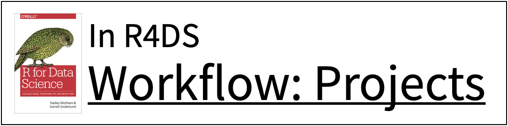
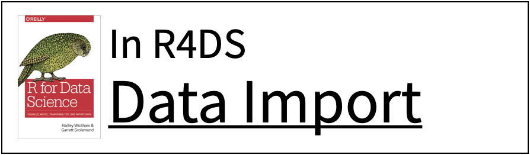
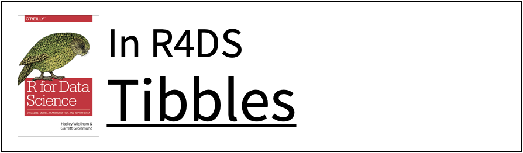
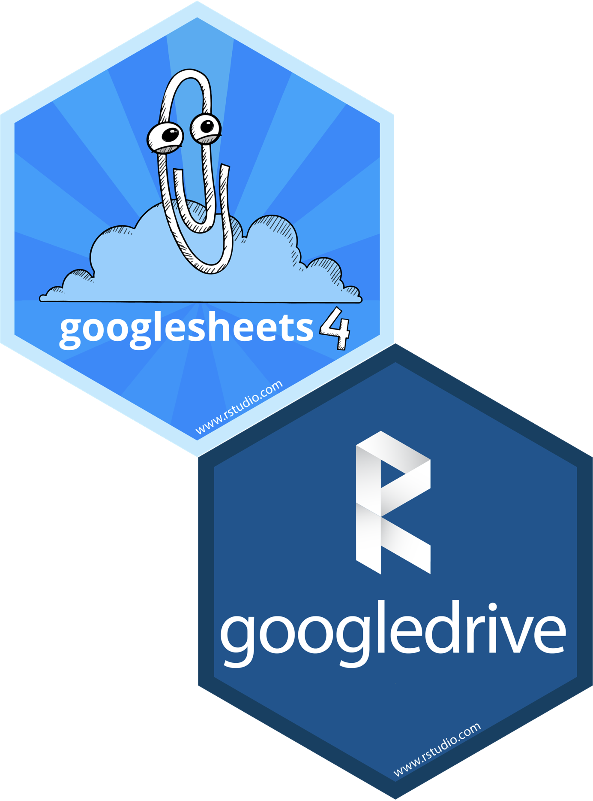
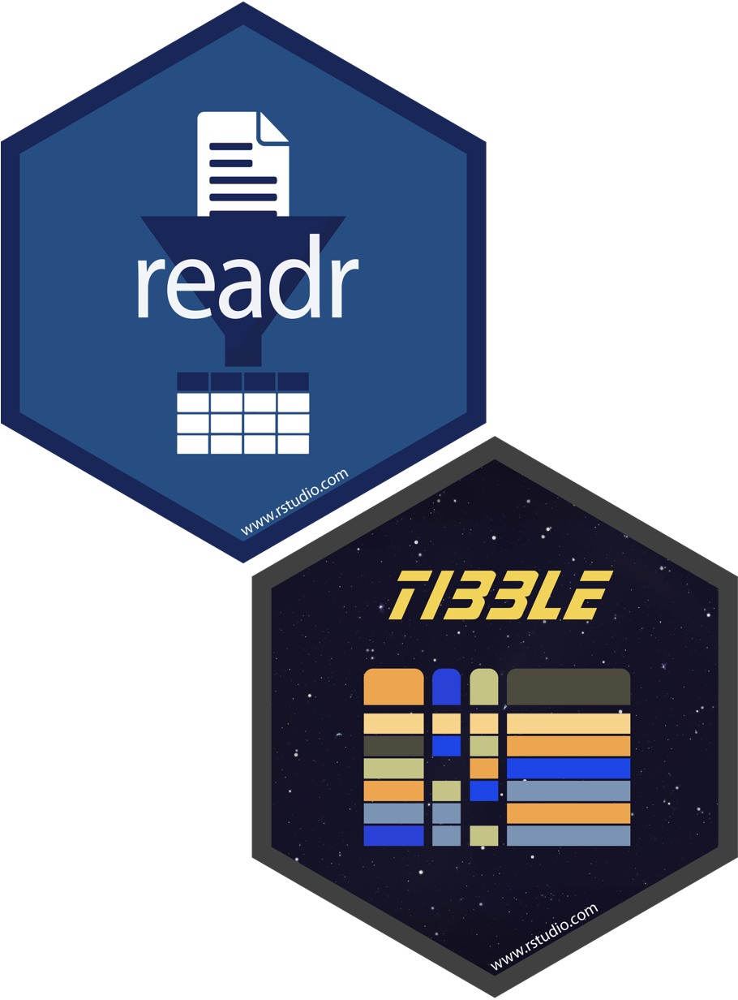

```{r setup, include=FALSE}
options(htmltools.dir.version = FALSE)
knitr::opts_chunk$set(collapse = TRUE,
                      fig.retina = 3,
                      fig.path = "images/import/plots/",
                      fig.align = "center",
                      fig.asp = 0.618,
                      comment = "#>")

xaringanExtra::use_share_again()
xaringanExtra::use_panelset()
xaringanExtra::use_extra_styles(hover_code_line = TRUE,
                                mute_unhighlighted_code = TRUE)
xaringanExtra::use_scribble(pen_color = "#009FB7")

yt_counter <- 0
library(countdown)
library(tidyverse)
library(flair)
library(here)
library(knitr)

library(xaringancolor)
yellow <- "#FED766"
blue <- "#009FB7"
```

class: title-slide, center

<span class="fa-stack fa-4x">
  <i class="fa fa-circle fa-stack-2x" style="color: #ffffff;"></i>
  <strong class="fa-stack-1x" style="color:#009FB7;">`r rmarkdown::metadata$session`</strong>
</span> 

# `r rmarkdown::metadata$title`

## `r rmarkdown::metadata$subtitle`

### `r rmarkdown::metadata$author`

#### [`r params$class_link`](`r params$class_link`) &#183; [`r params$site_link`](`r params$site_link`)

.footer-license[*Tidy Data Science with the Tidyverse and Tidymodels* is licensed under a [Creative Commons Attribution 4.0 International License](https://creativecommons.org/licenses/by/4.0/).]

<div style = "position:fixed; visibility: hidden">
$$\require{color}\definecolor{yellow}{rgb}{0.996078431372549, 0.843137254901961, 0.4}$$
$$\require{color}\definecolor{blue}{rgb}{0, 0.623529411764706, 0.717647058823529}$$
</div>

<script type="text/x-mathjax-config">
MathJax.Hub.Config({
  TeX: {
    Macros: {
      yellow: ["{\\color{yellow}{#1}}", 1],
      blue: ["{\\color{blue}{#1}}", 1]
    },
    loader: {load: ['[tex]/color']},
    tex: {packages: {'[+]': ['color']}}
  }
});
</script>

<style>
.yellow {color: #FED766;}
.blue {color: #009FB7;}
</style>

---
background-image: url(images/import/bored.jpeg)
background-position: center middle
background-size: 100%

### **Incredibly boring, or...**

---
background-image: url(images/import/frustrated.jpeg)
background-position: center middle
background-size: 100%

### **absolutely infuriating.**

---
class: your-turn

# Your turn `r (yt_counter <- yt_counter + 1)`

```{r yt-setwd-cd, echo = FALSE}
countdown(minutes = 2, seconds = 0,
          font_size = "2em",
          color_border = yellow,
          color_background = blue,
          color_text = yellow,
          color_running_background = "#F0F0F0",
          color_running_text = blue,
          color_finished_background = yellow,
          color_finished_text = blue)
```

.pull-left.big[
* Open the R Notebook **materials/exercises/05-import.Rmd**
* Run the setup chunk
]

--

.pull-right[
```{r shock-emo, echo = FALSE, out.width = "80%"}

```
]


---
class: center middle

<a href="https://twitter.com/hadleywickham/status/940021008764846080">
    
</a>

---
# Be kind to your collaborators...

--

## including future you.

--

* Workflow

    * Editor
    * Home directory
    * R code you ran before break
    
--

* Product
    * Raw data
    * R code someone else need to run to replicate results

--

* **Workflows should not be hardwired into the products**

---
# Projects

* Each analysis as a *project*
    * Folder on your computer with all relevant files

* R scripts written with assumption of:
    1. Clean session
    2. Working directory = project directory

* Creates everything it needs, touches nothing it didn't create.

???

Can move directory on computer, can move to different computer, can be used by other person (including future you!)

It’s like agreeing that we will all drive on the left or the right. A hallmark of civilization is following conventions that constrain your behavior a little, in the name of public safety.


---
background-image: url(images/import/here.png)
background-position: 75% 50%
background-size: 60%

<a href="https://r4ds.had.co.nz/workflow-projects.html">
  
</a>

.footnote[Artwork by [@allison_horst](https://twitter.com/allison_horst)]

---
# `here()`

.big[Find the project directory and build file paths.]

```{r here-example}
library(here)

here()

here("materials", "data", "nimbus.csv")
```

---
# `here()`

Where does **`here()`** start?

* Is a file named `.here` present?  

* Is there a `.Rproj` file (e.g., `tidyds-2021.Rproj`)?  

* Is there a `.git` or `.svn` directory?

```{r here-source}
dr_here()
```

---
<div class="hex-book">
  <a href="https://readr.tidyverse.org">
    
  </a>
  <a href="https://r4ds.had.co.nz/data-import.html">
    
  </a>
</div>

---
background-image: url(images/import/applied-ds-import.png)
background-position: center 60%
background-size: 85%

---
# `readr` functions

.big[
```{r readr-tab, message = FALSE, warning = FALSE, echo = FALSE}
library(gt)

tribble(
  ~`function`,    ~extracts,
  "read_csv()",   "comma separated files",
  "read_csv2()",  "semi-colon separated files",
  "read_delim()", "general delimited files",
  "read_fwf()",   "fixed width files",
  "read_log()",   "Apache log files",
  "read_table()", "space separated files",
  "read_tsv()",   "tab separated files"
) %>%
  gt() %>%
  wjake::gt_theme_wjake() %>%
  tab_style(style = cell_text(font = google_font("Source Code Pro")),
            locations = cells_body(columns = c(1))) %>%
  cols_width(1 ~ px(200),
             2 ~ px(400)) %>%
  cols_align(align = "center", columns = 1:2)
```
]

---
# `readr` functions

.big[
```{r readr-tab2, message = FALSE, warning = FALSE, echo = FALSE}
library(gt)

tribble(
  ~`function`,    ~extracts,
  "read_csv()",   "comma separated files",
  "read_csv2()",  "semi-colon separated files",
  "read_delim()", "general delimited files",
  "read_fwf()",   "fixed width files",
  "read_log()",   "Apache log files",
  "read_table()", "space separated files",
  "read_tsv()",   "tab separated files"
) %>%
  gt() %>%
  wjake::gt_theme_wjake() %>%
  tab_style(style = cell_text(font = google_font("Source Code Pro")),
            locations = cells_body(columns = c(1))) %>%
  cols_width(1 ~ px(200),
             2 ~ px(400)) %>%
  cols_align(align = "center", columns = 1:2) %>%
  tab_style(style = cell_text(weight = "bold"),
            locations = cells_body(columns = 1:2, rows = 1))
```
]

---
# Example data: `nimbus`

```{r show-nimbus, echo = FALSE}
read_lines(here("materials", "data", "nimbus.csv")) %>%
  head(n = 10) %>%
  cat(sep = "\n")
```

---
# `read_csv()`

**`readr`** functions share a common syntax.

```{r csv-example, eval = FALSE, include = FALSE}
dat <- read_csv("path/to/file.csv", ...)
```

```{r csv-example-flair, echo = FALSE}
decorate("csv-example", eval = FALSE)
```

---
# `read_csv()`

**`readr`** functions share a common syntax.

```{r csv-example-flair-save, echo = FALSE}
decorate("csv-example", eval = FALSE) %>%
  flair("dat", background = yellow, color = blue)
```

???

object to save data to

---
# `read_csv()`

**`readr`** functions share a common syntax.

```{r csv-example-flair-path-bad, echo = FALSE}
decorate("csv-example", eval = FALSE) %>%
  flair('"path/to/file.csv"', background = "red", color = "white")
```


---
# `read_csv()`

**`readr`** functions share a common syntax.

```{r csv-example-here, eval = FALSE, include = FALSE}
dat <- read_csv(here("path", "to", "file.csv"), ...)
```

```{r csv-example-flair-path-good, echo = FALSE}
decorate("csv-example-here", eval = FALSE) %>%
  flair('here("path", "to", "file.csv")', background = yellow, color = blue)
```

???

build file path with `here()`

---
class: your-turn

# Your turn `r (yt_counter <- yt_counter + 1)`

.big[
* Find **`nimbus.csv`** in your project directory

* Read it into an object

* View the results
]

```{r yt-nimbus-cd, echo = FALSE}
countdown(minutes = 2)
```

---
class: your-turn

.smallish[
```{r yt-nimbus-sol}
nimbus <- read_csv(here("materials", "data", "nimbus.csv"))
nimbus
```
]

---
name: tibble
class: center middle

# tibbles

---
<div class="hex-book">
  <a href="https://tibble.tidyverse.org">
    
  </a>
  <a href="https://r4ds.had.co.nz/tibbles.html">
    
  </a>
</div>

---
# `read.csv()` vs. `read_csv()`

.pull-left.small[
```{r nimbus-base, echo = FALSE}
df_nimbus <- read.csv(here("materials", "data", "nimbus.csv")) %>%
  tail(n = 25)
colnames(df_nimbus) <- NULL

df_nimbus
```
]

--

.pull-right.small[
```{r nimbus-readr, echo = FALSE, message = FALSE}
read_csv(here("materials", "data", "nimbus.csv"))
```
]

---
background-image: url(images/import/df-display.png)
background-position: center middle
background-size: 65%

---
background-image: url(images/import/tib-display.png)
background-position: center middle
background-size: 65%

---
background-image: url(images/import/cheatsheet-tibble.png)
background-position: center middle
background-size: 70%

---
name: parsing
class: center middle

# parsing

---
class: pop-quiz

# Consider

.big[
* Look at the **`nimbus`** data.

* What class (data type) is **`ozone`**?
]

```{r pq-ozone, eval = FALSE}
nimbus %>%
  pull(ozone) %>%
  class()
```

```{r pq-ozone-cd, echo = FALSE}
countdown(minutes = 1)
```


---
class: pop-quiz

```{r set-max-print, include = FALSE}
opts <- options(max.print = 150)
```

```{r pq-ozone-sol}
nimbus %>%
  pull(ozone) %>%
  class()

nimbus %>%
  pull(ozone) %>%
  unique()
```

```{r restore-print, include = FALSE}
options(opts)
```

---
# `NA` values

```{r missing-ozone}
nimbus %>%
  filter(ozone == ".")
```

---
# Define missing values

```{r define-missing, eval = FALSE, include = FALSE}
dat <- read_csv(here("path", "to", "file.csv"), na = ".")
```

```{r define-missing-flair, echo = FALSE}
decorate("define-missing", eval = FALSE) %>%
  flair('na = "."', background = yellow, color = blue)
```

---
class: your-turn

# Your turn `r (yt_counter <- yt_counter + 1)`

.big[
* Read in **`nimbus.csv`** again.

* Set values of **`"."`** to **`NA`**.
]

```{r yt-set-missing-cd, echo = FALSE}
countdown(minutes = 2)
```

---
class: your-turn

.panelset[
.panel[.panel-name[Original]
.smallish[
```{r yt-set-missing-orig}
read_csv(here("materials", "data", "nimbus.csv"))
```
]
]

.panel[.panel-name[Solution]
.smallish[
```{r yt-set-missing-sol}
read_csv(here("materials", "data", "nimbus.csv"), na = ".")
```
]
]
]

---
# Specify column types

```{r define-types, eval = FALSE, include = FALSE}
dat <- read_csv(here("path", "to", "file.csv"), na = ".",
                col_types = cols(var_1 = col_number()))
```

```{r define-types-flair, echo = FALSE}
decorate("define-types", eval = FALSE) %>%
  flair("col_types = cols(var_1 = col_number())", background = yellow,
        color = blue)
```

---
# Column types

```{r column-tab, message = FALSE, warning = FALSE, echo = FALSE}

tribble(
  ~`function`,       ~`data type`,
  "col_character()", "characters",
  "col_date()",      "dates",
  "col_datetime()",  "POSIXct (date-time)",
  "col_double()",    "double (decimal number)",
  "col_factor()",    "factors",
  "col_guess()",     "let readr guess (default)",
  "col_integer()",   "integers",
  "col_logical()",   "logicals",
  "col_number()",    "numbers mixed with non-number characters",
  "col_numeric()",   "double or integer",
  "col_skip()",      "do not read",
  "col_time()",      "time"
) %>%
  gt() %>%
  wjake::gt_theme_wjake() %>%
  tab_style(style = cell_text(font = google_font("Source Code Pro")),
            locations = cells_body(columns = c(1))) %>%
  cols_width(1 ~ px(220),
             2 ~ px(500)) %>%
  cols_align(align = "center", columns = 1:2)
```

---
class: your-turn

# Your turn `r (yt_counter <- yt_counter + 1)`

.big[
* Read in **`nimbus.csv`** again.

* Set values of **`"."`** to **`NA`**.

* Specify **`ozone`** as integer values.
]

```{r yt-set-type-cd, echo = FALSE}
countdown(minutes = 2)
```

---
class: your-turn

.panelset[
.panel[.panel-name[Solution]
```{r yt-set-type-sol}
read_csv(here("materials", "data", "nimbus.csv"), na = ".",
         col_types = cols(ozone = col_integer()))
```

```{r read-nimbus-final, include = FALSE}
nimbus <- read_csv(here("materials", "data", "nimbus.csv"), na = ".",
                   col_types = cols(ozone = col_integer()))
```
]

.panel[.panel-name[Bonus Map]
```{r bonus-map, fig.show = "hide", message = FALSE}
library(rnaturalearth)
library(sf)

world <- ne_countries(scale = "medium", returnclass = "sf")

ortho <- "+proj=ortho +lat_0=-78 +lon_0=166 +x_0=0 +y_0=0 +a=6371000 +b=6371000 +units=m +no_defs"

ggplot(data = nimbus) +
  geom_point(mapping = aes(x = longitude, y = latitude, color = ozone)) +
  geom_sf(data = world, fill = NA, color = "black") +
  scale_color_viridis_c(option = "viridis") +
  coord_sf(crs = ortho)
```
]

.panel[.panel-name[Map]
```{r show-map, echo = FALSE, out.width = "80%"}
include_graphics(fig_chunk("bonus-map", ".png"))
```
]
]

---
name: misc
class: center middle

# other data files

---
class: center middle

.large-left-multi[
# Excel files (`.xls` and `.xlsx`)
]

.small-right[
```{r readxl-logo, echo = FALSE, out.width = "100%"}
include_graphics("images/hex/readxl.png")
```
]

---
class: center middle

.large-left-multi[
# Data from other statistical software (SPSS, Stata, and SAS)
]

.small-right[
```{r haven-logo, echo = FALSE, out.width = "100%"}
include_graphics("images/hex/haven.png")
```
]

---
class: center middle

.large-left-multi[
# Google Sheets and other files from Google Drive
]

.small-right[
```{r google-logo, echo = FALSE, out.width = "100%"}

```
]

---
class: center middle

.large-left-multi[
# Efficient data sharing between R and Python
]

.small-right[
```{r feather-logo, echo = FALSE, out.width = "100%"}
include_graphics("images/hex/feather.png")
```
]

---
class: center middle

.large-left-multi[
# Web pages (web scraping)
]

.small-right[
```{r rvest-logo, echo = FALSE, out.width = "100%"}
include_graphics("images/hex/rvest.png")
```
]

---
background-image: url(images/import/other-pkgs.png)
background-position: center middle
background-size: 50%

???

jsonlite -> json
xml2 -> xml
httr -> web APIs
DBI -> databases

---
class: title-slide, center

# `r rmarkdown::metadata$title`

```{r closing-hex, echo = FALSE, out.width = "18%"}

```

## `r rmarkdown::metadata$subtitle`

### `r rmarkdown::metadata$author`

#### [`r params$class_link`](`r params$class_link`) &#183; [`r params$site_link`](`r params$site_link`)

.footer-license[*Tidy Data Science with the Tidyverse and Tidymodels* is licensed under a [Creative Commons Attribution 4.0 International License](https://creativecommons.org/licenses/by/4.0/).]
