```{r setup, include=FALSE}
options(htmltools.dir.version = FALSE)
knitr::opts_chunk$set(collapse = TRUE,
                      fig.retina = 3,
                      fig.path = "images/tidy/plots/",
                      fig.align = "center",
                      fig.asp = 0.618,
                      comment = "#>")

xaringanExtra::use_share_again()
xaringanExtra::use_panelset()
xaringanExtra::use_extra_styles(hover_code_line = TRUE,
                                mute_unhighlighted_code = TRUE)
xaringanExtra::use_scribble(pen_color = "#009FB7")

yt_counter <- 0
library(countdown)
library(tidyverse)
library(flair)
library(here)
library(knitr)

library(xaringancolor)
yellow <- "#FED766"
blue <- "#009FB7"
```

```{r data-sets, include = FALSE}
# Toy data
cases <- tribble(
  ~country, ~"2011", ~"2012", ~"2013",
      "FR",    7000,    6900,    7000,
      "DE",    5800,    6000,    6200,
      "US",   15000,   14000,   13000
)

pollution <- tribble(
       ~city,   ~size, ~amount,
  "New York", "large",      23,
  "New York", "small",      14,
    "London", "large",      22,
    "London", "small",      16,
   "Beijing", "large",     121,
   "Beijing", "small",      56
)

scores <- tribble(
                     ~name,       ~house, ~score,
          "Ronald Weasley", "Gryffindor",     78,
            "Harry Potter", "Gryffindor",     85,
        "Hermione Granger", "Gryffindor",    100,
  "Justin Finch-Fletchley", "Hufflepuff",     87,
            "Hannah Abbot", "Hufflepuff",     92,
             "Susan Bones", "Hufflepuff",     93,
       "Anthony Goldstein", "Ravenclaw",      84,
          "Michael Corner", "Ravenclaw",      93,
             "Padma Patil", "Ravenclaw",      97,
          "Vincent Crabbe", "Slytherin",      61,
           "Gregory Goyle", "Slytherin",      61,
            "Draco Malfoy", "Slytherin",      92
)


bp_systolic <- tribble(
  ~ subject_id,  ~ time_1, ~ time_2, ~ time_3,
             1,       120,      118,      121,
             2,       125,      131,       NA,
             3,       141,       NA,       NA 
)

bp_systolic2 <- tribble(
  ~ subject_id,  ~ time, ~ systolic,
             1,       1,        120,
             1,       2,        118,
             1,       3,        121,
             2,       1,        125,
             2,       2,        131,
             3,       1,        141
)
```

class: title-slide, center

<span class="fa-stack fa-4x">
  <i class="fa fa-circle fa-stack-2x" style="color: #ffffff;"></i>
  <strong class="fa-stack-1x" style="color:#009FB7;">`r rmarkdown::metadata$session`</strong>
</span> 

# `r rmarkdown::metadata$title`

## `r rmarkdown::metadata$subtitle`

### `r rmarkdown::metadata$author`

#### [`r params$class_link`](`r params$class_link`) &#183; [`r params$site_link`](`r params$site_link`)

.footer-license[*Tidy Data Science with the Tidyverse and Tidymodels* is licensed under a [Creative Commons Attribution 4.0 International License](https://creativecommons.org/licenses/by/4.0/).]

<div style = "position:fixed; visibility: hidden">
$$\require{color}\definecolor{yellow}{rgb}{0.996078431372549, 0.843137254901961, 0.4}$$
$$\require{color}\definecolor{blue}{rgb}{0, 0.623529411764706, 0.717647058823529}$$
</div>

<script type="text/x-mathjax-config">
MathJax.Hub.Config({
  TeX: {
    Macros: {
      yellow: ["{\\color{yellow}{#1}}", 1],
      blue: ["{\\color{blue}{#1}}", 1]
    },
    loader: {load: ['[tex]/color']},
    tex: {packages: {'[+]': ['color']}}
  }
});
</script>

<style>
.yellow {color: #FED766;}
.blue {color: #009FB7;}
</style>

---
class: your-turn

# Your turn 0

.big[
* Open the R Notebook **materials/exercises/06-tidy.Rmd**
* Run the setup chunk
]

```{r yt-setwd-cd, echo = FALSE}
countdown(minutes = 1, seconds = 0,
          font_size = "2em",
          color_border = yellow,
          color_background = blue,
          color_text = yellow,
          color_running_background = "#F0F0F0",
          color_running_text = blue,
          color_finished_background = yellow,
          color_finished_text = blue)
```

---
background-image: url(images/tidy/applied-ds-tidy.png)
background-position: center 60%
background-size: 85%

---
name: tidy-tools
class: center middle

# tidy tools

---
# Tidy tools

Functions are easiest to use when they are:

1\. **Simple**: They do one thing, and they do it well.

--

2\. **Composable**: They can be combined with other functions for multi-step operations.

--

3\. **Smart**: They can use R objects as input.

--

Tidy functions do these things in a specific way.

---
# Tidy tools

Functions are easiest to use when they are:

1\. **Simple**: They do one thing, and they do it well.

2\. **Composable**: They can be combined with other functions for multi-step operations.

.fade[
3\. **Smart**: They can use R objects as input.
]

Tidy functions do these things in a specific way.

---
# Simple

.big[
They do one thing, and they do it well.

**`filter()`** &#8211; extract cases  
**`arrange()`** &#8211; reorder cases  
**`group_by()`** &#8211; group cases  
**`select()`** &#8211; extract variables  
**`mutate()`** &#8211; create new variables  
**`summarize()`** &#8211; summarize variables
]

---
# Composable

.big[
They can be combined with other functions for multi-step operations.

```{r pipe-exm, echo = FALSE, out.width = "80%"}
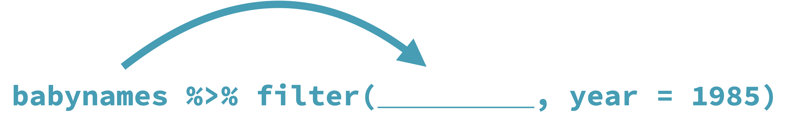
```

Each `dplyr` function takes a data frame as its first argument and returns a data frame. As a result, you can directly pipe the output of one function into the next.
]

---
name: tidy-data
class: center middle

# tidy data

---
class: center middle

<blockquote>
.huge[Data are not just numbers, they are numbers with a context.]
.right[ <cite> &#8211; [George Cobb and David Moore (1997)](https://doi.org/10.2307/2975286) </cite>]
</blockquote>

---
class: pop-quiz

# Consider

What are the variables in this data set?

```{r print-table1, echo = FALSE, out.width = "80%"}
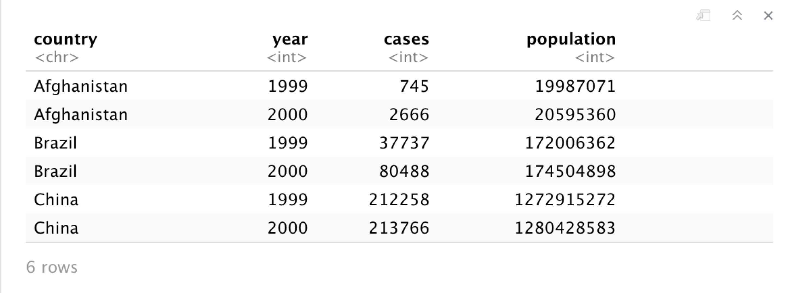
```

---
class: pop-quiz

# Consider

What are the variables in this data set?

```{r print-table1-vars, echo = FALSE, out.width = "80%"}
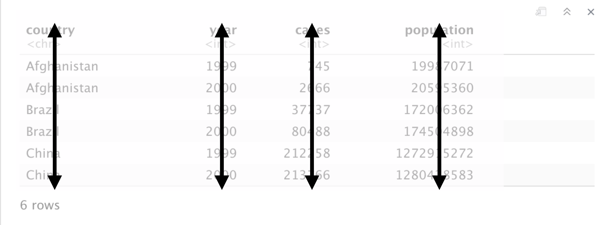
```

---
class: pop-quiz

# Consider

What are the variables in this data set?

```{r print-table1-untidy, echo = FALSE, out.width = "80%"}
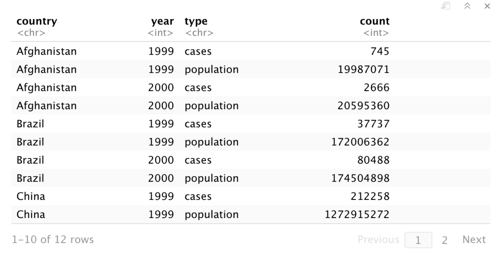
```

---
class: pop-quiz

# Consider

What are the variables in this data set?

```{r print-table1-untidy-vars, echo = FALSE, out.width = "80%"}
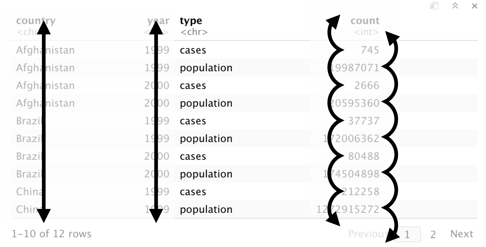
```

---
# This isn't tidy

What are the variables in this data set?

```{r print-table1-pop, echo = FALSE, out.width = "80%"}
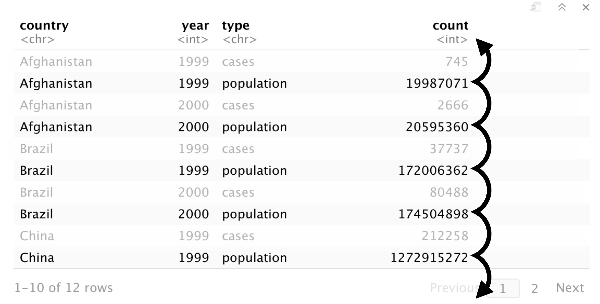
```

---
class: center middle

<blockquote>
.huge[Data comes in many format, but R prefers just one: tidy data.]
.right[ <cite> &#8211; Garrett Grolemund </cite>]
</blockquote>

---
# Tidy data

.pull-left[
```{r print-tidy-data, echo = FALSE, out.width = "100%"}
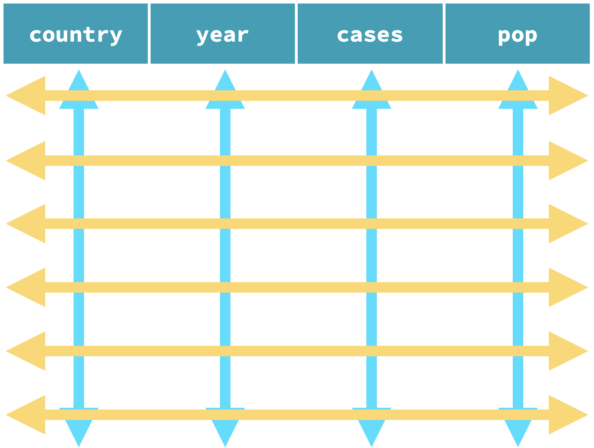
```
]

.pull-right[
A data set is **tidy** if:

1. Each .blue[**variable**] is in its own .blue[**column**].

2. Each .dark-yellow[**case**] is in its own .dark-yellow[**row**].

3. Each .pink[**value**] is in its own .pink[**cell**].
]

---
class: your-turn

# Your turn `r (yt_counter <- yt_counter + 1)`

.big[
Is **`bp_systolic`** tidy? What are the variables?
]

```{r yt-bp-sys-cd, echo = FALSE}
countdown(minutes = 1)
```

---
class: your-turn

.panelset[
.panel[.panel-name[`bp_systolic`]
```{r yt-bp-sys-sol}
bp_systolic
```
]

.panel[.panel-name[`bp_systolic2`]
```{r yt-bp-sys-sol2}
bp_systolic2
```
]
]

???
Three variables: subject, blood pressure, time point

---
class: your-turn

# Your turn `r (yt_counter <- yt_counter + 1)`

.big[
Using **`bp_systolic2`** with `group_by()` and `summarize()`:

1. Find the average systolic blood pressure for each subject.

2. Find the last time each subject was measured.
]

```{r yt-bp-sys2-cd, echo = FALSE}
countdown(minutes = 3)
```

---
class: your-turn

```{r yt-bp-sys2-sol}
bp_systolic2 %>%
  group_by(subject_id) %>%
  summarize(avg_sys = mean(systolic),
            last_measurement = max(time))
```

---
class: center middle

<blockquote>
.huge[Tidy datasets are all alike, but every messy dataset is messy in its own way.]
.right[ <cite> &#8211; [Hadley Wickham (2014)](https://doi.org/10.18637/jss.v059.i10) </cite>]
</blockquote>

---
<div class="hex-book">
  <a href="https://tidyr.tidyverse.org">
    
  </a>
  <a href="https://r4ds.had.co.nz/tidy-data.html">
    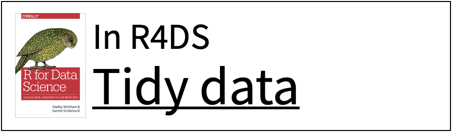
  </a>
</div>

---
# `tidyr` verbs

.left-column[
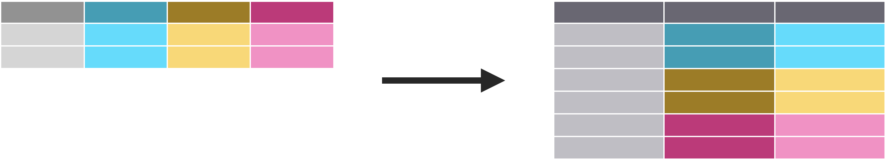
]

.right-column.center[
Move column names into values with **`pivot_longer()`**
]

---
# `tidyr` verbs

.left-column[

</br>
</br>
</br>
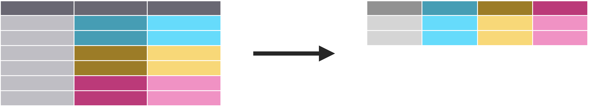
]

.right-column.center[
Move column names into values with **`pivot_longer()`**
</br>
</br>
</br>
</br>
Move values into column names with **`pivot_wider()`**
]

---
# `tidyr` verbs

.left-column[

</br>
</br>
</br>

</br>
</br>
</br>

]

.right-column.center[
Move column names into values with **`pivot_longer()`**
</br>
</br>
</br>
</br>
Move values into column names with **`pivot_wider()`**
</br>
</br>
</br>
</br>
</br>
Split a column with **`separate()`**
]

---
# `tidyr` verbs

.left-column[

</br>
</br>
</br>

</br>
</br>
</br>

</br>
</br>
</br>

]

.right-column.center[
Move column names into values with **`pivot_longer()`**
</br>
</br>
</br>
</br>
Move values into column names with **`pivot_wider()`**
</br>
</br>
</br>
</br>
</br>
Split a column with **`separate()`**
</br>
</br>
</br>
</br>
Unite columns with **`unite()`**
]

---
name: pivot-longer
class: center middle

# `pivot_longer()`

---
# Toy data for practice

```{r}
cases
```

---
class: pop-quiz

# Consider

.big[
Discuss in the chat: What are the variables in the **`cases`** data set?
]

```{r pq-cases-print, echo = FALSE, out.width = "60%"}
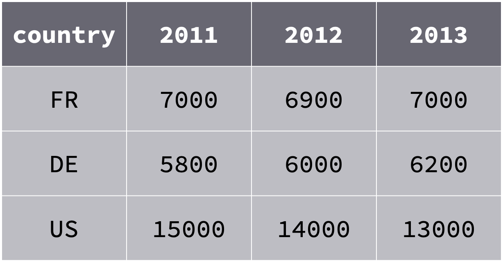
```

```{r pq-cases-cd, echo = FALSE}
countdown(minutes = 1)
```

---
class: pop-quiz

# Consider

.big[
What are the variables in the **`cases`** data set?
]

```{r pq-cases1, echo = FALSE, out.width = "60%"}
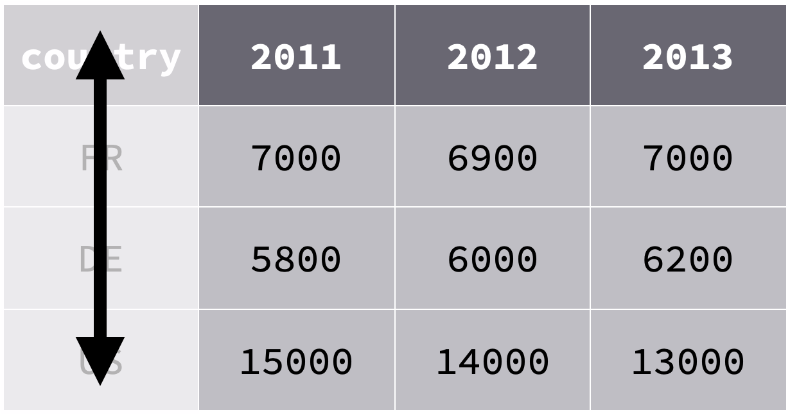
```

???

Variable 1: Country

---
class: pop-quiz

# Consider

.big[
What are the variables in the **`cases`** data set?
]

```{r pq-cases2, echo = FALSE, out.width = "60%"}
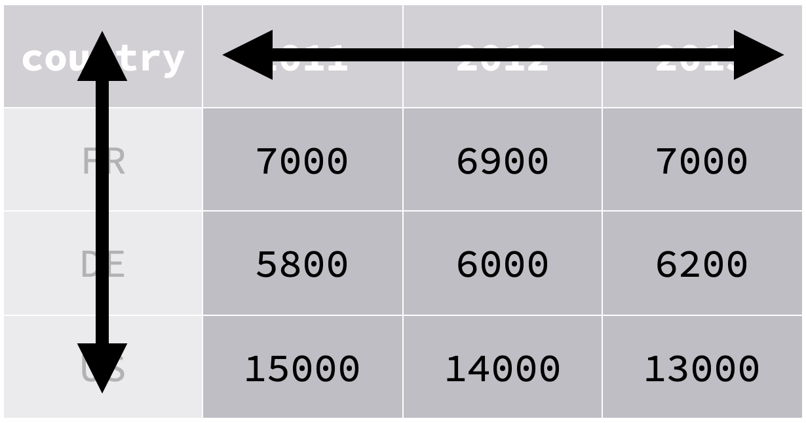
```

???

Variable 2: Year

---
class: pop-quiz

# Consider

.big[
What are the variables in the **`cases`** data set?
]

```{r pq-cases3, echo = FALSE, out.width = "60%"}
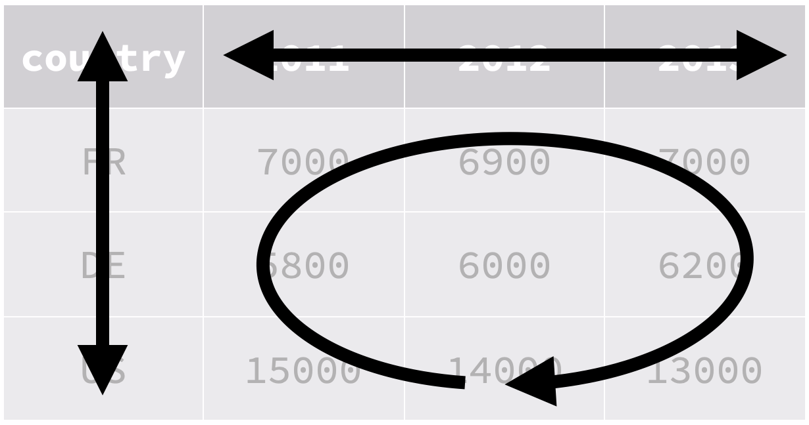
```

???

Variable 3: cases

---
class: your-turn

# Your turn `r (yt_counter <- yt_counter + 1)`

.big[
On a sheet of paper, draw how the **`cases`** data set would look if it had the same values grouped into three columns: **`country`**, **`year`**, and **`n`**.
]

```{r pq-cases-print, echo = FALSE, out.width = "60%"}
```

```{r yt-pivot-cases-cd, echo = FALSE}
countdown(minutes = 5)
```

---
background-image: url(images/tidy/pivot-longer/pl00.png)
background-position: center middle
background-size: 85%

---
background-image: url(images/tidy/pivot-longer/pl01.png)
background-position: center middle
background-size: 85%

---
background-image: url(images/tidy/pivot-longer/pl02.png)
background-position: center middle
background-size: 85%

---
background-image: url(images/tidy/pivot-longer/pl03.png)
background-position: center middle
background-size: 85%

---
background-image: url(images/tidy/pivot-longer/pl04.png)
background-position: center middle
background-size: 85%

---
background-image: url(images/tidy/pivot-longer/pl05.png)
background-position: center middle
background-size: 85%

---
background-image: url(images/tidy/pivot-longer/pl06.png)
background-position: center middle
background-size: 85%

---
background-image: url(images/tidy/pivot-longer/pl07.png)
background-position: center middle
background-size: 85%

---
background-image: url(images/tidy/pivot-longer/pl08.png)
background-position: center middle
background-size: 85%

---
background-image: url(images/tidy/pivot-longer/pl09.png)
background-position: center middle
background-size: 85%

---
background-image: url(images/tidy/pivot-longer/pl10.png)
background-position: center middle
background-size: 85%

---
background-image: url(images/tidy/pivot-longer/pl11.png)
background-position: center middle
background-size: 85%

---
background-image: url(images/tidy/pivot-longer/pl12.png)
background-position: center middle
background-size: 85%

---
background-image: url(images/tidy/pivot-longer/pl13.png)
background-position: center middle
background-size: 85%

---
background-image: url(images/tidy/pivot-longer/pl14.png)
background-position: center middle
background-size: 85%

???

The `names_to` argument specifies the new variable name for what was formerly the column headings.

---
background-image: url(images/tidy/pivot-longer/pl15.png)
background-position: center middle
background-size: 85%

???

The `values_to` argument specific the new variable name for what were formerly the spread out values.

---
# `pivot_longer()`

```{r pl-example, eval = FALSE, include = FALSE}
cases %>%
  pivot_longer(cols = -country,
               names_to = "year",
               values_to = "n")
```

```{r pl-example-flair, echo = FALSE}
decorate("pl-example", eval = FALSE)
```

---
# `pivot_longer()`

```{r pl-example-flair-cases, echo = FALSE}
decorate("pl-example", eval = FALSE) %>%
  flair("cases", background = yellow, color = blue)
```

???

The data to reshape

---
# `pivot_longer()`

```{r pl-example-flair-cols, echo = FALSE}
decorate("pl-example", eval = FALSE) %>%
  flair("cols = -country", background = yellow, color = blue)
```

???

`cols` specifies which columns need to be pivoted

---
# `pivot_longer()`

```{r pl-example-flair-names, echo = FALSE}
decorate("pl-example", eval = FALSE) %>%
  flair('names_to = "year"', background = yellow, color = blue)
```

???

Name of the column the column names will go to.

---
# `pivot_longer()`

```{r pl-example-flair-values, echo = FALSE}
decorate("pl-example", eval = FALSE) %>%
  flair('values_to = "n"', background = yellow, color = blue)
```

???

Name of the column the values will go to.

---
class: your-turn

# Your turn `r (yt_counter <- yt_counter + 1)`

.big[
Use **`pivot_longer()`** to reorganize **`table4a`** into three columns: `country`, `year`, and `cases`.
]

```{r yt-table4a}
table4a
```

```{r yt-table4a-cd, echo = FALSE}
countdown(minutes = 4)
```

---
class: your-turn

.panelset[
.panel[.panel-name[Solution]
```{r yt-table4a-sol}
table4a %>%
  pivot_longer(cols = -country, names_to = "year", values_to = "n")
```
]

.panel[.panel-name[Better]
```{r}
table4a %>%
  pivot_longer(cols = -country, names_to = "year", values_to = "n",
               names_transform = list(year = as.integer))
```
]
]

---
name: pivot-wider
class: center middle

# `pivot_wider()`

---
# Toy data for practice

```{r}
pollution
```

---
class: pop-quiz

# Consider

.big[
Discuss in the chat: What are the variables in the **`pollution`** data set?
]

```{r pq-pollution, echo = FALSE, out.width = "40%"}
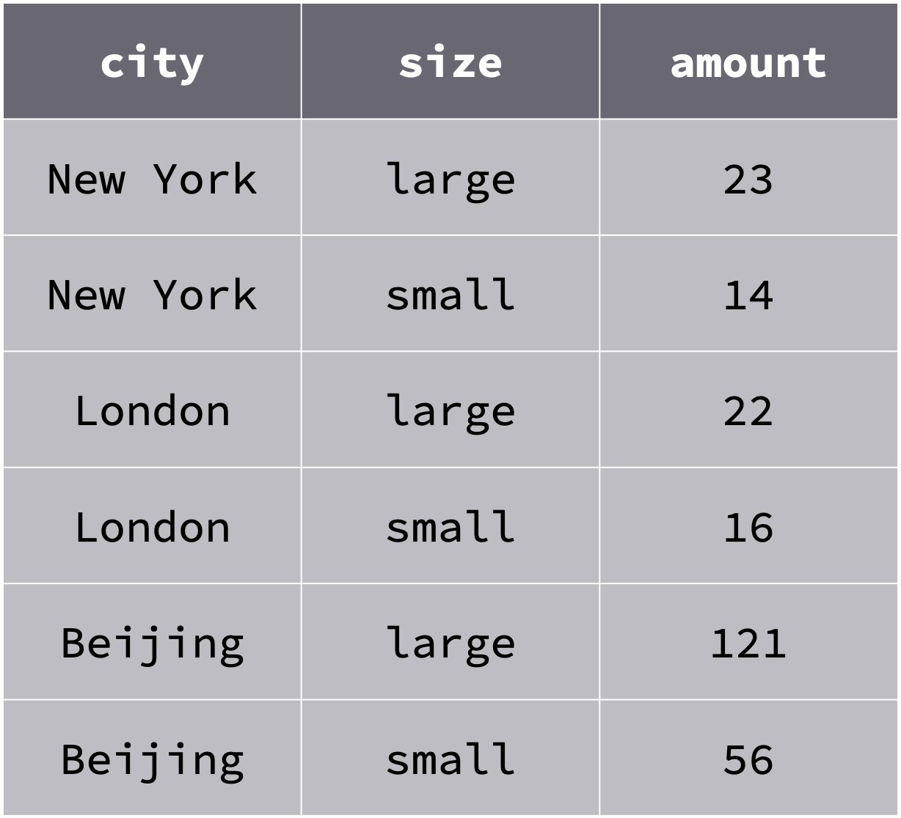
```

```{r pq-pollution-cd, echo = FALSE}
countdown(minutes = 1)
```

---
class: pop-quiz

# Consider

.big[
What are the variables in the **`pollution`** data set?
]

```{r pq-pollution1, echo = FALSE, out.width = "40%"}
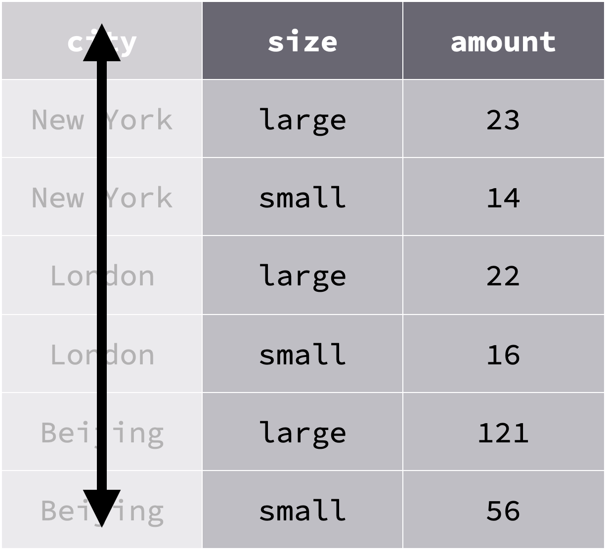
```

???

Variable 1: City

---
class: pop-quiz

# Consider

.big[
What are the variables in the **`pollution`** data set?
]

```{r pq-pollution2, echo = FALSE, out.width = "40%"}
include_graphics("images/tidy/pivot-wider/pollution2.png")
```

???

Variable 2: amount of large particulate

---
class: pop-quiz

# Consider

.big[
What are the variables in the **`pollution`** data set?
]

```{r pq-pollution3, echo = FALSE, out.width = "40%"}
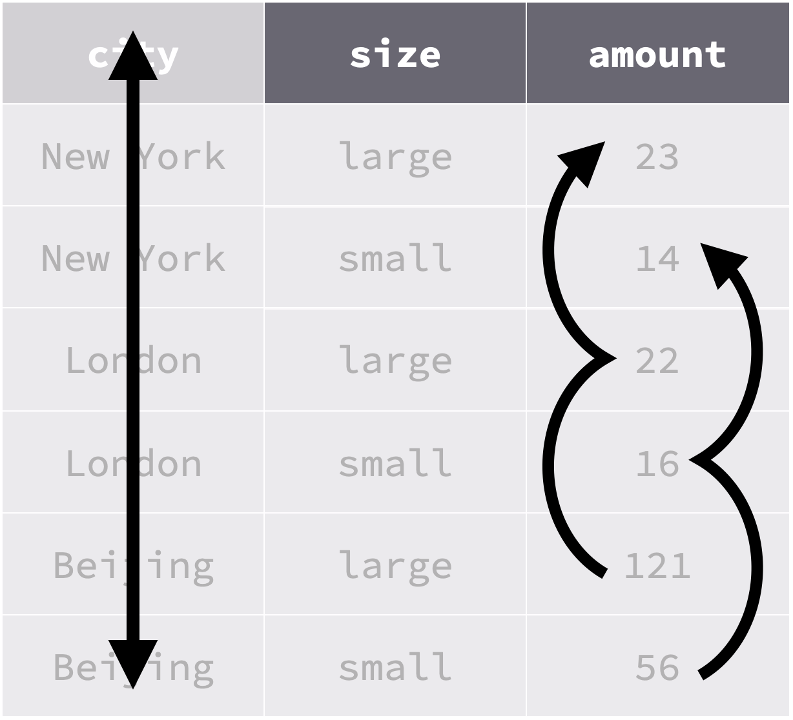
```

???

Variable 3: amount of small particulate

---
class: your-turn

# Your turn `r (yt_counter <- yt_counter + 1)`

.big[
On a sheet of paper, draw how the **`pollution`** data set would look if it had the same values grouped into three columns: **`city`**, **`large`**, and **`small`**.
]

```{r pq-pollution, echo = FALSE, out.width = "35%"}
```

```{r yt-pivot-pollution-cd, echo = FALSE}
countdown(minutes = 5)
```

---
background-image: url(images/tidy/pivot-wider/pw00.png)
background-position: center middle
background-size: 85%

---
background-image: url(images/tidy/pivot-wider/pw01.png)
background-position: center middle
background-size: 85%

---
background-image: url(images/tidy/pivot-wider/pw02.png)
background-position: center middle
background-size: 85%

---
background-image: url(images/tidy/pivot-wider/pw03.png)
background-position: center middle
background-size: 85%

---
background-image: url(images/tidy/pivot-wider/pw04.png)
background-position: center middle
background-size: 85%

---
background-image: url(images/tidy/pivot-wider/pw05.png)
background-position: center middle
background-size: 85%

---
background-image: url(images/tidy/pivot-wider/pw06.png)
background-position: center middle
background-size: 85%

---
background-image: url(images/tidy/pivot-wider/pw07.png)
background-position: center middle
background-size: 85%

---
background-image: url(images/tidy/pivot-wider/pw08.png)
background-position: center middle
background-size: 85%

---
background-image: url(images/tidy/pivot-wider/pw09.png)
background-position: center middle
background-size: 85%

---
background-image: url(images/tidy/pivot-wider/pw10.png)
background-position: center middle
background-size: 85%

---
background-image: url(images/tidy/pivot-wider/pw11.png)
background-position: center middle
background-size: 85%

???

The `names_from` argument specifies the variable the new column names will come from.


---
background-image: url(images/tidy/pivot-wider/pw12.png)
background-position: center middle
background-size: 85%

???

The `values_from` argument specific the variable the new values will come from.

---
# `pivot_wider()`

```{r pw-example, eval = FALSE, include = FALSE}
pollution %>%
  pivot_wider(names_from = "size",
              values_from = "amount")
```

```{r pw-example-flair, echo = FALSE}
decorate("pw-example", eval = FALSE)
```

---
# `pivot_wider()`

```{r pw-example-flair-pollution, echo = FALSE}
decorate("pw-example", eval = FALSE) %>%
  flair("pollution", background = yellow, color = blue)
```

???

The data to reshape

---
# `pivot_wider()`

```{r pw-example-flair-names, echo = FALSE}
decorate("pw-example", eval = FALSE) %>%
  flair('names_from = "size"', background = yellow, color = blue)
```

???

Name of the column that will become column names.

---
# `pivot_wider()`

```{r pw-example-flair-values, echo = FALSE}
decorate("pw-example", eval = FALSE) %>%
  flair('values_from = "amount"', background = yellow, color = blue)
```

???

Name of the column that will make up the values of the new columns.

---
class: your-turn

# Your turn `r (yt_counter <- yt_counter + 1)`

.big[
Use **`pivot_wider()`** to reorganize **`table2`** into four columns: `country`, `year`, `cases`, and `population`.
]

.smallish[
```{r yt-table2}
table2
```
]

```{r yt-table2-cd, echo = FALSE}
countdown(minutes = 4)
```

---
class: your-turn

```{r yt-table2-sol}
table2 %>%
  pivot_wider(names_from = "type", values_from = "count")
```

---
name: sep-unite
class: center middle

# `separate()` and `unite()`

---
# Toy data for practice

```{r print-scores}
scores
```

---
class: pop-quiz

# Consider

.big[
Discuss in the chat: What the variables in the `scores` data set?
]

```{r pq-scores-print, echo = FALSE, out.width = "55%"}
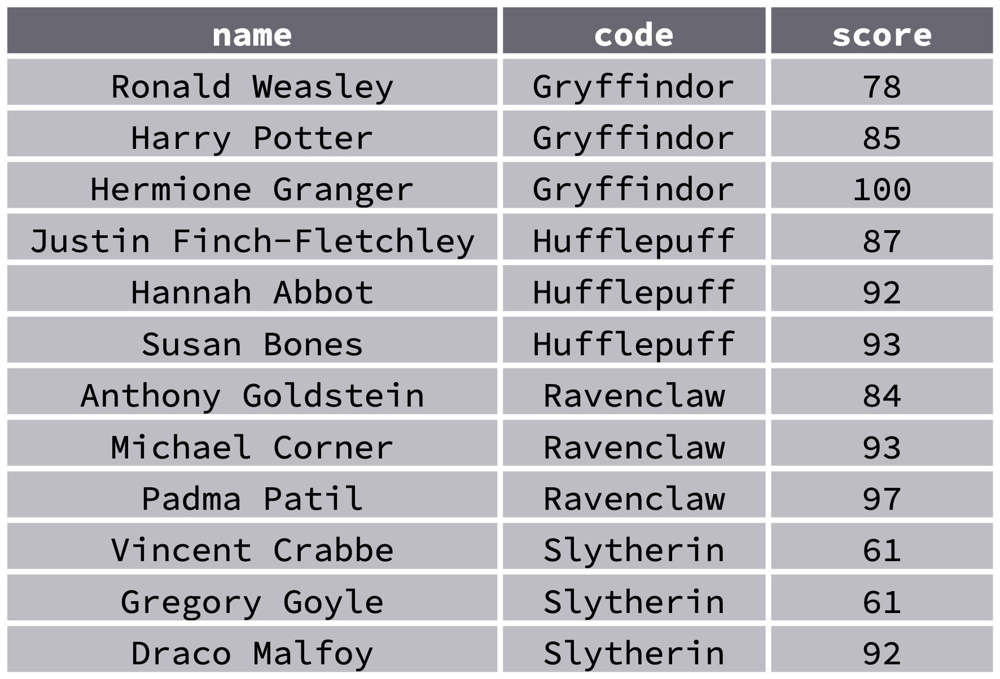
```

```{r pq-scores-cd, echo = FALSE}
countdown(minutes = 1)
```

---
class: pop-quiz

# Consider

.big[
One variable or two? What is "tidy" will depend on your purpose.
]

```{r pq-scores-print2, echo = FALSE, out.width = "55%"}
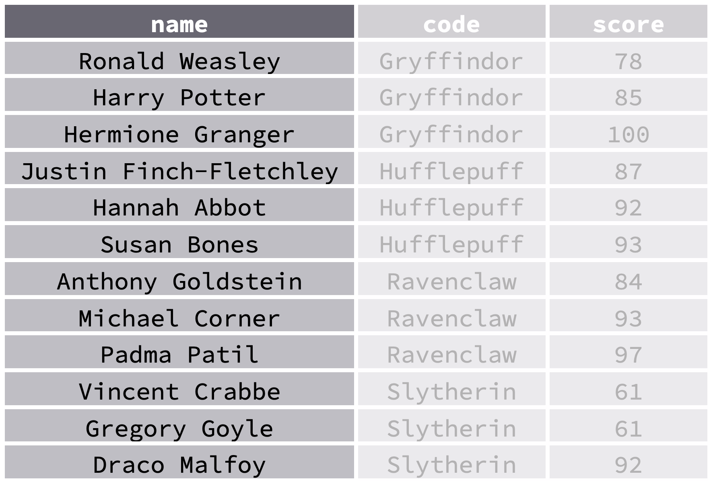
```

---
# `separate()`

```{r sep-example, echo = FALSE, eval = FALSE}
separate(data, col, into, sep = "[^[:alnum:]]+", ...)
```

```{r sep-example-flair, echo = FALSE}
decorate("sep-example", eval = FALSE)
```

---
# `separate()`

```{r sep-example-flair-data, echo = FALSE}
decorate("sep-example", eval = FALSE) %>%
  flair("data", background = yellow, color = blue)
```

???

Data frame to tidy

---
# `separate()`

```{r sep-example-flair-col, echo = FALSE}
decorate("sep-example", eval = FALSE) %>%
  flair("col", background = yellow, color = blue)
```

???

Column to separate

---
# `separate()`

```{r sep-example-flair-into, echo = FALSE}
decorate("sep-example", eval = FALSE) %>%
  flair("into", background = yellow, color = blue)
```

???

New columns to be created

---
# `separate()`

```{r sep-example-flair-sep, echo = FALSE}
decorate("sep-example", eval = FALSE) %>%
  flair('sep = "[^[:alnum:]]+"', background = yellow, color = blue)
```

???

What divides the pieces of information

---
```{r scores-sep}
scores %>%
  separate(col = name, into = c("first", "last"))
```

---
```{r scores-sep-flair, echo = FALSE}
decorate("scores-sep") %>%
  flair("#> Warning: Expected 2 pieces. Additional pieces discarded in 1 rows [4].",
        color = "red")
```

---
```{r scores-sep-flair2, echo = FALSE}
decorate("scores-sep") %>%
  flair("#> Warning: Expected 2 pieces. Additional pieces discarded in 1 rows [4].",
        color = "red") %>%
  flair("Finch", background = yellow, color = blue)
```

---
```{r define-sep, include = FALSE}
scores %>%
  separate(col = name, into = c("first", "last"), sep = " ")
```

```{r define-sep-flair, echo = FALSE}
decorate("define-sep") %>%
  flair('sep = " "', background = yellow, color = blue)
```

---
```{r define-sep-flair2, echo = FALSE}
decorate("define-sep") %>%
  flair('sep = " "', background = yellow, color = blue) %>%
  flair("Finch-Fletchley", background = yellow, color = blue)
```

---
# `separate()`

```{r sep-extra, echo = FALSE, eval = FALSE}
separate(data, col, into, sep = "[^[:alnum:]]+", ...,
         extra = "warn", fill = "warn")
```

```{r sep-extra-flair-extra, echo = FALSE}
decorate("sep-extra", eval = FALSE) %>%
  flair('extra = "warn"', background = yellow, color = blue)
```

--

- **`warn`**: emit warning, drop extra values

- **`drop`**: drop extra values without warning

- **`merge`**: merge extra values into final column of `into`

---
# `separate()`

```{r sep-extra-flair-fill, echo = FALSE}
decorate("sep-extra", eval = FALSE) %>%
  flair('fill = "warn"', background = yellow, color = blue)
```

--

- **`warn`**: emit warning, fill with `NA` from right

- **`right`**: fill with `NA` from right without warning

- **`left`**: fill with `NA` from left without warning

---
# `unite()`

.big[
Merges columns together; opposite of **`separate()`**
]

```{r unite-example, include = FALSE, eval = FALSE}
unite(data, col, ..., sep = "_")
```

```{r unite-flair, echo = FALSE}
decorate("unite-example", eval = FALSE)
```

---
# `unite()`

.big[
Merges columns together; opposite of **`separate()`**
]

```{r unite-flair-data, echo = FALSE}
decorate("unite-example", eval = FALSE) %>%
  flair("data", background = yellow, color = blue)
```

???

Data frame to tidy

---
# `unite()`

.big[
Merges columns together; opposite of **`separate()`**
]

```{r unite-flair-col, echo = FALSE}
decorate("unite-example", eval = FALSE) %>%
  flair("col", background = yellow, color = blue)
```

???

Name of new column to be created

---
# `unite()`

.big[
Merges columns together; opposite of **`separate()`**
]

```{r unite-flair-dots, echo = FALSE}
decorate("unite-example", eval = FALSE) %>%
  flair("...", background = yellow, color = blue)
```

???

Columns to be merged

---
# `unite()`

.big[
Merges columns together; opposite of **`separate()`**
]

```{r unite-flair-sep, echo = FALSE}
decorate("unite-example", eval = FALSE) %>%
  flair('sep = "_"', background = yellow, color = blue)
```

???

What divides the pieces of information

---
.panelset[
.panel[.panel-name[Separate Names]
```{r sep-names}
sep_scores <- scores %>%
  separate(name, into = c("first", "last"), sep = " ")
sep_scores
```
]

.panel[.panel-name[Unite Names]
```{r unite-names}
sep_scores %>%
  unite("full_name", first, last)
```
]

.panel[.panel-name[Better Unite]
```{r better-unite}
sep_scores %>%
  unite("full_name", first, last, sep = " ")
```
]
]

---
# Recap: tidyr verbs

.left-column[

</br>
</br>
</br>

</br>
</br>
</br>

</br>
</br>
</br>

]

.right-column.center[
Move column names into values with **`pivot_longer()`**
</br>
</br>
</br>
</br>
Move values into column names with **`pivot_wider()`**
</br>
</br>
</br>
</br>
</br>
Split a column with **`separate()`**
</br>
</br>
</br>
</br>
Unite columns with **`unite()`**
]

---
class: title-slide, center

# `r rmarkdown::metadata$title`

```{r closing-hex, echo = FALSE, out.width = "20%"}
include_graphics("images/hex/tidyr.png")
```

## `r rmarkdown::metadata$subtitle`

### `r rmarkdown::metadata$author`

#### [`r params$class_link`](`r params$class_link`) &#183; [`r params$site_link`](`r params$site_link`)

.footer-license[*Tidy Data Science with the Tidyverse and Tidymodels* is licensed under a [Creative Commons Attribution 4.0 International License](https://creativecommons.org/licenses/by/4.0/).]
