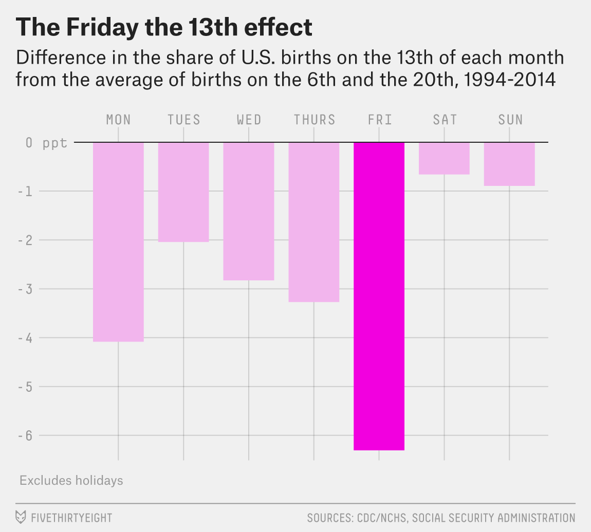
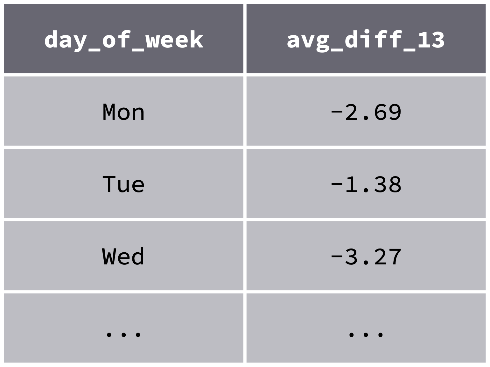
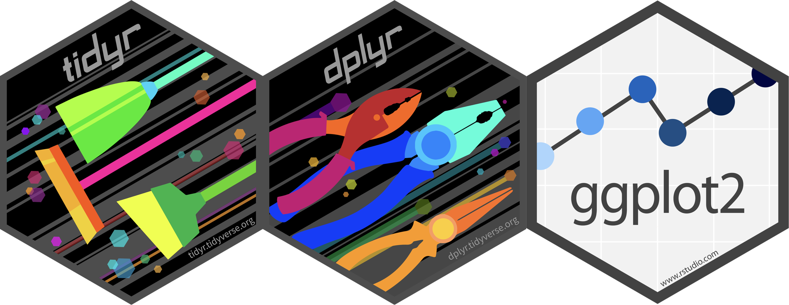

```{r setup, include=FALSE}
options(htmltools.dir.version = FALSE)
knitr::opts_chunk$set(collapse = TRUE,
                      fig.retina = 3,
                      fig.path = "images/case-study-1/plots/",
                      fig.align = "center",
                      fig.asp = 0.618,
                      comment = "#>")

xaringanExtra::use_share_again()
xaringanExtra::use_panelset()
xaringanExtra::use_extra_styles(hover_code_line = TRUE,
                                mute_unhighlighted_code = TRUE)
xaringanExtra::use_scribble(pen_color = "#009FB7")

yt_counter <- 0
library(countdown)
library(tidyverse)
library(flair)
library(here)
library(knitr)

library(xaringancolor)
yellow <- "#FED766"
blue <- "#009FB7"
```

class: title-slide, center

<span class="fa-stack fa-4x">
  <i class="fa fa-circle fa-stack-2x" style="color: #ffffff;"></i>
  <strong class="fa-stack-1x" style="color:#009FB7;">`r rmarkdown::metadata$session`</strong>
</span> 

# `r rmarkdown::metadata$title`

## `r rmarkdown::metadata$subtitle`

### `r rmarkdown::metadata$author`

#### [`r params$class_link`](`r params$class_link`) &#183; [`r params$site_link`](`r params$site_link`)

.footer-license[*Tidy Data Science with the Tidyverse and Tidymodels* is licensed under a [Creative Commons Attribution 4.0 International License](https://creativecommons.org/licenses/by/4.0/).]

<div style = "position:fixed; visibility: hidden">
$$\require{color}\definecolor{yellow}{rgb}{0.996078431372549, 0.843137254901961, 0.4}$$
$$\require{color}\definecolor{blue}{rgb}{0, 0.623529411764706, 0.717647058823529}$$
</div>

<script type="text/x-mathjax-config">
MathJax.Hub.Config({
  TeX: {
    Macros: {
      yellow: ["{\\color{yellow}{#1}}", 1],
      blue: ["{\\color{blue}{#1}}", 1]
    },
    loader: {load: ['[tex]/color']},
    tex: {packages: {'[+]': ['color']}}
  }
});
</script>

<style>
.yellow {color: #FED766;}
.blue {color: #009FB7;}
</style>

---
background-image: url(images/case-study-1/tidyr-dplyr-ggplot2.png)
background-position: center middle
background-size: 85%

---
class: your-turn

# Your turn 0

.big[
* Open the R Notebook **materials/exercises/07-case-study-1.Rmd**
* Run the setup chunk
]

```{r yt-setwd-cd, echo = FALSE}
countdown(minutes = 1, seconds = 0,
          font_size = "2em",
          color_border = yellow,
          color_background = blue,
          color_text = yellow,
          color_running_background = "#F0F0F0",
          color_running_text = blue,
          color_finished_background = yellow,
          color_finished_text = blue)
```

---
# `fivethirtyeight`

.big[
An R package containing data sets behind the stories published by [FiveThirtyEight](https://fivethirtyeight.com/)
]

```{r load-538}
library(fivethirtyeight)
```

---
class: middle

.pull-left[
```{r print-real, echo = FALSE, out.width = "100%"}

```
]

.pull-right[
### Some People Are Too Superstitious To Have A Baby On Friday The 13th

[Story link](https://fivethirtyeight.com/features/some-people-are-too-superstitious-to-have-a-baby-on-friday-the-13th/)

.huger[Can we replicate this plot?]
]

---
class: your-turn

# Your turn `r (yt_counter <- yt_counter + 1)`

.pull-left[
.big[
- Take a look at **`US_births_1994_2003`**

- Discuss in the chat: Brainstorm the steps needed to get the data into a form ready to make the plot.
]
]

.pull-right[
```{r print-real, echo = FALSE, out.width = "90%"}
```
]

```{r yt-brainstorm-cd, echo = FALSE}
countdown(minutes = 5)
```

---
.panelset[
```{r year-line, panelset = c(source = "Code", output = "Plot"), out.width = "80%"}
US_births_1994_2003 %>%
  filter(year == 1994) %>%
  ggplot(mapping = aes(x = date, y = births)) +
  geom_line()
```
]

---
.pull-left[
```{r print-real, echo = FALSE, out.width = "100%"}
```
]

--

.pull-right[
Data required to make the plot

```{r answer-preview, echo = FALSE, out.width = "100%"}

```
]

.right-float[\* using slightly different data]

???

x-axis: day of week
y-axis: some calculated value

---
background-image: url(images/case-study-1/steps1.png)
background-position: center middle
background-size: 95%

---
background-image: url(images/case-study-1/steps2.png)
background-position: center middle
background-size: 95%

---
background-image: url(images/case-study-1/steps3.png)
background-position: center middle
background-size: 95%

---
# One potential process

* Get just the data for the 6th, 13th, and 20th

* Calculate the variable of interest
    * For each month/year:
        * Find average births on the 6th and 20th
        * Find *percentage difference* between births on the 13th and the average births on the 6th and 20th
    * Average *percentage difference* by day of the week

* Create plot

---
class: your-turn

# Your turn `r (yt_counter <- yt_counter + 1)`

.big[
* Remove the **`date`** field.
    ** It is redundant and will get in the way later.

* Extract data for just the 6th, 13th, and 20th of each month.
]

```{r filter-date-cd, echo = FALSE}
countdown(minutes = 3)
```

---
class: your-turn

```{r}
US_births_1994_2003 %>%
  select(-date) %>%
  filter(date_of_month %in% c(6, 13, 20))
```

---
.big[
Two options for arranging the data. Which is tidy?
]

**Option 1**: days in rows

```{r long-option, echo = FALSE}
US_births_1994_2003 %>%
  select(-date) %>%
  filter(date_of_month %in% c(6, 13, 20)) %>%
  filter(year == 1994, month == 1)
```

**Option 2**: days in columns

```{r wide-option, echo = FALSE}
US_births_1994_2003 %>%
  select(-date) %>%
  filter(date_of_month %in% c(6, 13, 20)) %>%
  pivot_wider(names_from = date_of_month, values_from = births) %>%
  filter(year == 1994, month == 1)
```

---
class: your-turn

# Your turn `r (yt_counter <- yt_counter + 1)`

.big[
Which arrangement is tidy?
]

**Hint**: Think about our next step, *"Find the percentage difference between the 13th and the average of the 6th and 20th."* In which layout will this be easier using our tidy tools?

```{r yt-tidy-choice-cd, echo = FALSE}
countdown(minutes = 2)
```

---
class: your-turn

.panelset[
.panel[.panel-name[Option 1]
```{r long-option, echo = FALSE}
```

Next step, we'd have to write a custom function to summarize these three rows, relying on order, or subsetting to reference dates. **NOT TIDY.**
]

.panel[.panel-name[Option 2]
```{r wide-option, echo = FALSE}
```

Next step, we can mutate directly referring to columns for days. **TIDY!**
]
]

---
class: your-turn

# Your turn `r (yt_counter <- yt_counter + 1)`

.big[
Tidy the filtered data to have the days in columns.
]

```{r wide-option, echo = FALSE}
```

```{r yt-pivot-cd, echo = FALSE}
countdown(minutes = 3)
```

---
class: your-turn

```{r}
US_births_1994_2003 %>%
  select(-date) %>%
  filter(date_of_month %in% c(6, 13, 20)) %>%
  pivot_wider(names_from = date_of_month, values_from = births)
```

---
class: your-turn

# Your turn `r (yt_counter <- yt_counter + 1)`

.big[
Now use **`mutate()`** to add columns for:

- The average of the births on the 6th and 20th.

- The percentage difference between the number of births on the 13th and the average of the 6th and 20th.


**Hint:** You need to use backticks,`` ` ``, around the days, e.g.,`` `6` ``,`` `13` ``, and`` `20` `` to specify the column names.
]

```{r yt-mutate-cd, echo = FALSE}
countdown(minutes = 5)
```

---
class: your-turn

.panelset[
.panel[.panel-name[Solution]
```{r yt-mutate-sol}
births_diff_13 <- US_births_1994_2003 %>%
  select(-date) %>%
  filter(date_of_month %in% c(6, 13, 20)) %>%
  pivot_wider(names_from = date_of_month, values_from = births) %>%
  mutate(avg_6_20 = (`6` + `20`) / 2,
         diff_13 = ((`13` - avg_6_20) / avg_6_20) * 100)

```
]

.panel[.panel-name[Output]
```{r yt-mutate-sol-results}
births_diff_13
```
]
]

---
class: center

Let's take a look at the distribution of average difference by day of the week.

```{r births-dist, echo = FALSE, out.width = "80%"}
births_diff_13 %>%
  ggplot(mapping = aes(x = day_of_week, y = diff_13)) +
  geom_point()
```

---
class: center

Let's take a look at the distribution of average difference by day of the week.

```{r births-dist-highlight, message = FALSE, warning = FALSE, echo = FALSE, out.width = "80%"}
library(gghighlight)

births_diff_13 %>%
  ggplot(mapping = aes(x = day_of_week, y = diff_13)) +
  geom_point() +
  gghighlight(diff_13 > 10, label_key = type)
```

---

```{r examine-outlier}
births_diff_13 %>%
  filter(diff_13 > 10)
```

???

Big difference is the 6th. September 6, 1999 = Labor day. Holiday effect?

---
class: your-turn

# Your turn `r (yt_counter <- yt_counter + 1)`

.pull-left[
.big[
Calculate the average **`diff_13`** for each day of the week.

Then recreate a bar graph to mimic the FiveThirtyEight plot.
]
]

.pull-right[
```{r print-real, echo = FALSE, out.width = "90%"}
```
]

```{r yt-sum-diff, echo = FALSE}
countdown(minutes = 5)
```


---
class: your-turn

.panelset[
.panel[.panel-name[Calculation]
```{r yt-sum-diff-sol}
births_13 <- births_diff_13 %>%
  group_by(day_of_week) %>%
  summarize(avg_diff_13 = mean(diff_13))

births_13
```
]

.panel[.panel-name[Plot Code]
```{r yt-sum-diff-plot, fig.show = "hide"}
ggplot(births_13, mapping = aes(x = day_of_week, y = avg_diff_13)) +
  geom_col()
```
]

.panel[.panel-name[Plot]
```{r yt-sum-diff-plot-create, echo = FALSE, out.width = "80%"}
ggplot(births_13, mapping = aes(x = day_of_week, y = avg_diff_13)) +
  geom_col()
```
]
]

---
class: center middle

# styling

---
.pull-left[
```{r yt-sum-diff-plot, echo = FALSE, out.width = "100%", fig.asp = 1}
```
]

.pull-right[
```{r print-real, echo = FALSE, out.width = "100%"}
```
]

???

First - reorder x-axis, add variable for color.

---
.panelset[
```{r new-vars, panelset = c(source = "Code", output = "Plot"), out.width = "80%"}
births_13 %>%
  mutate(day_of_week = fct_relevel(day_of_week, "Mon", "Tues", "Wed", "Thurs",
                                   "Fri", "Sat", "Sun"),
         friday = day_of_week == "Fri") %>%
  ggplot(mapping = aes(x = day_of_week, y = avg_diff_13)) +
  geom_col(mapping = aes(fill = friday))
```
]

???

Reorder x-axis, map fill to `friday`.

---
.panelset[
.panel[.panel-name[Code]
```{r new-colors, fig.show = "hide"}
births_13 %>%
  mutate(day_of_week = fct_relevel(day_of_week, "Mon", "Tues", "Wed", "Thurs",
                                   "Fri", "Sat", "Sun"),
         friday = day_of_week == "Fri") %>%
  ggplot(mapping = aes(x = day_of_week, y = avg_diff_13)) +
  geom_col(mapping = aes(fill = friday), show.legend = FALSE) +
  scale_fill_manual(values = c("#F2B5ED", "#F200DF"))
```
]

.panel[.panel-name[Plot]
```{r new-colors-create, echo = FALSE, out.width = "80%"}
births_13 %>%
  mutate(day_of_week = fct_relevel(day_of_week, "Mon", "Tues", "Wed", "Thurs",
                                   "Fri", "Sat", "Sun"),
         friday = day_of_week == "Fri") %>%
  ggplot(mapping = aes(x = day_of_week, y = avg_diff_13)) +
  geom_col(mapping = aes(fill = friday), show.legend = FALSE) +
  scale_fill_manual(values = c("#F2B5ED", "#F200DF"))
```
]
]

???

Remove legend, specify colors.

---
.pull-left[
```{r new-colors, echo = FALSE, out.width = "100%", fig.asp = 1}
```
]

.pull-right[
```{r print-real, echo = FALSE, out.width = "100%"}
```
]

---
.panelset[
```{r new-axes, panelset = c(source = "Code", output = "Plot"), out.width = "80%"}
births_13 %>%
  mutate(day_of_week = fct_relevel(day_of_week, "Mon", "Tues", "Wed", "Thurs",
                                   "Fri", "Sat", "Sun"),
         friday = day_of_week == "Fri") %>%
  ggplot(mapping = aes(x = day_of_week, y = avg_diff_13)) +
  geom_col(mapping = aes(fill = friday), show.legend = FALSE) +
  scale_fill_manual(values = c("#F2B5ED", "#F200DF")) +
  scale_x_discrete(position = "top") +
  scale_y_continuous(breaks = seq(-6, 0, by = 1),
                     labels = c("-6", "-5", "-4", "-3", "-2", "-1", "0 ppt")) +
  labs(x = NULL, y = NULL)
```
]

???

Now, the axes.

---
.panelset[
```{r refine-axes, panelset = c(source = "Code", output = "Plot"), out.width = "80%"}
births_13 %>%
  mutate(day_of_week = fct_relevel(day_of_week, "Mon", "Tues", "Wed", "Thurs",
                                   "Fri", "Sat", "Sun"),
         friday = day_of_week == "Fri") %>%
  ggplot(mapping = aes(x = day_of_week, y = avg_diff_13)) +
  geom_col(mapping = aes(fill = friday), show.legend = FALSE) +
  scale_fill_manual(values = c("#F2B5ED", "#F200DF")) +
  scale_x_discrete(position = "top") +
  scale_y_continuous(breaks = seq(-6, 0, by = 1),
                     labels = c("-6", "-5", "-4", "-3", "-2", "-1", "0 ppt")) +
  labs(x = NULL, y = NULL) +
  theme(axis.ticks = element_blank(),
        axis.text.y = element_text(hjust = 0))
```
]

???

Refine the axes.

---
background-image: url(images/case-study-1/ggplot2-theme-elements.png)
background-position: center middle
background-size: 85%

---
.pull-left[
```{r refine-axes-print, ref.label="refine-axes", echo = FALSE, out.width = "100%", fig.asp = 1}
```
]

.pull-right[
```{r print-real, echo = FALSE, out.width = "100%"}
```
]

---
.panelset[
```{r add-title, panelset = c(source = "Code", output = "Plot"), out.width = "80%"}
births_13 %>%
  mutate(day_of_week = fct_relevel(day_of_week, "Mon", "Tues", "Wed", "Thurs",
                                   "Fri", "Sat", "Sun"),
         friday = day_of_week == "Fri") %>%
  ggplot(mapping = aes(x = day_of_week, y = avg_diff_13)) +
  geom_col(mapping = aes(fill = friday), show.legend = FALSE) +
  scale_fill_manual(values = c("#F2B5ED", "#F200DF")) +
  scale_x_discrete(position = "top") +
  scale_y_continuous(breaks = seq(-6, 0, by = 1),
                     labels = c("-6", "-5", "-4", "-3", "-2", "-1", "0 ppt")) +
  labs(x = NULL, y = NULL,
       title = "The Friday the 13th effect",
       subtitle = "Difference in the share of U.S. births on the 13th of each month\nfrom the average of births on the 6th and the 20th, 1994-2003") +
  theme(axis.ticks = element_blank(),
        axis.text.y = element_text(hjust = 0),
        plot.title = element_text(face = "bold", size = rel(1.5)))
```
]

???

Title and subtitle.

---
.panelset[
```{r refine-colors, panelset = c(source = "Code", output = "Plot"), out.width = "80%"}
births_13 %>%
  mutate(day_of_week = fct_relevel(day_of_week, "Mon", "Tues", "Wed", "Thurs",
                                   "Fri", "Sat", "Sun"),
         friday = day_of_week == "Fri") %>%
  ggplot(mapping = aes(x = day_of_week, y = avg_diff_13)) +
  geom_col(mapping = aes(fill = friday), show.legend = FALSE) +
  scale_fill_manual(values = c("#F2B5ED", "#F200DF")) +
  scale_x_discrete(position = "top") +
  scale_y_continuous(breaks = seq(-6, 0, by = 1),
                     labels = c("-6", "-5", "-4", "-3", "-2", "-1", "0 ppt")) +
  labs(x = NULL, y = NULL, title = "The Friday the 13th effect",
       subtitle = "Difference in the share of U.S. births on the 13th of each month\nfrom the average of births on the 6th and the 20th, 1994-2003") +
  theme(axis.ticks = element_blank(),
        axis.text.y = element_text(hjust = 0),
        plot.title = element_text(face = "bold", size = rel(1.5)),
        panel.grid.minor = element_blank(),
        panel.background = element_rect(fill = "#F0F0F0"),
        plot.background = element_rect(fill = "#F0F0F0"),
        panel.grid.major = element_line(color = "#DBDBDB"))
```
]

???

Color adjustment in the theme.

---
.pull-left[
```{r refine-colors-compare, ref.label="refine-colors", echo = FALSE, out.width = "100%", fig.asp = 1}
```
]

.pull-right[
```{r print-real, echo = FALSE, out.width = "100%"}
```
]

---
class: your-turn

# Extra Challenges

.big[
If you wanted to use the **`US_births_2000_2014`** data instead, what would you need to change in the pipeline? How about using both **`US_births_1994_2003`** and **`US_births_2000_2014`**?

Try not removing the date column. At what point in the pipeline does it cause problems? Why?
]

```{r yt-extra-cd, echo = FALSE}
countdown(minutes = 5)
```

---
class: title-slide, center

# `r rmarkdown::metadata$title`

```{r closing-hex, echo = FALSE, out.width = "40%"}

```

## `r rmarkdown::metadata$subtitle`

### `r rmarkdown::metadata$author`

#### [`r params$class_link`](`r params$class_link`) &#183; [`r params$site_link`](`r params$site_link`)

.footer-license[*Tidy Data Science with the Tidyverse and Tidymodels* is licensed under a [Creative Commons Attribution 4.0 International License](https://creativecommons.org/licenses/by/4.0/).]
