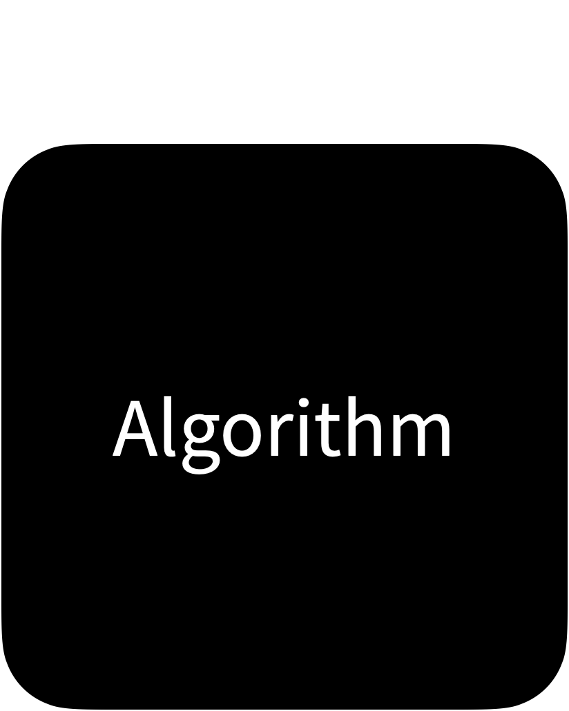

```{r setup, include=FALSE}
options(htmltools.dir.version = FALSE)
knitr::opts_chunk$set(collapse = TRUE,
                      fig.retina = 3,
                      fig.path = "images/prediction/plots/",
                      fig.align = "center",
                      fig.asp = 0.618,
                      comment = "#>")

xaringanExtra::use_share_again()
xaringanExtra::use_panelset()
xaringanExtra::use_extra_styles(hover_code_line = TRUE,
                                mute_unhighlighted_code = TRUE)
xaringanExtra::use_scribble(pen_color = "#009FB7")

yt_counter <- 0
library(countdown)
library(tidyverse)
library(tidymodels)
library(flair)
library(here)
library(knitr)
library(downlit)

library(xaringancolor)
blue <- "#009FB7"
light_blue <- "#0ADEFF"
yellow <- "#FED766"
dark_yellow <- "#A27A01"
pink <- "#CB297B"
light_pink <- "#FF8DC6"
grey <- "#696773"

library(AmesHousing)
ames <- make_ames()
```

class: title-slide, center

<span class="fa-stack fa-4x">
  <i class="fa fa-circle fa-stack-2x" style="color: #ffffff;"></i>
  <strong class="fa-stack-1x" style="color:#009FB7;">`r rmarkdown::metadata$session`</strong>
</span> 

# `r rmarkdown::metadata$title`

## `r rmarkdown::metadata$subtitle`

### `r rmarkdown::metadata$author`

#### [`r params$class_link`](`r params$class_link`) &#183; [`r params$site_link`](`r params$site_link`)

.footer-license[*Tidy Data Science with the Tidyverse and Tidymodels* is licensed under a [Creative Commons Attribution 4.0 International License](https://creativecommons.org/licenses/by/4.0/).]

<div style = "position:fixed; visibility: hidden">
  $$\require{color}\definecolor{blue}{rgb}{0, 0.623529411764706, 0.717647058823529}$$
  $$\require{color}\definecolor{light_blue}{rgb}{0.0392156862745098, 0.870588235294118, 1}$$
  $$\require{color}\definecolor{yellow}{rgb}{0.996078431372549, 0.843137254901961, 0.4}$$
  $$\require{color}\definecolor{dark_yellow}{rgb}{0.635294117647059, 0.47843137254902, 0.00392156862745098}$$
  $$\require{color}\definecolor{pink}{rgb}{0.796078431372549, 0.16078431372549, 0.482352941176471}$$
  $$\require{color}\definecolor{light_pink}{rgb}{1, 0.552941176470588, 0.776470588235294}$$
  $$\require{color}\definecolor{grey}{rgb}{0.411764705882353, 0.403921568627451, 0.450980392156863}$$
</div>
  
<script type="text/x-mathjax-config">
  MathJax.Hub.Config({
    TeX: {
      Macros: {
        blue: ["{\\color{blue}{#1}}", 1],
        light_blue: ["{\\color{light_blue}{#1}}", 1],
        yellow: ["{\\color{yellow}{#1}}", 1],
        dark_yellow: ["{\\color{dark_yellow}{#1}}", 1],
        pink: ["{\\color{pink}{#1}}", 1],
        light_pink: ["{\\color{light_pink}{#1}}", 1],
        grey: ["{\\color{grey}{#1}}", 1]
      },
      loader: {load: ['[tex]/color']},
      tex: {packages: {'[+]': ['color']}}
    }
  });
</script>

---
class: your-turn

# Your Turn 0

.big[
* Open the R Notebook **materials/exercises/08-prediction.Rmd**
* Run the setup chunk
]

```{r yt-setwd-cd, echo = FALSE}
countdown(minutes = 1, seconds = 0,
          font_size = "2em",
          color_border = yellow,
          color_background = blue,
          color_text = yellow,
          color_running_background = "#F0F0F0",
          color_running_text = blue,
          color_finished_background = yellow,
          color_finished_text = blue)
```

---
background-image: url(images/prediction/applied-ds-model.png)
background-position: center 60%
background-size: 85%

# .nobold[(Applied)] Data Science

---
# AmesHousing

Descriptions of 2,930 houses sold in Ames, IA from 2006 to 2010, collected by the Ames Assessor’s Office.

```{r}
# install.packages("AmesHousing")
library(AmesHousing)
ames <- make_ames() %>% 
  dplyr::select(-matches("Qu"))
```

???

`ames` contains descriptions of 2,930 houses sold in Ames, IA from 2006 to 2010. The data comes from the Ames Assessor’s Office and contains things like the square footage of a house, its lot size, and its sale price.

---
class: middle

```{r}
glimpse(ames)
```

---

```{r}
lm_ames <- lm(Sale_Price ~ Gr_Liv_Area, data = ames)
lm_ames
```

???

Since I'm a data scientist, I might do something like this with the data.

Who recognizes what this code does? What does it do?

---
# `lm()`

.big[
Fits linear models with Ordinary Least Squares regression
]

```{r}
lm_ames <- lm(Sale_Price ~ Gr_Liv_Area, data = ames)
```

???

`lm()` is the archetype R modeling function. It fits a linear model to a data set. In this case, the linear model predicts the `Sale_Price` variable in the `ames` data set with another variable in the `ames` data set:

1. `Gr_Liv_Area` - which is the total above ground square feet of the house and 

You can tell this from the arguments we pass to `lm()`.

---
# Formulas

Bare variable names separated by a `~` 


```{r eval = FALSE}
Sale_Price ~ Gr_Liv_Area + Full_Bath
```

$$ y = \alpha + \beta{x} + \epsilon$$

.center[
$y$ `~` $x$
]

.footnote[See `?formula` for help.]

???

That's great. `lm()` is one of the simplest places to start with Machine Learning. We'll use it to establish some important points. And if you've never used `lm()` before, don't worry. I'll review what you need to know as we go. 

Like many modeling functions in R, `lm()` takes a _formula_ that describes the relationship we wish to model. Formulas are always divided by a `~` and contain bare variable names, that is variable names that are _not_ surrounded by quotation marks. The variable to the left of the `~` becomes the response variable in the model. The variables to the right of the tilde become the predictors. Where do these variables live? In the data set passed to the data argument. 

A formula can have a single variable on the right hand side, or many as we see here. Alternatively, the right hand side can contain a `.`, which is shorthand for "every other variable in the data set." Formulas in R come with their own extensive syntax which you can read more about at `?formula`. For example, you can add a zero to the right-hand side to remove the intercept term, which is included by default. And you can specify the interaction between two terms with `:`. We're going to use formulas throughout the day; but they will only be simple formulas like this.

Notice that I saved the model results to `lm_ames`. This is common practice in R. Model results contain _a lot_ of information, a lot more information than you see when you call `lm_ames`. How can we see more of the output?

---
# `summary()`

Display a "summary" of the results. Not `summarize()`!


```{r summary-lm, results='hide'}
summary(lm_ames)
```


.footnote[See `?summary` for help.]

???

One popular way is to run `summary()` on the model object—not to be confused with `summarize()` from the dplyr package.

---
```{r summary-lm}
```


---
class: center middle

# What is a model?

---
# Models

A low dimensional description of a higher dimensional data set.

.columns[
.left-col[
```{r model-1, echo = FALSE, out.width = "100%", fig.asp = 1, message = FALSE, warning = FALSE}
tibble(x = rnorm(100)) %>%
  mutate(y = x + rnorm(n(), sd = 0.3)) %>%
  ggplot(aes(x, y)) +
  geom_point() +
  geom_smooth(method = "lm", se = FALSE) +
  theme_bw()
```
]

.middle-col[
```{r model-2, echo = FALSE, out.width = "100%", fig.asp = 1, message = FALSE, warning = FALSE}
tibble(x = rnorm(100)) %>%
  mutate(y = (x ^ 3) / 3 + rnorm(n(), sd = 0.3)) %>%
  ggplot(aes(x, y)) +
  geom_point() +
  geom_smooth(method = "loess", se = FALSE) +
  theme_bw()
```
]

.right-col[
```{r model-3, echo = FALSE, out.width = "100%", fig.asp = 1, message = FALSE, warning = FALSE}
tibble(x = c(runif(100, min = -2, max = 2))) %>%
  mutate(y = (x ^ 2) + rnorm(n(), sd = 0.3),
         extra = case_when(between(y, -0.5, 0.5) ~ 1L, TRUE ~ 0L),
         error = runif(n(), min = 1, max = 2.5),
         y = y + (extra * error)) %>%
  ggplot(aes(x, y)) +
  geom_point() +
  geom_smooth(method = "loess", se = FALSE) +
  theme_bw()
```
]
]

---
# Models

```{r fake-data, include = FALSE}
set.seed(9416)
exm_data <- tibble(x = runif(30, min = 0, max = 5)) %>%
  mutate(y = x + rnorm(n(), sd = 0.6))

lm_model <- lm(y ~ x, data = exm_data)
exm_data <- broom::augment(lm_model)

exm_plot <- ggplot(exm_data, aes(x, y)) +
  geom_point(alpha = 0.6) +
  theme_void() +
  theme(plot.background = element_rect(fill = "#F0F0F0", color = NA))
```

<br>

.columns[
.left-col[
```{r raw-data, echo = FALSE, out.width = "100%", fig.width = 2, fig.asp = 1}
exm_plot
```

### Data
]

.middle-col[
```{r black-box, echo = FALSE, out.width = "80%"}

```
]

.right-col[
```{r blank, echo = FALSE, out.width = "100%", fig.asp = 1}
ggplot(exm_data, aes(x, y)) +
  theme_void() +
  theme(plot.background = element_rect(fill = "#F0F0F0", color = NA))
```

### Model Function
]
]

---
# Models

What is the .blue[**model function**]?

.columns[

.left-col[
```{r raw-data, opts.label = TRUE}
```

### Data
]

.middle-col[
```{r black-box, opts.label = TRUE}
```
]

.right-col[
```{r model-func, echo = FALSE, out.width = "100%", fig.width = 2, fig.asp = 1, warning = FALSE, message = FALSE}
exm_plot +
  geom_smooth(method = "lm", color = "#009FB7", se = FALSE)
```

### Model Function
]
]

---
# Models

What .grey[**uncertainty**] is associated with it?

.columns[

.left-col[
```{r raw-data, opts.label = TRUE}
```

### Data
]

.middle-col[
```{r black-box, opts.label = TRUE}
```
]

.right-col[
```{r model-uncert, echo = FALSE, out.width = "100%", fig.width = 2, fig.asp = 1, warning = FALSE, message = FALSE}
exm_plot +
  geom_smooth(method = "lm", color = "#009FB7", se = TRUE, fill = "#696773")
```

### Model Function
]
]

---
# Models

What are the .pink[**residuals**]?

.columns[

.left-col[
```{r raw-data, opts.label = TRUE}
```

### Data
]

.middle-col[
```{r black-box, opts.label = TRUE}
```
]

.right-col[
```{r model-resid, echo = FALSE, out.width = "100%", fig.width = 2, fig.asp = 1, warning = FALSE, message = FALSE}
exm_plot +
  geom_smooth(method = "lm", color = "#009FB7", se = FALSE) +
  geom_segment(aes(xend = x, yend = .fitted), color = "#CB297B")
```

### Model Function
]
]

---
# Models

What are the .dark-yellow[**predictions**]?

.columns[

.left-col[
```{r raw-data, opts.label = TRUE}
```

### Data
]

.middle-col[
```{r black-box, opts.label = TRUE}
```
]

.right-col[
```{r model-pred, echo = FALSE, out.width = "100%", fig.width = 2, fig.asp = 1, warning = FALSE, message = FALSE}
exm_plot +
  geom_smooth(method = "lm", color = "#009FB7", se = FALSE) +
  geom_segment(aes(xend = x, yend = .fitted), color = "#CB297B") +
  geom_point(aes(y = .fitted), color = "#A27A01", size = 2)
```

### Model Function
]
]

---
background-image: url(images/prediction/algorithm.png)
background-position: center middle
background-size: cover

???

What makes an algorithm "good"?

So many... which one is "best"?

---
background-image: url(images/prediction/modeling.png)
background-size: 45%
background-position: center 80%

# Statistical modeling is an *extension of hypothesis testing.*

???

Statistical modeling is an extension of hypothesis testing. Statisticians want to test hypotheses about nature. They do this by formulating those hypotheses as models and then testing the models against data.

At one level, models embed hypotheses like _`Sale_Price` depends on `Gr_Liv_Area`."_ We use the model to test whether these hypotheses agree with the data. At another level, the model _is_ a hypothesis and we test how well _it_ comports with the data. 

If the model passes the tests, we check to see how much it explains about the data. The best models explain the most. The hope is that we will find a hypothesis that accurately explains the data, and hence reality. In this context, the data is sacred and every model is evaluated by how closely it fits the data at hand.

So statisticians ask questions like, "Is this model a reasonable representation of the world given the data?"

---
# The hypothesis determines

.big[
1\. Which .display[data] to use

2\. Which .display[model] to use

3\. How to .display[assess] the model
]

???

In other words, statisticians use a model to test the hypotheses in the model. The hypotheses dictate:

1. Which data to use
2. Which model to use
3. How to assess the model, e.g. Does it perform better than the null model according to a well-established, non-generalizable statistical test custom made for the assessment?

This is an important starting place for Machine Learning, because the first thing you need to know about Machine Learning is that Machine Learning is nothing like Hypothesis Testing.

---
background-image: url(images/prediction/ml-1.png)
background-size: 70%
background-position: center middle

---
background-image: url(images/prediction/ml-2.png)
background-size: 70%
background-position: center middle

---
background-image: url(images/prediction/ml-3.png)
background-size: 70%
background-position: center middle

---
background-image: url(images/prediction/ml-4.png)
background-size: 70%
background-position: center middle

---
background-image: url(images/prediction/ml-5.png)
background-size: 70%
background-position: center middle

---
background-image: url(images/prediction/ml-6.png)
background-size: 70%
background-position: center middle


---
<div class="hex-book">
  <a href="https://tidymodels.org">
    
  </a>
  <a href="https://www.tmwr.org/">
    
  </a>
</div>

---
name: ml-goal
class: middle, center, frame

# Goal of Machine Learning

--

## generate accurate predictions


---
name: predictions
class: middle, center, frame

# Goal of Machine Learning

## `r emo::ji("crystal_ball")` generate accurate .display[predictions]


---
# `lm()`


```{r ames-lm}
lm_ames <- lm(Sale_Price ~ Gr_Liv_Area, data = ames)
lm_ames
```


???

So let's start with prediction. To predict, we have to have two things: a model to generate predictions, and data to predict

---
name: step1
background-image: url("images/prediction/predicting-1.png")
background-position: center 70%
background-size: 60%

# Step 1: Train the model

---
# Linear Regression

* Base R includes some default functionality with `lm()` and `glm()`.

* [`glmnet`](https://glmnet.stanford.edu/) for regularized regression.

* [`rstanarm`](https://mc-stan.org/rstanarm/) and [`brms`](https://paul-buerkner.github.io/brms/) for Bayesian regression.

* [`keras`](https://keras.rstudio.com/) for regression using tensorflow

* [`sparklyr`](https://spark.rstudio.com/) for large data sets.

* And MANY more...

---
<div class="hex-book">
  <a href="https://tidymodels.org">
    
  </a>
  <a href="https://www.tmwr.org/">
    
  </a>
</div>

---
class: middle, frame

# .center[Specify a model with `parsnip`]

.right-column[

1\. Pick a .display[model]

2\. Set the .display[engine]

3\. Set the .display[mode] (if needed)

]

---
class: middle, frame

# .center[Specify a model with `parsnip`]

```{r eval = FALSE}
decision_tree() %>%
  set_engine("C5.0") %>%
  set_mode("classification")
```

---
class: middle, frame

# .center[Specify a model with `parsnip`]

```{r eval = FALSE}
nearest_neighbor() %>%              
  set_engine("kknn") %>%             
  set_mode("regression") %>%        
```

---
class: middle, frame

.fade[
# .center[To specify a model with parsnip]
]


.right-column[

1\. Pick a .display[model]
.fade[
2\. Set the .display[engine]

3\. Set the .display[mode] (if needed)
]

]

---
class: middle, center

# 1\. Pick a .display[model] 

All available models are listed at

<https://www.tidymodels.org/find/parsnip/>

```{r echo=FALSE}
knitr::include_url("https://www.tidymodels.org/find/parsnip/")
```

---
# `linear_reg()`

.big[
Specifies a model that uses linear regression
]

```{r results='hide'}
linear_reg(mode = "regression", penalty = NULL, mixture = NULL)
```

---
# `linear_reg()`

.big[
Specifies a model that uses linear regression
]

```{r results='hide'}
linear_reg(
  mode = "regression",   # "default" mode, if exists
  penalty = NULL,        # model hyper-parameter
  mixture = NULL         # model hyper-parameter
)
```

---
class: middle, frame

.fade[
# .center[To specify a model with parsnip]
]


.right-column[
.fade[
1\. Pick a .display[model]
]

2\. Set the .display[engine]

.fade[
3\. Set the .display[mode] (if needed)
]

]

---
# `set_engine()`

.big[
Adds an engine to power or implement the model.
]

```{r eval=FALSE}
lm_spec %>%
  set_engine(engine = "lm", ...)
```

---
class: middle, frame

.fade[
# .center[To specify a model with parsnip]
]


.right-column[
.fade[
1\. Pick a .display[model]

2\. Set the .display[engine]
]

3\. Set the .display[mode] (if needed)


]

---
# `set_mode()`

.big[
Sets the class of problem the model will solve, which influences which output is collected. Not necessary if mode is set in Step 1.
]

```{r eval=FALSE}
lm_spec %>%
  set_mode(mode = "regression")
```

---
class: your-turn

# Your turn `r (yt_counter <- yt_counter + 1)`

Write a pipe that creates a model that uses `lm()` to fit a linear regression. Save it as `lm_spec` and look at the object. What does it return?


*Hint: you'll need https://www.tidymodels.org/find/parsnip/*


```{r yt-lm-spec-cd, echo = FALSE}
countdown(minutes = 3)
```

---
class: your-turn

```{r yt-lm-spec-sol}
lm_spec <- 
   linear_reg() %>% # Pick linear regression
   set_engine(engine = "lm") # set engine

lm_spec
```

---
# `fit()`

.big[
Train a model by fitting a model. Returns a {parsnip} model fit.
]

```{r fit-data, eval = FALSE}
fit(lm_spec, Sale_Price ~ Gr_Liv_Area, data = ames)
```

---
# `fit()`

.big[
Train a model by fitting a model. Returns a {parsnip} model fit.
]

```{r fit-data2, eval = FALSE}
fit(
  model = lm_spec,           # parsnip model
  Sale_Price ~ Gr_Liv_Area,  # a formula
  data = ames                # data frame
)
```

---
class: your-turn

# Your turn `r (yt_counter <- yt_counter + 1)`

.big[
Double check. Does
]

```{r yt-lm-fit, results = "hide"}
lm_fit <- fit(lm_spec,
              Sale_Price ~ Gr_Liv_Area,
              data = ames)
lm_fit
```

.big[
give the same results as
]

```{r yt-lm-fit2, eval = FALSE}
lm(Sale_Price ~ Gr_Liv_Area, data = ames)
```

```{r yt-lm-fit-cd, echo = FALSE}
countdown(minutes = 2)
```

---
```{r yt-lm-sol}
lm_fit

lm(Sale_Price ~ Gr_Liv_Area, data = ames)
```

---
class: center, middle

data `(x, y)` + model = fitted model

---
template: step1

---
name: step2
background-image: url("images/prediction/predicting-2.png")
background-position: center 70%
background-size: 60%

# Step 2: Make predictions

---
# `predict()`

.big[
Use a fitted model to predict new **`y`** values from data. Returns a tibble.
]

```{r predict-data, eval = FALSE}
predict(lm_fit, new_data = ames)
```

---
# `predict()`

.big[
Use a fitted model to predict new **`y`** values from data. Returns a tibble.
]

```{r predict-data2}
predict(
  object = lm_fit,  # fitted parsnip model
  new_data = ames   # data frame
)
```

---
name: lm-predict

# Predictions

```{r lm-predict, echo = FALSE, fig.align='center', fig.asp = 1, warning = FALSE, message = FALSE}
# smaller for plotting
set.seed(0)
small_ames <- ames %>% 
  slice_sample(n = 80) %>% 
  mutate(.row = dplyr::row_number())

# split
set.seed(100) # Important!
small_split  <- initial_split(small_ames)
small_train  <- training(small_split)
small_test   <- testing(small_split)

ggplot(small_train, aes(Gr_Liv_Area, Sale_Price)) +
  geom_smooth(method = "lm", se = FALSE, colour = blue) +
  geom_point(size = 3, alpha = .5) +
  geom_point(aes(Gr_Liv_Area, fitted(lm(Sale_Price ~ Gr_Liv_Area))),
             color = yellow,
             size = 3) +
  coord_cartesian(y = c(50000, 500000)) +
  wjake::theme_wjake() +
  theme(text = element_text(family = "Source Sans Pro"))
  
```

---
class: your-turn

# Your turn `r (yt_counter <- yt_counter + 1)`

.big[
Fill in the blanks. Use `predict()` to:

1. Use your linear model to predict sale prices: save the tibble as `price_pred`.
2. Add a pipe and use `mutate()` to add a column with the observed sale prices; name it `truth`.
]

```{r yt-pred, include = FALSE}
lm_fit <- fit(lm_spec, Sale_Price ~ Gr_Liv_Area, data = ames)

price_pred <- lm_fit %>% 
  predict(new_data = ames) %>% 
  mutate(truth = ames$Sale_Price)

price_pred
```

```{r yt-pred-flair, echo = FALSE}
decorate("yt-pred", eval = FALSE) %>%
  mask_rx("(?<!^)lm_fit", background = yellow) %>%
  mask_rx("(?<=new_data = )ames", background = yellow, color = yellow) %>%
  mask("mutate(truth = ames$Sale_Price)", background = yellow)
```

```{r yt-pred-cd, echo = FALSE}
countdown(minutes = 3)
```


---
class: your-turn

```{r yt-pred-sol}
<<yt-pred>>
```

---
class: center middle

data `(x, y)` + model = fitted model

--

data `(x)` + fitted model = predictions

---
template: predictions

---
name: accurate-predictions
class: middle, center, frame

# Goal of Machine Learning

## `r emo::ji("target")` generate .display[accurate predictions]

???

Now we have predictions from our model. What can we do with them? If we already know the truth, that is, the outcome variable that was observed, we can compare them!

---
class: middle, center, frame

# Axiom

Better Model = Better Predictions (Lower error rate)

---
template: lm-predict

---
# Residuals

```{r lm-resid, echo = FALSE, fig.align='center', fig.asp = 1, warning = FALSE, message = FALSE}
ggplot(small_train, aes(Gr_Liv_Area, Sale_Price)) +
  geom_segment(aes(x = Gr_Liv_Area, 
                   xend = Gr_Liv_Area, 
                   y = Sale_Price, 
                   yend = predict(lm(Sale_Price ~ Gr_Liv_Area))), 
               colour = light_pink) +
  geom_smooth(method = "lm", se = FALSE, colour = blue) +
  geom_point(size = 3, alpha = 0.5) +  
  geom_point(aes(Gr_Liv_Area, fitted(lm(Sale_Price ~ Gr_Liv_Area))),
             color = yellow,
             size = 3) +
  coord_cartesian(ylim = c(50000, 500000)) +
  wjake::theme_wjake(base_family = "Source Sans Pro")
```

---
# Residuals

The difference between the predicted and observed values.

$$\huge{\hat{y}_i - {y}_i}$$ 

???

refers to a single residual. Since residuals are errors, the sum of the errors would be a good measure of total error except for two things. What's one of them?

---
class: pop-quiz

# Consider

.big[What could go wrong?]

.center[
$$\huge{\sum_{i=1}^n\hat{y}_i - {y}_i}$$ 
]


???

First, the sum would increase every time we add a new data point. That means models fit on larger data sets would have bigger errors than models fit on small data sets. That makes no sense, so we work with the mean error.

---
class: pop-quiz

# Consider

.big[What could go wrong?]

.center[
$$\huge{\frac{1}{n} \sum_{i=1}^n\hat{y}_i - {y}_i}$$ 
]


???

What else makes this an insufficient measure of error?

Positive and negative residuals would cancel each other out. We can fix that by taking the absolute value of each residual...

---
class: pop-quiz

# Consider

.big[What could go wrong?]

.center[
$$\huge{\frac{1}{n} \sum_{i=1}^n |\hat{y}_i - {y}_i|}$$ 
]


.footnote[Mean Absolute Error]

???

...but absolute values are hard to work with mathematically. They're not differentiable at zero. That's not a big deal to us because we can use computers. But it mattered in the past, and as a result statisticians used the square instead, which also penalizes large residuals more than smaller residuals. The square version also has some convenient throretical properties. It's the standard deviation of the residuals about zero. So we will use the square.

---
class: pop-quiz

# Consider

.big[What could go wrong?]

.center[
$$\huge{\frac{1}{n} \sum_{i=1}^n (\hat{y}_i - {y}_i)^2}$$ 
]

???

If you take the square, then to return things to the same units as the residuals, you have the the root mean square error.

---
class: pop-quiz

# Consider

.big[What could go wrong?]

.center[
$$\huge{\sqrt{\frac{1}{n} \sum_{i=1}^n (\hat{y}_i - {y}_i)^2 }}$$ 
]

.footnote[Root Mean Squared Error]

---
# RMSE

.big[
Root Mean Squared Error - The standard deviation of the residuals about zero.
]

.center[
$$\huge{\sqrt{\frac{1}{n} \sum_{i=1}^n (\hat{y}_i - {y}_i)^2 }}$$ 
]

---
<div class="hex-book">
  <a href="https://tidymodels.org">
    
  </a>
  <a href="https://www.tmwr.org/">
    
  </a>
</div>

---
# `rmse()`

.big[
Calculates the RMSE based on two columns in a dataframe:

.center[
The **truth**: $y_i$

The predicted **estimate**: $\hat{y}_i$
]
]

```{r rmse-example, eval = FALSE}
rmse(data, truth, estimate)
```

---

```{r}
lm_fit <- fit(lm_spec,
              Sale_Price ~ Gr_Liv_Area, 
              data = ames)

price_pred <- lm_fit %>% 
  predict(new_data = ames) %>% 
  mutate(price_truth = ames$Sale_Price)

rmse(price_pred, truth = price_truth, estimate = .pred) #<<
```

```{r include = FALSE}
rmse_full <- rmse(price_pred, truth = price_truth, estimate = .pred) %>% pull(.estimate)
```

---
template: step1

---
template: step2

---
name: step3
background-image: url("images/prediction/predicting-3.png")
background-position: center 70%
background-size: 60%

# Step 3: Compute metrics

---
class: center middle

data `(x, y)` + model = fitted model

--

data `(x)` + fitted model = predictions

--

data `(y)` + predictions = metrics

---
class: middle, center, inverse

A model doesn't have to be a straight line!

---
exclude: true

```{r include = FALSE}
set.seed(100)
small_split_cv <- mc_cv(small_ames, times = 1)
rt_spec <- 
  decision_tree() %>%          
  set_engine(engine = "rpart") %>% 
  set_mode("regression")

rt_train <- function(rset) {
  rpart::rpart(Sale_Price ~ Gr_Liv_Area, 
               data = analysis(rset))
}

rt_preds <- small_split_cv %>% 
  mutate(tree = map(splits, rt_train)) %>% 
  mutate(.fitted_tree = map(tree, predict)) %>% 
  mutate(train_set = map(splits, analysis)) %>% 
  unnest(c(train_set, .fitted_tree))
```


```{r results = 'hide'}
rt_spec <- 
  decision_tree() %>%          
  set_engine(engine = "rpart") %>% 
  set_mode("regression")

rt_fit <- fit(rt_spec,
              Sale_Price ~ Gr_Liv_Area, 
              data = ames)

price_pred <- predict(rt_fit, new_data = ames) %>% 
  mutate(price_truth = ames$Sale_Price)

rmse(price_pred, truth = price_truth, estimate = .pred)
```

---
```{r rt-plot, echo = FALSE, fig.align = "center", fig.asp = 1, out.width = "50%"}
base_rt_plot <-
  ggplot(rt_preds, aes(x = Gr_Liv_Area, y = Sale_Price)) +
  scale_x_continuous(breaks=seq(-0.5, 0.5, 0.1)) +
  coord_cartesian(ylim = c(50000, 500000), x = c(700, 2750)) +
  labs(title = "Regression Tree") +
  wjake::theme_wjake(base_family = "Source Sans Pro") +
  theme(legend.position="none")

base_rt_plot +
  geom_point(size = 3, alpha = 0.5) +
  geom_line(aes(x = Gr_Liv_Area, y = .fitted_tree),
            colour = blue, size = 2) 
```

---
```{r rt-plot-resid, echo = FALSE, fig.align = "center", fig.asp = 1, out.width = "50%"}
base_rt_plot +
  geom_segment(aes(x = Gr_Liv_Area, 
                   xend = Gr_Liv_Area, 
                   y = Sale_Price, 
                   yend = .fitted_tree), 
               colour = light_pink) +
  geom_point(size = 3, alpha = 0.5) +
  geom_line(aes(x=Gr_Liv_Area, y = .fitted_tree), colour=blue, size=2)
```

---
class: middle, inverse, center

# Do you trust it?

---
class: middle, inverse, center

# Overfitting

---

```{r include = FALSE}
overfit <-
  ggplot(small_train, aes(Gr_Liv_Area, Sale_Price)) +
  geom_point(size = 3, alpha = 0.5) +
  coord_cartesian(y = c(50000, 500000)) +
  geom_smooth(method = "lm", se = FALSE, colour = blue, lwd = 1) +
  wjake::theme_wjake(base_family = "Source Sans Pro")
```

```{r overfit-poly2, echo = FALSE, fig.align='center', out.width = "50%", fig.asp = 1, message = FALSE, warning = FALSE}
overfit +
  stat_smooth(method = "lm", se = FALSE, formula = y ~ poly(x, 2), colour = pink, lwd = 1)
```

---

```{r overfit-poly5, echo = FALSE, fig.align='center', out.width = "50%", fig.asp = 1, message = FALSE, warning = FALSE}
overfit +
  stat_smooth(method = "lm", se = FALSE, formula = y ~ poly(x, 5), colour = pink, lwd = 1)
```

---

```{r overfit-poly9, echo = FALSE, fig.align='center', out.width = "50%", fig.asp = 1, message = FALSE, warning = FALSE}
overfit +
  stat_smooth(method = "lm", se = FALSE, formula = y ~ poly(x, 9), colour = pink, lwd = 1)
```

---

```{r include = FALSE}
single_pt <- filter(small_train, Sale_Price == max(Sale_Price))
```


.pull-left[

```{r overfit-poly5-highlight, echo = FALSE, fig.align='center', out.width = "100%", fig.asp = 1, message = FALSE, warning = FALSE}
over1 <- overfit +
  stat_smooth(method = "lm", se = FALSE, formula = y ~ poly(x, 5), colour = pink, lwd = 1) +
  geom_point(data = single_pt, 
             fill = yellow, 
             size = 5,
             shape = 21)
over1
```

]

.pull-right[
```{r overfit-poly9-highlight, echo = FALSE, fig.align='center', out.width = "100%", fig.asp = 1, message = FALSE, warning = FALSE}
over2 <- overfit +
  stat_smooth(method = "lm", se = FALSE, formula = y ~ poly(x, 9), colour = pink, lwd = 1) +
  geom_point(data = single_pt, 
             fill = yellow, 
             size = 5, 
             shape = 21)
over2
```
]

---
class: your-turn

# Your turn `r (yt_counter <- yt_counter + 1)`

Discuss in the chat which model:

1. Has the smallest residuals
2. Will have lower prediction error. Why?

.pull-left[
```{r overfit-poly5-highlight, echo = FALSE, fig.align='right', out.width = "60%", fig.asp = 1, message = FALSE, warning = FALSE}
```
]

.pull-right[
```{r overfit-poly9-highlight, echo = FALSE, fig.align='left', out.width = "60%", fig.asp = 1, message = FALSE, warning = FALSE}
```
]

```{r yt-of-cd, echo = FALSE}
countdown(minutes = 2)
```

---
class: your-turn

```{r calc-preds, cache = TRUE, include = FALSE}
set.seed(100)
mc_split <- mc_cv(small_ames, times = 1)
poly_rec <- recipe(Sale_Price ~ Gr_Liv_Area, data = small_train) %>% 
  step_poly(Gr_Liv_Area, degree = tune())

library(workflows)
poly_flow <- workflow() %>% 
  add_recipe(poly_rec) %>% 
  add_model(lm_spec)

poly_grid <- expand.grid(degree = 1:12)

mc_grid <- tune_grid(poly_flow, 
                     resamples = mc_split,
                     grid = poly_grid,
                     metrics = metric_set(rmse))

mod <- list()
pred <- list()
rmse <- list()
for (i in 1:12) {
    mod[[i]] <- lm(Sale_Price ~ poly(Gr_Liv_Area, i), small_train)
    pred[[i]] <- predict(mod[[i]])
    rmse[[i]] <- rmse_vec(truth = small_train %>% pull(Sale_Price),
                          estimate = pred[[i]])
}

rmse_poly <- enframe(rmse, name = "degree", value = "train") %>% 
  unnest(cols = c(train))
```


.panelset[
.panel[.panel-name[Residuals]
```{r yt-of-sol-resid, echo = FALSE, out.width = "80%"}
mc_grid %>% 
  collect_metrics() %>% 
  left_join(rmse_poly, by = "degree") %>% 
  pivot_longer(cols = c(mean, train)) %>% 
  filter(name == "train") %>%
  ggplot(aes(x = degree, y = value, colour = name)) +
  geom_line(size = 2) +
  scale_x_continuous(breaks = pretty_breaks()) +
  scale_color_manual(values = c("train" = blue, "mean" = pink)) +
  coord_cartesian(ylim = c(45000, 95000)) +
  ylab("rmse") +
  wjake::theme_wjake(base_family = "Source Sans Pro") +
  theme(legend.position = "none")
```
]

.panel[.panel-name[Prediction Error]
```{r yt-of-sol-preds, echo = FALSE, out.width = "80%"}
mc_grid %>% 
  collect_metrics() %>% 
  left_join(rmse_poly, by = "degree") %>% 
  pivot_longer(cols = c(mean, train)) %>% 
  ggplot(aes(x = degree, y = value, colour = name)) +
  geom_line(size = 2) +
  scale_x_continuous(breaks = pretty_breaks()) +
  scale_color_manual(values = c("train" = blue, "mean" = pink)) +
  coord_cartesian(ylim = c(45000, 95000)) +
  ylab("rmse") +
  wjake::theme_wjake(base_family = "Source Sans Pro") +
  theme(legend.position = "none")
```
]
]

---
class: middle, center, frame

# Axiom

The best way to measure a model's performance at predicting new data is to .display[predict new data].

---
class: middle, center, frame

# Goal of Machine Learning

--


## `r emo::ji("hammer")` construct .display[models] that

--


## `r emo::ji("target")` generate .display[accurate predictions]

--


## `r emo::ji("new")` for .display[future, yet-to-be-seen data]


--

.footnote[Max Kuhn & Kjell Johnston, http://www.feat.engineering/]


???

But need new data...

---
class: middle, center, frame

# Method #1

## The holdout method

---

```{r all-split, echo = FALSE, fig.width = 12, fig.height = 3, fig.asp = NULL}
set.seed(16)
one_split <- slice(ames, 1:30) %>% 
  initial_split() %>% 
  tidy() %>% 
  add_row(Row = 1:30, Data = "Original") %>% 
  mutate(Data = case_when(
    Data == "Analysis" ~ "Training",
    Data == "Assessment" ~ "Testing",
    TRUE ~ Data
  )) %>% 
  mutate(Data = factor(Data, levels = c("Original", "Training", "Testing")))

all_split <-
  ggplot(one_split, aes(x = Row, y = fct_rev(Data), fill = Data)) + 
  geom_tile(color = "white",
            size = 1) + 
  scale_fill_manual(values = c(blue, yellow, pink), guide = "none") +
  wjake::theme_wjake(base_family = "Source Sans Pro",
                     grid = FALSE) +
  theme(axis.text.y = element_text(size = rel(2)),
        axis.text.x = element_blank(),
        legend.position = "top",
        panel.grid = element_blank()) +
  coord_equal(ratio = 1) +
  labs(x = NULL, y = NULL)

all_split
```

???

We refer to the group for which we know the outcome, and use to develop the algorithm, as the training set. We refer to the group for which we pretend we don’t know the outcome as the test set.

---
# `initial_split()`

.big[
"Splits" data randomly into a single testing and a single training set.
]

```{r is-example, eval = FALSE}
initial_split(data, prop = 3/4)
```

---

```{r ames-split}
ames_split <- initial_split(ames, prop = 0.75)
ames_split
```

???

data splitting

---
# `training()` and `testing()`

.big[
Extract training and testing sets from an rsplit
]

```{r results='hide'}
training(ames_split)
testing(ames_split)
```

---
```{r}
train_set <- training(ames_split) 
train_set
```

---
class: pop-quiz

# Pop quiz!

.big[
Now that we have training and testing sets...
]

--

.big[
Which data set do you think we use for .display[fitting]?
]

--

.big[
Which do we use for .display[predicting]?
]

---
template: step1

---
template: step2

---
template: step3

---
name: step3-func
background-image: url("images/prediction/predicting-4.png")
background-position: center 70%
background-size: 60%

# Step 3: Compute metrics

---
name: step1-split
background-image: url("images/prediction/predicting-split-1.png")
background-position: center 70%
background-size: 80%

# Step 1: Split the data

---
name: step2-split
background-image: url("images/prediction/predicting-split-2.png")
background-position: center 70%
background-size: 80%

# Step 2: Train the model

---
name: step3-split
background-image: url("images/prediction/predicting-split-3.png")
background-position: center 70%
background-size: 80%

# Step 3: Make predictions

---
name: step4-split
background-image: url("images/prediction/predicting-split-4.png")
background-position: center 70%
background-size: 80%

# Step 4: Compute metrics

---
class: your-turn

# Your turn `r (yt_counter <- yt_counter + 1)`

.pull-left2[
Use `initial_split()`, `training()`, `testing()`, `lm()` and `rmse()` to:

1. Split **ames** into training and test sets. Save the rsplit!

1. Extract the training data. Fit a linear model to it. Save the model!

1. Measure the RMSE of your model with your test set.  
]

.pull-right2[
```{r yt-split, eval = FALSE, include = FALSE}
set.seed(100)

ames_split  <- initial_split(ames)
ames_train  <- training(ames_split)
ames_test   <- testing(ames_split)

lm_fit <- fit(lm_spec,
              Sale_Price ~ Gr_Liv_Area, 
              data = ames_train)

price_pred  <- lm_fit %>% 
  predict(new_data = ames_test) %>% 
  mutate(price_truth = ames_test$Sale_Price)

rmse(price_pred, truth = price_truth,
     estimate = .pred)
```

```{r yt-split-mask, echo = FALSE}
decorate("yt-split", eval = FALSE) %>%
  mask("initial_split(ames)", background = yellow) %>%
  mask("training(ames_split)", background = yellow) %>%
  mask("testing(ames_split)", background = yellow) %>%
  mask_rx("(?<=data = )ames_train", background = yellow, color = yellow) %>%
  mask_rx("(?<=<- )lm_fit", background = yellow, color = yellow) %>%
  mask_rx("(?<=new_data = )ames_test", background = yellow, color = yellow) %>%
  mask("ames_test$Sale_Price", background = yellow) %>%
  mask_rx("(?<=\\()price_pred", background = yellow, color = yellow) %>%
  mask_rx("(?<=truth = )price_truth", background = yellow, color = yellow) %>%
  mask(".pred", background = yellow)
```
]

```{r echo=FALSE}
countdown(minutes = 5)
```

---
class: your-turn

```{r yt-split-sol}
<<yt-split>>
```

```{r include=FALSE}
price_resid  <- predict(lm_fit, new_data = ames_train) %>% 
  mutate(price_truth = ames_train$Sale_Price)
rmse_train <- rmse(price_resid, truth = price_truth, estimate = .pred) %>% pull(.estimate)
rmse_test  <- rmse(price_pred, truth = price_truth, estimate = .pred) %>% pull(.estimate)
```

RMSE = `r round(rmse_test, 2)`; compare to `r round(rmse_full, 2)` when using full data

---
class: center middle

.pull-left[
### Training RMSE = `r round(rmse_train, 2)`
```{r print-train, echo = FALSE, fig.align='center', fig.asp = 1, warning = FALSE, message = FALSE, out.width = "100%"}
include_graphics(fig_chunk("lm-resid", "png"))
```
]

--

.pull-right[
### Testing RMSE = `r round(rmse_test, 2)`
```{r lm-test-resid, echo = FALSE, fig.align='center', fig.asp = 1, warning = FALSE, message = FALSE}
train_lm <- lm(Sale_Price ~ Gr_Liv_Area, data = small_train)

lm_test_pred <- train_lm %>% 
  broom::augment(newdata = small_test) %>% 
  select(Sale_Price, Gr_Liv_Area, .fitted, .row)

ggplot(data = NULL, aes(Gr_Liv_Area, Sale_Price)) +
  geom_segment(data = lm_test_pred,
               aes(x = Gr_Liv_Area, 
                   xend = Gr_Liv_Area, 
                   y = Sale_Price, 
                   yend = .fitted), 
               colour = pink) +
  geom_smooth(data = small_train, method = "lm", se = FALSE, colour = blue,
              fullrange = TRUE) +
  geom_point(data = small_test, size = 3, alpha = 0.5) +
  geom_point(data = lm_test_pred, aes(y = .fitted),
             color = yellow, size = 3) +
  coord_cartesian(y = c(50000, 500000)) +
  wjake::theme_wjake(base_family = "Source Sans Pro")
```
]

---
class: center, middle

old data `(x, y)` + model = fitted model

--

new data `(x)` + fitted model = predictions

--

new data `(y)` + predictions = metrics

---
class: pop-quiz

# Consider

.big[
How much data should you set aside for testing?
]

--

.big[
If .display[testing set] is small, performance metrics may be unreliable.
]

--

.big[
If .display[training set] is small, model fit may be poor.
]

---
class: center middle inverse

# Stratified sampling

```{r include=FALSE}
top_area <- small_ames %>% 
  top_n(20, Gr_Liv_Area) %>% 
  pull(.row)

top_sale <- small_ames %>% 
  top_n(20, Sale_Price) %>% 
  pull(.row)

bot_area <- small_ames %>% 
  top_n(-20, Gr_Liv_Area) %>% 
  pull(.row)

bot_sale <- small_ames %>% 
  top_n(-20, Sale_Price) %>% 
  pull(.row)

tidy_ssplit <- small_split %>% 
  tidy() %>% 
  mutate(Data = case_when(
    Data == "Analysis" ~ "Training",
    Data == "Assessment" ~ "Testing",
    TRUE ~ Data
  )) %>% 
  mutate(Data = factor(Data, levels = c("Training", "Testing"))) %>% 
  left_join(small_ames, by = c("Row" = ".row")) %>% 
  select(Gr_Liv_Area, Sale_Price, Data, Row) %>% 
  mutate(hi_area = if_else(Row %in% top_area, "Testing", "Training"),
         hi_sale = if_else(Row %in% top_sale, "Testing", "Training"),
         lo_sale = if_else(Row %in% bot_sale, "Testing", "Training"),
         lo_area = if_else(Row %in% bot_area, "Testing", "Training"))

split_plots <- 
  ggplot(tidy_ssplit, aes(x = Gr_Liv_Area, y = Sale_Price)) +
  geom_point(aes(fill = Data), size = 5, shape = 21) +
  scale_fill_manual(values = c("Training" = blue, "Testing" = light_pink)) +
  wjake::theme_wjake(base_family = "Source Sans Pro") +
  theme(legend.position = "none")
```

---

```{r split-exm-1, echo=FALSE, fig.align='center', fig.asp = 1, out.width = "60%"}
split_plots
```

---

```{r split-exm-2, echo=FALSE, fig.align='center', fig.asp = 1, out.width = "60%"}
split_plots +
  geom_point(aes(fill = hi_area), size = 5, shape = 21)
```

---

```{r split-exm-3, echo=FALSE, fig.align='center', fig.asp = 1, out.width = "60%"}
split_plots +
  geom_point(aes(fill = hi_sale), size = 5, shape = 21)
```

---

```{r split-exm-4, echo=FALSE, fig.align='center', fig.asp = 1, out.width = "60%"}
split_plots +
  geom_point(aes(fill = lo_sale), size = 5, shape = 21)
```

---

```{r split-exm-5, echo=FALSE, fig.align='center', fig.asp = 1, out.width = "60%"}
split_plots +
  geom_point(aes(fill = lo_area), size = 5, shape = 21)
```

---
```{r split-strata-1, echo = FALSE, fig.align='center', fig.asp = 1, out.width = "60%"}
set.seed(100)
small_strata <- initial_split(small_ames, 
                              strata = Sale_Price, 
                              breaks = 4)

strata_split <- small_strata %>% 
  tidy() %>% 
  mutate(Data = case_when(
    Data == "Analysis" ~ "Training",
    Data == "Assessment" ~ "Testing",
    TRUE ~ Data
  )) %>% 
  mutate(Data = factor(Data, levels = c("Training", "Testing"))) %>% 
  left_join(small_ames, by = c("Row" = ".row")) %>% 
  select(Gr_Liv_Area, Sale_Price, Data, Row) %>% 
  mutate(bucket = ntile(Sale_Price, n = 4))

strata_plot <- ggplot(strata_split, aes(x = Gr_Liv_Area, y = Sale_Price)) +
  geom_point(size = 5, shape = 21) +
  scale_fill_manual(values = c("Training" = blue, "Testing" = light_pink)) +
  wjake::theme_wjake(base_family = "Source Sans Pro") +
  theme(legend.position = "none")

strata_plot
```

---
```{r split-strata-2, echo=FALSE, fig.align='center', fig.asp = 1, out.width = "60%"}
strata_plot +
  geom_point(data = filter(strata_split, bucket == 1), 
             aes(fill = Data), size = 5, shape = 21)
```

---

```{r split-strata-3, echo=FALSE, fig.align='center', fig.asp = 1, out.width = "60%"}
strata_plot +
  geom_point(data = filter(strata_split, bucket == 2), aes(fill = Data), 
             size = 5, shape = 21) 
```

---

```{r split-strata-4, echo=FALSE, fig.align='center', fig.asp = 1, out.width = "60%"}
strata_plot +
  geom_point(data = filter(strata_split, bucket == 3), aes(fill = Data), 
             size = 5, shape = 21) 
```

---

```{r split-strata-5, echo=FALSE, fig.align='center', fig.asp = 1, out.width = "60%"}
strata_plot +
  geom_point(data = filter(strata_split, bucket == 4), aes(fill = Data), 
             size = 5, shape = 21)
```

---
```{r strata, eval=FALSE}
set.seed(100) # Important!

ames_split  <- initial_split(ames, 
                             strata = Sale_Price, #<<
                             breaks = 4) #<<
ames_train  <- training(ames_split)
ames_test   <- testing(ames_split)

lm_fit      <- fit(lm_spec,
                   Sale_Price ~ Gr_Liv_Area, 
                   data = ames_train)

price_pred  <- lm_fit %>% 
  predict(new_data = ames_test) %>% 
  mutate(price_truth = ames_test$Sale_Price)

rmse(price_pred, truth = price_truth, estimate = .pred)
```

---
# `decision_tree()`

.big[
Specifies a decision tree model
]

```{r eval = FALSE}
decision_tree(tree_depth = NULL, min_n = NULL, cost_complexity = NULL)
```

---
class: your-turn

# Your turn `r (yt_counter <- yt_counter + 1)`

.big[
Write a pipe to create a model that uses the {rpart} package to fit a regression tree and calculate the RMSE.

Compare the `lm()` model. Which is better?
]

*Hint: you'll need https://www.tidymodels.org/find/parsnip/*

```{r yt-dt-cd, echo = FALSE}
countdown(minutes = 5)
```

---
class: your-turn

.panelset[
.panel[.panel-name[Create Split]
```{r yt-dt-sol-splits}
set.seed(100) # Important!

ames_split  <- initial_split(ames, 
                             strata = Sale_Price,
                             breaks = 4)
ames_train  <- training(ames_split)
ames_test   <- testing(ames_split)
```

]

.panel[.panel-name[Linear Model]
```{r yt-dt-lm-sol, results = "hide"}
lm_spec <- 
  linear_reg() %>%
  set_engine("lm") %>%
  set_mode("regression")

lm_fit <- fit(lm_spec,
              Sale_Price ~ Gr_Liv_Area, 
              data = ames_train)

price_pred  <- lm_fit %>% 
  predict(new_data = ames_test) %>% 
  mutate(price_truth = ames_test$Sale_Price)

lm_rmse <- rmse(price_pred,
                truth = price_truth,
                estimate = .pred)
```
]

.panel[.panel-name[Decision Tree]
```{r yt-dt-sol, results = "hide"}
rt_spec <- 
  decision_tree() %>%
  set_engine("rpart") %>%
  set_mode("regression")

dt_fit <- fit(rt_spec,
              Sale_Price ~ Gr_Liv_Area, 
              data = ames_train)

price_pred  <- dt_fit %>% 
  predict(new_data = ames_test) %>% 
  mutate(price_truth = ames_test$Sale_Price)

dt_rmse <- rmse(price_pred,
                truth = price_truth,
                estimate = .pred)
```
]

.panel[.panel-name[Compare]
```{r yt-dt-compare-sol}
lm_rmse

dt_rmse
```
]
]

---
# `nearest_neighbor()`

.big[
Specifies a KNN model
]

```{r knn-example, eval = FALSE}
nearest_neighbor(neighbors = 1)
```

---
class: your-turn

# Your turn `r (yt_counter <- yt_counter + 1)`

.big[
Write another pipe to create a model that uses the {kknn} package to fit a K nearest neighbors model. Calculate the RMSE to compare to our other models that use the same formula?
]

*Hint: you'll need https://www.tidymodels.org/find/parsnip/*

```{r yt-knn-cd, echo = FALSE}
countdown(minutes = 5)
```

---
class: your-turn

.panelset[
.panel[.panel-name[Nearest Neighbor]
```{r yt-}
knn_spec <-
  nearest_neighbor() %>%
  set_engine(engine = "kknn") %>%
  set_mode("regression")

knn_fit <- fit(knn_spec,
               Sale_Price ~ Gr_Liv_Area, 
               data = ames_train)

price_pred  <- knn_fit %>% 
  predict(new_data = ames_test) %>% 
  mutate(price_truth = ames_test$Sale_Price)

knn_rmse <- rmse(price_pred,
                 truth = price_truth,
                 estimate = .pred)
```
]

.panel[.panel-name[Compare]
```{r}
lm_rmse

dt_rmse

knn_rmse
```
]
]

---
class: title-slide, center

# `r rmarkdown::metadata$title`

```{r closing-hex, echo = FALSE, out.width = "40%"}
include_graphics("images/prediction/pred-hex.png")
```

## `r rmarkdown::metadata$subtitle`

### `r rmarkdown::metadata$author`

#### [`r params$class_link`](`r params$class_link`) &#183; [`r params$site_link`](`r params$site_link`)

.footer-license[*Tidy Data Science with the Tidyverse and Tidymodels* is licensed under a [Creative Commons Attribution 4.0 International License](https://creativecommons.org/licenses/by/4.0/).]
