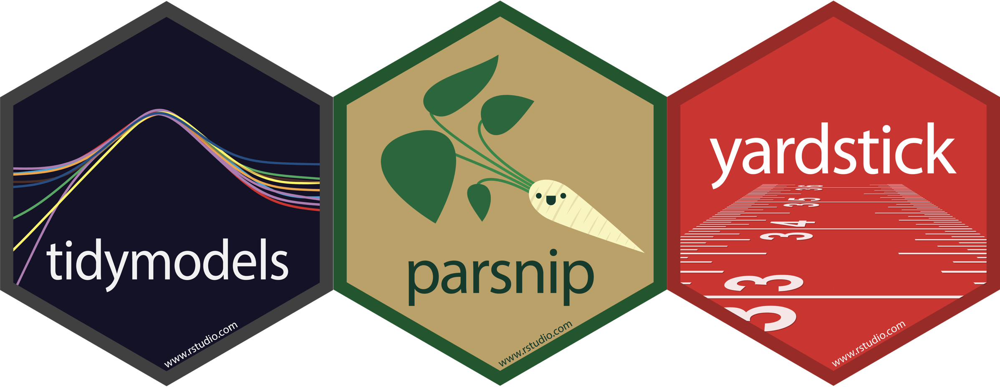

```{r setup, include=FALSE}
options(htmltools.dir.version = FALSE)
knitr::opts_chunk$set(collapse = TRUE,
                      fig.retina = 3,
                      fig.path = "images/classification/plots/",
                      fig.align = "center",
                      fig.asp = 0.618,
                      comment = "#>")

xaringanExtra::use_share_again()
xaringanExtra::use_panelset()
xaringanExtra::use_extra_styles(hover_code_line = TRUE,
                                mute_unhighlighted_code = TRUE)
xaringanExtra::use_scribble(pen_color = "#009FB7")

yt_counter <- 0
library(countdown)
library(tidyverse)
library(tidymodels)
library(flair)
library(here)
library(knitr)
library(downlit)

library(xaringancolor)
blue <- "#009FB7"
light_blue <- "#0ADEFF"
yellow <- "#FED766"
dark_yellow <- "#A27A01"
pink <- "#CB297B"
light_pink <- "#FF8DC6"
grey <- "#696773"

library(AmesHousing)
ames <- make_ames()

theme_set(wjake::theme_wjake(base_family = "Source Sans Pro"))
```

```{r depends-on, include =FALSE}
# split
set.seed(100) # Important!
ames_split  <- initial_split(ames)
ames_train  <- training(ames_split)
ames_test   <- testing(ames_split)

# smaller for plotting
set.seed(0)
small_ames <- ames %>% 
  slice_sample(n = 80) %>% 
  mutate(.row = dplyr::row_number())


# split
set.seed(100) # Important!
small_split  <- initial_split(small_ames)
small_train  <- training(small_split)
small_test   <- testing(small_split)

lm_spec <- 
   linear_reg() %>% # Pick linear regression
   set_engine(engine = "lm") # set engine

lm_fit <- fit(lm_spec,
              Sale_Price ~ Gr_Liv_Area, 
              data = ames_train)

sales_resid  <- lm_fit %>% 
  predict(new_data = ames_train) %>% 
  mutate(truth = ames_train$Sale_Price)

sales_pred <- lm_fit %>% 
  predict(new_data = ames_test) %>% 
  mutate(truth = ames_test$Sale_Price)

rmse_train <- rmse(sales_resid, truth = truth, estimate = .pred) %>% pull(.estimate)
rmse_test  <- rmse(sales_pred, truth = truth, estimate = .pred) %>% pull(.estimate)
```

class: title-slide, center

<span class="fa-stack fa-4x">
  <i class="fa fa-circle fa-stack-2x" style="color: #ffffff;"></i>
  <strong class="fa-stack-1x" style="color:#009FB7;">`r rmarkdown::metadata$session`</strong>
</span> 

# `r rmarkdown::metadata$title`

## `r rmarkdown::metadata$subtitle`

### `r rmarkdown::metadata$author`

#### [`r params$class_link`](`r params$class_link`) &#183; [`r params$site_link`](`r params$site_link`)

.footer-license[*Tidy Data Science with the Tidyverse and Tidymodels* is licensed under a [Creative Commons Attribution 4.0 International License](https://creativecommons.org/licenses/by/4.0/).]

<div style = "position:fixed; visibility: hidden">
  $$\require{color}\definecolor{blue}{rgb}{0, 0.623529411764706, 0.717647058823529}$$
  $$\require{color}\definecolor{light_blue}{rgb}{0.0392156862745098, 0.870588235294118, 1}$$
  $$\require{color}\definecolor{yellow}{rgb}{0.996078431372549, 0.843137254901961, 0.4}$$
  $$\require{color}\definecolor{dark_yellow}{rgb}{0.635294117647059, 0.47843137254902, 0.00392156862745098}$$
  $$\require{color}\definecolor{pink}{rgb}{0.796078431372549, 0.16078431372549, 0.482352941176471}$$
  $$\require{color}\definecolor{light_pink}{rgb}{1, 0.552941176470588, 0.776470588235294}$$
  $$\require{color}\definecolor{grey}{rgb}{0.411764705882353, 0.403921568627451, 0.450980392156863}$$
</div>
  
<script type="text/x-mathjax-config">
  MathJax.Hub.Config({
    TeX: {
      Macros: {
        blue: ["{\\color{blue}{#1}}", 1],
        light_blue: ["{\\color{light_blue}{#1}}", 1],
        yellow: ["{\\color{yellow}{#1}}", 1],
        dark_yellow: ["{\\color{dark_yellow}{#1}}", 1],
        pink: ["{\\color{pink}{#1}}", 1],
        light_pink: ["{\\color{light_pink}{#1}}", 1],
        grey: ["{\\color{grey}{#1}}", 1]
      },
      loader: {load: ['[tex]/color']},
      tex: {packages: {'[+]': ['color']}}
    }
  });
</script>

---
class: your-turn

# Your Turn 0

.big[
* Open the R Notebook **materials/exercises/09-classification.Rmd**
* Run the setup chunk
]

```{r yt-setwd-cd, echo = FALSE}
countdown(minutes = 1, seconds = 0,
          font_size = "2em",
          color_border = yellow,
          color_background = blue,
          color_text = yellow,
          color_running_background = "#F0F0F0",
          color_running_text = blue,
          color_finished_background = yellow,
          color_finished_text = blue)
```

---
class: middle, center, frame

# Goal of Machine Learning

--


## `r emo::ji("hammer")` construct .display[models] that

--


## `r emo::ji("target")` generate .display[accurate predictions]

--


## `r emo::ji("new")` for .display[future, yet-to-be-seen data]

--

.footnote[Max Kuhn & Kjell Johnston, http://www.feat.engineering/]

---
class: inverse, middle, center

A model doesn't have to be a straight line...

```{r lm-fig, dev = 'svg', dev.args = list(bg = "transparent"), echo=FALSE, fig.align='center', message = FALSE, warning = FALSE, fig.asp = 1, out.width = "50%"}
ggplot(small_train, aes(Gr_Liv_Area, Sale_Price)) +
  geom_smooth(method = "lm", se = FALSE, colour = blue, lwd=3) +
  geom_point(size = 3, colour = "white") +  
  coord_cartesian(ylim = c(50000, 500000))+
  theme_void() +
  theme(
    panel.background = element_rect(fill = "transparent", colour = NA), 
    plot.background = element_rect(fill = "transparent", colour = NA),
    legend.background = element_rect(fill = "transparent", colour = NA),
    legend.key = element_rect(fill = "transparent", colour = NA)
  )
```

---
class: inverse, middle, center

.pull-left[
```{r lm-fig, dev = 'svg', dev.args = list(bg = "transparent"), echo = FALSE, fig.align='center', message = FALSE, warning = FALSE, fig.asp = 1, out.width = "100%"}
```
]

.pull-right[
```{r poly-fig, dev = 'svg', dev.args = list(bg = "transparent"), echo=FALSE, fig.align='center', message = FALSE, warning = FALSE, fig.asp = 1, out.width = "100%"}
ggplot(small_train, aes(Gr_Liv_Area, Sale_Price)) +
  stat_smooth(method = "lm", se = FALSE, formula = y ~ poly(x, 9), colour = blue, lwd=3) +
  geom_point(size = 3, colour = "white") +  
  coord_cartesian(ylim = c(50000, 500000))+
  theme_void() +
  theme(
    panel.background = element_rect(fill = "transparent", colour = NA), 
    plot.background = element_rect(fill = "transparent", colour = NA),
    legend.background = element_rect(fill = "transparent", colour = NA),
    legend.key = element_rect(fill = "transparent", colour = NA)
  )
```
]

---

# Decision Trees

.big[
To predict the outcome of a new data point:
]

* Use rules learned from splits

* Each split maximizes information gain

---
class: middle, center


---
```{r include=FALSE}
rt_spec <- 
  decision_tree() %>%          
  set_engine(engine = "rpart") %>% 
  set_mode("regression")

set.seed(1)
rt_fitwf <- last_fit(rt_spec, Sale_Price ~ Gr_Liv_Area,
                     split = small_split)
lm_fitwf <- last_fit(lm_spec, Sale_Price ~ Gr_Liv_Area,
                     split = small_split)

rt_fit <- rt_fitwf %>% 
  pluck(".workflow", 1) %>% 
  pull_workflow_fit() %>% 
  .$fit

lm_fit <- lm_fitwf %>%
  pluck(".workflow", 1) %>%
  pull_workflow_fit() %>%
  .$fit

splt <- rt_fit$splits %>% 
  as_tibble(.) %>% 
  mutate(order = dplyr::row_number()) 
```

```{r rt-splits, echo = FALSE, fig.align='center',fig.asp = 1, out.width = "55%"}
ggplot(small_train, aes(x = Gr_Liv_Area, y = Sale_Price)) + 
  geom_point(size = 3) +
  geom_vline(data=splt, 
             aes(xintercept = index, 
                 colour=factor(order)), 
             lwd = 5, 
             alpha = .7) + 
  geom_text(data=splt, aes(x=index, 
                           y=max(small_train$Sale_Price), 
                           label=order), nudge_x=0.02) +
  scale_x_continuous(breaks=seq(-0.5, 0.5, 0.1)) +
  scale_colour_viridis_d(option = "plasma", end = .8) +
  theme(legend.position = "none") +
  coord_cartesian(ylim = c(50000, 500000), x = c(700, 2750))
```

---
```{r rt-split-smooth, echo = FALSE, fig.align='center',fig.asp = 1, out.width = "55%"}
rt_preds <- rt_fitwf %>% 
  collect_predictions() %>% 
  left_join(select(small_test, .row, Gr_Liv_Area),
            by = ".row") 

lm_preds <- lm_fitwf %>%
  collect_predictions() %>%
  left_join(select(small_test, .row, Gr_Liv_Area),
            by = ".row")

rt_pred_plot <- ggplot(rt_preds) + 
  geom_point(aes(x=Gr_Liv_Area, y=Sale_Price), size = 3) +
  geom_line(aes(x=Gr_Liv_Area, y=.pred), colour=blue, size=2) +
  geom_vline(data=splt, aes(xintercept = index, colour=factor(order)), 
             lwd = 5, 
             alpha = .7) + 
  scale_colour_viridis_d(option = "plasma", end = .8) +
  theme(legend.position="none") +
  coord_cartesian(y = c(50000, 500000), x = c(700, 2750))

rt_pred_plot
```

---
class: pop-quiz

# Consider

.big[How do we assess predictions here?]

--

RMSE?

---
```{r rt-split-rmse, echo = FALSE, fig.align='center',fig.asp = 1, out.width = "55%"}
rt_pred_plot +
  geom_segment(aes(x = Gr_Liv_Area, 
                   xend = Gr_Liv_Area, 
                   y = Sale_Price, 
                   yend = .pred), 
               colour = light_pink) 
```

---

.pull-left[

### LM RMSE = `r round(rmse_test, 2)`
```{r lm-test-resid, echo = FALSE, fig.align='center', fig.asp = 1, warning = FALSE, message = FALSE, out.width = "100%"}
lm_pred_plot <- ggplot(lm_preds) + 
  geom_point(aes(x=Gr_Liv_Area, y=Sale_Price), size = 3) +
  geom_line(aes(x=Gr_Liv_Area, y=.pred), colour=blue, size=2) +
  theme(legend.position="none") +
  coord_cartesian(y = c(50000, 500000), x = c(700, 2750)) +
  geom_segment(aes(x = Gr_Liv_Area, 
                   xend = Gr_Liv_Area, 
                   y = Sale_Price, 
                   yend = .pred), 
               colour = light_pink)

lm_pred_plot
```

]

--

.pull-right[

```{r include = FALSE}
rmse_tree <- rt_fitwf %>% 
  collect_predictions() %>% 
  rmse(., truth = Sale_Price, estimate = .pred) %>% 
  pull(.estimate)
```

### Tree RMSE = `r round(rmse_tree, 2)`
```{r print-rt-split-rmse, ref.label='rt-split-rmse', echo = FALSE, fig.align='center',fig.asp = 1, out.width = "100%"}
```

]

---
class: inverse, middle, center

.pull-left[
```{r print-lm-fit, ref.label='lm-fig', dev = 'svg', dev.args = list(bg = "transparent"), echo = FALSE, fig.align='center', message = FALSE, warning = FALSE, fig.asp = 1, out.width = "100%"}
```
]

.pull-right[
```{r dt-fig, dev = 'svg', dev.args = list(bg = "transparent"), echo = FALSE, fig.align='center', message = FALSE, warning = FALSE, fig.asp = 1, out.width = "100%"}
ggplot(rt_preds) + 
  geom_point(data = small_train, aes(x=Gr_Liv_Area, y=Sale_Price), colour = "white", size = 3) +
  geom_line(aes(x=Gr_Liv_Area, y=.pred), colour=blue, size=2) + 
  coord_cartesian(y = c(50000, 500000), x = c(700, 2750)) +  
  theme_void() +
  theme(
    legend.position="none",
    panel.background = element_rect(fill = "transparent", colour = NA), 
    plot.background = element_rect(fill = "transparent", colour = NA),
    legend.background = element_rect(fill = "transparent", colour = NA),
    legend.key = element_rect(fill = "transparent", colour = NA)
  )
```
]

---
class: middle, center, inverse

# What is a model?

---
# K Nearest Neighbors (KNN)

.big[
To predict the outcome of a new data point:
]

* Find the K most similar old data points

* Take the average/mode/etc. outcome

---

```{r}
library(kknn)
knn_spec <- nearest_neighbor(neighbors = 5) %>% 
           set_engine("kknn") %>% 
           set_mode("regression")

set.seed(100)
knn_fit <- fit(knn_spec, Sale_Price ~ ., data = ames_train)

knn_pred <- knn_fit %>% 
  predict(new_data = ames_test) %>% 
  mutate(price_truth = ames_test$Sale_Price)

rmse(knn_pred, truth = price_truth, estimate = .pred)

rsq(knn_pred, truth = price_truth, estimate = .pred)
```

---
exclude: true

```{r include=FALSE}
# prep data for knn
knn_rec <- recipe(Sale_Price ~ Gr_Liv_Area, data = small_ames) %>%
  #step_nzv(all_nominal()) %>%
  #step_integer(matches("Qual|Cond|QC|Qu")) %>%
  step_center(all_numeric(), -all_outcomes()) %>%
  step_scale(all_numeric(), -all_outcomes()) 

df <- knn_rec %>%
  prep(training = small_train) %>%
  juice() %>%
  select(Sale_Price, Gr_Liv_Area)
```

```{r include=FALSE}
plot_neighbors <- function(home = 59, k = 5, data = df) {
  set.seed(1)
  index <- as.vector(FNN::knnx.index(data = data[-home, -1], 
                                   query = data[home, -1], 
                                   k = k))
  neighbors <- data %>% 
    mutate(desc = case_when(
      row_number() == home ~ "Home of interest",
      row_number() %in% index ~ "Closest neighbors",
      TRUE ~ NA_character_),
      k = k)
  
  jitter <- position_jitter(width = .1, height = .1, seed = 110)
  
  ggplot(data = neighbors, aes(x = Gr_Liv_Area, y = Sale_Price)) +
    geom_point(position = jitter, aes(fill = desc), size = 5, shape = 21) + 
    scale_fill_manual(values = c("Home of interest" = yellow,
                                 "Closest neighbors" = blue),
                      na.value = "grey90") +
    # scale_fill_scico_d(palette = "buda", end = .8, na.value = "gray90") +
    theme(legend.position="none") +
    coord_cartesian(ylim = c(50000, 500000), xlim = c(-2, 2.5)) +
    geom_hline(data = filter(neighbors, desc == "Closest neighbors"),
             aes(yintercept = mean(Sale_Price)), lty = 3) +
    ggtitle(glue::glue("k = {neighbors$k}"))
}
```

---

```{r knn-home1, echo=FALSE, fig.align='center', fig.asp = 1, out.width = "55%"}
plot_neighbors(home = 55, k = 5)
```

---

```{r knn-home2, echo=FALSE, fig.align='center', fig.asp = 1, out.width = "55%"}
plot_neighbors(home = 59, k = 5)
```

---

```{r knn-home2-10, echo=FALSE, fig.align='center', fig.asp = 1, out.width = "55%"}
plot_neighbors(home = 59, k = 10)
```

---

```{r knn-home2-25, echo=FALSE, fig.align='center', fig.asp = 1, out.width = "55%"}
plot_neighbors(home = 59, k = 25)
```

---

```{r knn-home2-50, echo=FALSE, fig.align='center', fig.asp = 1, out.width = "55%"}
plot_neighbors(home = 59, k = 50)
```

---

.pull-left[
```{r knn-home2-1, echo=FALSE, fig.align='center', fig.asp = 1, out.width = "100%"}
plot_neighbors(home = 59, k = 1)
```
]

.pull-right[
```{r underfit-knn, echo=FALSE, message = FALSE, fig.align='center', fig.asp = 1, out.width = "100%"}
plot_knnresid <- function(neighbors = 1) {
  set.seed(100)
  knn_preds <- last_fit(set_args(knn_spec, neighbors = neighbors),
                        Sale_Price ~ Gr_Liv_Area,
                        split = small_split) %>%
    collect_predictions() %>%
    left_join(select(small_test, .row, Gr_Liv_Area),
              by = ".row")
  
  ggplot(knn_preds, aes(x = Gr_Liv_Area, y = .pred)) +
    geom_point() +
    geom_line(color = blue) +
    geom_point(aes(y = Sale_Price), alpha = .5) +
    geom_segment(aes(x = Gr_Liv_Area, 
                     xend = Gr_Liv_Area, 
                     y = Sale_Price, 
                     yend = .pred), 
                 colour = light_pink) +
    coord_cartesian(ylim = c(50000, 500000))
}

# underfit knn
plot_knnresid(neighbors = 1)
```
]

---
.pull-left[
```{r print-home2, echo=FALSE, fig.align='center', fig.asp = 1, out.width = "100%"}
include_graphics(fig_chunk("knn-home2", "png"))
```
]

.pull-right[
```{r fit-knn, echo=FALSE, message = FALSE, fig.align='center', fig.asp = 1, out.width = "100%"}
plot_knnresid(neighbors = 5)
```
]

---
class: pop-quiz

# Pop quiz!

[Why is logistic regression considered a linear model?](https://sebastianraschka.com/faq/docs/logistic_regression_linear.html)

.center[
```{r lr-fig, echo=FALSE, dev = 'svg', dev.args = list(bg = "transparent"), fig.asp = 1, out.width = "40%", message = FALSE, warning = FALSE}
data(mtcars)
dat <- subset(mtcars, select=c(mpg, am, vs)) 
ggplot(dat, aes(x=mpg, y=vs)) + 
  geom_point(colour = grey, size = 3) + 
  stat_smooth(method="glm",
              method.args = list(family = "binomial"), se = FALSE,
              colour = blue, size = 2) +
  theme_void()
```
]

---
class: middle, center
```{r echo=FALSE, out.width = "70%"}
knitr::include_graphics("https://raw.githubusercontent.com/EmilHvitfeldt/blog/master/static/blog/2019-08-09-authorship-classification-with-tidymodels-and-textrecipes_files/figure-html/unnamed-chunk-18-1.png")
```

https://www.hvitfeldt.me/blog/authorship-classification-with-tidymodels-and-textrecipes/

---
class: middle, center
```{r echo=FALSE, out.width = "50%"}
knitr::include_graphics("https://www.kaylinpavlik.com/content/images/2019/12/dt-1.png")
```

https://www.kaylinpavlik.com/classifying-songs-genres/

---
class: middle, center
```{r echo=FALSE}
knitr::include_graphics("images/classification/sing-tree.png")
```

[The Science of Singing Along](http://www.doc.gold.ac.uk/~mas03dm/papers/PawleyMullensiefen_Singalong_2012.pdf)

---
class: middle, center

```{r echo=FALSE, out.width='40%'}
knitr::include_graphics("https://a3.typepad.com/6a0105360ba1c6970c01b7c95c61fb970b-pi")
```

.footnote[[tweetbotornot2](https://github.com/mkearney/tweetbotornot2)]

---
name: guess-the-animal
class: middle, center, inverse

```{r echo=FALSE, out.width = '90%'}
knitr::include_graphics("http://www.atarimania.com/8bit/screens/guess_the_animal.gif")
```

---
# What makes a good guesser?

--

.big[High information gain per question (can it fly?)]

--

.big[Clear features (feathers vs. is it "small"?)]

--

.big[Order matters]

---
class: inverse, middle, center

# Congratulations!

You just built a decision tree `r emo::ji("tada")`

---
background-image: url(images/classification/aus-standard-animals.png)
background-size: cover

.footnote[[Australian Computing Academy](https://aca.edu.au/resources/decision-trees-classifying-animals/)]

---
background-image: url(images/classification/annotated-tree-00.png)
background-size: 80%

.footnote[[Australian Computing Academy](https://aca.edu.au/resources/decision-trees-classifying-animals/)]

---
background-image: url(images/classification/annotated-tree-01.png)
background-size: 80%

---
background-image: url(images/classification/annotated-tree-02.png)
background-size: 80%

---
background-image: url(images/classification/annotated-tree-03.png)
background-size: 80%

---
background-image: url(images/classification/annotated-tree-04.png)
background-size: 80%

---
background-image: url(images/classification/annotated-tree-05.png)
background-size: 80%

---
background-image: url(images/classification/bonsai-anatomy.jpg)
background-size: cover

---
background-image: url(images/classification/bonsai-anatomy-flip.jpg)
background-size: cover

---
class: pop-quiz

# Pop quiz!

.big[Name that variable type!]

```{r echo=FALSE, out.width = "60%", fig.align='center'}
knitr::include_graphics("images/classification/vartypes_quiz.png")
```

```{r pq-var-type-cd, echo = FALSE}
countdown(minutes = 2)
```

---
class: pop-quiz

```{r echo=FALSE, out.width = "80%", fig.align='center'}
knitr::include_graphics("images/classification/vartypes_answers.png")
```

---
class: pop-quiz

```{r echo=FALSE, out.width = "80%", fig.align='center'}
knitr::include_graphics("images/classification/vartypes_unicorn.jpeg")
```

---
class: center, middle

# Show of hands

How many people have .display[fit] a logistic regression model with `glm()`?

---
exclude: true

```{r include=FALSE}
library(magick)

uni_train <- iris %>% 
  janitor::clean_names() %>% 
  mutate(unicorn = as.factor(if_else(species == "versicolor", 1, 0))) %>% 
  mutate(across(starts_with("sepal"), ~.x * 10)) %>% 
  select(n_butterflies = sepal_width, n_kittens = sepal_length, unicorn)

# setup stuff
not_col <- grey
uni_col <- pink

unicorn <- image_read(here::here("site/static/slides/images/classification/unicorn_horn.png"))
horse <- image_read(here::here("site/static/slides/images/classification/horse_black_mane.png"))
uni_raster <- as.raster(image_fill(unicorn, 'none'))
horse_raster <- as.raster(image_fill(horse, 'none'))
```

---
class: middle, center, inverse

.pull-left[
```{r show-unicorn, echo=FALSE}
unicorn
```

]

.pull-right[
```{r show-horse, echo=FALSE}
horse
```
]

---

.pull-left[
```{r}
uni_train %>% 
  count(unicorn)
```
]

.pull-right[
```{r unicorn-box, echo=FALSE, fig.asp = 1, fig.width = 4, out.width = "100%"}
ggplot(uni_train, aes(x = unicorn, y = n_butterflies, fill = unicorn)) +
  geom_boxplot(alpha = .8) +
  scale_fill_manual(values = c(not_col, uni_col), guide = "none")
```

]

---

```{r unicorn-density, echo=FALSE, fig.align='center', fig.width = 4, fig.asp = 1, out.width = "55%"}
ggplot(uni_train, aes(x = n_butterflies, fill = unicorn)) +
  geom_density(alpha = .8, colour = NA) +
  scale_fill_manual(values = c(not_col, uni_col), guide = "none") +
  annotation_raster(uni_raster, 20, 26, .07, .10) +
  annotation_raster(horse_raster, 33, 39, .07, .10)
```

---

```{r include=FALSE}
# do the logistic regression
glm_fit <- glm(unicorn ~ n_butterflies, 
    data = uni_train,
    family = binomial)

uni_glm <- uni_train %>% 
  mutate(prob_uni = predict(glm_fit, type = "response"),
         pred_uni = if_else(prob_uni >= .5, 1, 0))

glm_jitter <- position_jitter(height = .01, seed = 0)
```

```{r unicorn-lr, echo=FALSE, message = FALSE, warning = FALSE, fig.align='center', fig.asp = 1, fig.width = 4, out.width = "55%"}
ggplot(uni_glm, aes(x = n_butterflies, 
                    y = as.numeric(unicorn) - 1)) +
  geom_point(position = glm_jitter, alpha = .7, aes(colour = unicorn), size = 3) +
  scale_colour_manual(values = c(not_col, uni_col), guide = "none") +
  geom_smooth(method="glm", method.args = list(family = "binomial")) +
  labs(y = "Unicorns") +
  annotation_raster(uni_raster, 30, 35, .75, .95) +
  annotation_raster(horse_raster, 20, 25, .05, .25) 
```

???

Logistic regression model

---
```{r unicorn-probs, echo=FALSE, message = FALSE, warning = FALSE, fig.align='center', fig.asp = 1, fig.width = 4, out.width="55%"}
ggplot(uni_glm, aes(x = n_butterflies, 
                    y = prob_uni,
                    colour = unicorn)) +
  geom_point(position = glm_jitter, alpha = .7, size = 3) +
  geom_rug(alpha = .5) +
  scale_colour_manual(values = c(not_col, uni_col), guide = "none") +
  labs(y = "Unicorns") +
  annotation_raster(uni_raster, 30, 35, .75, .95) +
  annotation_raster(horse_raster, 20, 25, .05, .25) 
```

???

The probability that each observation is a unicorn

---
```{r unicorn-pred-class, echo=FALSE, message = FALSE, warning = FALSE, fig.align='center', fig.asp = 1, fig.width = 4, out.width="55%"}
ggplot(uni_glm, aes(x = n_butterflies, 
                    y = as.numeric(unicorn) - 1)) +
  geom_point(position = glm_jitter, alpha = .7, aes(colour = as.factor(pred_uni)), size = 3) +
  scale_colour_manual(values = c(not_col, uni_col), guide = "none") +
  geom_smooth(method="glm", method.args = list(family = "binomial")) +
  labs(y = "Unicorns") +
  annotation_raster(uni_raster, 30, 35, .75, .95) +
  annotation_raster(horse_raster, 20, 25, .05, .25) 
```

???

Predicted class of each observation

---
class: middle, center


```{r unicorn-clusters, echo=FALSE, fig.align='center', warning=FALSE, message =FALSE, fig.asp = 1, fig.width = 4, out.width="55%"}
ggplot(uni_train, aes(x = n_kittens, y = n_butterflies, colour = unicorn)) +
  geom_count(alpha = .9, show.legend = FALSE) +
  scale_colour_manual(values = c(not_col, uni_col)) +
  scale_size_continuous(range = c(4, 10)) +
  annotation_raster(uni_raster, 52, 60, 23, 28) +
  annotation_raster(horse_raster, 45, 52, 35, 40)
```

---

```{r include=FALSE}
uni_lnr <- 
  decision_tree(tree_depth = 2) %>%         
  set_engine("rpart", model = TRUE) %>%      
  set_mode("classification") 

uni_wf <- 
  workflow() %>% 
  add_model(uni_lnr) %>% 
  add_formula(unicorn ~ .)

set.seed(0)
uni_tree <-
  uni_wf  %>% 
  fit(data = uni_train) %>% 
  pull_workflow_fit()

uni_train <- uni_tree %>% 
  predict(new_data = uni_train) %>% 
  bind_cols(uni_train)
```

```{r echo=FALSE}
uni_tree
```

---
```{r uni-tree-partykit, echo=FALSE, fig.width=10, warning=FALSE, message=FALSE, fig.align='center'}
library(partykit)
lone_rparty <- as.party(uni_tree$fit)
plot(lone_rparty, 
     terminal_panel=node_barplot(lone_rparty, beside = TRUE))
```

---

```{r echo=FALSE, warning=FALSE, message=FALSE}
library(rpart.plot)
rpart.rules(uni_tree$fit,
            extra = 4, 
            cover = TRUE, 
            nn = TRUE,
            roundint = FALSE)
```

---

```{r echo=FALSE}
# setup for tree parts plots
splt <- uni_tree$fit$splits %>% 
  as_tibble(rownames = "pred") %>% 
  filter(adj == 0) %>%  # filter out surrogate splits
  mutate(order = dplyr::row_number()) %>% 
  mutate(uni_is = if_else(ncat == 1, "lower than", "higher than"))

jitter <- position_jitter(seed = 0)

tree_parts <-
  ggplot(uni_train, aes(x = n_kittens, y = n_butterflies, colour = unicorn)) +
  geom_count(alpha = .9, show.legend = FALSE, position = jitter) +
  scale_size_continuous(range = c(4, 10)) +
  scale_colour_manual(values = c(not_col, uni_col)) +
  theme(legend.position="none") +
  coord_cartesian(xlim = c(40, 80), y = c(20, 45), expand = TRUE)
```

.pull-left[
```{r og-data-no-div, echo=FALSE, fig.align='center', fig.asp = 1, fig.width = 5, out.width = "100%"}
tree_parts
```
]

--

.pull-right[
```{r pred-data-no-div, echo=FALSE, fig.align='center', fig.asp = 1, fig.width = 5, out.width = "100%"}
ggplot(uni_train, aes(x = n_kittens, y = n_butterflies, colour = .pred_class)) +
  geom_count(alpha = .9, show.legend = FALSE, position = jitter) +
  scale_size_continuous(range = c(4, 10)) +
  scale_colour_manual(values = c(not_col, uni_col)) +  theme_minimal() +
  theme(legend.position="none") +
  coord_cartesian(xlim = c(40, 80), y = c(20, 45), expand = TRUE)
```

]

---

.pull-left[

```{r kitten-div-1, echo=FALSE, fig.asp = 1, fig.width = 5, out.width = "100%"}
# kittens
tree_parts +
  annotate(geom='rect', xmin = -Inf, xmax = 54.5, ymin = -Inf, ymax = Inf, 
           alpha = .5, fill = not_col) +
  annotate("text", x = 40, y = 40, label = "NOT?", hjust = 0, size = 10, family = "Shadows Into Light")
```


]

--

.pull-right[

```{r butterfly-div-1, echo=FALSE, fig.asp = 1, fig.width = 5, out.width = "100%"}
# butterfly
tree_parts +
  annotate(geom='rect', xmin = -Inf, xmax = Inf, ymin = 29.5, ymax = Inf, 
           alpha = .5, fill = not_col) +
  annotate("text", x = 75, y = 40, label = "NOT?", hjust = 0, size = 10, family = "Shadows Into Light")
```

]

--

### .center[`r emo::ji("butterfly")` split wins]

---

.pull-left[

```{r kitten-div-2, echo=FALSE, fig.asp = 1, fig.width = 5, out.width = "100%"}
# kittens
tree_parts +
  annotate(geom='rect', xmin = -Inf, xmax = Inf, ymin = 29.5, ymax = Inf, 
           alpha = 1, fill = not_col) +
  annotate("text", x = 75, y = 40, label = "NOT", hjust = 0, size = 8, family = "Shadows Into Light") +
  annotate(geom='rect', xmin = -Inf, xmax = 62.5, ymin = -Inf, ymax = 29.5, 
           alpha = .5, fill = uni_col) +
  annotate("text", x = 40, y = 20, label = "UNI?", hjust = 0, size = 10, family = "Shadows Into Light") +
  annotate(geom='rect', xmin = 62.5, xmax = Inf, ymin = -Inf, ymax = 29.5, 
           alpha = .5, fill = not_col) +
  annotate("text", x = 75, y = 20, label = "NOT?", hjust = 0, size = 10, family = "Shadows Into Light")
```


]

--

.pull-right[

```{r butterfly-div-2, echo=FALSE, fig.asp = 1, fig.width = 5, out.width = "100%"}
# butterflies
tree_parts +
  annotate(geom='rect', xmin = -Inf, xmax = Inf, ymin = 29.5, ymax = Inf, 
           alpha = 1, fill = not_col) +
  annotate("text", x = 75, y = 40, label = "NOT", hjust = 0, size = 8, family = "Shadows Into Light") +
  annotate(geom='rect', xmin = -Inf, xmax = Inf, ymin = 24.5, ymax = 29.5, 
           alpha = .5, fill = uni_col) +
  annotate("text", x = 75, y = 26, label = "UNI?", hjust = 0, size = 10, family = "Shadows Into Light") +
  annotate(geom='rect', xmin = -Inf, xmax = Inf, ymin = -Inf, ymax = 24.5, 
           alpha = .5, fill = not_col) +
  annotate("text", x = 75, y = 20, label = "NOT?", hjust = 0, size = 10, family = "Shadows Into Light")
```

]

--

### .center[`r emo::ji("cat")` split wins]

---
class: middle, center

# Sadly, we are not classifying unicorns today

```{r echo=FALSE, fig.align='center', out.width='20%'}
knitr::include_graphics("images/classification/sad_unicorn.png")
```

---
background-image: url(images/classification/copyingandpasting-big.png)
background-size: contain
background-position: center
class: middle, center

---
background-image: url(images/classification/so-dev-survey.png)
background-size: contain
background-position: center
class: middle, center

---

```{r echo = FALSE, out.width = '80%'}
knitr::include_graphics("https://github.com/juliasilge/supervised-ML-case-studies-course/blob/master/img/remote_size.png?raw=true")
```

.footnote[[Julia Silge](https://supervised-ml-course.netlify.app/)]

???

Notes: The specific question we are going to address is what makes a developer more likely to work remotely. Developers can work in their company offices or they can work remotely, and it turns out that there are specific characteristics of developers, such as the size of the company that they work for, how much experience they have, or where in the world they live, that affect how likely they are to be a remote developer.

---

# StackOverflow Data

```{r include=FALSE}
# read in the data
stackoverflow <- read_rds(here::here("materials/data/stackoverflow.rds"))
```

```{r}
glimpse(stackoverflow)
```

---

# `initial_split()`

.big["Splits" data randomly into a single testing and a single training set;
extract `training` and `testing` sets from an rsplit]

```{r}
set.seed(100) # Important!
so_split <- initial_split(stackoverflow, strata = remote)
so_train <- training(so_split)
so_test  <- testing(so_split)
```

---
class: your-turn

# Your turn `r (yt_counter <- yt_counter + 1)`

.big[Using the `so_train` and `so_test` data sets, how many individuals in our training set are remote? How about in the testing set?]

```{r echo=FALSE}
countdown(minutes = 2)
```

---
class: your-turn

```{r so-counts}
so_train %>% 
  count(remote)

so_test %>% 
  count(remote)
```

---

.pull-left[
```{r ref.label='so-counts'}

```

]

.pull-right[

```{r so-box, echo=FALSE, fig.asp = 1, out.width = "100%"}
ggplot(stackoverflow, aes(x = remote, y = years_coded_job)) +
  geom_boxplot()
```
]

---
class: inverse


# How would we fit a tree with parsnip?

```{r echo = FALSE, out.width="30%", fig.align = "center"}
knitr::include_graphics("images/hex/parsnip.png")
```

---
class: middle, frame


# .center[To specify a model with parsnip]

.right-column[

1\. Pick a .display[model]

2\. Set the .display[engine]

3\. Set the .display[mode] (if needed)

]

---
# 1\. Pick a .display[model] 

All available models are listed at <https://www.tidymodels.org/find/parsnip/>

.center[
```{r echo=FALSE, out.width = "80%"}
knitr::include_url("https://www.tidymodels.org/find/parsnip/")
```
]

---
# 2\. Set the .display[engine] 

We'll use `rpart` for building `C`lassification `A`nd `R`egression `T`rees

```{r eval=FALSE}
set_engine("rpart") 
```

---
# 3\. Set the .display[mode] 

A character string for the model type (e.g. "classification" or "regression")

```{r eval=FALSE}
set_mode("classification") 
```

---
class: middle, frame

# .center[To specify a model with parsnip]

```{r eval = FALSE}
decision_tree() %>%
  set_engine("rpart") %>%
  set_mode("classification")
```

---
class: your-turn

# Your turn `r (yt_counter <- yt_counter + 1)`

Fill in the blanks. Use the `tree_spec` model provided and `fit()` to:

1. Train a CART-based model with the formula = `remote ~ years_coded_job + salary`.

1. Remind yourself what the output looks like!

1. Predict remote status with the testing data.

1. Keep `set.seed(100)` at the start of your code.  

```{r echo=FALSE}
countdown(minutes = 5)
```

---
class: your-turn

.panelset[
.panel[.panel-name[Fit Model]
```{r}
tree_spec <- 
  decision_tree() %>%         
  set_engine("rpart") %>%      
  set_mode("classification")

set.seed(100) # Important!
tree_fit <- fit(tree_spec,
                remote ~ years_coded_job + salary,
                data = so_train) 
```
]

.panel[.panel-name[View Model]
```{r}
tree_fit
```
]

.panel[.panel-name[Make Predictions]
```{r}
predict(tree_fit, new_data = so_test)
```
]
]

---

class: middle, center, frame

# Goal of Machine Learning


## `r emo::ji("hammer")` construct .display[models] that

.fade[

## `r emo::ji("crystal_ball")` generate accurate .display[predictions]

## `r emo::ji("new")` for .display[future, yet-to-be-seen data]

]

---

class: middle, center, frame

# Goal of Machine Learning


.fade[
## `r emo::ji("hammer")` construct .display[models] that


## `r emo::ji("crystal_ball")` generate accurate .display[predictions]

]


## `r emo::ji("new")` for .display[future, yet-to-be-seen data]

---

class: middle, center, frame

# Goal of Machine Learning


.fade[
## `r emo::ji("hammer")` construct .display[models] that

]

## `r emo::ji("crystal_ball")` generate accurate .display[predictions]

.fade[

## `r emo::ji("new")` for .display[future, yet-to-be-seen data]

]
---

class: middle, center, frame

# Goal of Machine Learning


.fade[
## `r emo::ji("hammer")` construct .display[models] that

]

## `r emo::ji("target")` generate .display[accurate predictions]

.fade[

## `r emo::ji("new")` for .display[future, yet-to-be-seen data]

]

---
class: your-turn

# Your turn `r (yt_counter <- yt_counter + 1)`

Create a data frame of the observed and predicted remote status for the `so_test` data. Then use `count()` to count the number of individuals (i.e., rows) by their true and predicted remote status. Answer the following questions:

1. How many predictions did we make?

1. How many times is "remote" status predicted?

1. How many respondents are actually remote?

1. How many predictions did we get right?

*Hint: You can create a 2x2 table using* `count(var1, var2)`

```{r echo=FALSE}
countdown(minutes = 6)
```

---
class: your-turn

.panelset[
.panel[.panel-name[Create Predictions]
```{r}
tree_predict <- predict(tree_fit, new_data = so_test)

all_preds <- so_test %>%
  select(remote) %>%
  bind_cols(tree_predict)

all_preds
```
]

.panel[.panel-name[Evalutate Predictions]
```{r}
all_preds %>%
  count(.pred_class, truth = remote)
```
]
]

---
# `conf_mat()`

.big[
Creates confusion matrix, or truth table, from a data frame with observed and predicted classes.
]

```{r eval = FALSE}
conf_mat(data, truth = remote, estimate = .pred_class)
```

---
```{r}
all_preds %>%
  conf_mat(truth = remote, estimate = .pred_class)
```

---
```{r conf-map-heat, fig.asp = 1, out.width = "40%", fig.align="center"}
all_preds %>%
  conf_mat(truth = remote, estimate = .pred_class) %>%
  autoplot(type = "heatmap")
```

---
background-image: url(images/classification/metrics/metrics-01.png)
background-position: 50% 90%
background-size: 80%

# Confusion matrix

---
background-image: url(images/classification/metrics/metrics-02.png)
background-position: 50% 90%
background-size: 80%

# Confusion matrix

---
background-image: url(images/classification/metrics/metrics-03.png)
background-position: 50% 90%
background-size: 80%

# Confusion matrix

---
background-image: url(images/classification/metrics/metrics-04.png)
background-position: 50% 90%
background-size: 80%

# Confusion matrix

---
background-image: url(images/classification/metrics/metrics-05.png)
background-position: 50% 90%
background-size: 80%

# Accuracy

---
background-image: url(images/classification/metrics/metrics-06.png)
background-position: 50% 90%
background-size: 80%

# Accuracy

---
background-image: url(images/classification/metrics/metrics-07.png)
background-position: 50% 90%
background-size: 80%

# Accuracy

---
background-image: url(images/classification/metrics/metrics-01.png)
background-position: 50% 90%
background-size: 80%

# Sensitivity vs. Specificity

---
background-image: url(images/classification/metrics/metrics-08.png)
background-position: 50% 90%
background-size: 80%

# Sensitivity

---
background-image: url(images/classification/metrics/metrics-09.png)
background-position: 50% 90%
background-size: 80%

# Sensitivity

---
background-image: url(images/classification/metrics/metrics-10.png)
background-position: 50% 90%
background-size: 80%

# Specificity

---
background-image: url(images/classification/metrics/metrics-11.png)
background-position: 50% 90%
background-size: 80%

# Specificity

---
# Metrics

All available metrics are listed at <https://yardstick.tidymodels.org/articles/metric-types.html#metrics>

.center[
```{r echo=FALSE, out.width = "80%"}
knitr::include_url("https://yardstick.tidymodels.org/articles/metric-types.html#metrics")
```
]

---
# Calculating metrics

```{r}
accuracy(all_preds, truth = remote, estimate = .pred_class)

sensitivity(all_preds, truth = remote, estimate = .pred_class)

specificity(all_preds, truth = remote, estimate = .pred_class)
```

---
# `metric_set()`

.big[Combine multiple metrics functions together.]

```{r}
so_metrics <- metric_set(accuracy, sensitivity, specificity)

so_metrics(all_preds, truth = remote, estimate = .pred_class)
```

---
# `roc_curve()`

.big[
Takes predictions, returns a tibble with probabilities.
]

```{r eval = FALSE}
roc_curve(all_preds, truth = remote, estimate = .pred_Remote)
```

.big[
Truth = the .display[observed] class

Estimate = the .display[probability] of the target response
]

???

We don't have `.pred_Remote`. How do we get that?

---
```{r}
all_preds <- so_test %>%
  select(remote) %>%
  bind_cols(predict(tree_fit, new_data = so_test)) %>%
  bind_cols(predict(tree_fit, new_data = so_test, type = "prob"))

all_preds
```

---
# `roc_curve()`

```{r}
roc_curve(all_preds, truth = remote, estimate = .pred_Remote)
```

???

`.threshold` = probability threshold needed to place an individual in the class.

---
class: your-turn

# Your turn `r (yt_counter <- yt_counter + 1)`

.big[
Build the necessary data frame, and use `roc_curve()` to calculate the data needed to construct the full ROC curve.

What is the necessary threshold for achieving specificity >.75?
]

```{r yt-roccurve-cd, echo = FALSE}
countdown(minutes = 5)
```

---
class: your-turn

```{r}
all_preds <- so_test %>%
  select(remote) %>%
  bind_cols(predict(tree_fit, new_data = so_test)) %>%
  bind_cols(predict(tree_fit, new_data = so_test, type = "prob"))

roc_curve(all_preds, truth = remote, estimate = .pred_Remote)
```

???

For specificity of .75, we need a threshold of .687.

---
.panelset[
```{r yt-roccurve-plot, panelset = c(source = "Plot Code", output = "Plot"), out.width = "50%", fig.asp = 1}
roc_curve(all_preds, truth = remote, estimate = .pred_Remote) %>%
  ggplot(mapping = aes(x = 1 - specificity, y = sensitivity)) +
  geom_line(color = "midnightblue", size = 1.5) +
  geom_abline(lty = 2, alpha = 0.5, color = "gray50", size = 1.2)
```
]

---
```{r roccurve-autoplot, out.width = "50%", fig.asp = 1}
roc_curve(all_preds, truth = remote, estimate = .pred_Remote) %>%
  autoplot()
```

---
# Area under the curve

.pull-left[
```{r good-rocauc, echo=FALSE, fig.asp = 1, out.width = "100%"}
data("two_class_example")

roc_curve(two_class_example, truth = truth, estimate = Class1) %>%
  ggplot(aes(x = 1 - specificity, y = sensitivity)) +
  geom_line(size = 1.5, color = blue) +
  geom_abline(lty = 2, alpha = 0.5, color = "gray50", size = 1.2) +
  labs(x = "False Positive Rate", y = "True Positive Rate")
```
]

.pull-right[
* AUC = 0.5: random guessing

* AUC = 1: perfect classifer

* In general AUC of above 0.8 considered "good"

* {yardstick} metric: `roc_auc()`
]

---
# ROC curve: Guessing

```{r guess-rocauc, echo=FALSE, out.width = "70%"}
tibble(x = c(0, 1),
       y = c(0, 1)) %>%
  ggplot(aes(x = x, y = y)) +
  geom_line(size = 1.5, color = blue) +
  geom_segment(aes(x = 0, xend = 1, y = 0, yend = 1),
               lty = 2, alpha = 0.5, color = "gray50", size = 1.2) +
  labs(x = "False Positive Rate", y = "True Positive Rate")
```

---
# ROC curve: Perfect

```{r perfect-rocauc, echo=FALSE, out.width = "70%"}
tibble(x = c(0, 0, 1),
       y = c(0, 1, 1)) %>%
  ggplot(aes(x = x, y = y)) +
  geom_line(size = 1.5, color = blue) +
  geom_segment(aes(x = 0, xend = 1, y = 0, yend = 1),
               lty = 2, alpha = 0.5, color = "gray50", size = 1.2) +
  labs(x = "False Positive Rate", y = "True Positive Rate")
```

---
# ROC curve: Poor

```{r poor-rocauc, echo=FALSE, out.width = "70%"}
tibble(x = c(0, 0.1, 0.20, 0.30, 0.38, 0.50, 0.60, 0.80, 0.88, 1),
       y = c(0, 0.1, 0.13, 0.23, 0.38, 0.45, 0.54, 0.68, 0.73, 1)) %>%
  ggplot(aes(x = x, y = y)) +
  geom_line(size = 1.5, color = blue) +
  geom_segment(aes(x = 0, xend = 1, y = 0, yend = 1),
               lty = 2, alpha = 0.5, color = "gray50", size = 1.2) +
  labs(x = "False Positive Rate", y = "True Positive Rate")
```

---
# ROC curve: OK

```{r ok-rocauc, echo=FALSE, out.width = "70%"}
tibble(x = c(0, 0.10, 0.40, 0.50, 0.60, 0.85, 1),
       y = c(0, 0.27, 0.59, 0.76, 0.73, 1.00, 1)) %>%
  ggplot(aes(x = x, y = y)) +
  geom_line(size = 1.5, color = blue) +
  geom_segment(aes(x = 0, xend = 1, y = 0, yend = 1),
               lty = 2, alpha = 0.5, color = "gray50", size = 1.2) +
  labs(x = "False Positive Rate", y = "True Positive Rate")
```

---
# ROC curve: Good

```{r print-good-rocauc, ref.label = "good-rocauc", echo = FALSE, out.width = "70%"}
```

---
class: your-turn

# Your turn `r (yt_counter <- yt_counter + 1)`

.big[
Use `roc_auc()` to calculate the area under the ROC curve. Then plot the ROC curve using `autoplot()`.
]

```{r yt-rocauc-plot-cd, echo = FALSE}
countdown(minutes = 5)
```


---
class: your-turn

.panelset[
.panel[.panel-name[Code]
```{r yt-rocauc-sol, fig.show = "hide"}
roc_auc(all_preds, truth = remote, estimate = .pred_Remote)

roc_curve(all_preds, truth = remote, estimate = .pred_Remote) %>%
  autoplot()
```
]

.panel[.panel-name[Plot]
```{r show-rocauc, echo = FALSE, out.width = "80%"}
include_graphics(fig_chunk("yt-rocauc-sol", "png"))
```
]
]

---
class: title-slide, center

# `r rmarkdown::metadata$title`

```{r closing-hex, echo = FALSE, out.width = "40%"}

```

## `r rmarkdown::metadata$subtitle`

### `r rmarkdown::metadata$author`

#### [`r params$class_link`](`r params$class_link`) &#183; [`r params$site_link`](`r params$site_link`)

.footer-license[*Tidy Data Science with the Tidyverse and Tidymodels* is licensed under a [Creative Commons Attribution 4.0 International License](https://creativecommons.org/licenses/by/4.0/).]
