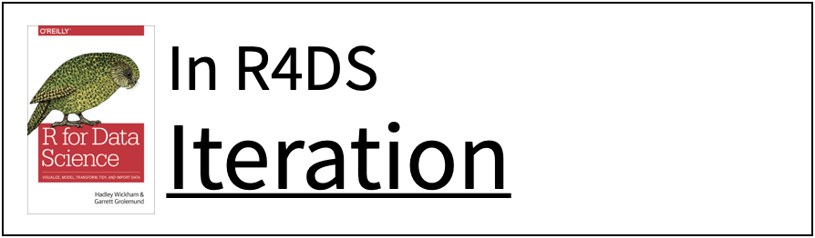
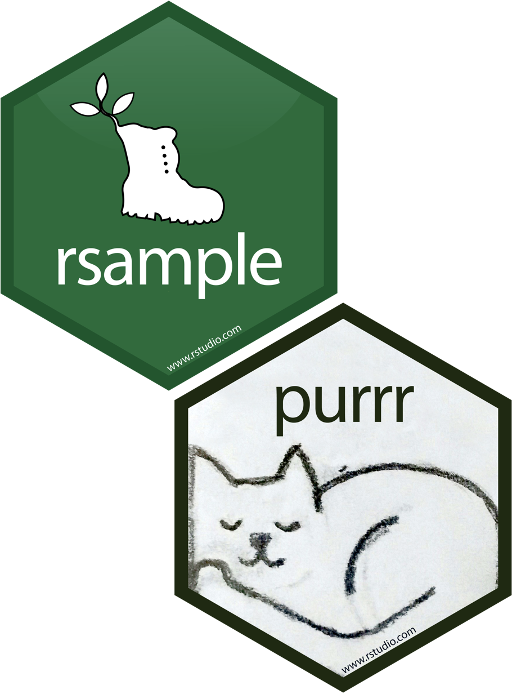

```{r setup, include=FALSE}
options(htmltools.dir.version = FALSE)
knitr::opts_chunk$set(collapse = TRUE,
                      fig.retina = 3,
                      fig.path = "images/resampling/plots/",
                      fig.align = "center",
                      fig.asp = 0.618,
                      comment = "#>")

xaringanExtra::use_share_again()
xaringanExtra::use_panelset()
xaringanExtra::use_extra_styles(hover_code_line = TRUE,
                                mute_unhighlighted_code = TRUE)
xaringanExtra::use_scribble(pen_color = "#009FB7")

yt_counter <- 0
library(countdown)
library(tidyverse)
library(tidymodels)
library(flair)
library(here)
library(knitr)
library(downlit)

library(xaringancolor)
blue <- "#009FB7"
light_blue <- "#0ADEFF"
yellow <- "#FED766"
dark_yellow <- "#A27A01"
pink <- "#CB297B"
light_pink <- "#FF8DC6"
green <- "#5FAD56"
dark_green <- "#3C6E35"
grey <- "#696773"

library(AmesHousing)
ames <- make_ames()

theme_set(wjake::theme_wjake(base_family = "Source Sans Pro",
                             base_size = 14,
                             axis_title_size = 12))
```

```{r plot-colors, include = FALSE}
# for figures
train_color <- yellow
test_color  <- green
data_color  <- blue
assess_color <- light_blue
splits_pal <- c(data_color, train_color, test_color)
```

class: title-slide, center

<span class="fa-stack fa-4x">
  <i class="fa fa-circle fa-stack-2x" style="color: #ffffff;"></i>
  <strong class="fa-stack-1x" style="color:#009FB7;">`r rmarkdown::metadata$session`</strong>
</span> 

# `r rmarkdown::metadata$title`

## `r rmarkdown::metadata$subtitle`

### `r rmarkdown::metadata$author`

#### [`r params$class_link`](`r params$class_link`) &#183; [`r params$site_link`](`r params$site_link`)

.footer-license[*Tidy Data Science with the Tidyverse and Tidymodels* is licensed under a [Creative Commons Attribution 4.0 International License](https://creativecommons.org/licenses/by/4.0/).]

<div style = "position:fixed; visibility: hidden">
  $$\require{color}\definecolor{blue}{rgb}{0, 0.623529411764706, 0.717647058823529}$$
  $$\require{color}\definecolor{light_blue}{rgb}{0.0392156862745098, 0.870588235294118, 1}$$
  $$\require{color}\definecolor{yellow}{rgb}{0.996078431372549, 0.843137254901961, 0.4}$$
  $$\require{color}\definecolor{dark_yellow}{rgb}{0.635294117647059, 0.47843137254902, 0.00392156862745098}$$
  $$\require{color}\definecolor{pink}{rgb}{0.796078431372549, 0.16078431372549, 0.482352941176471}$$
  $$\require{color}\definecolor{light_pink}{rgb}{1, 0.552941176470588, 0.776470588235294}$$
  $$\require{color}\definecolor{grey}{rgb}{0.411764705882353, 0.403921568627451, 0.450980392156863}$$
</div>
  
<script type="text/x-mathjax-config">
  MathJax.Hub.Config({
    TeX: {
      Macros: {
        blue: ["{\\color{blue}{#1}}", 1],
        light_blue: ["{\\color{light_blue}{#1}}", 1],
        yellow: ["{\\color{yellow}{#1}}", 1],
        dark_yellow: ["{\\color{dark_yellow}{#1}}", 1],
        pink: ["{\\color{pink}{#1}}", 1],
        light_pink: ["{\\color{light_pink}{#1}}", 1],
        grey: ["{\\color{grey}{#1}}", 1]
      },
      loader: {load: ['[tex]/color']},
      tex: {packages: {'[+]': ['color']}}
    }
  });
</script>

---
exclude: true

```{r include=FALSE}
# make zero correlation variables
set.seed(100)
x <- rnorm(500)

# shuffle x to get y
set.seed(100)
y <- sample(x, size = 500)

# linear combos of x + y
unicorns <- x + y
rainbows <- x - y
cor(unicorns, rainbows)
uni <- tibble(unicorns = unicorns, rainbows = rainbows)

# plotting helper functions
plot_sample <- function(sample, title = "Sample") {
  ggplot(uni, aes(x = unicorns, y = rainbows)) +
    geom_point(size = 3, color = "gray80", alpha = .5) +
    geom_point(data = sample, 
               size = 3, color = blue) +
    coord_cartesian(ylim = c(-5, 5), xlim = c(-4, 4)) +
    theme(axis.text = element_blank(),
          plot.title = element_text(hjust = 0.5)) + 
    labs(title = title)
}

plot_sample_lm <- function(sample, title = "Sample") {
  plot_sample(sample, title) +
      geom_smooth(data = sample, method = "lm", se = FALSE, 
                  color = pink, fullrange = TRUE, lwd = 2)
}

plot_sample_poly <- function(sample, title = "Flexible Models") {
  plot_sample_lm(sample, title) +
  #geom_smooth(data = sample, method = "loess", se = FALSE, lwd = 3) +
  stat_smooth(data = sample, 
              method="loess", se = FALSE, span = .5,
              fullrange = TRUE, lwd = 2)
}

plot_resamples <- function(rset, title = "Sample Variation") {
  lm_train <- function(rset) {
      lm(rainbows ~ unicorns, analysis(rset))
  }
  full_data <- if (all(str_detect(rset$id, "Bootstrap"))) {
    bind_rows(analysis(rset$splits[[1]]),
              assessment(rset$splits[[1]])) %>%
      distinct()
  } else {
    uni
  }
  
  rset %>% 
    mutate(model = map(splits, lm_train)) %>% 
    mutate(augmented = map(model, augment, newdata = uni)) %>% 
    unnest(augmented) %>% 
    ggplot(aes(unicorns, rainbows)) +
    geom_point(data = full_data, size = 3, color = "gray80", alpha = .5) +
    geom_line(aes(y = .fitted, group = id), 
              colour = pink, alpha = .5, size = 2) +
    coord_cartesian(ylim = c(-5, 5), xlim = c(-4, 4)) +
    theme(axis.text = element_blank(),
          plot.title = element_text(hjust = 0.5)) + 
    labs(title = title)
}

get_training <- function(rset, resample = 1) {
  rset %>% 
    pluck("splits", resample) %>% 
    analysis()
}

plot_resample <- function(rset, id = "Bootstrap01", title = "Sample Variation") {
  max_point_size <- if_else(str_detect(id, "Bootstrap"), 7, 3)
  full_data <- if (str_detect(id, "Bootstrap")) {
    bind_rows(analysis(rset$splits[[1]]),
              assessment(rset$splits[[1]])) %>%
      distinct()
  } else {
    uni
  }
  
  single_id <- id
  id_data <- rset %>%
    mutate(analysis = map(splits, analysis)) %>%
    filter(id == single_id) %>%
    select(analysis) %>%
    unnest(analysis)
    
  
  ggplot(full_data, aes(x = unicorns, y = rainbows)) +
    geom_point(size = 3, color = "grey80", alpha = 0.5) +
    geom_count(data = id_data, color = blue) +
    geom_smooth(data = id_data, method = "lm", se = FALSE,
                color = pink, fullrange = TRUE, lwd = 2) +
    coord_cartesian(ylim = c(-5, 5), xlim = c(-4, 4)) +
    theme(axis.text = element_blank(),
            plot.title = element_text(hjust = 0.5)) + 
    labs(title = title) +
    scale_size_area(max_size = max_point_size, guide = "none")
}

plot_tree_resample <- function(rset, id = "Bootstrap01", title = "Sample Variation") {
  lm_train <- function(rset) {
      lm(rainbows ~ unicorns, analysis(rset))
  }
  
  rt_train <- function(rset) {
      rpart::rpart(rainbows ~ unicorns, 
                   data = analysis(rset))
  }
  
  preds <- rset %>% 
      mutate(model = map(splits, lm_train)) %>% 
      mutate(tree = map(splits, rt_train)) %>% 
      mutate(augmented = map(model, augment)) %>% 
      mutate(.fitted_tree = map(tree, predict)) %>% 
      unnest(c(augmented, .fitted_tree))
  
  ggplot(preds, aes(x = unicorns, y = rainbows)) +
      geom_point(size = 8, color = "gray80", alpha = .2) +
      geom_count(data = filter(preds, id == {{ id }}), 
                 color = blue) +
      geom_line(data = filter(preds, id == {{ id }}),
                 aes(x = unicorns, y = .fitted_tree), 
                 colour = pink, size = 3) +
      coord_cartesian(ylim = c(-5, 5), xlim = c(-4, 4)) +
      theme(axis.text = element_blank(),
            plot.title = element_text(hjust = 0.5)) + 
      labs(title = title) +
      scale_size_area(max_size = 20, guide = FALSE)
}

plot_tree_resamples <- function(rset, title = "Sample Variation") {
  lm_train <- function(rset) {
      lm(rainbows ~ unicorns, analysis(rset))
  }
  
  rt_train <- function(rset) {
      rpart::rpart(rainbows ~ unicorns, 
                   data = analysis(rset))
  }
  
  rset %>% 
      mutate(model = map(splits, lm_train)) %>% 
      mutate(tree = map(splits, rt_train)) %>% 
      mutate(augmented = map(model, augment)) %>% 
      mutate(.fitted_tree = map(tree, predict)) %>% 
      unnest(c(augmented, .fitted_tree)) %>% 
    ggplot(aes(unicorns, rainbows)) +
      geom_point(size = 8, color = "gray80") +
      geom_line(aes(y = .fitted_tree, group = id), 
                colour = pink, alpha=.5, size = 3) +
      coord_cartesian(ylim = c(-5, 5), xlim = c(-4, 4)) +
      theme(axis.text = element_blank(),
            plot.title = element_text(hjust = 0.5)) + 
      labs(title = title)
}
```

---
class: your-turn

# Your Turn 0

.big[
* Open the R Notebook **materials/exercises/10-resampling.Rmd**
* Run the setup chunk
]

```{r yt-setwd-cd, echo = FALSE}
countdown(minutes = 1, seconds = 0,
          font_size = "2em",
          color_border = yellow,
          color_background = blue,
          color_text = yellow,
          color_running_background = "#F0F0F0",
          color_running_text = blue,
          color_finished_background = yellow,
          color_finished_text = blue)
```


---
background-image: url(images/resampling/unicorns-rainbows/joshua-hoehne-wnHeb_pRJBo-unsplash.jpg)
background-size: cover


---
background-image: url(images/resampling/unicorns-rainbows/unicorns.001.jpeg)
background-size: cover

---
background-image: url(images/resampling/unicorns-rainbows/unicorns.002.jpeg)
background-size: cover

---
background-image: url(images/resampling/unicorns-rainbows/unicorns.003.jpeg)
background-size: cover

---
background-image: url(images/resampling/unicorns-rainbows/unicorns.004.jpeg)
background-size: cover

---
background-image: url(images/resampling/unicorns-rainbows/unicorns.005.jpeg)
background-size: cover

---
class: frame, middle, center

# Hypothesis

.big[
As the number of `r emo::ji("unicorn")` increases, so does the number of `r emo::ji("rainbow")`.
]

---

```{r pop-plot, echo = FALSE, fig.width = 8, out.width = "90%", message = FALSE, warning = FALSE}
pop_plot <-
  ggplot(uni, aes(x = unicorns, y = rainbows)) +
  geom_point(size = 3, color = blue) +
  coord_cartesian(ylim = c(-5, 5), xlim = c(-4, 4)) +
  theme(axis.text = element_blank(),
        plot.title = element_text(hjust = 0.5)) + 
  labs(title = "Population")

pop_plot
```

---

```{r pop-plot-lm, echo = FALSE, fig.width = 8, out.width = "90%", message = FALSE, warning = FALSE}
pop_plot +
  geom_smooth(method = "lm", se = FALSE, 
              color = pink, fullrange = TRUE, lwd = 2) 
```

---

```{r sample-plot, echo = FALSE, fig.width = 8, out.width = "90%", message = FALSE, warning = FALSE}
set.seed(1)
sample_1 <- sample_n(uni, 30)
plot_sample(sample_1, title = "Sample")
```

---

```{r sample-plot-lm, echo = FALSE, fig.width = 8, out.width = "90%", message = FALSE, warning = FALSE}
plot_sample_lm(sample_1, title = "Sample")
```

---
class: inverse, middle, center

# The Challenge

---

```{r neg-bias-plot, echo = FALSE, fig.width = 8, out.width = "90%", message = FALSE, warning = FALSE}
set.seed(1)
sample_bias <- uni %>% 
  mutate(weight = case_when(
    unicorns < -1 & rainbows > 1 ~ 1,
    unicorns > 1 & rainbows < -1 ~ 1,
    TRUE ~ 0)) %>%
  slice_sample(n = 30, weight_by = weight)

plot_sample(sample_bias, title = "Sample Bias")
```

---

```{r neg-bias-plot-lm, echo = FALSE, fig.width = 8, out.width = "90%", message = FALSE, warning = FALSE}
plot_sample_lm(sample_bias, title = "Sample Bias")
```

---

```{r pos-bias-plot, echo = FALSE, fig.width = 8, out.width = "90%", message = FALSE, warning = FALSE}
set.seed(100)
sample_line <- uni %>% 
  mutate(weight = case_when(
    rainbows < -1 & unicorns < -1 ~ 1,
    between(rainbows, -1, 0) & between(unicorns, -1, 0) ~ 2,
    rainbows > 1 & unicorns > 1 ~ 1,
    between(rainbows, 0, 1) & between(unicorns, 0, 1) ~ 2,
    TRUE ~ 0)) %>% 
  slice_sample(n = 30, weight_by = weight)

plot_sample(sample_line, title = "Sample Bias")
```

---

```{r pos-bias-plot-lm, echo = FALSE, fig.width = 8, out.width = "90%", message = FALSE, warning = FALSE}
plot_sample_lm(sample_line, title = "Sample Bias")
```

---
class: middle, center, frame

# The Solution

Random Sampling

---

```{r create-samples, include = FALSE}
set.seed(1)
small_samples <- mc_cv(uni, prop = 0.06, times = 25)
```


```{r plot-resample1, echo = FALSE, fig.width = 8, out.width = "90%", message = FALSE, warning = FALSE}
plot_resample(small_samples, id = "Resample02", title = "Random Sample")
```

---

```{r plot-resample2, echo = FALSE, fig.width = 8, out.width = "90%", message = FALSE, warning = FALSE}
plot_resample(small_samples, id = "Resample03", title = "Random Sample")
```

---

```{r plot-resample3, echo = FALSE, fig.width = 8, out.width = "90%", message = FALSE, warning = FALSE}
plot_resample(small_samples, id = "Resample04", title = "Random Sample")
```

---

```{r plot-resample4, echo = FALSE, fig.width = 8, out.width = "90%", message = FALSE, warning = FALSE}
plot_resample(small_samples, id = "Resample05", title = "Random Sample")
```

---

```{r plot-many-resamples, echo = FALSE, fig.width = 8, out.width = "90%", message = FALSE, warning = FALSE}
sample_variation <- ggplot(uni, aes(x = unicorns, y = rainbows)) +
  geom_point(size = 3, color = "gray80", alpha = .5) +
  geom_smooth(data = get_training(small_samples, 2), method = "lm", se = FALSE, 
              color = pink, fullrange = TRUE, lwd = 2) +
  geom_smooth(data = get_training(small_samples, 3), method = "lm", se = FALSE, 
              color = pink, fullrange = TRUE, lwd = 2) +
  geom_smooth(data = get_training(small_samples, 4), method = "lm", se = FALSE, 
              color = pink, fullrange = TRUE, lwd = 2) +
  geom_smooth(data = get_training(small_samples, 5), method = "lm", se = FALSE, 
              color = pink, fullrange = TRUE, lwd = 2) +
  coord_cartesian(ylim = c(-5, 5), xlim = c(-4, 4)) +
  theme(axis.text = element_blank(),
        plot.title = element_text(hjust = 0.5)) 

sample_variation + 
  labs(title = "Sample Variation")
```

---

```{r plot-all-resamples, echo = FALSE, fig.width = 8, out.width = "90%", message = FALSE, warning = FALSE}
plot_resamples(rset = small_samples, title = "Sample Variation")
```

---
class: middle, center, frame

# The New Challenge

Sample Variation

---

```{r create-big-sample, include = FALSE}
set.seed(1)
big_samples <- mc_cv(uni, prop = 0.6, times = 25)
```

```{r plot-big-resample1, echo = FALSE, fig.width = 8, out.width = "90%", message = FALSE, warning = FALSE}
plot_resample(big_samples, id = "Resample02", title = "Larger N")
```

---

```{r plot-big-resample2, echo = FALSE, fig.width = 8, out.width = "90%", message = FALSE, warning = FALSE}
plot_resample(big_samples, id = "Resample03", title = "Larger N")
```

---

```{r plot-big-resample3, echo = FALSE, fig.width = 8, out.width = "90%", message = FALSE, warning = FALSE}
plot_resample(big_samples, id = "Resample04", title = "Larger N")
```

---

```{r plot-big-resample4, echo = FALSE, fig.width = 8, out.width = "90%", message = FALSE, warning = FALSE}
plot_resample(big_samples, id = "Resample05", title = "Larger N")
```

---
```{r plot-many-big-resamples, echo = FALSE, fig.width = 8, out.width = "90%", message = FALSE, warning = FALSE}
ggplot(uni, aes(x = unicorns, y = rainbows)) +
  geom_point(size = 3, color = "gray80", alpha = .5) +
  geom_smooth(data = get_training(big_samples, 2), method = "lm", se = FALSE, 
              color = pink, fullrange = TRUE, lwd = 2, alpha = .2) +
  geom_smooth(data = get_training(big_samples, 3), method = "lm", se = FALSE, 
              color = pink, fullrange = TRUE, lwd = 2, alpha = .2) +
  geom_smooth(data = get_training(big_samples, 4), method = "lm", se = FALSE, 
              color = pink, fullrange = TRUE, lwd = 2, alpha = .2) +
  geom_smooth(data = get_training(big_samples, 5), method = "lm", se = FALSE, 
              color = pink, fullrange = TRUE, lwd = 2, alpha = .2) +
  coord_cartesian(ylim = c(-5, 5), xlim = c(-4, 4)) +
  theme(axis.text = element_blank(),
        plot.title = element_text(hjust = 0.5)) + 
  labs(title = "Larger N")
```

---

```{r plot-all-big-resamples, echo = FALSE, fig.width = 8, out.width = "90%", message = FALSE, warning = FALSE}
plot_resamples(rset = big_samples, title = "Larger N")
```

---

```{r plot-poly1, echo = FALSE, fig.width = 8, out.width = "90%", message = FALSE, warning = FALSE}
plot_sample_poly(get_training(small_samples, 2))
```

---

```{r plot-poly2, echo = FALSE, fig.width = 8, out.width = "90%", message = FALSE, warning = FALSE}
plot_sample_poly(get_training(small_samples, 3))
```

---

```{r plot-poly3, echo = FALSE, fig.width = 8, out.width = "90%", message = FALSE, warning = FALSE}
plot_sample_poly(get_training(small_samples, 4))
```

---

```{r plot-poly4, echo = FALSE, fig.width = 8, out.width = "90%", message = FALSE, warning = FALSE}
plot_sample_poly(get_training(small_samples, 5))
```

---
```{r plot-many-poly, echo = FALSE, fig.width = 8, out.width = "90%", message = FALSE, warning = FALSE}
sample_variation + 
  stat_smooth(data = get_training(small_samples, 2), 
              method="loess", se = FALSE, span = .5,
              fullrange = TRUE, lwd = 2) +
  stat_smooth(data = get_training(small_samples, 3), 
              method="loess", se = FALSE, span = .5,
              fullrange = TRUE, lwd = 2) +
  stat_smooth(data = get_training(small_samples, 4), 
              method="loess", se = FALSE, span = .5,
              fullrange = TRUE, lwd = 2) +
  stat_smooth(data = get_training(small_samples, 5), 
              method="loess", se = FALSE, span = .5,
              fullrange = TRUE, lwd = 2) +
  labs(title = "Flexible Models")
```

---
class: middle, center, frame

# The good news

You don't have to collect more data.

You don't have to sacrifice fit for flexibility.

---

```{r plot-boot1, echo = FALSE, fig.width = 8, out.width = "90%", message = FALSE, warning = FALSE}
set.seed(1)
boots <- bootstraps(sample_1, times = 25)
plot_resample(boots, id = "Bootstrap01", title = "Bootstrapped Sample")
```

---

```{r plot-boot2, echo = FALSE, fig.width = 8, out.width = "90%", message = FALSE, warning = FALSE}
plot_resample(boots, id = "Bootstrap05", title = "Bootstrapped Sample")
```

---

```{r plot-boot3, echo = FALSE, fig.width = 8, out.width = "90%", message = FALSE, warning = FALSE}
plot_resample(boots, id = "Bootstrap10", title = "Bootstrapped Sample")
```

---

```{r plot-boot4, echo = FALSE, fig.width = 8, out.width = "90%", message = FALSE, warning = FALSE}
plot_resample(boots, id = "Bootstrap12", title = "Bootstrapped Sample")
```

---

```{r plot-boot5, echo = FALSE, fig.width = 8, out.width = "90%", message = FALSE, warning = FALSE}
plot_resample(boots, id = "Bootstrap18", title = "Bootstrapped Sample")
```

---

```{r plot-boot6, echo = FALSE, fig.width = 8, out.width = "90%", message = FALSE, warning = FALSE}
plot_resample(boots, id = "Bootstrap21", title = "Bootstrapped Sample")
```

---

```{r plot-boot7, echo = FALSE, fig.width = 8, out.width = "90%", message = FALSE, warning = FALSE}
plot_resample(boots, id = "Bootstrap25", title = "Bootstrapped Sample")
```

---

```{r plot-boot8, echo = FALSE, fig.width = 8, out.width = "90%", message = FALSE, warning = FALSE}
plot_resamples(rset = boots, title = "Bootstraps") 
```

---
class: middle

.pull-left[
```{r many-samples, echo = FALSE, fig.width = 8, out.width = "100%", message = FALSE, warning = FALSE, fig.align = "center", fig.asp=1}
plot_resamples(rset = small_samples, title = "Many samples") +
  geom_smooth(method = "lm", data = uni, size = 2)
```
]

.pull-right[
```{r many-bootstraps, echo = FALSE, fig.width = 8, out.width = "100%", message = FALSE, warning = FALSE, fig.align = "center", fig.asp=1}
plot_resamples(rset = boots, title = "One Sample, Many bootstraps") +
  geom_smooth(method = "lm", data = uni, size = 2)
```
]

---
class: middle

.pull-left[
```{r many-big-samples, echo = FALSE, fig.width = 8, out.width = "100%", message = FALSE, warning = FALSE, fig.align = "center", fig.asp=1}
plot_resamples(rset = big_samples, title = "Many bigger samples") +
  geom_smooth(method = "lm", data = uni, size = 2)
```
]

.pull-right[
```{r many-big-bootstraps, echo = FALSE, fig.width = 8, out.width = "100%", message = FALSE, warning = FALSE, fig.align = "center", fig.asp=1}
set.seed(1)
big_boots <- bootstraps(get_training(big_samples, 1), times = 25)
plot_resamples(rset = big_boots, title = "One bigger sample, Many bootstraps") +
  geom_smooth(method = "lm", data = uni, size = 2)
```
]

---

```{r boot-corr, echo = FALSE, fig.width = 8, out.width = "100%", message = FALSE, warning = FALSE}
set.seed(1)
library(infer)
boot_train <- uni %>%
   specify(rainbows ~ unicorns) %>% 
   generate(reps = 1000, type = "bootstrap") %>%
   calculate(stat = "correlation")
percentile_ci <- get_ci(boot_train)
visualize(boot_train) +
  shade_confidence_interval(endpoints = percentile_ci, fill = pink, color = pink) +
  theme(plot.title = element_text(hjust = 0.5)) +
  coord_cartesian(xlim = c(-.5, .5)) +
  labs(x = "correlation")
```

---
<div class="hex-book">
  <a href="https://rsample.tidymodels.org/">
    
  </a>
  <a href="https://www.tmwr.org/resampling.html">
    
  </a>
</div>

---
class: center middle

.large-left[
# [Palmer Penguins](https://allisonhorst.github.io/palmerpenguins/)
]

.small-right[
```{r reorder-logo, echo = FALSE, out.width = "100%"}

```
]

---
background-image: url(images/resampling/penguins.png)
background-size: cover

.footnote[Artwork by [@allison_horst](https://twitter.com/allison_horst)]

???
[Ah]-dell-ee

---
.big[What is the correlation between bill length and bill depth?]

```{r}
library(palmerpenguins)
penguins
```

---
class: plain-white
background-image: url(images/resampling/culmen_depth.png)
background-size: 90%
background-position: center middle

.footnote[Artwork by [@allison_horst](https://twitter.com/allison_horst)]

---
# `bootstraps()`

.big[Create bootstrap samples from a data set.]

```{r}
set.seed(100) # Important!
penguin_boot <- bootstraps(penguins, times = 25)
```

---
class: your-turn

# Your turn `r (yt_counter <- yt_counter + 1)`

.big[
Use `bootstraps()` to create 100 bootstrap samples of the `penguins` data.

Save the bootstrap samples as `penguin_boot`.

Keep `set.seed(100)`!
]

```{r yt-create-penguin-boot-cd, echo = FALSE}
countdown(minutes = 2)
```

---
class: your-turn

```{r yt-create-penguin-boot-sol}
set.seed(100)
penguin_boot <- bootstraps(penguins, times = 100)
penguin_boot
```

???

What is a `<list>`?

---

```{r}
penguin_boot
```

```{r extract-list, include = FALSE}
penguin_boot$splits[[1]]
```

```{r extract-list-flair, echo = FALSE}
decorate("extract-list") %>%
  flair("[[1]]", background = yellow, color = blue)
```

---
# Anatomy of a split

.big[`<344/134/344>`]

--

.big[`<`.yellow-highlight[`344`]`/134/344>` >>> Size of resample (analysis set)]

--

.big[`<344/`.yellow-highlight[`134`]`/344>` >>> Size of holdout/unused data (assessment set)]

--

.big[`<344/134/`.yellow-highlight[`344`]`>` >>> Total size of data set]

---
# Split data

.smaller[
```{r}
boot1 <- penguin_boot$splits[[1]]
boot1
```
]

--

.pull-left[
### `analysis()`

.smaller[
```{r}
analysis(boot1)
```
]
]

--

.pull-right[
### `assessment()`

.smaller[
```{r}
assessment(boot1)
```
]
]

---
class: pop-quiz

# Pop quiz!

Why is the assessment set a different size for each bootstrap resample?

```{r echo = FALSE}
penguin_boot
```

```{r pq-penguin-boot-size-cd, echo = FALSE}
countdown(minutes = 1)
```

---
# Correlation

To estimate the correlation for a data set, use the `cor()` function.

```{r}
boot1 <- penguin_boot$splits[[1]]
boot_sample <- analysis(boot1)

cor(boot_sample$bill_length_mm, boot_sample$bill_depth_mm)
```

--

```{r}
cor(boot_sample$bill_length_mm, boot_sample$bill_depth_mm,
    use = "complete.obs")
```

---
class: your-turn

# Your turn `r (yt_counter <- yt_counter + 1)`

.big[Complete the code to calculate the correlation for the fifth bootstrap sample.]

```{r yt-boot5, include = FALSE}
boot5 <- penguin_boot$splits[[5]]
boot_sample <- analysis(boot5)

cor(boot_sample$bill_length_mm, boot_sample$bill_depth_mm,
    use = "complete.obs")
```

```{r yt-boot5-flair, echo = FALSE}
decorate("yt-boot5", eval = FALSE) %>%
  mask("penguin_boot$splits[[5]]", background = yellow) %>%
  mask("analysis", background = yellow) %>%
  mask("bill_length_mm", background = yellow) %>%
  mask("bill_depth_mm", background = yellow) %>%
  mask("\"complete.obs\"", background = yellow)
```

```{r yt-boot-5-cd, echo = FALSE}
countdown(minutes = 4)
```

---
class: your-turn

```{r yt-boot5-sol}
<<yt-boot5>>
```

---
class: center middle inverse

# Automation

---
<div class="hex-book">
  <a href="https://purrr.tidyverse.org/">
    
  </a>
  <a href="https://r4ds.had.co.nz/iteration.html">
    
  </a>
</div>

---
background-image: url(images/resampling/applied-ds-program.png)
background-position: center 60%
background-size: 85%

# .nobold[(Applied)] Data Science

---
# `map()` and friends

Applies a function to every element of a list.

```{r eval = FALSE}
map(.x, .f, ...)
```

--

What output do you expect?

`map_chr()`, `map_dbl()`, `map_int()`, `map_lgl()`, `map_df()`, or the general `map()`

---
# Building our `map()`

```{r need-func, include = FALSE, eval = FALSE}
map(penguin_boot$splits, .f)
```

```{r need-func-flair, echo = FALSE}
decorate("need-func", eval = FALSE) %>%
  flair(".f", background = yellow, color = blue)
```

---
# Custom functions

We need a function that:

1\. Takes in a split

2\. Pull out the analysis set

3\. Calculates the correlation of the analysis set

---
# Step 1: Create the code

Use our code from earlier

```{r pcor-func, include = FALSE}
penguin_cor <- function(split) {
  boot_sample <- analysis(split)
  
  cor(boot_sample$bill_length_mm, boot_sample$bill_depth_mm,
      use = "complete.obs")
}
```

```{r pcor-func-flair-code, echo = FALSE}
decorate("pcor-func", eval = FALSE) %>%
  mask("penguin_cor <- function(split) {", background = "white") %>%
  mask("}", background = "white")
```

---
# Step 1: Create the code

Use our code from earlier

```{r pcor-func-flair-split, echo = FALSE}
decorate("pcor-func", eval = FALSE) %>%
  mask("penguin_cor <- function(split) {", background = "white") %>%
  mask("}", background = "white") %>%
  flair("split", background = yellow, color = blue)
```

---
# Step 2: Wrap inside of `function()`

The `function()` function defines a new function

```{r pcor-func-flair-function, echo = FALSE}
decorate("pcor-func", eval = FALSE)
```

---
# Step 2: Wrap inside of `function()`

The code gets wrapped inside of the curly braces

```{r pcor-func-flair-braces, echo = FALSE}
decorate("pcor-func", eval = FALSE) %>%
  flair("{", background = yellow, color = blue) %>%
  flair("}", background = yellow, color = blue)
```

---
# Step 2: Wrap inside of `function()`

Give the function a name

```{r pcor-func-flair-name, echo = FALSE}
decorate("pcor-func", eval = FALSE) %>%
  flair("penguin_cor", background = yellow, color = blue)
```

---
# Step 3: Verify it works as expected

```{r}
boot1 <- penguin_boot$splits[[1]]
boot1_sample <- analysis(boot1)
cor(boot1_sample$bill_length_mm, boot1_sample$bill_depth_mm,
    use = "complete.obs")
```

--

```{r}
penguin_cor(boot1)
```

---
# Building our `map()`

```{r}
map(penguin_boot$splits, penguin_cor)
```

---
# `map()` + `mutate()`

```{r}
penguin_boot %>%
  mutate(corr = map(splits, penguin_cor))
```

???

What's wrong with this? What could be improved?

---
# `map_dbl()` + `mutate()`

```{r}
penguin_boot %>%
  mutate(corr = map_dbl(splits, penguin_cor))
```

---
class: your-turn

# Your turn `r (yt_counter <- yt_counter + 1)`

.big[
Use the mapping functions and `mutate()` to calculate the correlation between bill length and bill depth.

1\. Write a function to calculate the correlation from the analysis set of a split.

2\. Apply that function to every bootstrap sample using `mutate()` and mapping function.

3\. Make a histogram of the bootstrapped correlations.
]

```{r yt-boot-cor-cd, echo = FALSE}
countdown(minutes = 5)
```

---
class: your-turn

.panelset[
.panel[.panel-name[Function]
```{r}
penguin_cor <- function(split) {
  boot_sample <- analysis(split)
  
  cor(boot_sample$bill_length_mm, boot_sample$bill_depth_mm,
      use = "complete.obs")
}
```
]

.panel[.panel-name[Code]
```{r yt-boot-cor-sol, fig.show = "hide", message = FALSE, warning = FALSE}
penguin_boot %>%
  mutate(corr = map_dbl(splits, penguin_cor)) %>%
  ggplot(mapping = aes(x = corr)) +
  geom_histogram()
```
]

.panel[.panel-name[Plot]
```{r yt-boot-cor-sol, echo = FALSE, out.width = "80%", message = FALSE, warning = FALSE}
```
]
]

---
# Bootstrap summaries

```{r}
penguin_boot %>%
  mutate(corr = map_dbl(splits, penguin_cor)) %>%
  summarize(avg_corr = mean(corr))
```

---
# Bootstrap summaries

```{r}
penguin_boot %>%
  mutate(corr = map_dbl(splits, penguin_cor)) %>%
  summarize(interval_95 = quantile(corr, probs = c(0.025, 0.975)),
            quantile = c(0.025, 0.975))
```

---
.panelset[
.panel[.panel-name[Overall]
```{r overall-simpson, echo = FALSE, out.width = "70%", message = FALSE, warning = FALSE}
ggplot(penguins, aes(x = bill_length_mm, y = bill_depth_mm)) +
  geom_point() +
  geom_smooth(method = "lm", se = FALSE, color = "black") +
  labs(x = "Bill length (mm)", y = "Bill depth (mm)")
```

.center[
*r* =  `r ratlas::fmt_corr(cor(penguins$bill_length_mm, penguins$bill_depth_mm, use = "complete.obs"), digits = 2, output = "html")`
]
]

.panel[.panel-name[By Group]
```{r group-simpson, echo = FALSE, out.width = "70%", message = FALSE, warning = FALSE}
ggplot(penguins, aes(x = bill_length_mm, y = bill_depth_mm, color = species)) +
  geom_point() +
  geom_smooth(method = "lm", se = FALSE) +
  scale_color_manual(values = c(blue, dark_yellow, pink)) +
  labs(x = "Bill length (mm)", y = "Bill depth (mm)") +
  theme(legend.position = c(.9, .15))
```

```{r include = FALSE}
penguins %>%
  group_by(species) %>%
  summarize(corr = cor(bill_length_mm, bill_depth_mm, use = "complete.obs")) %>%
  mutate(corr = ratlas::fmt_corr(corr, digits = 2, output = "html")) %>%
  glue::glue_data("{species} *r* = {corr}") %>%
  paste(collapse = "; ") -> species_corr
```

.center[
`r species_corr`
]
]
]

---
name: cv
class: center middle inverse

# Cross-validation

---
class: your-turn

# Your turn `r (yt_counter <- yt_counter + 1)`

.big[
1\. Use `initial_split()` to create a training and testing set of the penguins data.

2\. Write a parsnip specification to fit a linear model that uses flipper length to predict bill length.

3\. Use the testing data to calculate the RMSE.
]

```{r yt-first-rmse-cd, echo = FALSE}
countdown(minutes = 6)
```


---
class: your-turn

```{r}
penguin_split <- initial_split(penguins)
penguin_train <- training(penguin_split)
penguin_test <- testing(penguin_split)

lm_spec <- linear_reg() %>%
  set_engine("lm") %>%
  set_mode("regression")

lm_model <- fit(lm_spec,
                bill_length_mm ~ flipper_length_mm,
                data = penguin_train)

lm_preds <- predict(lm_model, new_data = penguin_test) %>%
  mutate(.truth = penguin_test$bill_length_mm)

rmse(lm_preds, truth = .truth, estimate = .pred)
```

---
class: your-turn

# Your turn `r (yt_counter <- yt_counter + 1)`

.big[
What would happen if you repeated this process? Would you get the same answers?

Rerun the code chunk from the last exercise. Do you get the same answer?
]

```{r yt-rmse-2, echo = FALSE}
countdown(minutes = 2)
```

---
.pull-left[
```{r new-split, echo=FALSE, warnings = FALSE, message = FALSE}
new_split <- initial_split(penguins)
last_fit(lm_spec,
         bill_length_mm ~ flipper_length_mm,
         split = new_split,
         metrics = metric_set(rmse)) %>%
  collect_metrics() %>%
  select(-.config)
```

```{r ref.label='new-split', echo=FALSE, warnings = FALSE, message = FALSE}
```

```{r ref.label='new-split', echo=FALSE, warnings = FALSE, message = FALSE}
```

]

--

.pull-right[
```{r ref.label='new-split', echo=FALSE, warnings = FALSE, message = FALSE}
```

```{r ref.label='new-split', echo=FALSE, warnings = FALSE, message = FALSE}
```

```{r ref.label='new-split', echo=FALSE, warnings = FALSE, message = FALSE}
```

]

---
class: pop-quiz

# Pop quiz!

.big[Why is the new estimate different?]

---
exclude: true

```{r include=FALSE}
plot_split <- function(seed = 1, arrow = FALSE) {
  set.seed(seed)
  one_split <- slice(penguins, 1:20) %>% 
    initial_split() %>% 
    tidy() %>% 
    add_row(Row = 1:20, Data = "Original") %>% 
    mutate(Data = case_when(
      Data == "Analysis" ~ "Training",
      Data == "Assessment" ~ "Testing",
      TRUE ~ Data
    )) %>% 
    mutate(Data = factor(Data, levels = c("Original", "Training", "Testing")))
  
  both_split <-
    one_split %>% 
    filter(!Data == "Original") %>% 
    ggplot(aes(x = Row, y = 1, fill = Data)) + 
    geom_tile(color = "white",
              size = 1) + 
    scale_fill_manual(values = splits_pal[2:3],
                       guide = "none") +
    theme_void() +
    coord_equal() + {
    # arrow is TRUE
    if (arrow == TRUE) 
      annotate("segment", x = 31, xend = 32, y = 1, yend = 1, 
               colour = assess_color, size=1, arrow=arrow())
    } + {
    # arrow is TRUE
    if (arrow == TRUE)
        annotate("text", x = 33.5, y = 1, colour = assess_color, size=8, 
                 label = "RMSE", family="Source Sans Pro")
    }

  
  both_split
}
```

---
class: center middle

```{r split1, echo=FALSE, fig.width = 10, fig.height = .5, fig.align = 'center', warning = FALSE, message = FALSE, fig.asp = NA}
plot_split() +
  scale_fill_manual(values = rep("gray80", 2),
                    guide = "none")
```

--

```{r split2, fig.asp = NA, echo=FALSE, fig.width = 10, fig.height = .5, fig.align = 'center'}
plot_split(seed = 100)
```

--

```{r split3, fig.asp = NA, echo=FALSE, fig.width = 10, fig.height = .5, fig.align = 'center'}
plot_split(seed = 1)
```

--

```{r split4, fig.asp = NA, echo=FALSE, fig.width = 10, fig.height = .5, fig.align = 'center'}
plot_split(seed = 10)
```

--

```{r split5, fig.asp = NA, echo=FALSE, fig.width = 10, fig.height = .5, fig.align = 'center'}
plot_split(seed = 18)
```

--

```{r split6, fig.asp = NA, echo=FALSE, fig.width = 10, fig.height = .5, fig.align = 'center'}
plot_split(seed = 30)
```

--

```{r split7, fig.asp = NA, echo=FALSE, fig.width = 10, fig.height = .5, fig.align = 'center'}
plot_split(seed = 31)
```

--

```{r split8, fig.asp = NA, echo=FALSE, fig.width = 10, fig.height = .5, fig.align = 'center'}
plot_split(seed = 21)
```

--

```{r split9, fig.asp = NA, echo=FALSE, fig.width = 10, fig.height = .5, fig.align = 'center'}
plot_split(seed = 321)
```

---

```{r rmse-split1, fig.asp = NA, echo=FALSE, fig.width = 15, fig.height = .5, fig.align = 'center'}
plot_split(seed = 100, arrow = TRUE)
```

--

```{r rmse-split2, fig.asp = NA, echo=FALSE, fig.width = 15, fig.height = .5, fig.align = 'center'}
plot_split(seed = 1, arrow = TRUE)
```

--

```{r rmse-split3, fig.asp = NA, echo=FALSE, fig.width = 15, fig.height = .5, fig.align = 'center'}
plot_split(seed = 10, arrow = TRUE)
```

--

```{r rmse-split4, fig.asp = NA, echo=FALSE, fig.width = 15, fig.height = .5, fig.align = 'center'}
plot_split(seed = 18, arrow = TRUE)
```

--

```{r rmse-split5, fig.asp = NA, echo=FALSE, fig.width = 15, fig.height = .5, fig.align = 'center'}
plot_split(seed = 30, arrow = TRUE)
```

--

```{r rmse-split6, fig.asp = NA, echo=FALSE, fig.width = 15, fig.height = .5, fig.align = 'center'}
plot_split(seed = 31, arrow = TRUE)
```

--

```{r rmse-split7, fig.asp = NA, echo=FALSE, fig.width = 15, fig.height = .5, fig.align = 'center'}
plot_split(seed = 21, arrow = TRUE)
```

--

```{r rmse-split8, fig.asp = NA, echo=FALSE, fig.width = 15, fig.height = .5, fig.align = 'center'}
plot_split(seed = 321, arrow = TRUE)
```

--

.right[Mean RMSE]

---
```{r include = FALSE}
mc_splits <- mc_cv(penguins, times = 10)

rmses <- fit_resamples(lm_spec,
              bill_length_mm ~ flipper_length_mm,
              resamples = mc_splits,
              metrics = metric_set(rmse)) %>%
  collect_metrics(summarize = FALSE) %>%
  pull(.estimate)
```

```{r}
rmses %>% enframe(name = "rmse")

mean(rmses)
```

---
class: pop-quiz

# Consider

.big[Which do you think is more accurate, the best result or the mean of the results? Why?]

---
# There has to be a better way...

```{r}
rmses <- vector(length = 10, mode = "double")
for (i in seq_along(rmses)) {
  new_split <- initial_split(penguins)
  penguin_train <- training(new_split)
  penguin_test <- testing(new_split)
  
  lm_model <- fit(lm_spec,
                  bill_length_mm ~ flipper_length_mm,
                  data = penguin_train)
  
  lm_preds <- predict(lm_model,
                      new_data = penguin_test) %>%
    mutate(.truth = penguin_test$bill_length_mm)
  
  rmses[i] <- rmse(lm_preds, truth = .truth, estimate = .pred) %>%
    pull(.estimate)
}
```

---
class: center middle

# V-fold cross-validation

```{r eval = FALSE}
vfold_cv(data, v = 10, ...)
```

---
```{r cv-gif, message = FALSE, warning = FALSE, echo = FALSE, fig.asp = NA, fig.width = 10, fig.height = 5, cache = TRUE}
library(gganimate)
set.seed(1)
folds10 <- slice(penguins, 1:20) %>% 
  vfold_cv() %>% 
  tidy()

folds <- ggplot(folds10, aes(x = Row, y = fct_rev(Fold), fill = Data)) + 
  geom_tile(color = "white",
            width = 1,
            size = 1) + 
  scale_fill_manual(values = c(train_color, assess_color)) +
  theme(axis.text.x = element_blank(),
        legend.position = "top",
        panel.grid = element_blank(),
        panel.grid.major.y = element_blank(),
        panel.grid.major.x = element_blank(),
        panel.grid.minor.y = element_blank(),
        legend.key.size = unit(.4, "cm"),
        legend.text = element_text(size = rel(1))) +
  coord_equal() +
  labs(x = NULL, y = NULL, fill = NULL) 

folds + 
  theme(axis.text.y = element_blank()) +
  transition_states(Fold) +
  shadow_mark(past = TRUE)
```

---
# Guess

How many times does an observation/row appear in the assessment set?

```{r print-folds, echo = FALSE, fig.asp = NA, fig.width = 10, fig.height = 5, out.width = "80%"}
folds
```

---

```{r sorted-cv, echo=FALSE, fig.asp = NA, fig.height=6, fig.width = 12, fig.align='center', warning=FALSE, message=FALSE}
test_folds <- tibble(
  Row = seq(1, 20, 1),
  Data = "assessment",
  Fold = rep(1:10, each = 2)
) 

# i want all 20 rows, for all 10 folds
all_rows <- tibble(
  Row = rep(seq(1, 20, 1), 10),
  Fold = rep(1:10, each = 20)
)

train_folds <- all_rows %>% 
  anti_join(test_folds)

all_folds <- test_folds %>% 
  full_join(train_folds) %>% 
  mutate(Fold = as.factor(Fold)) %>% 
  mutate(Data = replace_na(Data, "analysis"))

ggplot(all_folds, aes(x = Row, y = fct_rev(Fold), fill = Data)) + 
  geom_tile(color = "white",
            width = 1,
            size = 1) + 
  scale_fill_manual(values = c(train_color, assess_color), guide = "none") +
  theme(axis.text.y = element_blank(),
        axis.text.x = element_blank(),
        legend.position = "top",
        panel.grid = element_blank(),
        panel.grid.major.x = element_blank(),
        panel.grid.major.y = element_blank(),
        legend.key.size = unit(.4, "cm"),
        legend.text = element_text(size = rel(.4))) +
  coord_equal() +
  labs(x = NULL, y = NULL, fill = NULL) 
```

---
class: pop-quiz

# Pop quiz!

.big[If we use 10 folds, what percent of our data will end up in the training set and what percent in the testing set for each fold?]

```{r pq-cv-pct-cd, echo = FALSE}
countdown(minutes = 1)
```

---
class: pop-quiz

# Pop quiz!

.big[If we use 10 folds, what percent of our data will end up in the training set and what percent in the testing set for each fold?]

.big[
**90% training**

**10% testing**
]

---
class: your-turn

# Your turn `r (yt_counter <- yt_counter + 1)`

Run the code below. What does it return?

```{r yt-cv-ret, results='hide'}
set.seed(100)
cv_folds <- vfold_cv(penguins, v = 10, strata = species)

cv_folds
```

```{r yt-cv-ret-cd, echo = FALSE}
countdown(minutes = 1)
```

---
class: your-turn

```{r}
cv_folds
```

???

How does this help us?

---
class: center middle inverse

# `fit_resamples()`

---
# `fit_samples()`

Trains and tests a model with cross-validation.

```{r fit-resamples, results = "hide"}
fit_resamples(lm_spec,
              bill_length_mm ~ flipper_length_mm,
              resamples = cv_folds)
```

---
```{r ref.label="fit-resamples"}
```

---
# `collect_metrics()`

Collect metrics from a cross-validation.

```{r include = FALSE}
cv_results <- fit_resamples(lm_spec,
                            bill_length_mm ~ flipper_length_mm,
                            resamples = cv_folds)
```


.pull-left[
```{r}
cv_results %>%
  collect_metrics()
```
]

--

.pull-right[
```{r}
cv_results %>%
  collect_metrics(summarize = FALSE)
```
]

---
# `metric_set()`

Specify which metrics you want to get back.

```{r}
fit_resamples(lm_spec,
              bill_length_mm ~ flipper_length_mm,
              resamples = cv_folds,
              metrics = metric_set(rsq)) %>%
  collect_metrics()
```

---
class: your-turn

# Your Turn `r (yt_counter <- yt_counter + 1)`

Modify the code below to estimate our model on each of the folds and calculate the average RMSE for our penguin model.

```{r yt-metric-set, eval = FALSE}
fit(lm_spec,
    bill_length_mm ~ flipper_length_mm,
    data = penguins)
```

```{r yt-metric-set-cd, echo = FALSE}
countdown(minutes = 3)
```

---
class: your-turn

```{r}
fit_resamples(lm_spec,
              bill_length_mm ~ flipper_length_mm,
              resamples = cv_folds,
              metrics = metric_set(rmse)) %>%
  collect_metrics()
```

---
class: center middle inverse

# Comparing Models

---
class: your-turn

# Your Turn `r (yt_counter <- yt_counter + 1)`

.big[
Use `fit_resamples()` and `cv_folds` to estimate to models two predict bill length.

1\. `bill_length_mm ~ flipper_length_mm`

2\. `bill_length_mm ~ species + sex`

Compare the performance of each.
]

```{r yt-cv-compare-cd, echo = FALSE}
countdown(minutes = 6)
```

---
class: your-turn

```{r}
fit_resamples(lm_spec,
              bill_length_mm ~ flipper_length_mm,
              resamples = cv_folds) %>%
  collect_metrics()

fit_resamples(lm_spec,
              bill_length_mm ~ species + sex,
              resamples = cv_folds) %>%
  collect_metrics()
```

---
class: pop-quiz

# Pop quiz!

.big[Why should you use the same data splits to compare each model?]

--

.big[`r emo::ji("apple")` to `r emo::ji("apple")`]

---
class: pop-quiz

# Pop quiz!

.big[Does cross-validation measure just the accuracy of your model, or your entire workflow?]

--

.big[Your entire workflow]

---
class: middle, center, inverse

# Other types of cross-validation

---
class: middle, center

# `vfold_cv()` - V Fold cross-validation

```{r ref.label='print-folds', echo = FALSE, fig.asp = NA, fig.height=6, fig.width = 12, out.width = "80%"}
```

---
class: middle, center

# `loo_cv()` - Leave one out CV

```{r loocv, echo=FALSE, fig.asp = NA, fig.height=7, fig.width = 7, fig.align='center'}
set.seed(1)
loo10 <- slice(penguins, 1:10) %>% 
  loo_cv() %>% 
  tidy() %>% 
  mutate(Resample = as.factor(parse_number(Resample))) 

loo <- ggplot(loo10, aes(x = Row, 
                         y = fct_reorder2(Resample, Data, Row), 
                         fill = Data)) + 
  geom_tile(color = "white",
            width = 1,
            size = 1) + 
  scale_fill_manual(values = c(train_color, assess_color)) +
  theme(axis.text.y = element_text(size = rel(2)),
        axis.text.x = element_blank(),
        legend.position = "top",
        panel.grid = element_blank(),
        panel.grid.major.x = element_blank(),
        panel.grid.major.y = element_blank(),
        legend.key.size = unit(.85, "cm"),
        legend.text = element_text(size = rel(1))) +
  coord_equal() +
  labs(x = NULL, y = NULL, fill = NULL) +
  scale_y_discrete(labels = rev(seq(1, 10, 1)))
loo
```

---
class: middle, center

# `mc_cv()` - Monte Carlo (random) CV

(Test sets sampled without replacement)

```{r mccv, echo=FALSE, fig.asp = NA, fig.height=6, fig.width = 12, fig.align='center', out.width = "80%"}
set.seed(1)
mc10 <- slice(penguins, 1:20) %>% 
  mc_cv(times = 10) %>% 
  tidy() 

mc <- ggplot(mc10, aes(x = Row, 
                         y = fct_rev(Resample), 
                         fill = Data)) + 
  geom_tile(color = "white",
            width = 1,
            size = 1) + 
  scale_fill_manual(values = c(train_color, assess_color)) +
  theme(axis.text.y = element_text(size = rel(2)),
        axis.text.x = element_blank(),
        legend.position = "top",
        panel.grid = element_blank(),
        panel.grid.major.x = element_blank(),
        panel.grid.major.y = element_blank(),
        legend.key.size = unit(.85, "cm"),
        legend.text = element_text(size = rel(1))) +
  coord_equal() +
  labs(x = NULL, y = NULL, fill = NULL) 
mc
```


---
class: middle, center

# `bootstraps()`

(Test sets sampled with replacement)

```{r bootstrap, echo=FALSE, fig.asp = NA, fig.height=6, fig.width = 12, fig.align='center', out.width = "80%"}
set.seed(15)
so_boots <- bootstraps(slice(penguins, 1:20), times = 10)

bt_rows <- data.frame(
  Row = unlist(lapply(so_boots$splits, function(x) sort(x$in_id))),
  Resample = rep(recipes:::names0(10, "Bootstrap"), 
                 each = nrow(slice(penguins, 1:20)))) %>% 
  count(Resample, Row, sort = TRUE) %>% 
  complete(Resample, Row) %>% 
  mutate(n = factor(n),
         Resample = factor(Resample)) 

boots <- ggplot(bt_rows , aes(x = Row, y = fct_rev(Resample), fill = n)) + 
  geom_tile(color = "white",
            width = 1,
            size = 1) + 
  theme(axis.text.y = element_text(size = rel(2)),
        axis.text.x = element_blank(),
        legend.position = "top",
        panel.grid = element_blank(),
        panel.grid.major.x = element_blank(),
        panel.grid.major.y = element_blank(),
        legend.key.size = unit(.85, "cm"),
        legend.text = element_text(size = rel(1))) +
  scale_fill_viridis_d(option = "plasma", begin = 0, end = 0.9,
                       na.value = "grey80",
                       labels = c("1", "2", "3", "4", "Assessment")) +
  coord_equal() +
  labs(x = NULL, y = NULL, fill = NULL) 
boots
```

---
class: title-slide, center

# `r rmarkdown::metadata$title`

```{r closing-hex, echo = FALSE, out.width = "18%"}

```

## `r rmarkdown::metadata$subtitle`

### `r rmarkdown::metadata$author`

#### [`r params$class_link`](`r params$class_link`) &#183; [`r params$site_link`](`r params$site_link`)

.footer-license[*Tidy Data Science with the Tidyverse and Tidymodels* is licensed under a [Creative Commons Attribution 4.0 International License](https://creativecommons.org/licenses/by/4.0/).]
