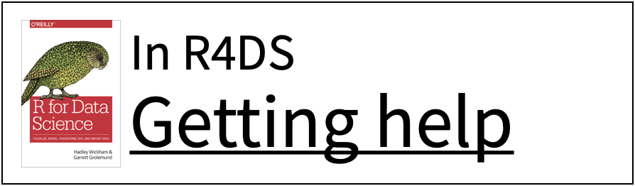
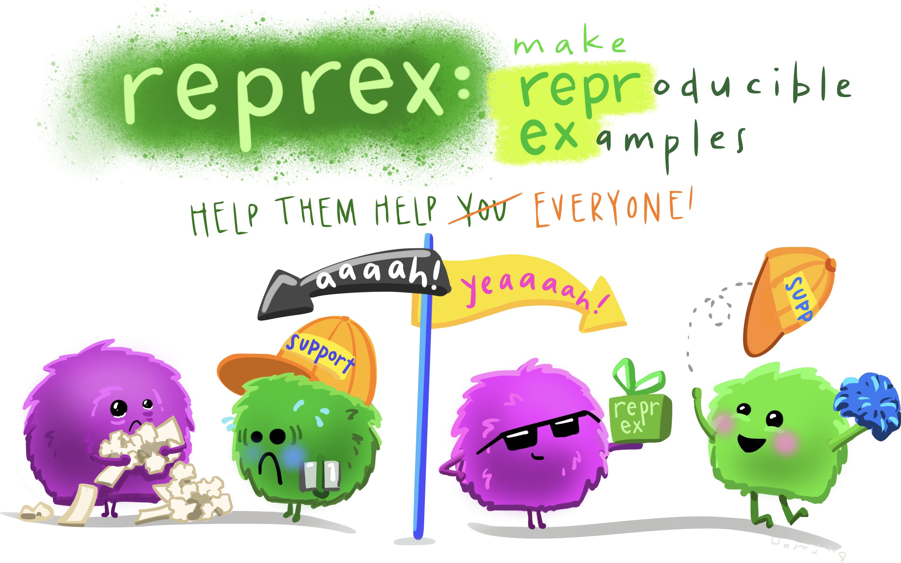
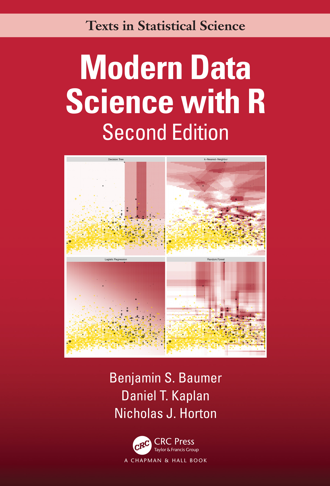
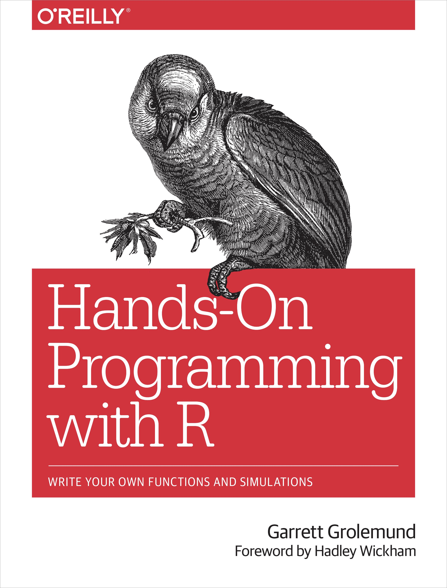
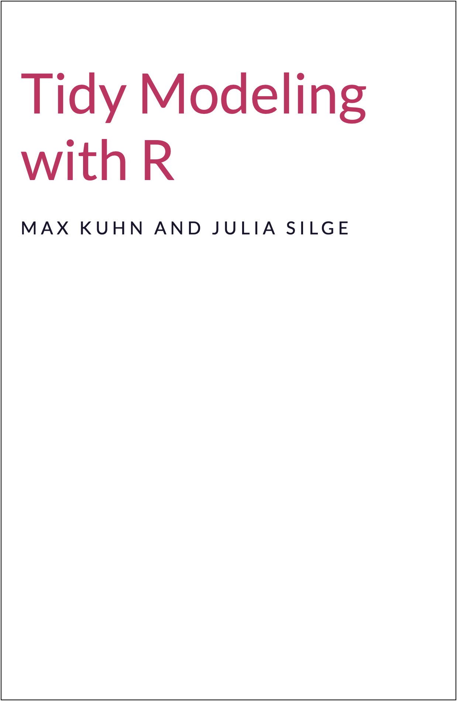

```{r setup, include=FALSE}
options(htmltools.dir.version = FALSE)
knitr::opts_chunk$set(collapse = TRUE,
                      fig.retina = 3,
                      fig.path = "images/wrap-up/plots/",
                      fig.align = "center",
                      fig.asp = 0.618,
                      comment = "#>")

xaringanExtra::use_share_again()
xaringanExtra::use_panelset()
xaringanExtra::use_extra_styles(hover_code_line = TRUE,
                                mute_unhighlighted_code = FALSE)
xaringanExtra::use_scribble(pen_color = "#009FB7")

yt_counter <- 0
library(countdown)
library(tidyverse)
library(tidymodels)
library(flair)
library(here)
library(knitr)
library(downlit)
library(vip)
library(themis)

library(xaringancolor)
blue <- "#009FB7"
light_blue <- "#0ADEFF"
yellow <- "#FED766"
dark_yellow <- "#A27A01"
pink <- "#CB297B"
light_pink <- "#FF8DC6"
green <- "#5FAD56"
dark_green <- "#3C6E35"
grey <- "#696773"

theme_set(wjake::theme_wjake(base_family = "Source Sans Pro",
                             base_size = 14,
                             axis_title_size = 12))
```


class: title-slide, center

<span class="fa-stack fa-4x">
  <i class="fa fa-circle fa-stack-2x" style="color: #ffffff;"></i>
  <strong class="fa-stack-1x" style="color:#009FB7;">`r rmarkdown::metadata$session`</strong>
</span> 

# `r rmarkdown::metadata$title`

## `r rmarkdown::metadata$subtitle`

### `r rmarkdown::metadata$author`

#### [`r params$class_link`](`r params$class_link`) &#183; [`r params$site_link`](`r params$site_link`)

.footer-license[*Tidy Data Science with the Tidyverse and Tidymodels* is licensed under a [Creative Commons Attribution 4.0 International License](https://creativecommons.org/licenses/by/4.0/).]

<div style = "position:fixed; visibility: hidden">
  $$\require{color}\definecolor{blue}{rgb}{0, 0.623529411764706, 0.717647058823529}$$
  $$\require{color}\definecolor{light_blue}{rgb}{0.0392156862745098, 0.870588235294118, 1}$$
  $$\require{color}\definecolor{yellow}{rgb}{0.996078431372549, 0.843137254901961, 0.4}$$
  $$\require{color}\definecolor{dark_yellow}{rgb}{0.635294117647059, 0.47843137254902, 0.00392156862745098}$$
  $$\require{color}\definecolor{pink}{rgb}{0.796078431372549, 0.16078431372549, 0.482352941176471}$$
  $$\require{color}\definecolor{light_pink}{rgb}{1, 0.552941176470588, 0.776470588235294}$$
  $$\require{color}\definecolor{grey}{rgb}{0.411764705882353, 0.403921568627451, 0.450980392156863}$$
</div>
  
<script type="text/x-mathjax-config">
  MathJax.Hub.Config({
    TeX: {
      Macros: {
        blue: ["{\\color{blue}{#1}}", 1],
        light_blue: ["{\\color{light_blue}{#1}}", 1],
        yellow: ["{\\color{yellow}{#1}}", 1],
        dark_yellow: ["{\\color{dark_yellow}{#1}}", 1],
        pink: ["{\\color{pink}{#1}}", 1],
        light_pink: ["{\\color{light_pink}{#1}}", 1],
        grey: ["{\\color{grey}{#1}}", 1]
      },
      loader: {load: ['[tex]/color']},
      tex: {packages: {'[+]': ['color']}}
    }
  });
</script>

---
background-image: url(images/wrap-up/applied-ds.png)
background-position: center 60%
background-size: 85%

# .nobold[(Applied)] Data Science

---
background-image: url(images/wrap-up/applied-ds-hex.png)
background-position: center 60%
background-size: 85%

# .nobold[(Applied)] Data Science

---
background-image: url(images/wrap-up/tm.png)
background-size: cover

---
background-image: url(images/wrap-up/tm-hex.png)
background-size: cover

---
background-image: url(images/wrap-up/hex-wall.png)
background-size: contain


---
background-image: url(images/wrap-up/hex-wall-reprex.png)
background-size: contain

---
<div class="hex-book">
  <a href="https://reprex.tidyverse.org/">
    
  </a>
  <a href="https://r4ds.had.co.nz/introduction.html#getting-help-and-learning-more">
    
  </a>
</div>

---
# Please help!

.center[

]

--

.center.big[
Create a .display[repr]oducible .display[ex]ample (.display[reprex])
]

---
# reprex

**Goal**: create the *simplest example possible* to illustrate the problem/question, that anyone can run on their own machine

* Can't use data stored on your computer (others won't have that)

* Can't assume options or settings are the same across computers

--

.display[reprex] to the rescue!

---
# Example

**Question**: How do I sort by a sum and then all component columns?

--

.center[

]

---
# My use case

```{r include = FALSE}
n <- 50

set.seed(123)
dat3 <- tibble(student_id = sample(1000:9999, n),
               skill_1 = sample(0:1, n, replace = TRUE),
               skill_2 = sample(0:1, n, replace = TRUE),
               skill_3 = sample(0:1, n, replace = TRUE))

dat4 <- tibble(student_id = sample(1000:9999, n),
               skill_1 = sample(0:1, n, replace = TRUE),
               skill_2 = sample(0:1, n, replace = TRUE),
               skill_3 = sample(0:1, n, replace = TRUE),
               skill_4 = sample(0:1, n, replace = TRUE))
```

.pull-left[
.small[
```{r}
dat3
```
]
]

.pull-right[
.small[
```{r}
dat4
```
]
]

???

I have some data that shows which of 3 skills each student has mastered. I want to sort the data by the total number of skills mastered, and then by each skill. But the number of skills can change. How can I write a solution that will work for any number of skills?

---
# Include data

**Question**: How do I sort a data frame by total skills and then each component skill?

.pull-left[
.smallish[
```{r}
dat3
```
]
]

--

.pull-right[

]

???

You can't do anything with this. You don't have `dat3` on your computer, and you can't copy/paste this df into an R object. Would have to build it by hand.

---
# Include .display[repr]oducible .display[ex]ample data

```{r}
library(tidyverse)

ex_data <- tibble(stu     = c(1, 2, 3, 4, 5),
                  skill_1 = c(0, 0, 1, 1, 1),
                  skill_2 = c(1, 1, 0, 0, 0),
                  skill_3 = c(0, 1, 0, 1, 1))

ex_data
```

---
# Asking questions

**Bad**: How do I sort by a sum and then all component columns?

--

**Better**: How can I sort a data frame by total skills and then each component skill?

--

**Best**: Provide an example of what you want (including the **better** question), and solutions you've tried.

---
```{r}
# What I want:
ex_data %>%
  mutate(total = skill_1 + skill_2 + skill_3) %>%
  arrange(total, desc(skill_1, skill_2, skill_3))
```

But without specifying each skill individually, because the number of skills may change.

---
```{r error = TRUE}
# What I've tried

ex_data %>%
  rowwise() %>%
  mutate(total = sum(c_across(starts_with("skill")))) %>%
  ungroup() %>%
  arrange(total, desc(starts_with("skill")))
```

---
# Anatomy of a good question

* __*Brief*__ description of what you're doing

* Reproducible data

* What you've tried

* What you've gotten

* What you want to get

---
# Anatomy of a good question

.fade[
* __*Brief*__ description of what you're doing
]

* Reproducible data

* What you've tried

* What you've gotten

.fade[
* What you want to get
]

???

reprex makes this part easier

---
# `reprex()`

The `reprex()` function from the reprex package will run code, format it nicely, and render the output to your clipboard.

```{r reprex, eval = FALSE, include = FALSE}
reprex(x = NULL, venue, session_info, style)
```

```{r reprex-flair, echo = FALSE}
decorate("reprex", eval = FALSE)
```

---
# `reprex()`

The `reprex()` function from the reprex package will run code, format it nicely, and render the output to your clipboard.

```{r reprex-flair-x, echo = FALSE}
decorate("reprex", eval = FALSE) %>%
  flair("x = NULL", background = yellow, color = blue)
```

???

The reprex. Looks first on the clipboard.

---
# `reprex()`

The `reprex()` function from the reprex package will run code, format it nicely, and render the output to your clipboard.

```{r reprex-flair-venue, echo = FALSE}
decorate("reprex", eval = FALSE) %>%
  flair("venue", background = yellow, color = blue)
```

???

Where is the question being posted.

---
# `reprex()`

The `reprex()` function from the reprex package will run code, format it nicely, and render the output to your clipboard.

```{r reprex-flair-si, echo = FALSE}
decorate("reprex", eval = FALSE) %>%
  flair("session_info", background = yellow, color = blue)
```

???

Whether or not to include session information.

---
# `reprex()`

The `reprex()` function from the reprex package will run code, format it nicely, and render the output to your clipboard.

```{r reprex-flair-style, echo = FALSE}
decorate("reprex", eval = FALSE) %>%
  flair("style", background = yellow, color = blue)
```

???

Whether or not to format code in tidy style.

---
class: center middle inverse

# Demo

---
# Answer

```{r}
ex_data %>%
  rowwise() %>%
  mutate(total = sum(c_across(starts_with("skill")))) %>%
  ungroup() %>%
  arrange(total, across(starts_with("skill"), desc)) #<<
```

???

We need to use `across()` in the arrange function.

---
class: center bottom
background-image: url(images/wrap-up/asking-for-help.png)
background-position: center 40%
background-size: 80%

#### Shannon Pileggi for [@WeAreRLadies](https://twitter.com/WeAreRLadies/status/1362370580708790274)

---
# Useful resources

.left-column[
[**RStudio Community**](https://community.rstudio.com/)
* [How to do a minimal reprex for beginners](https://community.rstudio.com/t/faq-how-to-do-a-minimal-reproducible-example-reprex-for-beginners/23061)

[**StackOverflow**](https://stackoverflow.com/)
* [How to make a great R reproducible example](https://stackoverflow.com/questions/5963269/how-to-make-a-great-r-reproducible-example)

[**Tidyverse**](https://www.tidyverse.org/)
* [Getting help](https://www.tidyverse.org/help/)
]

.right-column[
```{r echo = FALSE, out.width = "100%"}

```
]

---
class: center middle

<a href="https://twitter.com/JohnHolbein1/status/1348646618501885952">
    
</a>

---
class: center middle inverse

# What's Next

---
class: center

# Data Science

.columns[

.left-col[
<a href="https://r4ds.had.co.nz/">
  
</a>
]

.middle-col[
<a href="https://mdsr-book.github.io/mdsr2e/">
  
</a>
]

.right-col[
<a href="https://moderndive.com/">
  
</a>
]
]

???

R4DS: Expanding on this workshop. Much more to learn!

MDSR: beginning to end- data management, programming, statistics, machine learning, special topics in DS

MD: More statistics (more regression, hypothesis testing, confidence intervals, etc.)

---
class: center

# R Programming

.columns[

.left-col[
<a href="https://adv-r.hadley.nz/">
  
</a>
]

.middle-col[
<a href="https://r-pkgs.org/">
  
</a>
]

.right-col[
<a href="https://rstudio-education.github.io/hopr/">
  
</a>
]
]

???

AdvR: How R works (environments, data structures, meta programming)

R Packages: How to make your own package!
2nd edition work in progress

HOPR: Intro to R as a programming language, in the context of data science/data analysis

---
class: center

# Data Visualization

.columns[

.left-col[
<a href="https://socviz.co/">
  
</a>
]

.middle-col[
<a href="https://r-graphics.org/">
  
</a>
]

.right-col[
<a href="https://clauswilke.com/dataviz/">
  
</a>
]
]

???

SocViz: Intro to good looking graphics with ggplot2

Cookbook: Basic recipes for creating and customizing plots

Fundamentals: Made with ggplot2 & Rmd, but no code in book. Focus is on what makes a graphic informative, and appealing.

---
class: center

# Machine Learning

.columns[

.left-col[
<a href="https://www.tmwr.org/">
  
</a>
]

.middle-col[
<a href="http://www.feat.engineering/">
  
</a>
]

.right-col[
<a href="https://bradleyboehmke.github.io/HOML/">
  
</a>
]
]

???

TMWR: How to use tidymodels, best practices, etc.

FEATENG: Recipes -- how to extract more information from you data, including best practices, recommendations, etc.

HOML: Focused on machine learning methods and models - random forest, clustering algos, gradient boosting machines, neural networks, stacking, more!

---
class: center

# R Markdown

.columns[

.left-col[
<a href="https://bookdown.org/yihui/rmarkdown/">
  
</a>
]

.middle-col[
<a href="https://bookdown.org/yihui/rmarkdown-cookbook/">
  
</a>
]

.right-col[
<a href="https://bookdown.org/yihui/bookdown/">
  
</a>
]
]

???

RMD: Everything you could ever want to know about R Markdown. Includes chapters on extensions as well.

cookbook: popular how-tos for how to do different things in rmarkdown

bookdown: writing books, articles, dissertations, etc.

---
# Miscellaneous

* Blogs

  * [R posts you might have missed](https://postsyoumighthavemissed.com/)
  
  * [R Weekly](https://rweekly.org/)
  
  * [RStudio](https://blog.rstudio.com/)
  
  * [Tidyverse](https://www.tidyverse.org/blog/)
  
* Twitter `r icons::fontawesome$brands$twitter`

  * My personal list of [R community members](https://twitter.com/i/lists/893667630351085568?s=20)
  
  * [Tidy Tuesday](https://twitter.com/hashtag/TidyTuesday?src=hashtag_click) via [Thomas Mock](https://twitter.com/thomas_mock)

---
class: your-turn center middle

# .yellow[Thank you!]

---
class: middle

.center.huger[[tidyds-2021.wjakethompson.com](https://tidyds-2021.wjakethompson.com)]

.pull-left[
```{r echo = FALSE, out.width="65%"}
include_graphics("images/hex/wjakethompson.png")
```
]

.pull-right[
.contact-big[
.blue[<i class="fas fa-globe"></i>] [wjakethompson.com](https://wjakethompson.com)

.blue[<i class="fas fa-envelope"></i>] [wjakethompson@ku.edu](mailto:wjakethompson@ku.edu)

.blue[<i class="fab fa-github"></i>] [@wjakethompson](https://github.com/wjakethompson)  

.blue[<i class="fab fa-twitter"></i>] [@wjakethompson](https://twitter.com/wjakethompson)
]
]
